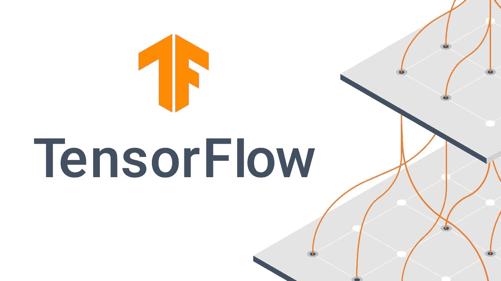

# 使用 TF 服务而不使用 Flask 的原始文本推理😮

> 原文：<https://medium.com/analytics-vidhya/raw-text-inferencing-using-tf-serving-without-flask-8d5287183a71?source=collection_archive---------9----------------------->

*这篇文章触及了 Tensorflow/NLP 的一个相当高级的话题。对于初学者来说，你应该看看* [*Tensorflow 教程*](https://www.tensorflow.org/tutorials/text/text_classification_rnn)

在最近发布的 Tensorflow 2.1 中，新增了一个图层 **TextVectorization** 。

> 简单术语这一层基本上可以做所有的文本预处理，作为**张量流图**的一部分。

我知道，我知道还有其他方法可以做到这一点，但在我看来，这是最简单的方法之一。我们可能会在接下来的博客中研究这些方法。

*我们来看看将预处理放入* ***TF 图*** *的利弊。*
**弊😨** 1。不需要太多张量流的高级知识。
2。你要把每一个运算都转换成张量运算。

赞成者👍
1。现在你不需要 flask 或者其他任何 web 框架代码库来维护。
2。单点预处理+建模。
3。单次微服务呼叫。

**我们要用*text 矢量化*图层**
做什么一、解码 text 矢量化图层。
二。在垃圾邮件数据集上生成嵌入。
III。使用预先训练的嵌入(手套)在层内。

# 解码文本矢量化图层

> 这个层有管理 Keras 模型中文本的基本选项。它将一批字符串(一个样本=一个字符串)转换为记号索引列表(一个样本=整数记号索引的 1D 张量)或密集表示(一个样本=表示关于样本记号的数据的浮点值的 1D 张量)。

## 我们可以在该层内的文本样本上执行的操作:

*   **max_tokens** 最大唯一词汇。
*   **标准化**清洗每个样本(通常是小写+标点剥离)。
*   **拆分**将样本转换成子串(通常是单词)。
*   **ngram** 在上述子串上生成 n-gram。
*   **output_mode** 它有助于决定该层的输出格式，如“int”、“binary”、“count”或“tf-idf”。
*   **output_sequence_length** 有助于将每个样本截断或填充到固定长度，并且仅在我们的 *output_mode 为" int"* 的情况下。
*   **pad_to_max_tokens** 当 *output_mode 为“二进制”、“计数”或“TF-IDF”*而不是时间维度轴时使用，它具有填充到 max_tokens 的特征轴。

## 👉最大令牌数

我们必须定义它需要处理的最大词汇量。它基于训练样本生成词汇表，并在推理时使用该词汇表进行映射。

## 👉标准化(可选)

在继续下一步之前，我们可以使用参数来清理我们的原始字符串。这个清理步骤可以定制，但只需要记住，它应该总是返回一个张量数据

## 👉分割(可选)

它的目的是根据自定义函数将原始字符串分解成单词或子单词。默认情况下，它提供“空白”标记化。

## 👉ngrams(可选)

顾名思义，它对上一步接收到的单词或子单词生成 ngrams。缺省值设置为 *None* ，因此不生成 ngram。

## 👉输出模式(可选)

它保存了这一层应该输出什么类型的值。它可以从原始字符串生成“int”、“binary”、“count”或“tf-idf”。因为我们将使用嵌入层，所以无论是新生成的嵌入还是像 Glove 这样的预训练嵌入，我们都将关注“int”类型。

## 👉输出序列长度(输出模式为“整数”)

仅当 output_mode 为“int”时有效。当它被设置时，输出将使其时间维度被填充或截断为精确的 output_sequence_length 值，这将产生形状的张量[batch_size，output_sequence_length]。

## 👉pad_to_max_tokens(输出模式为“二进制”/“计数”/“TF-IDF”)

仅当 output_mode 为“binary”/“count”/“TF-IDF”时有效。输出将使其特征轴填充到 *max_tokens* ，即使词汇表中唯一记号的数量小于 max_tokens，从而产生形状为[batch_size，max_tokens]的张量。

样本数据集上的文本矢量化实现([https://gist . github . com/swapnilpote/50 B6 a 37 a5e 0361437063 db 2799525 a 88](https://gist.github.com/swapnilpote/50b6a37a5e0361437063db2799525a88))

为了理解该层的用法，我们将使用几个语句作为查询，以理解它作为一个层消费什么以及它如何在内部处理它。

**🔶文本矢量化图层参数**

*   **text_dataset** 是我们的训练数据集。
*   **max_vocab** 是数字的话是应该明白的。
*   **max_len** 是每条语句的长度应该可以通过填充或截断来实现。
*   **output_mode** 用于该层返回值的格式。在这里，我们希望格式应该是*“int”，即*原始字符串中每个单词的索引。
*   **标准化**是根据默认的“lower_and_strip_punctuation”通过小写清理文本并删除标点符号。
*   **split** 用于根据基于空白的默认参数“white space”拆分原始字符串。

**🔶文本矢量化图层适配方法**

*   它生成一个唯一的词汇表，其大小与 max_vocab 相当。
*   它生成单词到 IDX 的映射。
*   我们可以在 get _ 词汇表()方法中访问新生成的词汇表。
*   现在，当我们传递一个原始字符串时，我们将从这一层中得到 IDX，而不是单词，该字符串在预处理后也提到了层内。

# 在垃圾邮件数据集上生成嵌入

自定义嵌入层在垃圾邮件数据集上的文本矢量化实现([https://gist . github . com/swapnilpote/f 720 EB 1b 38d 18 e 0 FB 38 DDC 3 a 485 f 785 e](https://gist.github.com/swapnilpote/f720eb1b38d18e0fb38ddc3a485f785e))

几乎所有的事情都是从上一步开始重复的，所以让我们在这里讨论更新步骤。我们可以将自定义预处理函数作为 TensorFlow 图的一部分来传递。检查预处理命名函数，从上面的代码库中了解更多。

**🔶文本矢量化图层参数**

*   **标准化**可以接受上面代码所示的自定义函数只是我们需要记住，它应该与注册的 Keras serializable 一起使用，并返回与输入相同形状的张量。
*   **分割**也接受与上一节所述条件相同的自定义功能。我们将这种定制留给了您，因此没有在示例代码中演示。

**🔶文本矢量化层采用方法**

*   它生成一个唯一的词汇表，其大小与 max_vocab 相当。
*   它生成单词到 IDX 的映射。
*   我们可以在 get _ 词汇表()方法中访问新生成的词汇表。
*   现在，当我们传递原始字符串时，我们将从这一层中得到 IDX，而不是单词，这也是在预处理后提到的层内。

*注意:在上面两种情况下你可以看到当我们使用****get _ vocabulary****方法打印时，它向我们显示例中所有单词+在最初 2 个位置[" "，"['UNK']"，…]多余的单词。这表示第一个将用于填充，第二个用于未知单词。*

**用训练和预测检查完整笔记本……
([https://github . com/swapnilpote/text _ vectorization _ TF _ layer/blob/master/notebook/text vectorization _ with _ model . ipynb](https://github.com/swapnilpote/text_vectorization_tf_layer/blob/master/notebook/textvectorization_with_model.ipynb))**

# 在内层使用预先训练的嵌入(手套)

在前两节中，我们已经看到了如何生成自定义嵌入向量，但是如果您想要使用预先训练的嵌入，如 Glove、Word2vec 或任何其他类型的嵌入，该怎么办。

让我们生成大小为 400，002 的向量数组来存储预先训练的带有[" "，"['UNK']"]的手套嵌入。

**🔶文本矢量化图层参数**

它将保持与上一节相同。

**🔶这里不需要文本矢量化图层适配方法**

由于我们已经从手套中获得了独特的 400，000 个单词，并且我们想要使用这些单词，那么我们不应该在这里使用 ***适应*** 方法。那么我们如何在 **TextVectorization** 层中设置这些单词呢？？？

简单的代替 ***adapt*** 方法使用***set _ vocabulary***方法并传递从手套文件中提取的单词集合。一旦完成，我们可以检查 2 个额外的单词被添加[" "，"['UNK']"]填充和未知的词汇。

现在，我们可以在神经网络中使用这一层，随后的嵌入层包含我们通常使用的手套嵌入权重。要了解神经网络架构，请查看下面的笔记本。

**用训练和预测检查完整笔记本…** ([https://github . com/swapnilpote/text _ vectorization _ TF _ layer/blob/master/notebook/text vectorization _ glove _ with _ model . ipynb](https://github.com/swapnilpote/text_vectorization_tf_layer/blob/master/notebook/textvectorization_glove_with_model.ipynb))

**一旦你的模型训练完毕，请查看我的博文，将其转换为 TF serving to productionise…**
([https://medium . com/analytics-vid hya/easy-way-to-serve-dl-models-in-production-using-docker-kubernetes-31870 e 34866 f](/analytics-vidhya/easiest-way-to-serve-dl-models-in-production-using-docker-kubernetes-31870e34866f))

请在评论中发表你的想法和建议。敬请关注更多关于机器学习从开发到生产的博客文章，以及各自的最佳实践。