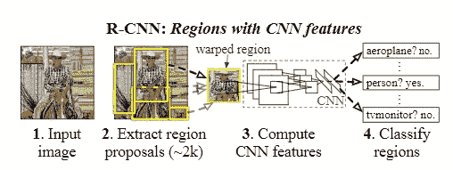
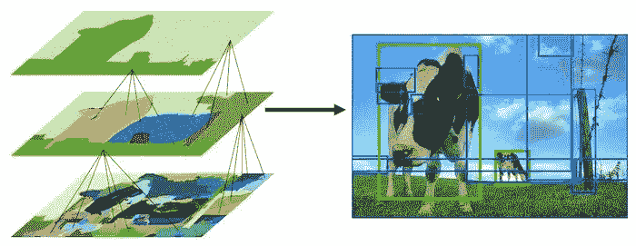
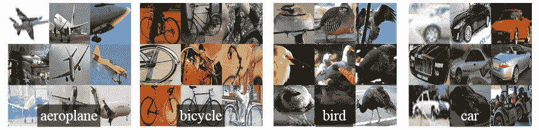

# RCNN 审查[1311.2524]

> 原文：<https://medium.com/analytics-vidhya/rcnn-review-1311-2524-898c3148789a?source=collection_archive---------28----------------------->

我已经计划阅读主要的物体探测论文(虽然我已经粗略地阅读了它们中的大部分，但我会详细地阅读它们，好到足以写一篇关于它们的博客)。这些论文与基于深度学习的对象检测相关。随时给建议或询问疑惑会尽我所能帮助大家。我将在下面写下每篇论文的 arxiv 代码，并在下面给出博客(我写的时候会不断更新)和他们论文的链接。任何从这个领域开始的人都可以跳过许多这样的论文。当我读完所有的论文后，我还会写下它们的优先级/重要性(根据理解主题的必要性)。我写这篇博客是考虑到和我相似的读者仍在学习。万一我犯了任何错误(我将通过从各种来源(包括博客、代码和视频)深入理解论文来尽量减少错误)，任何人都可以随意地在博客上强调它或添加评论。我已经提到了我将在博客结尾涉及的论文列表。

我们开始吧:)

RCNN 论文是引发基于深度学习的目标检测研究的主要论文之一。RCNN 将现有技术的结果提高了 30%,这是一个显著的进步。从理论上讲，这篇论文比上一篇博客中讨论的一些其他论文(如 overfeat)更容易理解。

RCNN 目标检测系统基于三个模块。这三个模块包括区域提议、用于特征提取的 CNN 和基于第三 SVM 的分类器。图 1 总结了这个网络。现在，我将简要介绍每个模块

图 1 RCNN 物体探测系统

## 区域提议

RCNN 的第一个模块提出可能包含对象的区域(候选边界框)。这些区域是使用选择性搜索提出的，作者建议的区域数量约为 2k。这些区域可能包含一个对象，但我们目前还不确定，但选择性搜索可以近似确定该对象的位置，并从建议中删除不相关的背景。作者提出了其他可以使用的区域提议技术，但最终使用了选择性搜索。

选择性搜索根据颜色、纹理、大小和形状对相似区域进行分层分组。这些区域随后被分组为多个边界框(在这种情况下为 2k)。

选择性搜索分层分组。[图片信用](https://www.koen.me/research/selectivesearch/)

## 特征抽出

对于每个区域建议，使用 alexnet 模型提取了 4096 个维度特征。所有区域的大小都调整为 227*227。由于这些建议的大小不同，它们会将周围紧密包围框中的所有像素扭曲到所需的大小。

扭曲的图像区域

然后，对于每个类别，我们使用为该类别训练的 SVM 对每个提取的特征向量进行评分。应用贪婪的非最大抑制，如果一个区域与大于学习阈值的较高得分的所选区域有交集-并集(IoU)重叠，则拒绝该区域。

## 培养

由于缺少对象检测数据，首先使用图像级分类(迁移学习)在较大的辅助 imagenet 数据集上对所使用的模型进行预训练。该模型后来针对新的检测任务和新的领域(扭曲的提议窗口)进行了微调。只是最后一层从像网的 1000 类改成了 pascal VOC 的 21 类(20+1 背景)。IOU≥0.5 的所有区域与地面实况框重叠，作为该框类别的正极，其余区域作为负极。一旦模型被微调，一个线性 SVM 被训练用于每一个类。

**参考文献:**

1.  【https://arxiv.org/abs/1311.2524 T3【RCNN 论文】
2.  【https://www.koen.me/research/selectivesearch 
3.  [https://www . learnopencv . com/selective-search-for-object-detection-CPP-python/](https://www.learnopencv.com/selective-search-for-object-detection-cpp-python/)
4.  [https://towards data science . com/r-CNN-fast-r-CNN-faster-r-CNN-yolo-object-detection-algorithms-36d 53571365 e](https://towardsdatascience.com/r-cnn-fast-r-cnn-faster-r-cnn-yolo-object-detection-algorithms-36d53571365e)

# 论文列表:

1.  [OverFeat:使用卷积网络的综合识别、定位和检测](https://arxiv.org/pdf/1312.6229.pdf)。[ [链接到博客](/@sanchittanwar75/overfeat-review-1312-6229-4fd925f3739f)
2.  [丰富的特征层次，用于精确的对象检测和语义分割(RCNN)。](https://arxiv.org/pdf/1311.2524.pdf) ←你完成了这篇博客。
3.  [用于视觉识别的深度卷积网络中的空间金字塔池(SPPNet)。](https://arxiv.org/pdf/1406.4729.pdf) [ [链接到博客](/@sanchittanwar75/review-spatial-pyramid-pooling-1406-4729-bfc142988dd2) ]
4.  快速 R-CNN
5.  更快的 R-CNN:使用区域提议网络实现实时目标检测。【博客链接】
6.  [你只看一次:统一的，实时的物体检测。](https://arxiv.org/pdf/1506.02640.pdf)【博客链接】
7.  [SSD:单次多盒探测器](https://arxiv.org/pdf/1512.02325.pdf)。[博客链接]
8.  [R-FCN:通过基于区域的完全卷积网络的目标检测。](https://arxiv.org/abs/1605.06409)【博客链接】
9.  [用于目标检测的特征金字塔网络。](https://arxiv.org/pdf/1612.03144.pdf)【博客链接】
10.  [DSSD:解卷积单粒子探测器](https://arxiv.org/pdf/1701.06659.pdf)。[博客链接]
11.  [密集物体检测的焦点丢失(视网膜网)。](https://arxiv.org/pdf/1708.02002.pdf)【博客链接】
12.  [YOLOv3:增量改进](https://arxiv.org/pdf/1804.02767.pdf)。[博客链接]
13.  [狙击手:高效多尺度训练](https://arxiv.org/pdf/1805.09300v3.pdf)。[博客链接]
14.  [标注像素和区域的高分辨率表示。](https://arxiv.org/pdf/1904.04514.pdf)【博客链接】
15.  [FCOS:全卷积一级目标检测](https://arxiv.org/pdf/1904.01355v5.pdf)。[博客链接]
16.  [以物为点](https://arxiv.org/pdf/1904.07850.pdf)。[博客链接]
17.  CornerNet-Lite:高效的基于关键点的对象检测。【博客链接】
18.  [CenterNet:用于对象检测的关键点三元组](https://arxiv.org/pdf/1904.08189v3.pdf)。[博客链接]
19.  用于实时对象检测的训练时间友好网络。【博客链接】
20.  CBNet:一种用于目标检测的新型复合主干网络体系结构。【博客链接】
21.  [EfficientDet:可扩展且高效的对象检测](https://arxiv.org/pdf/1911.09070v2.pdf)。[博客链接]

和平…