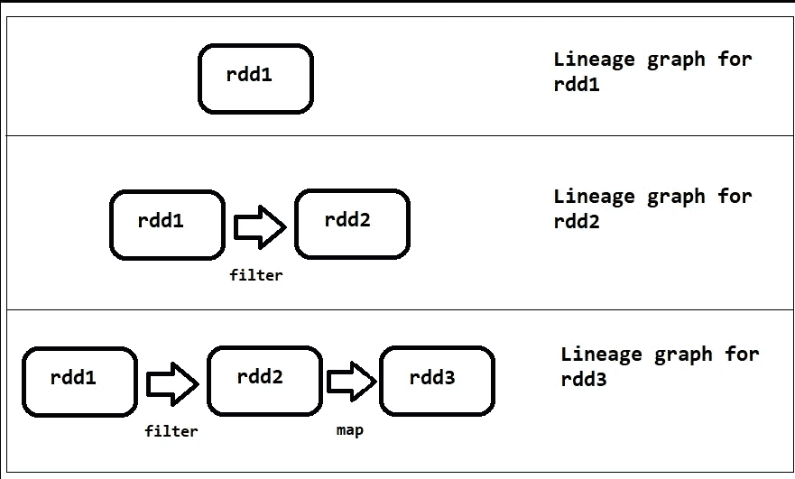
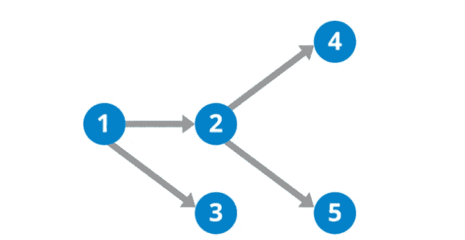
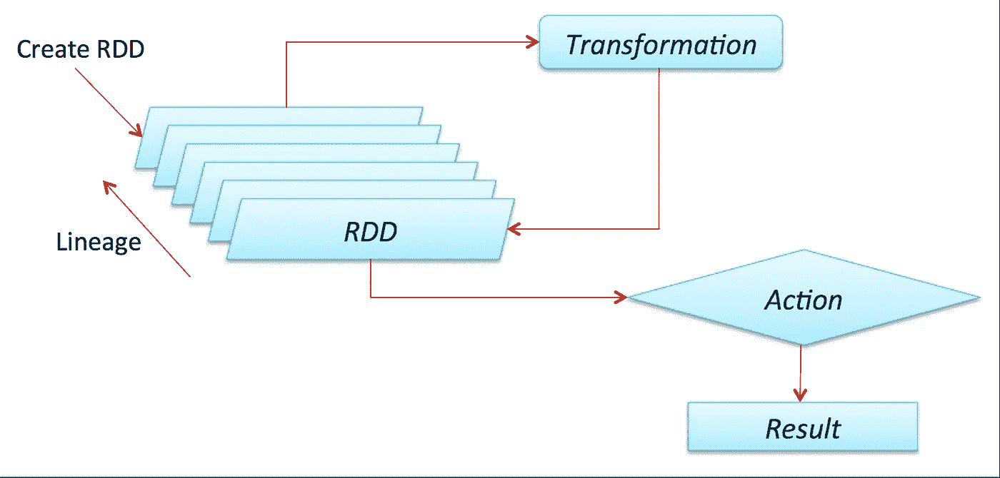
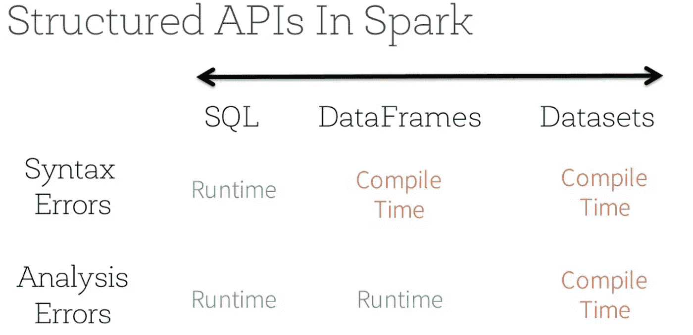
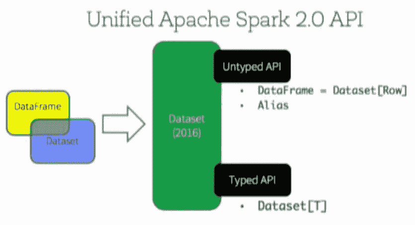
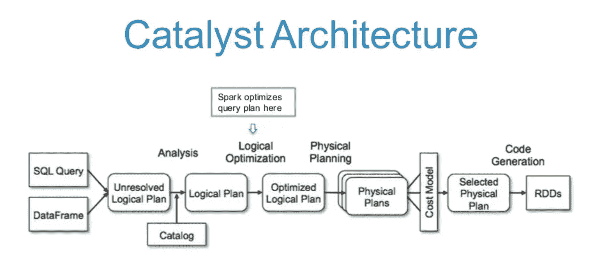
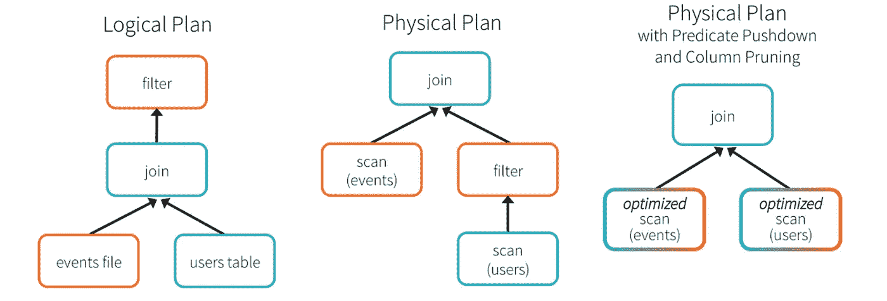
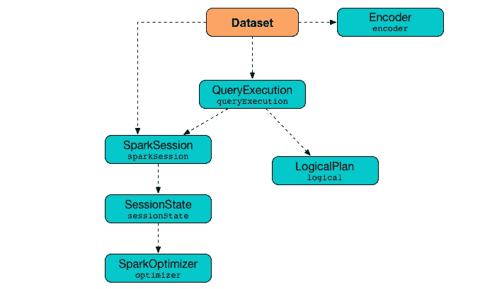
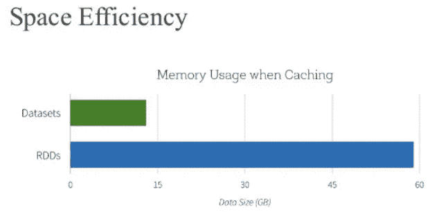

# RDD、数据框和数据集

> 原文：<https://medium.com/analytics-vidhya/rdd-dataframe-and-dataset-d92d95d873a4?source=collection_archive---------9----------------------->

# 弹性分布式数据集(RDD)

RDD 是整个 Spark 发展的基础逻辑抽象。它们是集群或环境中的逻辑分布式模型。

**弹性**

RDD 的主要优势是它们具有弹性，这意味着能够在执行过程中的任何时间点进行重新创建。

RDD 谱系图

让我们考虑一下，我们有 RDD1，我们对它执行转换，它将被转换为 RDD2，在下一次转换后，它将被转换为 RDD3。所有这些转变都被记录为它的起源。因此，如果出了什么问题，RDD 可以重建自己。

**不可改变的**

当我们对 RDD 应用变换时，原始的 RDD 保持不变。Spark 没有改变 RDD，而是创建了一个非循环图。Spark 可以使用这个非循环图重新创建 RDD。

有向无环图

RDD 的其他特色是

*   编译时类型安全
*   支持结构化和非结构化数据。
*   Lazy 只有在需要某个动作时才会被具体化。Spark 为 rdd 创建非循环图的原因是，它们并不像我们编码时那样执行每个转换。相反，Spark 将这些转换记录在一个非循环图中，并将所有内容保存在内存中，并将指针返回给操作。最后，当我们调用一个动作时，Spark 执行非循环图的整个链。

火花懒惰 RDD

**为什么使用 rdd**

*   提供控制和灵活性
*   提供低级 API
*   类型安全

**rdd 的问题**

*   我们表达如何解决问题，而不是做什么。
*   未通过 Spark 优化
*   对于 Python 这样的非 JVM 语言来说很慢
*   Spark 不理解记录在非循环图中的转换。因此，它不会修改执行计划来以更好的方式执行它。

# 结构化 API

数据帧和数据集是 Spark 中的结构化 API。它为您提供了一系列代码错误的早期检测。在结构化 API 中，我们告诉 Spark 我们在做什么，它评估我们的查询或 lambda 函数，以找出如何以更好的方式完成它。

在数据帧和数据集的情况下，比方说，如果你拼错了一个列名，你将得到一个编译时错误，而不是运行时错误，这为我们节省了大量的时间和金钱。

Spark 2.0 中 API 的统一

Spark 版融合了数据帧和数据集。因此，如果您使用 Spark 2.0 或更高版本，您将只使用一组数据集 API。SCALA 中的 DataFrame 是数据集[Row](即 Row 类型的数据集)的别名。尽管我们最终有了数据帧和数据集，但它们都将被转换成 rdd。rdd 是 Spark 的最低级别，可以处理数据。

# 数据帧

像 RDD 一样，数据帧是不可变的分布式数据集合。数据帧可以被视为具有与之相关联的模式的表，它包含行和列，并且列可以具有与之相关联的类型。DataFrames 比 RDD 更快的原因是 Spark 的 Catalyst Optimizer。

火花催化剂优化器

让我们了解 Catalyst Optimizer 的工作原理。当一个查询提交给 Spark 时，它会创建一个未解析的逻辑计划，然后检查 Spark 目录，查看我们引用的是哪些表或列。一旦模式得到验证，Spark 就会创建一个逻辑计划，然后创建一个优化的逻辑计划，这又会创建多个物理计划，并计算每个物理计划的成本，然后选择最佳的一个。在计算出最佳物理规划后，它创建 rdd。这些在选择最佳物理计划后创建的 rdd 与我们通过直接读取文件创建的 rdd 有很大不同。

假设我们正在连接两个表，然后应用一个过滤器。Spark 推断这是一个合乎逻辑的计划。在物理规划期间，Spark 甚至可以在连接之前进行过滤，从而大大降低了执行成本。

# 资料组

Dataset 是一组强类型的 JVM 对象，由 Scala 中定义的 case 类或 Java 中的类决定。Dataset API 的核心是一个称为编码器的新概念，它负责 JVM 对象和表格表示之间的转换。表格表示使用 Spark 的内部钨二进制格式存储，允许对序列化数据进行操作并提高内存利用率。

数据集内部

> Dataset 提供了 rdd 的便利、数据帧的性能优化和 Scala 强大的静态类型安全。给 Dataframe 带来强类型安全的最后一个特性使得 Dataset 如此吸引人。所有这些特性一起为您提供了一个更具功能性的编程接口来处理结构化数据。

**数据集的好处**

*   空间效率

Spark 作为一个编译器理解你的数据集类型 JVM 对象，它使用编码器将你的特定类型 JVM 对象映射到钨的内存表示。因此，钨编码器可以有效地序列化/反序列化 JVM 对象，并生成能够以超快的速度执行的紧凑字节码。

**何时使用数据集**

*   如果您想在编译时获得更高程度的类型安全，想要类型化的 JVM 对象，利用 Catalyst 优化，并受益于钨的高效代码生成，请使用 Dataset。

**为什么使用数据集**

*   高级 API
*   强类型安全
*   易用性和可读性

本文是使用 Databricks 视频参考资料编写的。

如果你喜欢这篇文章，请点击👏所以其他人会在媒体上看到它。