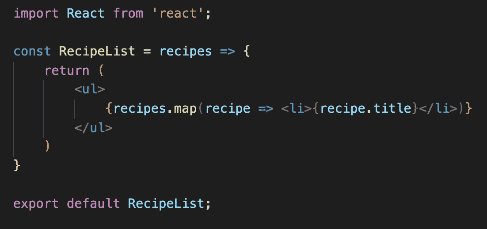
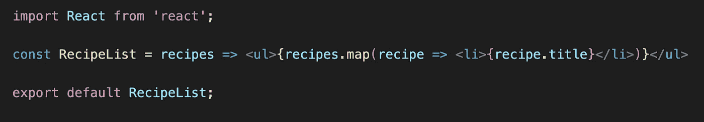
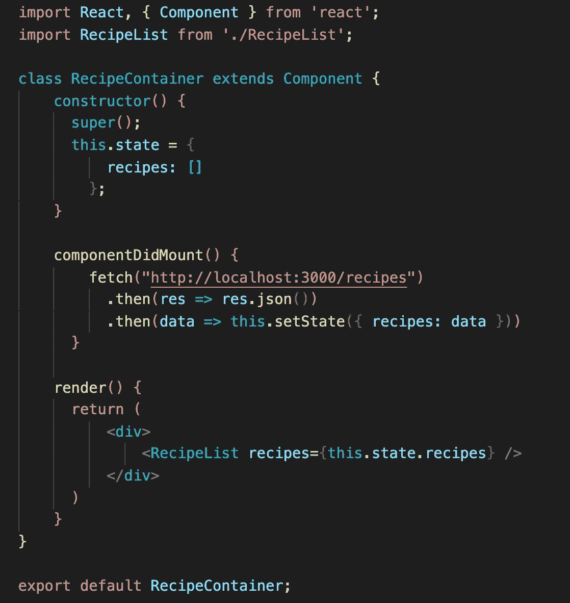

# 反应组件:功能与类

> 原文：<https://medium.com/analytics-vidhya/react-components-functional-vs-class-3bdf514b670d?source=collection_archive---------11----------------------->

React 组件是返回 React 元素的独立且可重用的代码块。**功能组件**和**类组件**是 React 中两种主要的组件类型:

1.  **功能组件:**它们是接受 **props** 作为参数并返回 JSX 代码而不是使用`render()`方法的基本函数。JavaScript 函数和箭头函数都可以声明函数组件。您将需要显式地编写 props 作为参数，并且您不需要扩展`Component`来处理功能组件。

`<RecipeList>`功能组件创建`<li>`元素。

功能组件也被称为无状态组件，因为它们不存储状态，并且缺少生命周期方法和实例。功能组件也可以用 ES6:

用 ES6 写下同样的`<RecipeList>`功能组件需要更少的代码行。

功能组件更容易编写、阅读、理解、测试和调试。它们主要用于显示没有任何沉重逻辑的内容，但如果你想使用助手函数和 **React 钩子**(版本 **16.8** )它们可能会更复杂。除非您需要状态和生命周期方法，否则功能组件应该受到青睐，这些方法对于类组件来说很容易获得。

2.**类组件:**在 React 中，组件也可以被声明为类。顾名思义，类组件是使用 ES6 类语法创建的，它们在几个方面不同于功能组件。首先，类组件需要从一个`Component`类扩展而来，这个类可以访问父组件的所有功能。其次，它们需要一个`render()`方法来返回一个 React 元素(JSX 代码)。

除了`render()`方法，我们还可以在类组件中添加**生命周期方法**。类组件也被称为*有状态组件*，因为它们采用**构造函数**，在这里它们可以接受**道具**并使用**状态**维护自己的数据。最后，您可以使用`this.props`访问 props，因为类组件有实例。

请注意，`componentDidMount()`生命周期方法是在 `<RecipeContainer>`类组件中使用的。

总之，功能组件是简洁的，更容易理解和维护。对于简单的组件来说，它们是很好的选择，但是它们缺乏某些特性。另一方面，类组件实现逻辑，它们比功能组件更复杂，包括状态、`Component`类、构造函数、生命周期和`render()`方法。建议从功能组件开始，除非你需要状态和生命周期方法，因为功能组件不能执行这些添加，除非使用 React 钩子。