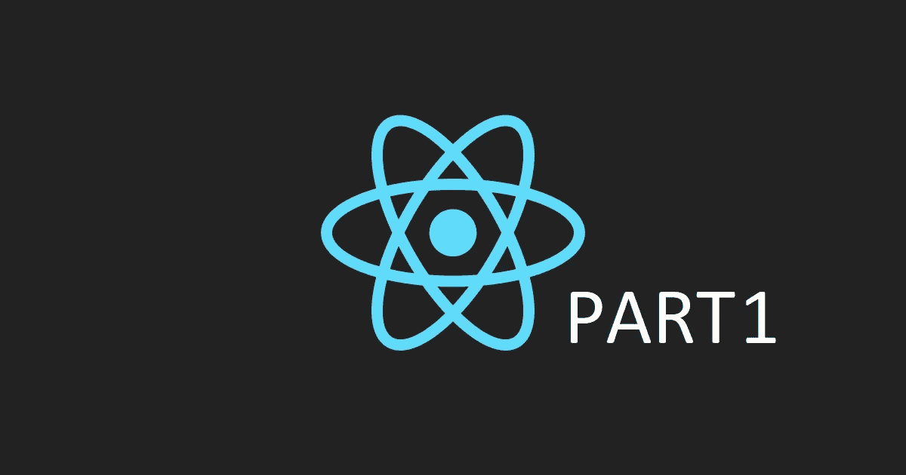

# 从头开始:第 1 部分

> 原文：<https://medium.com/analytics-vidhya/react-from-scratch-part-1-7d45fedadfc8?source=collection_archive---------20----------------------->

在这个系列中，我们将了解 React、Webpack、Babel 和 Redux。对于本系列的第一部分，我们将从一个基本的设置开始。我们开始吧！

## **先决条件**

在本指南中，我们将使用 npm 来安装所有依赖项并启动项目。

因此，请确保您的计算机上安装了 npm！