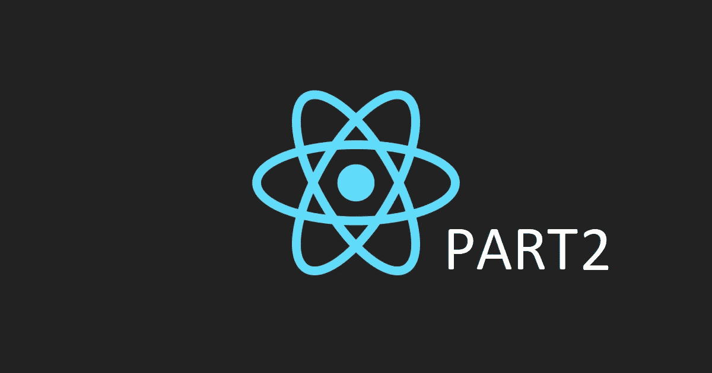

# 从头开始:第 2 部分

> 原文：<https://medium.com/analytics-vidhya/react-from-scratch-part-2-849ea98c70fd?source=collection_archive---------27----------------------->

这是“从头开始反应”系列的第二部分。这一次，我们将使用第 1 部分中的设置开始创建一个待办事项应用程序！

## **先决条件**

第 2 部分将从我们在第 1 部分停止的地方开始。如果你还没有，继续完成[第一部分](/@Klamser.dev/react-from-scratch-part-1-7d45fedadfc8)或者只是[从我的回购](https://github.com/JakobKIT/getting-started-react)中克隆它，然后从那里开始。

## **新的依赖关系**