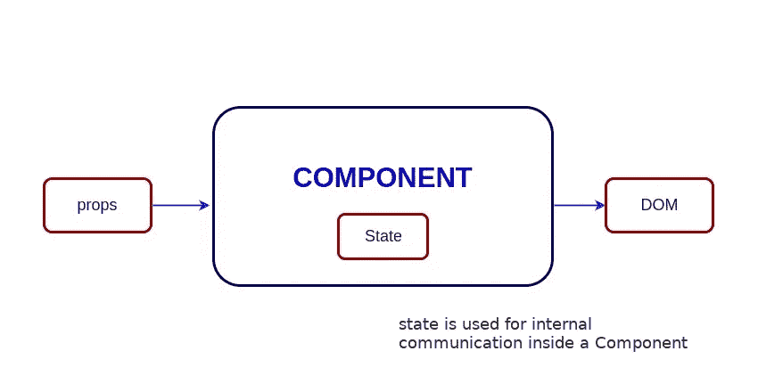

# 回应面试问题

> 原文：<https://medium.com/analytics-vidhya/react-interview-questions-272936f3e1fe?source=collection_archive---------11----------------------->

# 里程碑 3 -第 4 天


## 1.登录后如何进行自动重定向？

渲染一个 ***<重定向>*** 组件，由 ***react-router*** 包提供，将导航到一个新的位置。与服务器端重定向一样，新位置将覆盖历史堆栈中的当前位置。

```
import React, { Component } from 'react'
import { Redirect } from 'react-router'

export default class LoginComponent extends Component {
  render() {
    if (this.state.isLoggedIn === true) {
      return <Redirect to="/your/redirect/page" />
    } else {
      return <div>{'Login Please'}</div>
    }
  }
}
```

## 2.如何使用 React Intl 格式化日期？

***inject ntl()***高阶组件将通过组件中的 props 为您提供对 ***formatDate()*** 方法的访问。该方法由***formatted date***的实例在内部使用，它返回格式化日期的字符串表示。

```
import { injectIntl, intlShape } from 'react-intl'

const stringDate = this.props.intl.formatDate(date, {
  year: 'numeric',
  month: 'numeric',
  day: 'numeric'
})

const MyComponent = ({intl}) => (
  <div>{`The formatted date is ${stringDate}`}</div>
)

MyComponent.propTypes = {
  intl: intlShape.isRequired
}

export default injectIntl(MyComponent)
```

## 3.Redux 和 RxJS 有什么相似之处吗？

尽管两者用于不同的目的，但它们之间几乎没有相似之处:

> 我) **Redux** 是一个管理整个应用程序状态的工具。它通常被用作 UIs 的架构，可以假定 50%是 Angular 的替代方案。
> 
> **RxJS** 是一个反应式编程库。它通常被用作 JavaScript 中完成异步任务的工具。可以假定它是 JavaScript 承诺的替代方案。
> 
> **ii)** **Redux** 使用反应式范例，因为存储是反应式的。商店从远处观察行动，并改变自己。
> 
> RxJS 也使用了反应式范例，但是它不是一个架构，而是为我们提供了基本的构建模块，可观察的，来完成这个模式。

## 4.React 中的状态是什么？

在 **React** 意义上，“ **state** 是一个对象，表示 app 中可以改变的部分。每个组件可以维护自己的**状态**，它存在于一个名为 this 的对象中。**状态**。

> 状态是私有的，完全由组件控制。除了拥有该状态的组件之外，没有其他组件可以访问该状态。



**状态的示例:**

```
class User extends React.Component {
  constructor(props) {
    super(props)

    this.state = {
      message: 'Welcome to React world'
    }
  }

  render() {
    return (
      <div>
        <h1>{this.state.message}</h1>
      </div>
    )
  }
}
```

## 5.如何将参数传递给事件处理程序或回调？

**方法 1:** 使用*箭头功能*

这相当于调用了 ***bind()*** 函数

**方法二:**

向数组函数传递参数

## 6.使用带 props 参数的超级构造函数的目的是什么？

在调用 ***super()*** 方法之前，子类构造函数不能使用 ***这个*** 引用。这同样适用于 ES6 子类。将 props 参数传递给 ***super()*** 调用的主要原因是为了访问子构造函数中的 ***this.props*** 。

> **this.props** 只在构造函数内部不同。在构造函数之外也是如此。

**传球道具:**

```
class MyComponent extends React.Component {
  constructor(props) {
    super(props) console.log(this.props) // prints { name: 'John', age: 42 }
  }
}
```

**不传球道具:**

```
class MyComponent extends React.Component {
  constructor(props) {
    super() console.log(this.props) // prints undefined // but props parameter is still available
    console.log(props) // prints { name: 'John', age: 42 }
  } render() {
    // no difference outside constructor
    console.log(this.props) // prints { name: 'John', age: 42 }
  }
}
```

## 7.索引作为键有什么影响？

React 需要跟踪元素，因此 ***键*** 应该始终稳定，唯一&可预测。

下面的代码限制了 React 的优化能力。在这里，每个元素的键将基于排序，而不是绑定到所表示的数据。

```
{todos.map((todo, index) =>
  <Todo
    {...todo}
    key={index}
  />
)}
```

但是，如果我们使用元素数据作为唯一键，假设 ***todo.id*** 对于这个列表是唯一的并且是稳定的，React 将能够重新排序元素，而不需要重新评估它们。

```
{todos.map((todo) =>
  <Todo {...todo}
    key={todo.id} />
)}
```

## 8.我需要用钩子重写我所有的类组件吗？

不一定。但是我们可以在不重写任何现有代码的情况下，在一些组件(或新组件)中尝试挂钩。因为没有计划删除 ReactJS 中的类。

## 9.钩子覆盖了类的所有用例吗？

Hooks 并没有涵盖类的所有用例，但是计划很快会添加它们。目前，还没有与不常见的***getsnapshotbeforedupdate***和***componentDidCatch***生命周期等价的钩子。

## 10.如何确保钩子在你的项目中遵循规则？

我们可以通过使用名为 ***的 ESLint 插件来确保这一点***

**有两条规则:**

*i)在项目中添加插件(通过执行命令行)*

> npm 安装 eslint-plugin-react-hooks@next

*ii)在* ***ESLint 配置文件*** 中应用以下配置

```
{
  "plugins": [
    // ...
    "react-hooks"
  ],
  "rules": {
    // ...
    "react-hooks/rules-of-hooks": "error"
  }
}
```

今天就到此为止…感谢阅读。如果你喜欢这篇文章，请鼓掌。快乐学习:)

***文章参考:***

[*https://github.com/sudheerj/reactjs-interview-questions*](https://github.com/sudheerj/reactjs-interview-questions)

[*https://daveceddia.com/visual-guide-to-state-in-react/*](https://daveceddia.com/visual-guide-to-state-in-react/)