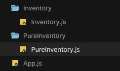
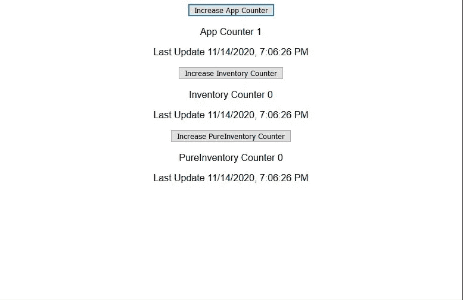
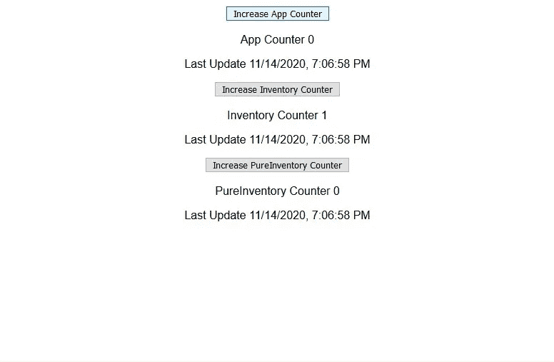
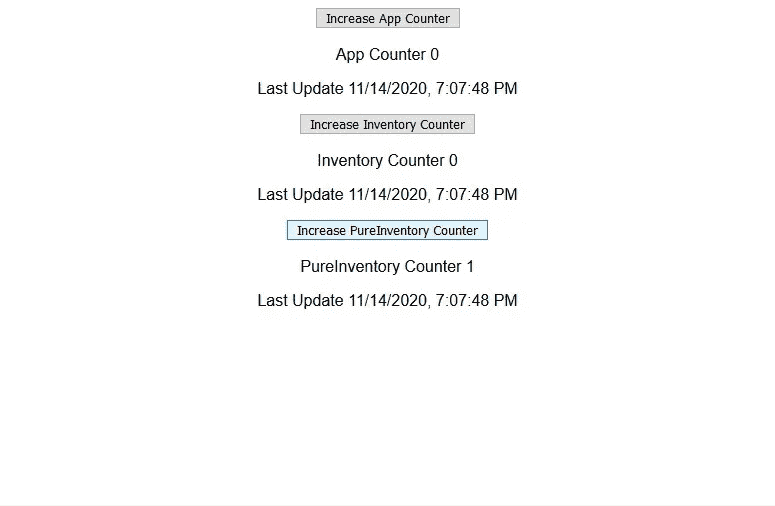
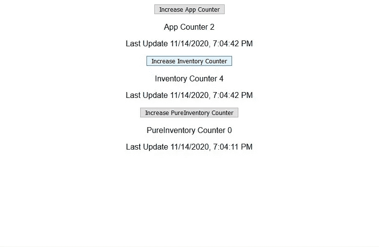
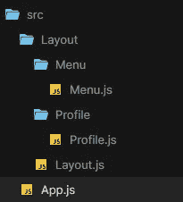

# 简单英语反应—状态(2)

> 原文：<https://medium.com/analytics-vidhya/reactjs-in-simple-english-state-2-af0fbc722cbe?source=collection_archive---------22----------------------->

这一次我们将更深入地了解状态，包括 *shouldComponentUpdate()* 、 *PureComponent* 和上下文 API

在我们继续之前，让我们看看 ReactJS 是如何更新我们的页面的

1.  检测到道具或状态的变化
2.  触发器*shouldcomponentdupdate()*，默认返回 true，这意味着它总是转到下一步 *render()*
3.  调用 render() 来渲染新的虚拟 DOM
4.  将旧的虚拟 DOM 与新呈现的虚拟 DOM 进行比较
5.  如果发现任何差异，更新真实的 DOM，只更新不同的部分，而不是整个 DOM

默认情况下，如果 props 或 state 发生任何变化，React 将始终呈现()包含所有组件的新虚拟 DOM，并将其与上一个版本进行比较。
例如，用户只需点击提交按钮并触发模态面板和确认对话框。显然，这是屏幕上的一个小变化，可能是一个布尔状态指示确认对话框必须显示，与其他组件无关。
但是，React 仍然会呈现一个包含所有组件的虚拟 DOM，并与旧版本进行核对。想想看，如果我们有一个大型应用程序，每一个变化都会触发相同的行为-渲染并再次检查所有组件。这将耗费大量资源并降低应用程序的速度。

为了提高性能，我们可以在*shouldComponentUpdate()*中实现一些检查，或者应用 *PureComponent* ，以便跳过一些不必要的 *render()* 并加快检查速度(因为新呈现的 DOM 将包含更少的组件)

1.  **shouldcomponentdupdate()**

它是 React 中的生命周期挂钩之一，默认情况下返回 true，这意味着它总是转到下一步 *render()。*我们可以在这里实现一些检查，所以如果状态/道具在那个类中没有改变，那么我们就不包括在接下来的渲染中。

为了更好地理解，让我们举个例子。在这个例子中，我们有 3 个班级。应用程序包含 PureInventory 和库存



App 类用三个变量初始化状态——App/ PureInventory/ Inventory 的计数器和为 App/pure Inventory/Inventory 添加计数器的函数，我们通过 props 传递它们

在 render 方法中，它包括两个子元素——pure Inventory 和 Inventory，以及一个时钟——每当 render 触发时，时钟就会更新

```
//App.jsclass App extends Component {state = {
   counter: 0,
   childCounter: 0,
   pureChildCounter: 0
};increaseCounterHandler = () => {
   this.setState((state) => {
   return { counter: state.counter + 1 };
   });
};increaseChildCounterHandler = () => {
   this.setState((state) => {
   return { childCounter: state.childCounter + 1 };
   });
};increasePureChildCounterHandler = () => {
   this.setState((state) => {
   return { pureChildCounter: state.pureChildCounter + 1 };
   });
};render() {
   console.log("parent render");
   return (
      <div className="App">
         <button onClick={this.increaseCounterHandler}>
         Increase App Counter
         </button>
         <p>App Counter {this.state.counter}</p>
         <p>Last Update {new Date().toLocaleString()}</p>
         <div>
         <Inventory 
            clicked={this.increaseChildCounterHandler} childCounter=    {this.state.childCounter}/>
         <PureInventory
            clicked={this.increasePureChildCounterHandler}   pureChildCounter={this.state.pureChildCounter}/>
         </div>
      </div>
      );
}
}
```

PureInventory 类，一个非常简单的类，有一个增加计数器的按钮和一个时钟——每当渲染触发时，时钟就会更新

```
//PureInventory.jsclass PureInventory extends Component {render() {
      console.log("pure children render");
      return (
         <div>
            <button onClick={this.props.clicked}> Increase PureInventory Counter </button>
            <p>PureInventory Counter {this.props.pureChildCounter}</p>    <p>Last Update {new Date().toLocaleString()}</p>
         </div>
      );
}
}
```

与 PureInventory 类类似，Inventory 类有一个增加计数器的按钮和一个时钟——每当渲染触发时，时钟就会更新

```
class Inventory extends Component {render() {
   console.log("children render");
   return (
      <div>
      <button onClick={this.props.clicked}>Increase Inventory Counter</button>
      <p>Inventory Counter {this.props.childCounter}</p>
      <p>Last Update {new Date().toLocaleString()}</p>
      </div>
      );
}
}
```

如上所述，默认情况下(如果你还没有实现*shouldComponentUpdate()**/PureComponent*)，状态的任何变化都会触发 *render()* (所有类的)在新的虚拟 DOM 中重新渲染所有的东西



应用计数器增加，子库存和纯库存也重新呈现，因为上次更新的时间相同



库存计数器增加，父库存和纯库存也会重新渲染，因为上次更新的时间相同



纯子级计数器增加，父级和子级也重新渲染，因为上次更新的时间相同

为了解决这个问题，我们可以在 PureInventory 类中实现*shouldComponentUpdate(nextProps，nextState)*-*nextProps*表示已更改的属性， *nextState* 表示已更改的状态。
因此，我们可以将当前道具/状态与变化后的道具/状态进行比较。
在这种情况下，PureInventory 只得到 1 个道具——pure child counter，我们通过*对比新旧道具！==* ，这意味着只有当新的 pureChildCounter 与当前的 pureChildCounter 不同时才进一步( *render()* )。

```
//PureInventory.jsclass PureInventory extends Component {shouldComponentUpdate(nextProps, nextState) {
   return 
   this.props.pureChildCounter !== nextProps.pureChildCounter;
}render() {
      console.log("pure children render");
      return (
         <div>
            <button onClick={this.props.clicked}> Increase Pure Child Counter </button>
            <p>Pure Child Counter {this.props.pureChildCounter}</p>    <p>Last Update {new Date().toLocaleString()}</p>
         </div>
      );
}
}
```



在 PureInventory 类中实现 shouldComponentUpdate()后，如果计数器的增加是在 App 或 Inventory 中(与 PureInventory 无关)，它不再重新呈现

让我们试试这个工作示例

2.*纯组件*

*PureComponent* 与*shouldComponentUpdate()*非常相似，除了 *PureComponent* 会检查所有道具/状态，但是你可以在*shouldComponentUpdate()*中定制

实现 *PureComponent* 很简单，只需导入它并扩展" *PureComponent* 而不是" *Component* "，其他都一样

```
import React, { PureComponent } from "react";class PureInventory extends PureComponent {render() { console.log("pure children render");
   return (
   <div>
   <button onClick={this.props.clicked}>
   Increase Pure Child Counter
   </button>
   <p>Pure Child Counter {this.props.pureChildCounter}</p>
   <p>Last Update {new Date().toLocaleString()}</p>
   </div>
   );
}
}export default PureInventory;
```

让我们试试工作示例

什么时候使用*shouldComponentUpdate()*/*PureComponent*？

视情况而定，如果有些组件总是随父组件更新，那么对它们进行任何检查都是浪费资源。对于某些情况，你非常确定不应该涉及到其他组件，就像我们在开头提到的——带有模态面板的确认对话框，*shouldComponentUpdate()*将是合适的，因为你确切地了解应该检查什么。如果应用程序很复杂，PureComponent 会更好，节省实现和测试时间，减少出错的机会。

*shouldComponentUpdate()*/*pure component*如何比较道具/状态？

PureComponent 实现了一个浅层比较，这意味着如果数据是一个原始值，它会自己比较数据。但是，如果它是一个对象，它将比较对象引用，而不是对象中的值。
在*shouldcomponentdupdate()*中，你可以实现任何你想要的东西，但是如果你在这里实现深度比较，可能会让你的应用变慢。
这就是为什么在[最后一段](https://link.medium.com/FHbgapkXobb)中，我强调我们“替换”了状态，但没有编辑里面的数据。

3.上下文 API

在[最后一段](https://link.medium.com/FHbgapkXobb)中，我们走过了基本的 about 状态，我们可以通过 props 将状态传递给另一个类/组件。想想看，如果我们有一个大型应用程序，从上到下，它可能有几层，如果我们想通过一个道具，我们必须通过每一层，这需要大量不必要的编码和额外的时间来维护它。

让我们看看这个例子，应用程序包含布局，布局包含菜单和配置文件。如果我们想把一个道具从应用程序传递到菜单和配置文件，那么我们也必须通过布局。



顶级— App.js

```
//App.js
class App extends Component {state = {
   adminMenu: false,
   customerMenu: true,
   name: "Fifi",
   position: "Customer Service Operator"
};render() {
   return (
      <div className="App">
      <Layout
         adminMenu={this.state.adminMenu}
         customerMenu={this.state.customerMenu}
         name={this.state.name}
         position={this.state.position}
      />
      </div>
   );}
}
```

“中间人”——layout . js

```
//Layout.js
import React, { Component } from "react";
import Profile from "./Profile/Profile";
import Menu from "./Menu/Menu";
import "../styles.css";class Layout extends Component {
   render() {
      console.log(this.props.customerMenu);
      return (
         <div className="main-container">
         <div className="left-container">
         <Menu customerMenu={this.props.customerMenu} adminMenu={this.props.adminMenu}
         />
         </div>
         <div className="right-container">
         <Profile name={this.props.name} position={this.props.position} />
         </div>
         </div>
   );}
}
export default Layout;
```

底层— Menu.js

```
class Menu extends Component { render() {
      return (
         <div>
         <p>{this.props.adminMenu ? <a href="#">Admin</a> : null}</p>
         <p>{this.props.customerMenu ? <a href="#">Customer</a> : null}</p>
         </div>
      );
}
}
```

底层— Profile.js

```
class Profile extends Component { render() {
      return (
         <div>
         <p>Name: {this.props.name}</p>
         <p>Position: {this.props.position}</p>
         </div>
         );
}
}
```

上面的例子说明，如果我们把道具从 App 传到菜单/ Profile，就必须经过 Layout。

自从上下文 API 的引入，我们可以绕过布局，应用程序可以直接将属性传递给菜单/配置文件

如何在 ReactJS 中实现上下文 API？

首先，我们必须创建一个 fail 来初始化上下文及其默认值

*createContext({})* 里面的这个值只是一个参考。即使我们在这里留空，我们仍然可以在后面的 *<提供者>* 中包含它。

```
//user-context.js
import React from "react";const userContext = React.createContext({});export default userContext;
```

在 App.js 中，我们初始化状态和传递状态的起点，我们必须导入我们刚刚创建的上下文文件。

然后，在*render()*——我们用来传递属性的地方，我们必须包装包含菜单和配置文件的树——我们想要将属性传递到的目的地，在本例中为< Layout/ >，并用< UserContext 包装它。提供者>，它的值属性包含我们想要传递的那些状态，或者我们可以只传递整个状态

```
import UserContext from "./context/user-context";class App extends Component {state = {
      adminMenu: false,
      customerMenu: true,
      name: "Fifi",
      position: "Customer Service Operator",
      testRender: 1,
      message: "testing"
   };//to test the behavior of context API later
increaseCounter = (greeting) => {
   this.setState((state) => {
      return { testRender: state.testRender + 1 };
   });
};render() {
   console.log("App render");
   console.log("counter:", this.state.testRender);
   return (
      <div className="App">
      <UserContext.Provider //pass the whole state
      *value={this.state}* //or only pass some value in state
      /*value={{
         adminMenu: this.state.adminMenu,
         customerMenu: this.state.customerMenu,
         name: this.state.name,
         position: this.state.position
      }}*/
      ><Layout />
   </UserContext.Provider>
   </div>
   );
}
}
```

在侧面，另一个目的地，我们想通过道具。导入我们在第一步创建的上下文文件。这一次我们必须用<usercontext.consumer>包装引用上下文变量的 JSX。在内部，在我们引用上下文变量之前，我们必须在这里声明一个 arrow 函数，用 *context* 作为参数，然后我们可以包装 JSX 返回并引用那里的上下文变量</usercontext.consumer>

```
import React, { Component, PureComponent } from "react";
import UserContext from "../../context/user-context";class Menu extends Component {
   render() {
      console.log("Menu render");
      return (
         <UserContext.Consumer>
         {(context) => (
            <div>
            <p>{context.adminMenu ? <a href="#">Admin</a> : null}</p>
            <p>{context.customerMenu ? <a href="#">Customer</a> : null}</p>
            </div>
         )}
         </UserContext.Consumer>
         );}
}
export default Menu;
```

在侧面，另一个目的地，我们想通过道具。导入我们在第一步创建的上下文文件。这次我们将尝试另一种语法(要求 16.6 或更高版本)。在 Profile 类中，我们必须声明一个静态变量— *静态上下文类型*(React 保留的字)并分配给*用户上下文*(我们刚刚导入的上下文文件)

```
import UserContext from "../../context/user-context";class Profile extends Component {
   static contextType = UserContext;

   render() {
      console.log("Profile render");
      return (
         <div>
         <p>Name: {this.context.name}</p>
         <p>Position: {this.context.position}</p>
         </div>
      );}
}
```

*<消费者>* 和*上下文类型*有什么区别？

1.  *<消费者>* 在 React 16.3 中可用，*上下文类型*在 React 16.6 以上必需
2.  <*消费者* >允许同时消费多个上下文，而*上下文类型*只允许消费单个上下文
3.  <*消费者* >只能与 JSX 一起使用，而*上下文类型*可以在类中的任何地方使用
4.  *contextType* 总是随着 Parent 一起触发 *render()* 一旦你声明*static context type = user context*无论你在对方*上应用*shouldcomponentdupdate()*或 *PureComponent* ，<消费者>* 得到类似的行为，但是如果你应用*shouldcomponentdupdate()*或 *PureComponent*

让我们试试工作示例