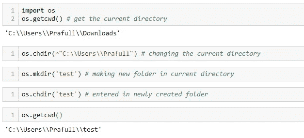
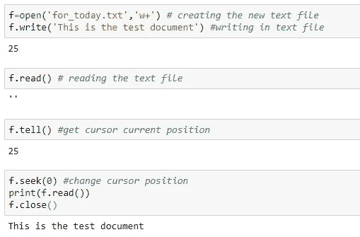
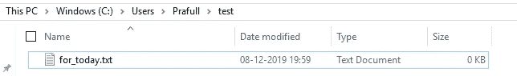
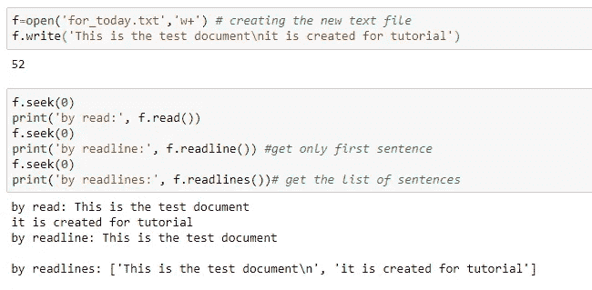
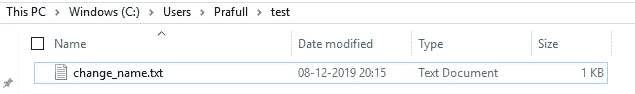
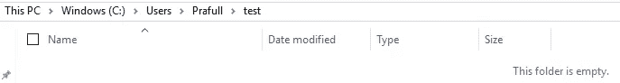
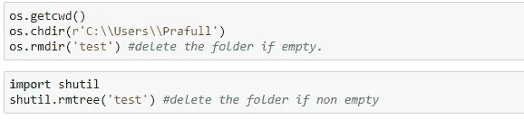

# 使用 Python 读写硬盘中的文件

> 原文：<https://medium.com/analytics-vidhya/read-and-write-files-in-the-hard-disk-using-python-b89114fcd18f?source=collection_archive---------4----------------------->


帕特里克·托马索在 [Unsplash](https://unsplash.com?utm_source=medium&utm_medium=referral) 上的照片

H 埃罗学者，

如果我们想永久存储一些文本输出，那么我们必须将它存储在硬盘中，因为存储在 RAM 中的数据是不稳定的，所以今天，我们将了解如何使用 python 读写文件。

听起来很酷？我们开始吧。

*   首先，我们将添加一个新文件夹(test)并更改当前目录。



1.  通过 *os.getcwd()* 获取我们当前的目录
2.  然后通过 *os.chdir()* 改变我们当前的目录
3.  创建了一个名为*测试*的新文件夹。
4.  进入一个新文件夹，并使其成为当前目录。

*   **读写文本文件。**



1.  *打开(' for_today.txt '，' w+')* 命令将创建一个新文件，如果不存在，则覆盖已经存在的文件，因为有操作符' *w+* '。



在测试文件夹中创建的文本文件

我们可以根据需要更换运营商。以下是操作员列表。

```
'r' = open the file for reading. (default)
'w' = open the file in writing. it creates the new file if does not exist or over ride if already exist.'x' = open the file for exclusive creation. if the file exist, operation fail.
'a' = appending at the end of file without truncating it and creates the new file if does not exist.
't' = open in the text mode.(default)
'b' = open in the binary mode. # we use the binary mode if our content is in matrix or list format.
'+' = open for updating (reading and writing)
'w+' = for reading and writing.
```

2.当我们试图读取我们的文件时，我们得到了空字符串，因为我们的光标在字符串的末尾(位置 25)。

3.通过'*f . seek(0)【T21]'我们把光标放在第 0 个位置，读取文件。始终记得在读/写操作后关闭文件，否则它将保留在 RAM 中。*

*   **readline 和 readlines 功能。**



如果我们想要迭代循环并打印所有文本，那么我们应该使用 readline 函数，但是如果我们想要文本列表，那么应该使用 readlines。

*   **重命名并删除文件。**

```
f.close() # closing the file
os.rename('for_today.txt','change_name.txt') #rename the file to change_name.txt
```



更改了文本文件的名称

```
os.remove('change_name.txt') # delete the file
```



删除了文本文件

*   **删除已创建的(测试)文件夹。**



要删除创建的“test”文件夹，我们必须将目录更改到创建 test 文件夹的主文件夹。

谢谢你，❤️

想在 Python、ML、AI 和数据科学方面保持最新？ [**报名**](https://forms.gle/FN4qvfYkCYEVE6Ce9)

如果对这个博客有任何疑问，请随时联系我。

> [https://www.linkedin.com/in/prafulla-dalvi-417708104/](https://www.linkedin.com/in/prafulla-dalvi-417708104/)