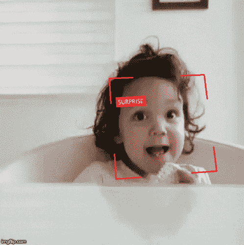

# 使用 Pytorch Torchvision 读取 FER2013 /人脸表情识别数据集

> 原文：<https://medium.com/analytics-vidhya/read-fer2013-face-expression-recognition-dataset-using-pytorch-torchvision-9ff64f55018e?source=collection_archive---------5----------------------->


本·怀特在 [Unsplash](https://unsplash.com?utm_source=medium&utm_medium=referral) 上的照片

## 一个流行的人工智能(AI)用例是检测人类的情绪/表情，他们的脸是否描绘了**快乐的表情、悲伤、厌恶、**等。



从市场研究到人类安全，人工智能的应用数不胜数，但我们不打算讨论它们，让我们讨论更多的技术。

> “人工智能”如何识别我们的情绪，这只是背后的图像分类，就像对热狗和热狗进行分类一样。

这种图像分类常用的数据集是 **FER2013** /面部表情识别，由 *Pierre-Luc Carrier 和亚伦·库维尔*准备，作为正在进行的研究项目的一部分(Kaggle 说)。

## 您可以通过下面的链接访问和下载该数据库:

[](https://www.kaggle.com/c/challenges-in-representation-learning-facial-expression-recognition-challenge/data) [## 表征学习的挑战:面部表情识别挑战

### 从图像中学习面部表情

www.kaggle.com](https://www.kaggle.com/c/challenges-in-representation-learning-facial-expression-recognition-challenge/data) 

数据集包含 48*48 像素的脸部的 35，887 张灰度图像。共有 7 类:**愤怒、厌恶、恐惧、高兴、悲伤、惊讶、中性。**


事情是这样的，这些“图片”是以 CSV 格式存储的， **YESS CSV 格式！**


类似于以 CSV 格式存储的表格数据，第一行是“列”的名称:情感、像素、用法。

然后，其余 35，887 行中的每一行包含情绪指数(0 =愤怒，1 =厌恶，2 =恐惧，3 =快乐，4 =悲伤，5 =惊讶，6 =中性)，2304 整数，其是与 48x48 图像相关联的像素的灰度强度(2304 = 48*48)，但是这 2304 个整数是由空格分隔的**，其用途是用于训练或公开测试或私人测试。**

回到题目里写的。我们将使用 Torchvision 包读取数据集。

我将提供两种提取它的方法。

## 这是第一个:

## 第二个:

要使用它，将类作为对象调用并迭代该对象，例如

```
dataset = FER2013Dataset_Alternative(fer_path)
dataset[1000] # RETURN IMAGE and EMOTION of row 1000
```

**不同点**在于，第二种方法在初始化状态时加载 CSV 中的所有行，而第一种方法是在需要时从 CSV 中加载一行。

第二种方法是更快的方式*，但是它*需要大量的内存*来存储大约 **301 MB** 的所有 CSV 数据，这相对较小，但是这种方法对于巨大的数据集是不推荐的(甚至是不可能的)。*

希望这篇文章对你有益，

干杯！！！！