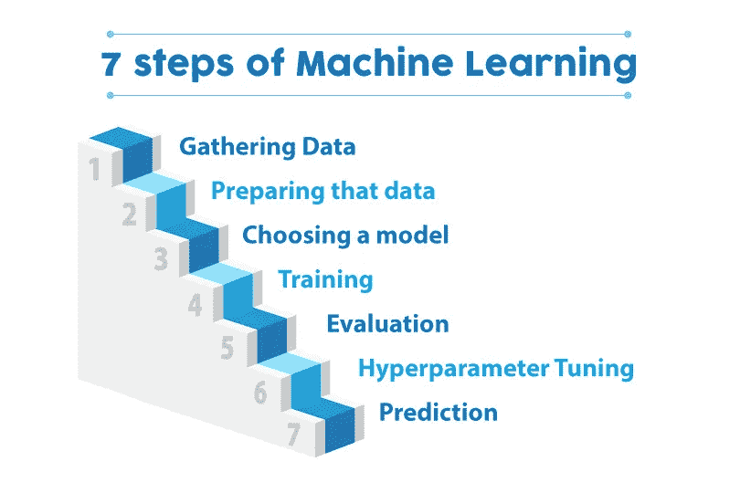
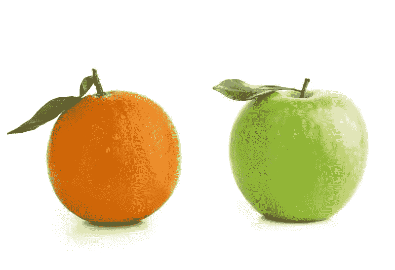
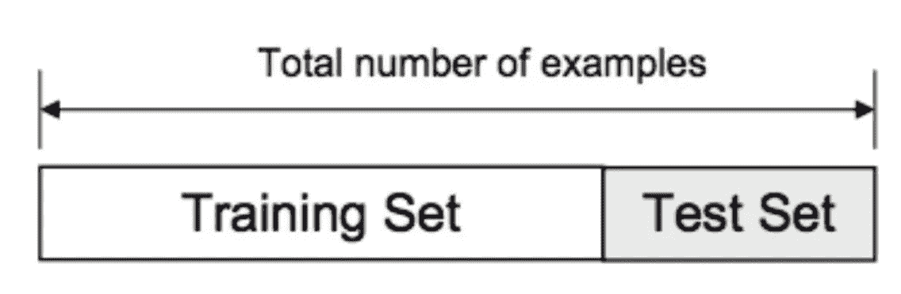
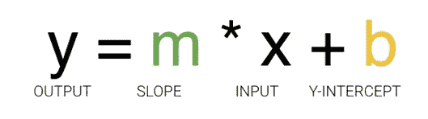
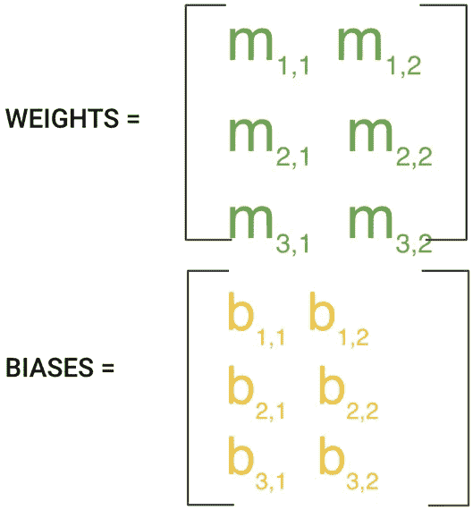
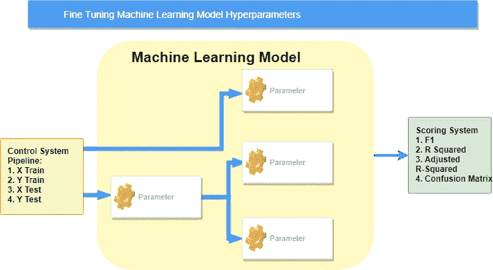
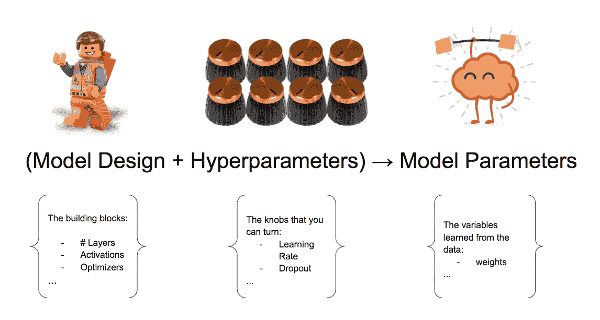
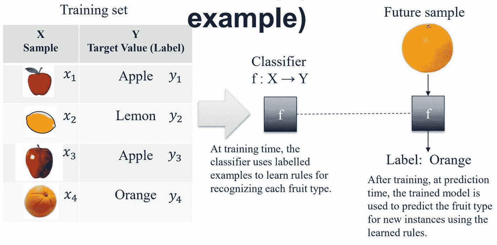

# 阅读这篇文章，作为你探索机器学习的指南

> 原文：<https://medium.com/analytics-vidhya/read-this-as-your-guide-in-exploring-machine-learning-997cfd23a3ea?source=collection_archive---------24----------------------->

制作机器学习项目的七个步骤

在[上一章](/@murzkii/the-beginning-intro-to-machine-learning-66e041dc4934)中，我们知道了什么是机器学习。但是，我应该从哪里开始我在机器学习项目中的第一次旅程呢？为此我应该学习什么编程语言？供您参考，当前的机器学习项目可以使用许多编程语言来完成，其中最简单的一种是使用 Python。再者，建议你先学 Python。

Jupyter 笔记本图标(左)Google Colab 图标(右)

你可以开始在运行于本地计算机环境的 Jupyter Notebook 或者运行于 Google Cloud 环境的 Google Colab 中编写你的代码。如果你选择在 Jupyter 笔记本上写下你的代码，你可以在这里下载[，但是如果你选择在 Google Colab 上写下你的代码，那么你应该访问这个](https://www.anaconda.com/products/individual)[链接](https://colab.research.google.com/notebooks/)。它们之间的主要区别是 GPU。虽然 Jupyter Notebook 使用你的 GPU 来运行代码，但 Google Colab 给你免费的 GPU 来使用。嗯，你可以阅读[这篇文章](/deep-learning-turkey/google-colab-free-gpu-tutorial-e113627b9f5d)来了解更多关于 Google Colab 的信息。

好了，回到正题。这里解释一下机器学习的七个步骤。

1.  **收集数据**

首先要做的事。你需要了解你面临的业务问题。你要考虑你的问题的主要目标是什么，为什么要用机器学习作为问题的解决方式，使用机器学习能获得什么好处等等。举个例子，作为机器学习工程师，你的任务是自动进行 ***预测，以确定橙子还是苹果*** 。

猩猩(左)和苹果(右)的照片

此外，您需要收集数据，如苹果和橙子的基色、苹果和橙子的大小等。你可以使用 [Kaggle](https://www.kaggle.com) 、数据库、API、web scraper、在线仓库等收集数据。机器学习中支持的数据格式有 CSV(逗号分隔值)、XLS、JSON (Javascript 对象表示法)、SQL(标准查询语言)和 SPSS(社会科学统计软件包)。

**2。准备数据**

下一步是数据准备。这一步需要做两件重要的事情，分别是**数据清理**和**数据转换**。数据清理就像*检查缺失值和不一致的数据类型*，*也删除重复值*。如果您得到了缺失的值，最好用平均值或该列中最常出现的值来填充它。另一方面，数据转换是根据预定义的规则修改数据的*过程，例如将数据分成训练和测试两个不同的部分。您可以将它们分成 70%和 30%或 80%和 20%(取决于数据集有多大)。*

**3。选择型号**

第三个是选择模型。多年来，研究人员和数据科学家创建了如此多的模型。有些非常适合图像数据，有些适合序列(如文本或音乐)，有些适合数字数据，有些适合基于文本的数据。以下是给出的六个示例模型:

人工神经网络

决策树

支持向量机

回归分析

贝叶斯网络

遗传算法

该模型将根据之前进行的学习类型 工作 ***。***

**4。训练数据**

现在我们进入通常被认为是机器学习的主体部分——训练。在这一步中，我们将使用我们的数据逐步提高模型预测给定水果是苹果还是橘子的能力。

斜截式

y=m*x+b，其中 x 是输入，m 是该线的斜率，b 是 y 截距，y 是该线在位置 x 处的值。我们可用于调整或“训练”的值是 m 和 b。没有其他方法可以影响该线的位置，因为其他变量只有 x(我们的输入)和 y(我们的输出)。

在机器学习中，有许多 m，因为可能有许多特征。这 m 个值的集合通常形成一个矩阵，我们将 W 表示为“权重”矩阵。类似地，对于 b，我们把它们放在一起，称之为偏差。

训练过程包括为 W 和 b 初始化一些随机值，并尝试用这些值预测输出。正如你所想象的，它做得很差。但是我们可以将我们的模型的预测与它应该产生的输出进行比较，并调整 W 和 b 中的值，这样我们将有更正确的预测。

然后重复这个过程。更新权重和偏差的每次迭代或循环被称为一个训练“步骤”。

**5。评估**

评估步骤评分系统([https://miro . medium . com/max/713/1 * dz 55mr _ 38 udwbtpctpcyzg . png](https://miro.medium.com/max/713/1*Dz55Mr_38UdWbtPcTPCyZg.png))

培训过程完成后，就该使用**评估**来查看结果了。这就是我们之前搁置的数据集发挥作用的地方。评估允许我们用从未用于训练的数据来测试我们的模型。这一指标使我们能够看到模型对尚未看到的数据的表现。这代表了模型在现实世界中的表现。

**6。参数调谐**

如果你对你最近的结果满意，这没关系，但是如果你想以任何方式改进你的训练，你可以通过 ***调整我们的参数*** 来做到这一点。我们在进行培训时隐含地假设了一些参数，现在是回过头来测试这些假设并尝试其他值的好时机。

参数调优([https://blog . floydhub . com/content/images/2018/08/Screen-Shot-2018-08-22-at-18 . 32 . 53 . png](https://blog.floydhub.com/content/images/2018/08/Screen-Shot-2018-08-22-at-18.32.53.png))

一个例子是 ***在训练*** 期间我们运行训练数据集多少次。我的意思是，我们可以多次向模型“展示”我们的完整数据集，而不仅仅是一次。这有时会导致更高的精度。

另一个参数是"*"的学习率。这定义了根据前一个训练步骤的信息，我们在每一步中移动直线的距离。这些值在我们的模型可以变得多精确以及训练需要多长时间方面都起着作用。*

*对于更复杂的模型， ***初始条件可以对决定训练结果的*** 起很大作用。根据模型开始训练时是否将值初始化为零，而不是值的某种分布，可以看出差异，这导致了使用哪种分布的问题。*

*正如你所看到的，在训练的这个阶段有很多需要考虑的事情，重要的是你要定义一个“足够好”的模型，否则你可能会发现自己要调整很长时间的参数。*

*这些参数通常被称为“ ***超参数*** ”。这些超参数的调整仍然是一门艺术，更像是一个实验过程，在很大程度上取决于数据集、模型和训练过程的细节。*

***7。预测***

**

*预测步骤的结果([https://lh3 . googleusercontent . com/tRhHQTKzNfr-eg1 sdaixtbu 7 jtzmkamvazbk 393 ftcbjp 5 kpqevqv 5d 3 jbipdciziyrscuq 09 JK 90 lco 8 svgrbuj9j-ytjexxmf 7 l 9 OPN by 3-SJbmUW _ duxbmqfio 5 syn 6 kjzejsuq = w 2400](https://lh3.googleusercontent.com/tRhHQTKzNfr-eg1sSdaIxTbU7jTzmKamvAZbK393ftcBjP5Kpqevqv5D3JbIPdcIzyrScUQ09jk90LCO8svgRBuj9j-ytJexXMf7l9oPNbY3-SJbmUW_DuXBMQfio5sYn6KJzeJSuQ=w2400))*

*机器学习是[用数据回答问题](/towards-data-science/what-is-machine-learning-8c6871016736)。所以**预测**，或者说推断，是我们回答一些问题的步骤。这是所有这些工作的重点，也是机器学习的价值得以实现的地方。*

*这部分到此为止。你有什么建议给我吗？请在下面留下你的评论，这样我就可以阅读并注意到。在下一章，我们将发现更多关于熊猫和预处理数据。*

*感谢你们所有人，祝你们有美好的一天:)*