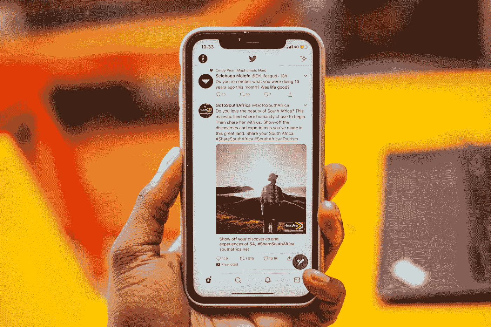

# 在做你的第一个 NLP 社交媒体项目之前，读一下这篇文章

> 原文：<https://medium.com/analytics-vidhya/read-this-before-doing-your-first-nlp-social-media-project-62da60543ea3?source=collection_archive---------7----------------------->

[爸爸莫拉拉](https://unsplash.com/@daddymohlala?utm_source=unsplash&utm_medium=referral&utm_content=creditCopyText)在 [Unsplash](https://unsplash.com/s/photos/mobile-phone?utm_source=unsplash&utm_medium=referral&utm_content=creditCopyText) 上的照片

鉴于社交媒体中丰富的数据潜力，以及从 [Twitter](https://developer.twitter.com/en/docs/twitter-api) 、 [Reddit](https://www.reddit.com/dev/api/) 、 [YouTube](https://developers.google.com/youtube/v3) 等获取这些数据的 API 的可用性。Python 程序员继续[运行 NLP 实验](https://realpython.com/natural-language-processing-spacy-python/)从社交媒体中提取和处理数据。一些例子是:

*   [使用 YouTube 评论创建数据集](https://towardsdatascience.com/how-to-build-your-own-dataset-of-youtube-comments-39a1e57aade)
*   [推特上的情绪分析](https://towardsdatascience.com/sentiment-analysis-on-twitter-data-regarding-2020-us-elections-1de4bedbe866) …