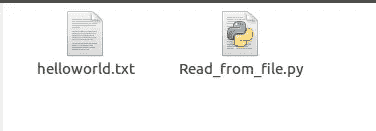
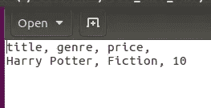
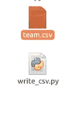
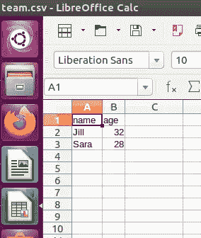

# 在 Python 中读写文件。

> 原文：<https://medium.com/analytics-vidhya/reading-and-writing-files-in-python-15d3360640d6?source=collection_archive---------21----------------------->

这周我一直在学习 Python 中的文件处理。作为初学者，这里有一些关于基本文件处理代码的注释。

所以让我们用 Python 来创建、读取、更新和删除文件。

**1。阅读**

为了读取一个文本文件，我们使用 open()函数。这个函数有两个参数，文件名和模式。“helloworld.txt”是我们的文件名，因为我们正在读取一个文件，所以我们使用“r”模式。请注意，如果文件夹中不存在该文件，则“r”会给出一个错误。我已经在 python 文件所在的文件夹中手动创建了一个名为“helloworld.txt”的文本文件。



```
with open('helloworld.txt', 'r') as text_file:
    contents = text_file.read()
print(contents) **output is :**country,capital, language
France,Paris,French
Italy,Rome,Italian
Canada,Ottawa,English
```

**将文本文件读取为 csv 文件:**CSV 文件(逗号分隔值)是一种包含大量数据的文件。使用称为分隔符(，)的分隔符来分隔数据。分隔符将数据组织成由行和列组成的表格形式。

```
import csv

with open('helloworld.txt') as csv_file:
    csv_reader = csv.reader(csv_file, delimiter=',')
    for data in csv_reader:
        print(data)output is:
['country', 'capital', ' language']
['France', 'Paris', 'French']
['Italy', 'Rome', 'Italian']
['Canada', 'Ottawa', 'English']
```

**将文本文件“helloworld.txt”另存为 csv 文件“hello world . CSV”**

```
import pandas as pd

read_file = pd.read_csv (r'/home/d/Documents/Python/Files_Handling/helloworld.txt')
read_file.to_csv (r'/home/d/Documents/Python/Files_Handling/helloworld.csv')
```


**读取 csv 格式的文本文件，并以 Python 字典的形式查看 csv 文件。**

```
import csv

with open('helloworld.txt', mode='r') as csv_file:
    csv_reader = csv.DictReader(csv_file)
    for data in csv_reader:
        print(data)output is:
{'country': 'France', 'capital': 'Paris', ' language': 'French'}
{'country': 'Italy', 'capital': 'Rome', ' language': 'Italian'}
{'country': 'Canada', 'capital': 'Ottawa', ' language': 'English'}
```

**将文本文件读取为 csv 文件，并以数据帧的形式查看 csv 文件。**

```
import pandas as pd

df = pd.read_csv('helloworld.txt')
print(df)output is: country capital  language
0  France   Paris    French
1   Italy    Rome   Italian
2  Canada  Ottawa   English
```

**2。写入**

为了写一个文本文件，我们使用 open()函数。这个函数有两个参数，文件名和模式。“books.txt”是我们的文件名，因为我们正在写一个文件，所以我们使用“w”模式。创建文件后，我们可以在文件夹中查看它。

```
with open('books.txt', 'w') as text_file:
    books = 'title, genre, price, \nHarry Potter, Fiction, 10'
    text_file.write(books)
```



**编写一个 csv 文件并将值作为 python 字典传递。**

创建该文件时，它会以电子表格的形式打开。

```
 import csv
field_names = ['name', 'age']
data = [
{'name': 'Sam', 'age': 32},
{'name': 'Kim', 'age': 28},
]
with open('team.csv', 'w+') as csv_file:
    spreadsheet = csv.DictWriter(csv_file, fieldnames=field_names)
    spreadsheet.writeheader()
```



3.**删除**

```
import os
os.remove("books.txt")
```

**4。追加:用户输入**

首先手动创建一个空的 todo 文件。然后要求用户输入新的待办事项

```
item = input('Add a todo item:')*#Read* with open('todo.txt','r')as todo_file:
    todo = todo_file.read()*#Add the new to do item to the existing to-do items* todo = todo + item +'\n'*#Save* with open('todo.txt', 'w') as todo_file:
    todo_file.write(todo)*#open* with open('todo.txt','r')as todo_file:
    todo = todo_file.read()
print(todo)**output is:**Add a todo item:Prepare Food
Shopping
Study
Go For A Walk
Prepare Food
```

希望你喜欢阅读我关于文件处理的笔记。谢谢！

**资源:**

W3Schools Online，2020。Python 文件处理。[在线]可在:[https://www.w3schools.com/python/python_file_handling.asp](https://www.w3schools.com/python/python_file_handling.asp)[2020 年 7 月 10 日访问]。

w3 在线学校，2001-2020。CSV 文件的读写。[在线]可在:[https://docs.python.org/3/library/csv.html?找到 highlight = file % 20 handling](https://docs.python.org/3/library/csv.html?highlight=file%20handling)【2020 年 7 月 10 日访问】。