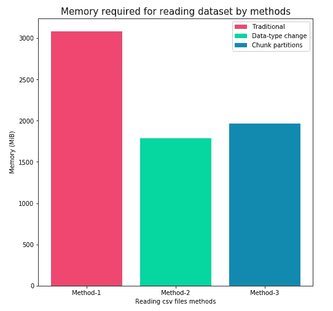
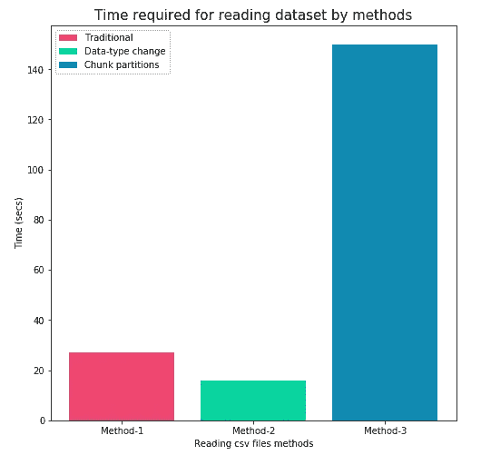

# 使用 pandas 读取大型数据集

> 原文：<https://medium.com/analytics-vidhya/reading-large-datasets-using-pandas-ec2d99465887?source=collection_archive---------2----------------------->


照片由[斯坦尼斯拉夫·康德拉蒂耶夫](https://unsplash.com/@technobulka?utm_source=unsplash&utm_medium=referral&utm_content=creditCopyText)在 [Unsplash](https://unsplash.com/s/photos/library?utm_source=unsplash&utm_medium=referral&utm_content=creditCopyText) 拍摄

在数据科学中，我们可能会遇到需要读取大于系统内存的大型数据集的情况。在这种情况下，您的系统将在读取如此大量的数据时耗尽 RAM/内存。这也可能导致 jupyter 笔记本的内核关闭或系统崩溃。为了避免这种情况，有一些非常好的技术可以帮助我们读取大型数据集。

对于任何数据科学家来说，阅读 CSV 文件的 python 包的明显选择是 pandas。在这篇博客中，我们将揭示一些很酷的技术来阅读这些数据集。

在我们深入研究这些技术之前，最好先设置好我们的环境并做好准备:

```
conda install -c conda-forge jupyterlab
conda install -c anaconda pandas
jupyter notebook
```

# **数据**

我使用的是 [PUBG 完成布局预测(仅内核)](https://www.kaggle.com/c/pubg-finish-placement-prediction) kaggle 竞赛的数据集。我们将使用训练数据集进行分析。训练集包含 440 万行，总计 700 MB 数据！

# **方法**

## 使用正常的 pandas 方法读取数据集

```
>>>> pd.read_csv('train_V2.csv')
```

这是读取 csv 文件的标准方法。现在让我们看看这段代码执行所花费的时间。使用 [IPython 的神奇命令](https://jakevdp.github.io/PythonDataScienceHandbook/01.07-timing-and-profiling.html):

```
>>>> %time pd.read_csv('train_V2.csv') [](https://gist.github.com/raisedrussian/b009caee3f117c65487452567affde99) CPU times: user 16.5 s, sys: 1.33 s, total: 17.8 s
Wall time: 27.5 s
```

我们花了大约 27 秒来阅读我们的训练集。我们仍然可以提高速度，减少停留时间。

为了计算这种方法消耗的内存量，我们可以使用 IPython 的`[memory_profiler](https://jakevdp.github.io/PythonDataScienceHandbook/01.07-timing-and-profiling.html)`扩展中的一个神奇命令，名为`%memit`

```
>>>> %memit pd.read_csv('train_V2.csv')peak memory: 3085.73 MiB, increment: 3001.68 MiB
```

这里的内存峰值表示`read_csv`功能消耗的内存量。对于 700 MiB 的训练数据，需要大约 3gb 的内存！让我们看看下一个方法消耗了多少内存。

# **使用数据类型修改方法从数据集读取数据**

这种方法只需要将数据集每一列的数据类型更改为占用内存较少的数据类型。在我们的示例中，让我们首先列出训练集中的所有数据类型。

我们首先需要知道训练集的当前数据类型是什么。我们不会再用传统的方法阅读训练集。但是我们将从训练集中抽取一些样本，并将其保存在另一个文件中。为此，请在 jupyter 笔记本单元格中键入以下命令，

```
!head train_V2.csv > sample_train.csv
```

`head`命令将打印`train_V2.csv`文件的前 10 行，并将其标准输出添加到`sample_train.csv`。现在我们已经得到了子样本训练集，因此我们现在可以通过普通的`pandas.read_csv`函数轻松读取数据集:

```
sample_train = pd.read_csv('sample_train.csv')
dict(zip(sample_train.columns,sample_train.dtypes))
```

最后一行将根据各自的数据类型给出列名的字典:

```
{'Id': dtype('O'),
 'groupId': dtype('O'),
 'matchId': dtype('O'),
 'assists': dtype('int64'),
 'boosts': dtype('int64'),
 'damageDealt': dtype('float64'),
 'DBNOs': dtype('int64'),
 'headshotKills': dtype('int64'),
 'heals': dtype('int64'),
 'killPlace': dtype('int64'),
 'killPoints': dtype('int64'),
 'kills': dtype('int64'),
 'killStreaks': dtype('int64'),
 'longestKill': dtype('float64'),
 'matchDuration': dtype('int64'),
 'matchType': dtype('O'),
 'maxPlace': dtype('int64'),
 'numGroups': dtype('int64'),
 'rankPoints': dtype('int64'),
 'revives': dtype('int64'),
 'rideDistance': dtype('float64'),
 'roadKills': dtype('int64'),
 'swimDistance': dtype('float64'),
 'teamKills': dtype('int64'),
 'vehicleDestroys': dtype('int64'),
 'walkDistance': dtype('float64'),
 'weaponsAcquired': dtype('int64'),
 'winPoints': dtype('int64'),
 'winPlacePerc': dtype('float64')}
```

一般来说，每当数据集被加载并且 pandas 找到任何数字列时，默认情况下它被分配给 int64 或 float64 数据类型。由于缺省值是 64 位数据类型，所以您可以想象，对于超过数百万行的数据集，它将占用多么巨大的空间。为了便于理解，下表将显示 int 和 float 数据类型允许的值范围:

```
int8  Byte    (-128 to 127)
int16 Integer (-32768 to 32767)   
int32 Integer (-2147483648 to 2147483647)   
int64 Integer (-9223372036854775808 to 9223372036854775807)
float32 Half precision
float64 Full precision
```

有关 pandas 中使用的数据类型的更多信息，请参考 [pandas](https://pandas.pydata.org/pandas-docs/stable/getting_started/basics.html#basics-dtypes) 和 [numpy](https://docs.scipy.org/doc/numpy/user/basics.types.html) 文档。

很明显，较大的数据类型将消耗更多的空间。在我们的场景中，有`19 int64, 6 float64 and 4 object` 数据类型列。现在让我们创建一个字典，它将包含`int16 and float16` 作为所有整数和浮点列的数据类型。

```
dtype_list = list()
for x in sample_train.dtypes.tolist():
    if x=='int64':
        dtype_list.append('int16')
    elif(x=='float64'):
        dtype_list.append('float16')
    else:
        dtype_list.append('object')

dtype_list = dict(zip(sample_train.columns.tolist(),dtype_list))
dtype_list
```

上面的代码片段将帮助我们获得类似于下面的数据类型字典:

```
{'Id': 'object',
 'groupId': 'object',
 'matchId': 'object',
 'assists': 'int16',
 'boosts': 'int16',
 'damageDealt': 'float16',
 'DBNOs': 'int16',
 'headshotKills': 'int16',
 'heals': 'int16',
 'killPlace': 'int16',
 'killPoints': 'int16',
 'kills': 'int16',
 'killStreaks': 'int16',
 'longestKill': 'float16',
 'matchDuration': 'int16',
 'matchType': 'object',
 'maxPlace': 'int16',
 'numGroups': 'int16',
 'rankPoints': 'int16',
 'revives': 'int16',
 'rideDistance': 'float16',
 'roadKills': 'int16',
 'swimDistance': 'float16',
 'teamKills': 'int16',
 'vehicleDestroys': 'int16',
 'walkDistance': 'float16',
 'weaponsAcquired': 'int16',
 'winPoints': 'int16',
 'winPlacePerc': 'float16'}
```

现在我们已经有了包含较小数据类型的自定义字典，让我们看看如何在`read_csv` 函数中包含这个数据类型字典，以便 pandas 按照我们想要的方式读取我们的训练集，即包含较小数据类型的列。

```
>>>> %time pd.read_csv('train_V2.csv',dtype=dtype_list)CPU times: user 13.4 s, sys: 667 ms, total: 14.1 s
Wall time: 16.6 s
```

读取整个训练数据集大约需要 16.6 秒。如果我们将这个时间与我们的普通方法进行比较，那么读取训练数据集的速度大约增加了**40%**。

现在是我们使用前面方法中相同的神奇命令再次计算内存消耗的时候了:

```
>>>> %memit pd.read_csv('train_V2.csv',dtype=dtype_list)peak memory: 1787.43 MiB, increment: 1703.09 MiB
```

因此，这种方法消耗了大约一半的内存，与我们的传统方法相比，这是非常好的。

# **使用块创建方法读取 csv**

该方法包括使用`read_csv` 函数中的`chunksize` 参数读取数据。让我们创建一个块大小，以便通过以下方法读取数据集:

```
>>>> chunk_size = 10**6
>>>> chunk_size
1000000
```

让我们将数据集分成 1000000 个块。因此，我们的数据集将被分成大小为 1000000 的 4 个块，最后一个块的大小由熊猫智能计算。现在让我们计算一下这种方法需要多少时间:

```
>>>> %timeit [chunk for chunk in pd.read_csv('train_V2.csv',chunksize=chunk_size)]29.4 s ± 2.26 s per loop (mean ± std. dev. of 7 runs, 1 loop each)
```

因此，对于每个数据块，加载数据需要大约 30 秒，即所有 5 个数据块总共需要 **150 秒**。

此外，此方法消耗的内存是:

```
>>>> %memit [chunk for chunk in pd.read_csv('train_V2.csv',chunksize=chunk_size)]peak memory: 1966.75 MiB, increment: 1880.20 MiB
```

比较所有方法消耗的时间和内存:



越低越好

# 结论

一般来说，这完全取决于您试图读取的数据集。方法 2 是我们讨论过的在读取时改变数据帧中列的数据类型的方法，它肯定可以用在系统资源不足的情况下或者在竞争中。但我认为这种方法有一个警告，即当我们从大数据集转移到小数据集时，我们正在缩小可接受的数字范围，因此可能会有一些数据丢失。如果速度不是那么重要，并且您希望保持数据的完整性，那么方法 3 是非常可取的。

感谢 fast.ai 的[机器学习入门课程和他们的](https://course18.fast.ai/lessonsml1/lesson3.html)[牛逼论坛](http://forums.fast.ai)激励我写这篇博客。

你可以在这篇博文中找到我的代码:

[https://github . com/keyurparalkar/Blogpost _ excepts/blob/master/Blogpost _ 0% 20-% 20 reading % 20 large % 20 datasets % 20 using % C2 % A0 pandas . ipynb](https://github.com/keyurparalkar/Blogpost_excerpts/blob/master/Blogpost_0%20-%20Reading%20large%20Datasets%20using%C2%A0pandas.ipynb)

请在评论区告诉我你有多喜欢这篇博文，或者你可以通过我的 twitter 账号 [@keurplkar](https://twitter.com/keurplkar) 向我寻求建设性反馈