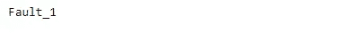

# 在 Tensorflow 2 中读取多个文件

> 原文：<https://medium.com/analytics-vidhya/reading-multiple-files-in-tensorflow-2-ec75c7d7c46c?source=collection_archive---------4----------------------->

维克多·塔拉舒克在 [Unsplash](https://unsplash.com?utm_source=medium&utm_medium=referral) 上拍摄的照片

([关于这篇文章的 Jupyter 笔记本可以在这里找到](https://github.com/biswajitsahoo1111/cbm_codes_open/blob/master/notebooks/Reading_multiple_files_in_Tensorflow_2.ipynb)

在本帖中，我们将使用生成器将多个`.csv`文件读入 Tensorflow。但是我们将要讨论的方法足够通用，也适用于其他文件格式。我们将使用 500 个`.csv`文件演示该过程。这些文件是用随机数创建的。每个文件在一列中只包含 1024 个数字。这种方法可以很容易地扩展到包含数千个`.csv`文件的大型数据集。随着文件数量变大，我们无法将全部数据加载到内存中。所以我们必须处理大量的数据。发电机帮助我们方便地做到这一点。在这篇文章中，我们将使用自定义生成器读取多个文件。

从读者不必从任何地方下载任何数据的意义上来说，这篇文章是自给自足的。只需按顺序运行以下代码。首先，在当前工作目录下创建一个名为“random_data”的文件夹，并在其中保存`.csv`文件。随后，将从该文件夹中读取文件并进行处理。只要确保你当前的工作目录没有一个名为“random_data”的旧文件夹。然后运行下面的代码。这个帖子的 Jupyter 笔记本可以在[这里](https://github.com/biswajitsahoo1111/cbm_codes_open/blob/master/notebooks/Reading_multiple_files_in_Tensorflow_2.ipynb)找到。

我们将使用`Tensorflow 2`来运行我们的深度学习模型。`Tensorflow`非常灵活。给定的任务可以用不同的方式来完成。我们将使用的方法不是唯一的。鼓励读者探索做同样事情的其他方法。下面是这篇文章中考虑的三个不同任务的概要。

# 大纲:

1.  创建 500 个`".csv"`文件，保存在当前目录下的“random_data”文件夹中。
2.  编写一个生成器，从文件夹中读取数据并对其进行预处理。
3.  将大块数据输入 CNN 模型，并对其进行几个时期的训练。

# 1.创建 500 个`.csv`随机数据文件

由于我们打算使用我们的数据训练 CNN 模型进行分类，我们将为 5 个不同的类别生成数据。以下是我们将遵循的流程。

*   每个`.csv`文件将有一列包含 1024 个条目的数据。
*   每个文件将使用以下名称之一保存(故障 1、故障 2、故障 3、故障 4、故障 5)。数据集是平衡的，也就是说，对于每个类别，我们有大约相同数量的观察值。“故障 1”类别中的数据文件的名称为“故障 1_001.csv”、“故障 1_002.csv”、“故障 1_003.csv”、“故障 1_100.csv”。其他班级也是如此。

首先创建一个将生成随机文件的函数。

现在使用该函数为五种故障类型创建 100 个文件。

要从文件名中提取标签，请提取文件名中与故障类型相对应的部分。

既然已经创建了数据，我们将进入下一步。也就是说，定义一个生成器，将类似时间序列的数据预处理成类似矩阵的形状，以便二维 CNN 可以摄取它。

# 2.编写一个生成器来读取数据块并对其进行预处理

生成器类似于函数，但有一个重要区别。函数一次产生所有的输出，而生成器一个接一个地产生输出，当被要求时也是如此。`yield`关键字将函数转换成生成器。根据内部使用的循环结构，生成器可以运行固定次数或无限期运行。对于我们的应用程序，我们将使用一个无限运行的生成器。

下面的生成器将文件名列表作为第一个输入。第二个论点是`batch_size`。`batch_size`决定我们一次要处理多少文件。这是由我们有多少内存决定的。如果所有数据都可以加载到内存中，就不需要生成器了。如果我们的数据量很大，我们可以处理大块的数据。

由于我们将解决一个分类问题，我们必须给每个原始数据分配标签。为了方便起见，我们将使用以下标签。

生成器将同时`yield`数据和标签。

要读取任何其他文件格式，在生成器内部更改读取文件的行。这将使我们能够读取不同的文件格式，无论是`.txt`或`.npz`或任何其他格式。

现在我们将检查发电机是否按预期工作。我们将设置`batch_size`为 10。这意味着将读取和处理以 10 个为一组的文件。从中选择 10 个文件的文件列表可以是有序文件列表或混排列表。如果文件没有随机播放，使用`np.random.shuffle(file_list)`随机播放文件。

在演示中，我们将从有序列表中读取文件。这将帮助我们检查代码中的任何错误。

多次运行上面的代码单元格，观察不同的标签。只有当所有对应于“Fault_1”的文件都已被读取时，标签 1 才会出现。“Fault_1”有 100 个文件，我们将 batch_size 设置为 10。在上面的单元格中，我们只对生成器迭代了 6 次。当迭代次数大于 10 时，我们会看到标签 1，然后是其他标签。这只有在我们的初始文件列表没有被打乱的情况下才会发生。如果原始列表被打乱，我们将获得随机标签。

现在我们将使用生成器创建一个`tensorflow dataset`。`Tensorflow`数据集可以方便地用于训练`tensorflow`模型。

可以从 numpy 数组或生成器中创建一个`tensorflow dataset`。这里，我们将使用一个生成器来创建它。在`tensorflow datasets`中使用之前创建的生成器不起作用(读者可以验证这一点)。这是因为正则表达式无法将“字符串”与“字节字符串”进行比较。tensorflow 中默认生成“字节串”。作为变通，我们将对早期的生成器进行修改，并将其用于 tensorflow 数据集。注意，我们将只修改三行。修改过的行旁边都附有注释文本。

测试改造后的发电机是否工作。

请注意，使用几个`tensorflow`命令创建的新生成器与我们之前的生成器一样工作良好。这种新型发电机现在可以与`tensorflow dataset`集成。

检查`dataset`是否工作。

这也很好。现在，我们将使用生成器训练一个完整的 CNN 模型。正如在每个模型中所做的那样，我们将首先打乱数据文件。将文件分为训练集、验证集和测试集。使用`tf_data_generator`创建三个 tensorflow 数据集，分别对应于训练、验证和测试数据。最后，我们将创建一个简单的 CNN 模型。使用训练数据集对其进行训练，查看其在验证数据集上的性能，并使用测试数据集获得预测。请记住，我们的目标不是提高模型的性能。由于数据是随机的，所以不要期望看到良好的性能。目的只是创建一个管道。

# 3.建立数据管道和训练 CNN 模型

现在创建模型。

编译模型。

在我们拟合模型之前，我们必须做一个重要的计算。记住我们的生成器是无限循环的。因此，如果没有给出停止条件，它将无限期运行。但是我们希望我们的模型运行 10 个时期。所以我们的生成器应该只对数据文件循环 10 次，不要超过 10 次。这是通过在`model.fit()`中将参数`steps_per_epoch`和`validation_steps`设置为期望的数值来实现的。类似地，在评估模型时，我们需要在`model.evaluate()`中将参数`steps`设置为所需的数值。

训练集中有 340 个文件。Batch_size 为 10。因此，如果发电机运行 34 次，它将对应于一个纪元。因此，我们应该将`steps_per_epoch`设置为 34。同理，`validation_steps = 6`和`model.evaluate()`、`steps = 10`中。

不出所料，模特表现很差。这就把我们带到了博客的结尾。正如我们在开始时所计划的，我们已经创建了随机数据文件、一个生成器，并使用该生成器训练了一个模型。上面的代码可以稍微调整一下来读取除了`.csv`之外的任何类型的文件。现在我们可以训练我们的模型，而不用担心数据的大小。无论数据大小是 10GB 还是 750GB，我们的方法都适用。

最后，我想强调的是，这不是完成任务的唯一方法。正如我之前提到的，在`Tensorflow`中，你可以用几种不同的方式做同样的事情。我选择的方法对我来说似乎很自然。我既没有追求效率，也没有追求优雅。如果读者有更好的想法，我很乐意知道。

我希望，这篇博客能对读者有所帮助。请把任何错误或遗漏告诉我。

**更新**:如果在读取的同时，必须对提取的数据进行复杂的转换(比如，对每段数据进行频谱分析等)。)，这篇博客中提出的天真的方法可能会很慢。但是有办法让这些计算更快。作者自己在一个应用程序中实现了 10 倍的加速比。如果您遇到此问题并且无法解决，请联系作者。讨论这种加速技术的博客将在稍后发布。