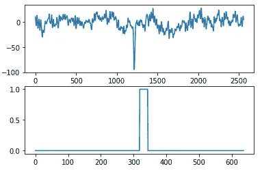
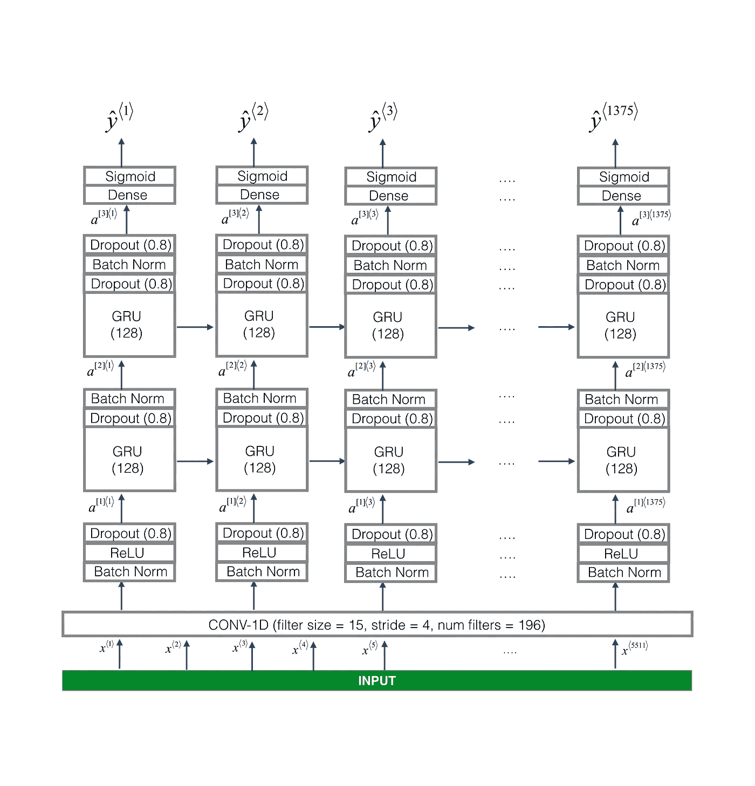
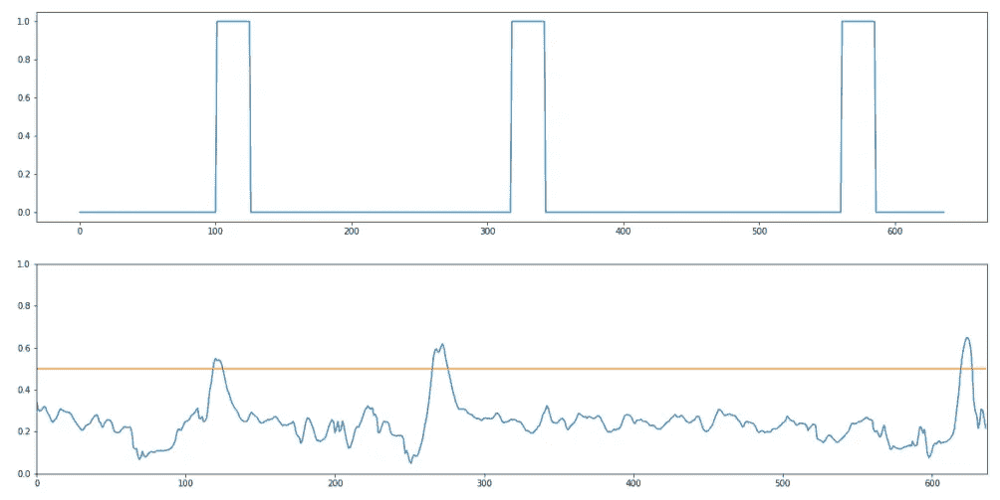

# 用机器学习解读大脑

> 原文：<https://medium.com/analytics-vidhya/reading-the-brain-with-machine-learning-aad4627cbc4b?source=collection_archive---------16----------------------->

在我的[上一篇文章](/analytics-vidhya/brain-research-on-the-cheap-ec9710a6c21b)中，我谈到了使用便携式脑电图设备来检测大脑中的事件相关电位(ERP)。具体来说，在一个谜题被正确解答后，我能够检测到一个奖励积极性(RewP)信号。我通过在事件发生后立即绘制信号图，并将其与来自[本文](https://www.frontiersin.org/articles/10.3389/fnins.2017.00109/full)的平均 RewP 信号进行比较来做到这一点。利用我的人类大脑的视觉模式识别，我确认我得到了相同的模式。训练一个机器学习模型来识别相同的模式，这样我们就可以自动监控这些事件，这难道不是很有趣吗？这样，这些 ERP 可以触发基于事件的 API，我们可以编写由各种大脑状态驱动的代码。为此，我训练了一只 RNN 来探测 RewP。

这个问题让我想起了触发词检测，例如，你训练一个人工智能听音频输入，当它听到“嘿 Siri”或“OK Google”时就会醒来。在 deeplearning.ai 类[序列模型](https://www.coursera.org/learn/nlp-sequence-models/home/welcome)中有一个项目就是这样做的，所以我决定使用他们的方法作为起点，并从那里进行调整。唯一的区别是，我们看的不是音频数据，而是脑电图数据，我们看的不是特定的词，而是活动的模式，但除此之外，问题是相似的，因为它们都处理一维时间序列数据。

# 数据

我开始的数据非常有限，所以我不期望有突出的结果，但我认为最好开始并进行模型的第一次迭代，我可以在以后添加更多/更好的数据。我收集了 8 个人(包括我自己)的 12 份脑电图记录，同时做了一些测试，比如在未标记的欧洲地图上寻找国家或者国际象棋谜题，如果他们的答案是对还是错，他们会得到即时反馈。我还记录了鼠标点击的时间戳，以准确知道反馈是何时给出的，我还记录了屏幕，以便稍后我可以判断每个答案是否正确。

# 预处理

一旦我汇总了数据，在鼠标被释放后，我立即为他们正确给出的每个答案截取了 1 秒钟的 EEG 数据(电极 TP9 和 TP10 的平均值)。这是我期望找到 RewP ERP 的地方。在某些情况下，RewP 信号存在，而在其他情况下则不存在。我的[研究](https://www.frontiersin.org/articles/10.3389/fnhum.2019.00041/full)告诉我，只有当受试者真的关心结果(不管他们是否答对)时，信号才会出现，所以有可能我的一些受试者只是对一些问题不够关心，所以 RewP 没有出现。为了增加我成功的机会，我手动过滤了我认为 RewP 存在的案例，并把它们放在一边。在某些情况下，Muse 会暂时失去信号，可能是因为电极连接不良，在这些情况下，它会记录 NaN。我没有使用任何超过南总百分之几的录音。为了处理剩余的缺失数据，我用记录的平均值替换了 NaN。接下来，我让信号通过一个双通巴特沃兹滤波器，通带为 0.1 Hz 至 30 Hz，就像他们在[这篇论文](https://www.frontiersin.org/articles/10.3389/fnins.2017.00109/full)中所做的那样，我最初复制它是为了消除噪声。

# 合成数据生成

按照触发词检测的例子，他们创建了合成的训练数据，其中目标词在没有背景噪声的情况下被记录，然后噪声从不同的位置(如嘈杂的咖啡馆、交通等)被单独记录。然后，在一小段噪声中的随机位置插入触发字，这样就可以知道信号的确切时间戳。我做了同样的事情。对于“背景噪音”,我使用了冥想阶段的脑电图记录。我的推理是，RewP 不太可能在冥想期间出现，因为受试者没有做任何可以提供反馈的任务。这种大脑活动可能不能代表“正常”的大脑活动，但这是我所拥有的，我必须从某个地方开始。我在 10 秒钟的冥想脑电图记录剪辑中随机插入 0 到 4 次 RewP。我采取的一个步骤是将信号转换成不同频率的摄谱仪(本质上是傅立叶变换)。与音频数据不同，我认为原始格式的 EEG 模式更容易识别。基本事实激活(Y)是一个向量，每个时间步长为 0 或 1。向量以全 0 开始，然后在 RewP 信号结束后，立即在短时间内设置为 1。

上图:EEG 信号，下图:用于训练的地面实况(Y)

# 模型

作为起点，我使用了与触发器单词检测项目相同的模型架构，我正在跟踪该项目的示例。

它使用一个 1D 卷积层，然后是 2 层 GRU 卷积层，最后是一个密集(全连接神经网络)。在 Keras 中用 Tensorflow 实现。由于卷积的步距是 4，它输出的值比它接收的值少 1/4。换句话说，它每 4 个输入时间步进行一次预测。我在笔记本电脑上训练了一夜。

# 结果

我做了新的脑电图记录，而受试者做了相同类型的任务，以用作验证集。鉴于有限的训练数据，有改进的空间并不奇怪，但这里有一个例子。在下图中，地面实况在顶部，预测在底部。如果该值达到 0.5 以上，我们就认为它被激活了，所以正如您看到的，第一个 ERP 是正确的，下一个有点早，最后一个有点晚。

顶部:地面真相，底部:预测

要提高它的可用性还有很多工作要做，但到目前为止，结果是令人鼓舞的。如果你对此感兴趣，或者你正在做类似的事情，我很乐意和你聊天，并可能合作。请评论或直接联系我:tony@tonythinks.com