# 基于特征关注的真实图像去噪

> 原文：<https://medium.com/analytics-vidhya/real-image-denoising-with-feature-attention-ridnet-b452c5e8f8ca?source=collection_archive---------11----------------------->

乔恩·泰森在 [Unsplash](https://unsplash.com?utm_source=medium&utm_medium=referral) 上的照片

图像处理和计算机视觉领域中的基本挑战之一是图像去噪，其中潜在的目标是通过抑制来自图像的噪声污染版本的噪声来估计原始图像。

# 内容:

1.  商业问题
2.  深度学习的使用
3.  数据来源
4.  现有方法
5.  Ridnet
6.  第一次切割溶液
7.  履行
8.  参考
9.  Github 回购
10.  Linkedin 个人资料

# 1.商业问题

图像噪声可能由不同的内在(即传感器)和外在(即环境)条件引起，这些条件在实际情况下往往无法避免。

因此，图像去噪在诸如图像恢复、视觉跟踪、图像配准、图像分割和图像分类等广泛的应用中起着重要的作用，其中获得原始图像内容对于强大的性能是至关重要的。

# 2.深度学习的使用

虽然已经提出了许多用于图像去噪的算法，但是深度学习技术在图像去噪领域受到了极大的关注。

深度卷积神经网络在包含空间不变噪声(合成噪声)的图像上表现更好；然而，它们的性能受限于真实噪声照片，并且需要多阶段网络建模。为了提高去噪算法的实用性，提出了一种基于模块化结构的单级真实图像盲去噪网络。

作者使用了残差结构上的残差来缓解低频信息的流动，并应用特征注意力来利用通道依赖性。

尽管作者使用 pytorch 创建了模型，但我尝试使用 tensorflow 和 keras 重新创建它。

# 3.数据来源

数据集取自— RENOIR —一个用于真实微光图像降噪的数据集—【http://ani.stat.fsu.edu/~abarbu/Renoir.html】T4。

该数据集由小米 Mi3 手机摄像头点击的嘈杂和干净的地面真实图像对组成。

# 4.现有方法

*   目前，由于卷积神经网络(CNN)的流行，图像去噪算法已经实现了性能的提升。值得注意的去噪神经网络、DnCNN 和 IrCNN 预测图像中存在的残差，而不是去噪图像，因为与原始干净图像相比，损失函数的输入是地面真实噪声。这两个网络都取得了更好的结果，尽管具有简单的架构，其中使用了重复的卷积块、批量归一化和 ReLU 激活。此外，IrCNN 和 DnCNN 依赖于盲目预测的噪声，即不考虑噪声图像的潜在结构和纹理。
*   最近，CBDNet 为真实照片训练了一个盲去噪模型。CBDNet 由两个子网络组成:噪声估计和非盲去噪。CBDNet 还结合了多种损失，旨在训练真实合成噪声和真实图像噪声，并对低噪声图像执行更高的噪声标准偏差。此外，可能需要人工干预来改善结果。

# 5.Ridnet

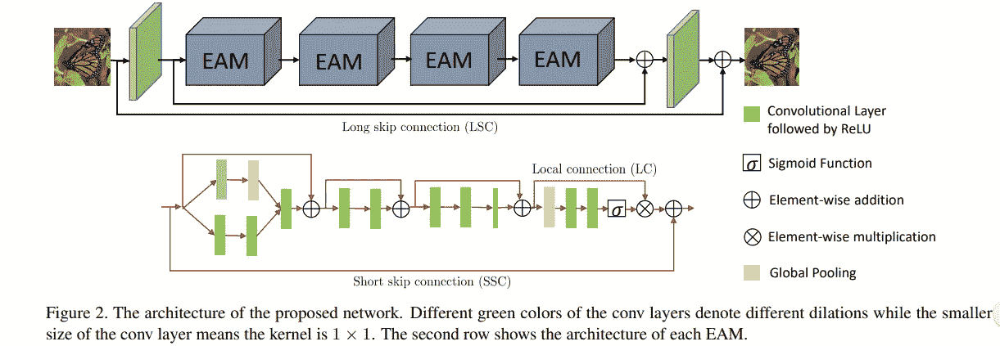

**5.1。网络架构**

该模型由三个主要模块组成，即特征提取、残差模块上的特征学习残差和重构，如图 2 所示。让我们假设 x 是有噪声的输入图像，y’是去噪的输出图像。我们的特征提取模块仅由一个卷积层组成，用于从噪声输入中提取初始特征 f0:

f0 = Me(x)，

其中 Me()对噪声输入图像执行卷积。接下来，f0 被传递到残差模块上的特征学习残差，称为 Mf l:

fr = Mf l(f0)，

其中 fr 是学习的特征，Mf l()是残差分量上的主要特征学习残差，由级联在一起的增强注意模块(EAM)组成，如图 2 所示。

该网络具有小的深度，但是通过在每个 EAM 初始的两个分支卷积中的核膨胀提供了宽的感受野。最终层的输出特征被馈送到重构模块，该重构模块也由一个卷积层组成:

yˇ= Mr(fr)，

其中 Mr()表示重建层。

一些网络使用多个损失来优化模型，与早期的网络相反，我们只使用一个损失，即 l1 或平均绝对误差(MAE)。

现在，给定一批 N 个训练对，{xi，易} N i=1，其中 x 是噪声输入，y 是地面实况，目标是使 l1 损失函数最小化为

l(W)= 1/N I = 1-N | | rid net()yi | |，

其中 RIDNet()是网络，W 表示所有学习的网络参数的集合。

**5.2。特征学习残差上的残差**

增强注意模块(EAM)使用具有局部跳跃和短跳跃连接的残差结构上的残差。每个 EAM 进一步由 D 块组成，其后是特征关注。

EAM 的第一部分涵盖了输入特征的全部感受野，随后是对特征的学习；然后压缩特征以提高速度，最后特征关注模块增强地图中重要特征的权重。

如图 2 第二行所示，EAM 的第一部分是使用新颖的合并运行单元实现的。输入要素分支并通过两个扩张卷积，然后连接并通过另一个卷积。接下来，使用两个卷积的残差块来学习特征，同时通过三个卷积层的增强残差块(ERB)来实现压缩。ERB 的最后一层通过应用 1×1 内核来展平特征。

最后，特征注意单元的输出被加到 EAM 的输入上。

5.3。特色关注

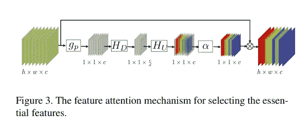

注意力已经存在一段时间了；然而，它还没有被用于图像去噪。图像去噪方法中对通道特征一视同仁，这在很多情况下是不合适的。为了利用和学习图像的关键内容，我们将注意力集中在通道特征之间的关系上；因此得名:特色关注。

由于卷积层仅利用局部信息而不能利用全局上下文信息，我们首先采用全局平均池来表示表示整个图像的统计，也可以探索用于聚集特征的其他选项来表示图像描述符。设 fc 是具有大小为 h × w 的 c 个特征映射的最后一个卷积层的输出特征；全局平均池会将大小从 h × w × c 减少到 1 × 1 × c，如下所示:

gp = 1 / h x w i=1- h i=1- w fc(i，j)，

其中 fc(i，j)是特征图中位置(I，j)处的特征值。

此外，自门控机制用于从由全局平均池检索的描述符中捕获通道依赖性。门控机制是=

rc = α(HU (δ(HD(gp))))，

其中 HD 和 HU 分别是通道缩减和通道上采样运算符。全局池层 gp 的输出与下采样 Conv 层卷积，随后是 relu 激活。为了区分通道特征，然后将输出馈送到上采样 Conv 层，随后是 sigmoid 激活。

# 6.第一次切割溶液

为了测试模型的性能，我首先用默认参数在 mnist 数据集上训练了 10 个时期。

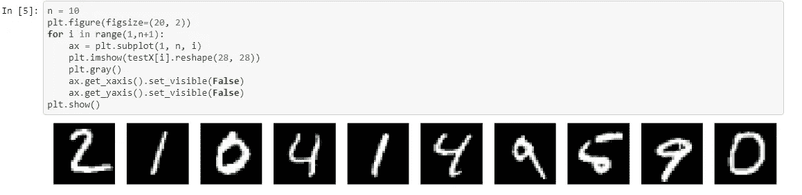

原始 mnist 图像

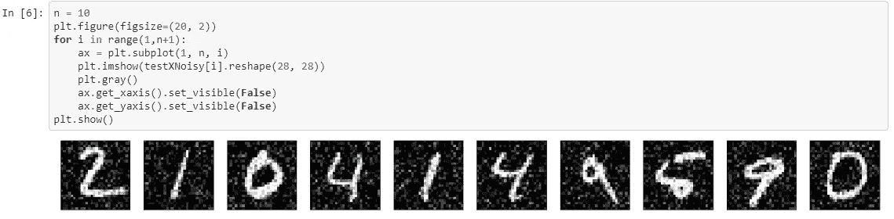

添加了高斯白噪声的图像列表(AWGN)

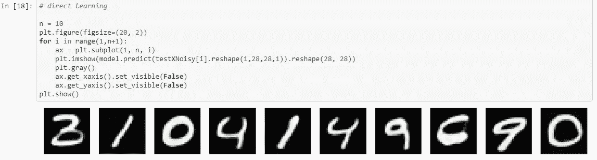

预测去噪图像

# 7.履行

接下来，我在雷诺阿数据集上训练模型。在每个训练批次中，每个图像被分成大小为 80 × 80 的小块。Adam 被用作具有默认参数的优化器。学习率最初设置为 0.0001，然后在处理每批后除以 50。训练进行 50 个时期，批次大小为 32。该网络在 tensorflow 和 keras 中使用 google colaboratory 实现。此外，峰值信噪比(PSNR)被用作评估指标，最佳模型给出的验证 mae 损失为 0.02968。

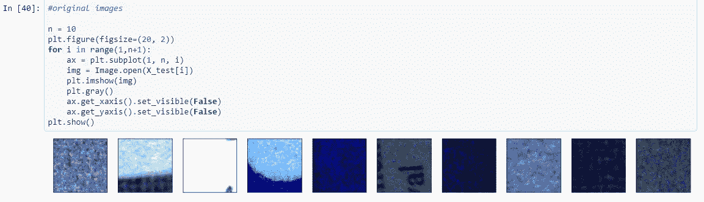

嘈杂的 rgb 图像

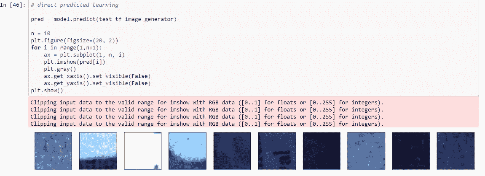

预测去噪 rgb 图像

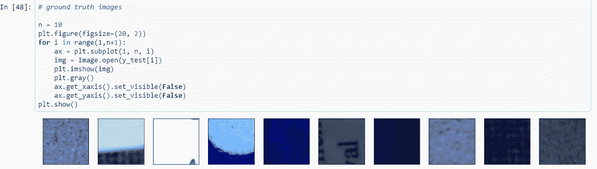

原始地面真实 rgb 图像

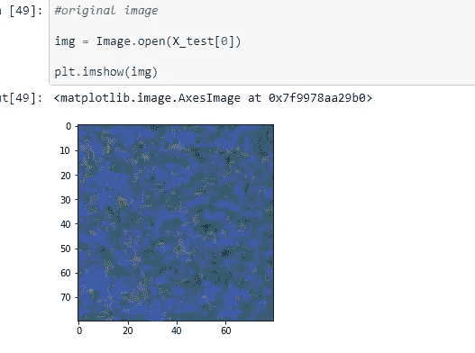

有噪声的 rgb 单幅图像

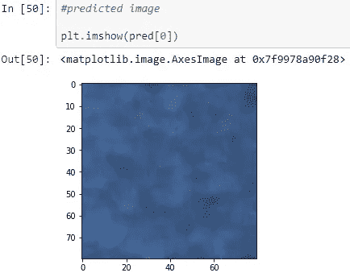

预测去噪 rgb 单幅图像

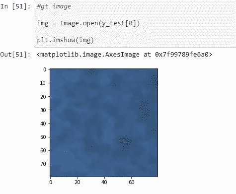

原始地面真实 rgb 单一图像

# 8.参考

1.  [https://arxiv.org/pdf/1904.07396.pdf](https://arxiv.org/pdf/1904.07396.pdf)
2.  http://ani.stat.fsu.edu/~abarbu/Renoir.html

3.【https://blog.keras.io/building-autoencoders-in-keras.html 

4.[https://www.appliedaicourse.com/](https://www.appliedaicourse.com/)

# 9.Github 回购

链接到我的 github 回购—[https://github.com/pc90/Ridnet-keras](https://github.com/pc90/Ridnet-keras)。

# 10.Linkedin 个人资料

链接到我的 Linkedin 个人资料—[https://www.linkedin.com/in/puneet-chandna-050486131/](https://www.linkedin.com/in/puneet-chandna-050486131/)。