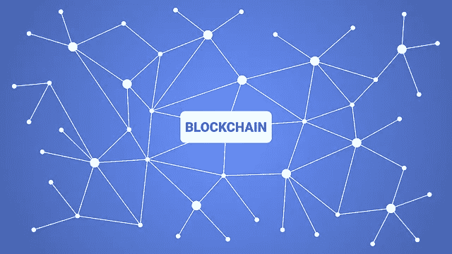
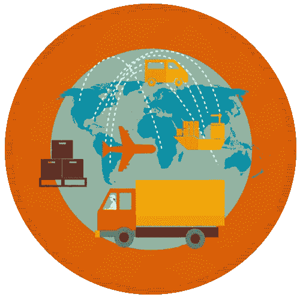

# 物联网区块链的现实实现及其应用

> 原文：<https://medium.com/analytics-vidhya/real-life-implementation-of-blockchain-for-iot-and-its-applications-2443a036503e?source=collection_archive---------0----------------------->

区块链技术在过去几年有了巨大的发展。我们已经见证了它的许多实际实现，特别是以加密货币的形式。由于具有不可改变性和分散性，它可以为不同的行业和部门带来安全性。其中一个行业就是物联网(IoT)。

区块链

> **IDC 预测—*‘到 2019 年，区块链将整合到 20%的物联网部署中’。***

# **物联网解决方案对区块链的需求**

现在问题来了‘为什么要为物联网实现区块链？’为了回答这个问题，我们将关注区块链的一些功能，这些功能将填补物联网解决方案中的漏洞，并从中受益。

[区块链应用开发技术](https://www.enukesoftware.com/blockchain-application-development.html)区别于其他技术的一大特点是其不变性。作为防黑客，区块链可以提供稳定性以及 100%的数据安全性，这是[物联网解决方案](https://www.enukesoftware.com/iot-application-development-company.html)仍然缺乏的。区块链的另一个特征将是去中心化，这为物联网解决方案在其生态系统内的所有流程提供了稳健、可靠和透明的环境。

让我们在[物联网解决方案](https://www.enukesoftware.com/iot-application-development-company.html)中观察一些区块链的真实实施，以便更好地理解物联网和区块链结合可以实现什么。

# **物联网区块链及其应用的实际案例研究**

**NetObjex(汽车行业)**

数字化是汽车行业的现代趋势之一，目前它正在利用物联网传感器带来全自动汽车的新时代。将区块链引入这些物联网车辆将带来各种新功能。

其中一个功能是分享任何类型的信息，如目的地、照片等。在分散式网络中有多个用户。区块链还将实现支付自动化，例如:-智能停车，自动燃油支付，等等。

*‘NetObjex*’将是最好的案例研究。NetObjex 与停车传感器公司“PNI”合作，实现了智能停车解决方案。随着区块链和物联网的结合，他们减少了寻找停车位的过程。不仅如此，物联网传感器可以计算停车的持续时间，付款直接通过加密钱包完成。

**Telstra(智能家居)**

我们正在步入物联网家庭安全系统的世界，在这个世界中，用户可以通过智能手机手动控制安全。但物联网设备缺乏交换信息和证明其来源的安全性。区块链可以通过引入其安全性和去中心化特征来解决这个问题。

澳大利亚媒体和电信公司 *Telstra* 推出了新的智能家居解决方案。他们将从智能设备收集的生物安全信息存储在区块链网络上。一旦数据在区块链上注册，它就不会受到任何操纵，并且只有授权的个人才能访问这些数据。

**澳洲联邦银行(银行)**

我们都同意区块链非常适合金融和银行。它可以为银行的交易和处理提供安全性和保密性。电子交易和跨境交易更容易受到网络攻击。在物联网设备上进行的任何电子交易都将随着去中心化技术的集成而变得更加安全。

*‘澳大利亚联邦银行’*就这么做了，在一次跨境交易中尝试物联网和区块链。通过利用以太坊区块链的智能合约和物联网，他们成功完成了与美国银行、富国银行和 Brighann Cotton 的第一笔银行间贸易交易。

**MediLedger(制药行业)**

今天，制药公司面临的最大挑战是伪造药品。医疗保健行业每天都见证着越来越多的假冒案件。它需要一种解决方案，能够从制造商到客户全程跟踪处方药，而不被篡改。

区块链和物联网可以解决这一问题，因为物联网设备可以帮助追踪药物，而区块链可以安全地存储和共享重要信息，只有授权的个人才能访问。

*MediLedger* 是制药行业的游戏规则改变者，因为它结合了物联网和区块链，提供了一个安全和自动化的平台。该平台为用户提供智能合同选项，帮助他们定期自动订购药品。它还提供财务管理和处方药从制造商到顾客家门口的追踪等功能。所有这一切都是在区块链网络上存储和加盖时间戳的情况下发生的。

**Slock.it(共享经济)**

今天，共享经济是全球迅速采用的概念。分散式分类帐有助于开发共享经济应用程序，用于无中断地共享商品。

通过利用区块链来共享物联网设备和对象，Slock.it 也在进行同样的探索。更重要的是，他们计划开发一个通用共享网络(USN)，在这个网络中，所有物联网对象或设备都可以共享、出售或租赁，而不需要任何中介。

***【trade lens】***

在供应链中，有许多层次的利益相关者，从原材料供应商到运输商再到经纪人。事实上，供应链有如此多的阶段和如此多的支付，很难从头到尾关注每一件事。区块链加上物联网传感器可以简化这个漫长而复杂的过程。物联网传感器可以将货物的数据发送给合适的人，用于跟踪目的，用于任何类型的问题或障碍警报，或用于支付通知。

IBM 的 TradeLens 将这一想法带入了生活。它结合了区块链和物联网，以降低全球运输成本，减少文书工作，并增加整个供应链的可见性。平台上的数据是保密的，只与获得授权的个人共享。TradeLens 已经注册了超过 2.3 亿次航运活动。

# 结束注释

区块链技术安全可靠，当与物联网集成时，可以产生一些有效和高效的现实生活解决方案。在本文中，我们讨论了区块链和物联网结合的一些实际案例研究。这些只是结合这两种技术可以实现的一瞥。在未来的时间里，我们可以期待更多区块链和物联网的现实解决方案的发展。