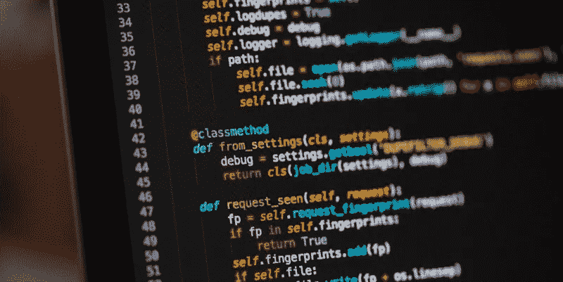

# 现实生活中的机器学习:处理原始数据中的缺失值

> 原文：<https://medium.com/analytics-vidhya/real-life-machine-learning-deal-with-missing-values-in-raw-data-29c5e9b6f00d?source=collection_archive---------22----------------------->

预处理对于现实生活中的机器学习非常重要，通常情况下，我们会看到一个数据集有很多**‘N/A’**，这对所有机器学习工程师来说都至关重要。在这里，我们特别介绍三种在数据科学竞赛中经常使用的技术，借助熊猫和 Numpy 的力量，来处理那些淘气的**‘不适用’值**