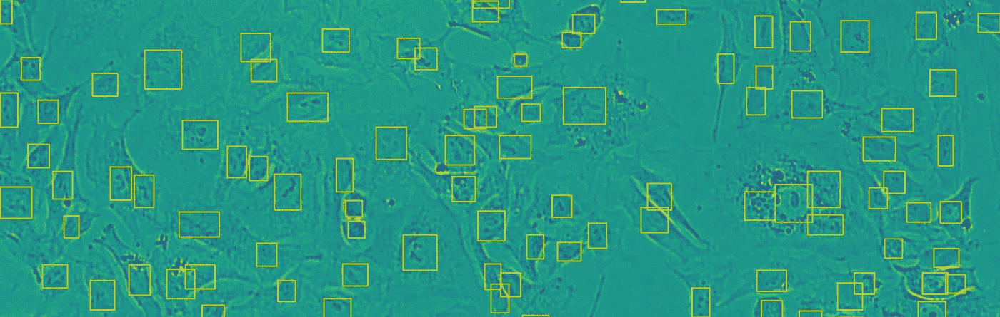

# 基于神经网络的显微图像实时细胞计数

> 原文：<https://medium.com/analytics-vidhya/real-time-cell-counting-in-microscopy-images-with-neural-networks-d630c2a5b6c4?source=collection_archive---------2----------------------->

YOLOv3 检测到的 A549 细胞(人腺癌肺泡基底上皮细胞)的明视野图像

# 医生和科学家为什么要计数细胞？

每当你带着你的问题去找医生，他们通常首先提供的事情之一就是做血液测试。这是一个行之有效的方法来确定你的健康投诉的原因，以及可以做些什么来帮助你。评估你血液状况的许多方法之一是…