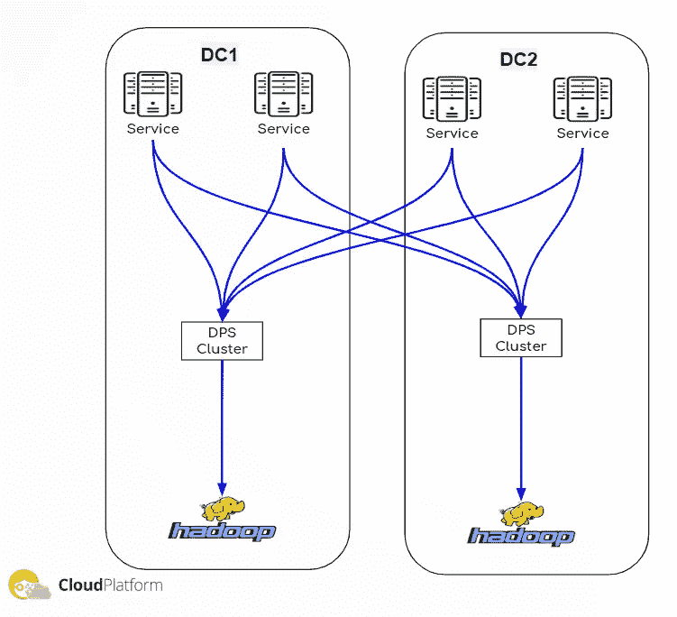
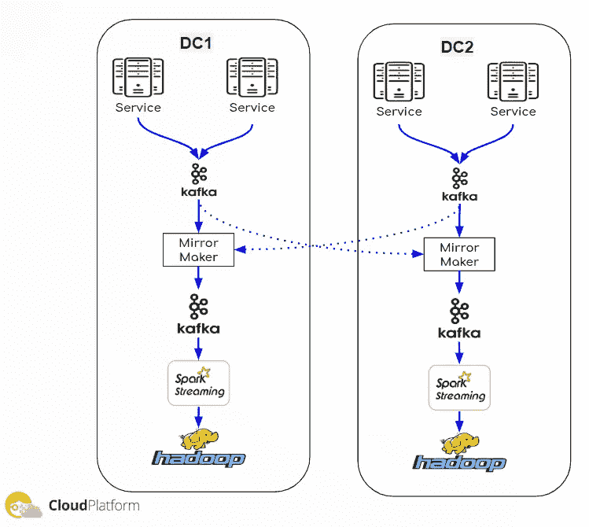
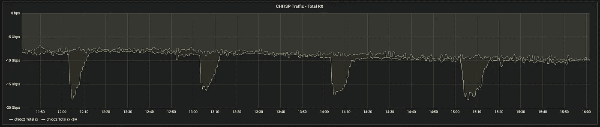
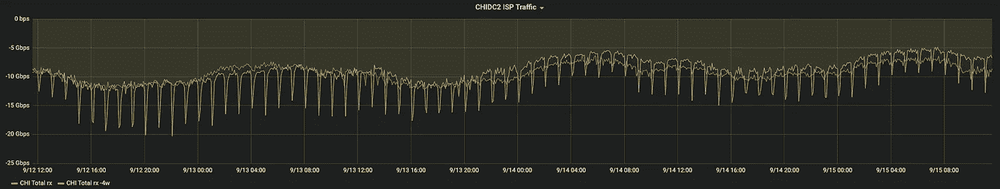

# 实时数据管道—超出我们的预期

> 原文：<https://medium.com/analytics-vidhya/real-time-data-pipeline-more-than-we-expected-c4e8575e638c?source=collection_archive---------26----------------------->

当我们考虑将我们的数据交付管道从每小时一批的文件迁移到实时流系统时，我们想到的原因是显而易见的；以减少我们处理系统的等待时间，并使数据实时可用。但是当我们开始着手这项工作时，我们意识到还有很多其他的好理由来着手这个复杂的项目。

# 概观

我们的数据交付管道旨在将来自各种服务的数据交付到我们的 Hadoop 生态系统中。在那里，使用 Spark 和 Hive 对其进行处理，以生成聚合数据，供我们的算法和机器学习(ML)实施、业务报告、调试和其他分析使用。我们称每种类型的数据为“数据”。我们有 60 多个数据，每个数据代表不同类型的数据，例如:请求、点击、列表等。

Outbrain 是全球领先的内容发现平台。我们每月向全球超过 10 亿用户提供超过 4000 亿条内容推荐。为了支持如此大的规模，我们在 Kubernetes 容器中运行的数千个微服务构建了一个后端系统，该系统位于一个基础架构之上，该基础架构分布在 3 个数据中心和公共云中的 7000 多台物理机上(GCP 和 AWS)。

正如您所想象的，我们的服务产生大量的数据，这些数据通过我们的数据交付管道传递。一般情况下，每天有超过 40TB 的数据通过它传输，在高峰日，它可以超过 50TB。

是的，为了支持这种规模，交付渠道需要可扩展、可靠，以及许多以“能力”结尾的词。

# 流水线架构

正如我在上面所写的，我们有多个数据中心(DC ),但是为了简化图表和解释，我将只使用 2 个 DC 来展示我们的管道架构。当我们浏览这两种架构(传统的 hourly 和当前的 RT)时，您会注意到唯一保持不变的组件是边缘。产生数据的服务，以及数据最终到达的 Hadoop。

另一件值得一提的事情是，为了实现完全灾难恢复(DR ),我们在不同的位置有两个独立的 Hadoop 集群，每个集群都独立地获取所有数据并处理相同的作业，以防其中一个发生故障，另一个继续正常工作。

## 每小时文件管道—传统

数据由服务收集，并保存到每个服务的本地文件系统上的文件中。从那里，另一个过程将这些文件复制到我们的数据处理系统(DPS)，这是一个内部解决方案，它收集所有数据并将其复制到 Hadoop 中。如您所见，这是一个非常简单的架构，没有很多组件，并且非常可靠和健壮，因为数据保存在文件中，在出现任何故障时都可以轻松恢复。

这种管道的缺点是，数据是以小时为单位移动的，并且在交付期间不可访问。它只能在每小时完成后进行处理，所有数据都在 Hadoop 中。此外，由于数据以峰值形式传输，这也给网络带来了沉重的负担。

## 实时流管道

取代本地文件系统存储，我们有一个 Kafka 集群。此外，我们有一个镜子制造商，一个聚合的 Kafka 集群和一个火花流集群，而不是我们的内部 DPS 系统。

在这个管道中，数据直接从服务写入 Kafka 集群。从这一点来看，任何想要使用这些数据的人都可以访问这些数据。分析师、algo 开发人员或任何其他能发现它有用的服务。当然，它也可以作为流水线的一部分提供给镜子制造商。

MirrorMaker 的工作是在 Kafka 集群之间同步数据，在我们的例子中，确保每个聚合的 Kafka 集群将拥有来自所有 DC 的全部数据。

像以前一样，聚合集群中的数据可供所有人使用，尤其是我们的 SparkStreaming 集群，它运行各种消耗数据并写入 Hadoop 的作业。

因此，很明显，通过实现这个管道，所有人都可以使用数据，并且数据可以更快地到达 Hadoop。

# 明显的好处

现在让我们回顾一下实时管道的明显优势:

*   数据可用性—由于数据是通过 Kafka 集群传递的，因此所有需要实时数据的实施都可以使用。这里有两个很好的例子:
*   推荐引擎现在可以用更新的数据来计算它的算法模型。这使得我们的每分钟收入(RPM)提高了 16%以上。
*   我们增加了面向客户的实时仪表板，使他们能够根据最新数据更快地采取所需的行动。
*   减少了处理系统的延迟—由于数据更快地到达 Hadoop，等待每小时数据的每小时作业可以更快地开始工作，并在接近一小时结束时完成工作。这降低了处理系统的总体延迟，现在，例如，业务报告可以在更短的时间内提供。

# 额外好处

这些是我们从实时管道中获得的意想不到的好处:

*   网络容量—在每小时文件管道中，数据以每小时为一批并在每小时结束时移动。这意味着网络容量需要同时支持所有数据的移动。这种要求迫使我们分配所需的带宽，而它在每个小时中仅被使用很短的时间，浪费了昂贵的资源。实时管道在一小时内增量传输相同数量的数据。
*   下图展示了我们转向实时管道后节省的带宽。例如，在 RX 图中，您可以看到我们从峰值 17 GBPs 变为平坦带宽 7 GBPs，节省了 10 GBPs。

总接收流量

总 TX 流量

*   灾难恢复—在基于每小时的管道中，数据保存在运行服务的机器的本地文件系统上的文件中，这一事实有一些限制。
*   数据丢失—众所周知，机器在某个时候 100%会发生故障。当你有成千上万台机器时，机会对我们不利。每次机器停机，您都有数据丢失的风险，因为所有每小时的文件可能还没有复制到管道中。在实时管道中，数据被立即写入 Kafka 集群，该集群更具弹性，数据丢失的风险也降低了。
*   后期处理-如果机器已经从故障中恢复，并且您足够幸运地避免了数据丢失，则需要处理恢复的数据，并且在大多数情况下，不会在与数据相关的时间段内完成。这意味着这个时间段将被再次处理，这增加了 Hadoop 的额外负载，并可能导致数据延迟，因为 Hadoop 需要同时处理多个时间段。像以前一样，实时管道在这方面的好处是数据到达 Hadoop 时没有任何延迟，因此没有任何时间段的重新处理。

# 结论

有了实时管道，我们的生活变得简单多了。除了计划的目标(数据可用性和减少延迟)，我们从这一变化中获得的额外好处使我们对任何网络故障或硬件故障不那么敏感。过去，这些问题中的每一个都迫使我们处理数据延迟，并有数据丢失的风险，而现在实时管道就其本质而言解决了所有这些问题。

是的，我们需要维护和监控更多组件，但是如果与我们通过为数据交付管道实施实时系统所取得的巨大成果相比，这一成本是合理的。