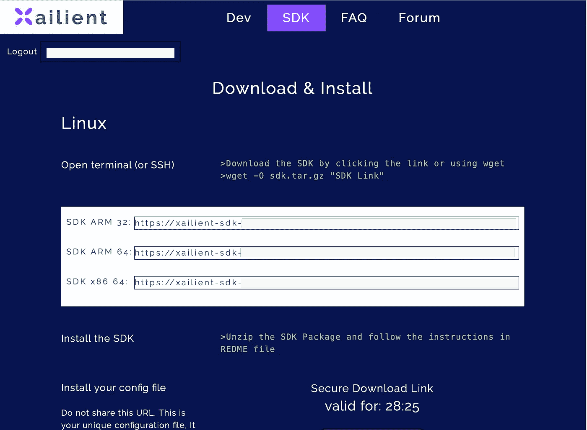
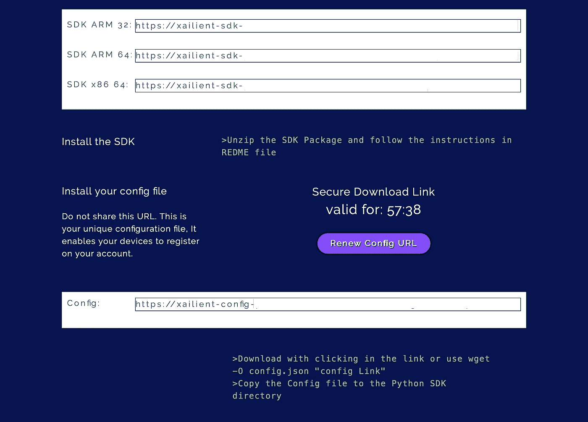
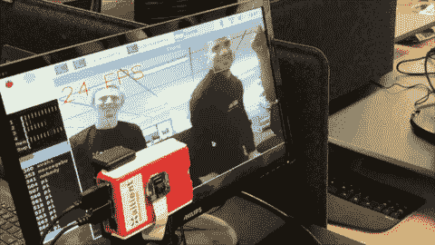

# 树莓 Pi 上的实时人脸检测

> 原文：<https://medium.com/analytics-vidhya/real-time-face-detection-on-raspberry-pi-ea3f42508bcc?source=collection_archive---------1----------------------->

## 在每秒运行 24 帧的 Raspberry Pi 上实现实时人脸检测的分步指南


显示检测到的面孔的图像

在这篇文章中，我将一步一步地指导你在 Raspberry Pi 上实现实时人脸检测，在单核上以每秒 24 帧的速度运行。

我将使用一个树莓 Pi 3B+，用 [Raspbian Buster](https://www.raspberrypi.org/downloads/raspbian/) 作为操作系统和一个 Pi 相机。

对于人脸检测，我将使用 Xailient FaceSDK。

## 步骤 1:安装 Python 3.7.3

Raspbian Buster 预装了 Python 3.7.3，所以不需要显式安装 Python 3.7.3。为了确认，使用下面的命令来查看您的 Raspberry Pi 中安装了哪个版本的 Python。

```
python --version
```

## 步骤 2:为 Python 3.7 安装 tflite

要安装 tflite for Python 3.7，请在终端中输入以下 pip3 install 命令。

```
pip3 install [https://dl.google.com/coral/python/tflite_runtime-1.14.0-cp37-cp37m-linux_armv7l.whl](https://dl.google.com/coral/python/tflite_runtime-1.14.0-cp37-cp37m-linux_armv7l.whl)
```

## 第三步:安装 OpenCV

如果尚未安装 OpenCV，请安装它。您可以在您的 Raspberry Pi 上使用 apt install 或 pip3 install OpenCV。

```
sudo apt install -y python3-opencv
```

或者

```
pip3 install opencv-python
```

## 第 4 步:下载 Xailient FaceSDK 并解压

进入 [Xailient SDK 页面](https://hubs.ly/H0m5y9q0)注册新用户并登录。

进入 ***SDK*** 标签，在这里你会找到下载和安装 Face SDK 的说明。



对于树莓派 3B+，下载 SDK 的 ARM32 版本。您可以从您的 Raspberry Pi 浏览器中打开链接直接下载到它，或者您可以使用以下 wget 命令:

```
wget -O sdk.tar.gz "SDK Link"
```

解压下载的 FaceSDK。

## 步骤 5:将共享库添加到路径

这是必需的，因为库依赖于一些动态加载的共享库。

```
export LD_LIBRARY_PATH=$LD_LIBRARY_PATH:$<Python_SDK path/Shared_arm32>
```

您可以将库路径添加到 bashrc 脚本中，这样您就不需要每次登录时都导出。

```
echo “export LD_LIBRARY_PATH=$LD_LIBRABRY_PATH:$<pathofSDK>/Shared_arm32” >> .bashrc
```

## 步骤 6:下载配置文件

在 Xailient SDK 页面中，通过从您的 Raspberry Pi 浏览器打开到的链接或使用以下 wget 命令下载配置文件:

```
wget -O config.json "Config Link"
```



将 *config.json* 文件复制到 FaceSDK 文件夹中。

## 步骤 7:安装 Xailient FaceSDK

要安装 Xailient FaceSDK，请运行 SDK 文件夹中的 *Install.sh* 文件。从终端转到 FaceSDK 文件夹，并运行以下命令:

```
./Install.sh
```

有关安装过程的更多详细信息，可以参考 FaceSDK 附带的自述文件。

## 步骤 8:运行样本人脸检测代码

FaceSDK 附带的示例代码演示了如何使用 Xailient 人脸检测器 Python 库以及如何与该库进行交互。

转到 *samples* 文件夹，运行*picam _ streaming _ demo . py*脚本运行实时人脸检测。



在 Raspberry Pi 3B+上运行 Xailient FaceSDK

现在，您可以在树莓 Pi 上运行实时人脸检测。

***发现这个帖子有用吗？请在下面留下你的想法。***

原载于*[*【www.xailient.com/blog】*](https://www.xailient.com/post/real-time-face-detection-on-raspberry-pi)*。**

**更多故事:**

*[*在你的 App 上集成人脸检测*](https://www.xailient.com/post/integrate-face-detection-in-your-app)*

*[*在计算受限的设备上运行深度学习计算机视觉的挑战*](https://www.xailient.com/post/challenges-of-running-deep-learning-computer-vision-on-computationally-limited-devices)*

*[*在树莓上挣扎运行的物体检测*](https://www.xailient.com/post/struggles-of-running-object-detection-on-a-raspberry-pi)*

*[*你现在需要从云计算转向边缘计算！*](https://www.xailient.com/post/cloud-computing-to-edge-computing)*