# 实时面罩检测系统

> 原文：<https://medium.com/analytics-vidhya/real-time-face-mask-detection-system-8d8254c86cfb?source=collection_archive---------9----------------------->

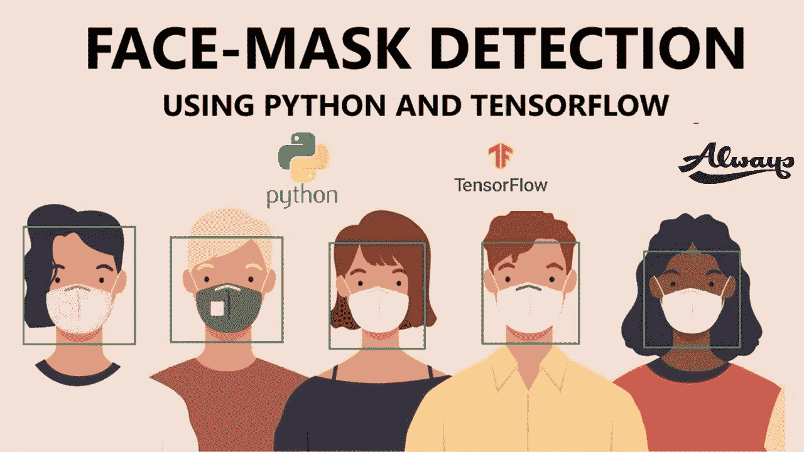

**实时面罩检测器**

> " P **生产力就是能够做你以前从来不能做的事情."——***弗兰茨·卡夫卡*

最近的冠状病毒疫情将全世界的人类推向了新的挑战。在这种不确定的情况下，我们都可以发挥自己的作用，为抗击这一疾病作出贡献。这是一个让技术为人类服务的绝佳机会。因此，我们可以通过实施对其有利的有成效的事情来为这种流行病做出贡献。

如果我们有一个系统可以监控我们周围的人是否遵守所有的安全措施，会怎么样？那么为什么不使用 ***TensorFlow*** 与 ***Keras*** 库和 ***OpenCV*** 项目建立一个非常简单和基本的卷积神经网络(CNN)模型来检测你是否戴了面罩来保护自己，这也显示了你对它的准确性。

# 卷积神经网络(CNN) —深度学习

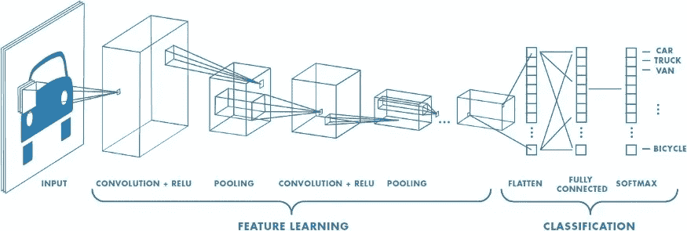

**具有多个卷积层的神经网络**

CNN 的灵感来自大脑的结构，但我们的重点不会放在神经科学上，因为我们没有任何生物学方面的专业知识或学术知识。还要注意的是，它们与真正的人脑相差甚远。CNN 是一类神经网络，已被证明在图像识别、处理和分类领域非常有效。

根据维基—[***机器学习***](/@srivastavasaumy2001/machine-learning-everything-you-need-to-know-9d4a415a5695) *中的*，卷积神经网络(CNN，或 ConvNet)是一类深度前馈人工神经网络，最常用于分析视觉图像。**

它们已经存在了几十年，但是当使用大的标记数据集时，它们被证明是非常强大的。这需要快速的计算机(例如 GPU)！

这个网络是多层感知器用于处理和分类的一个很好的例子。这是一种深度学习算法，它将输入作为图像，并有效地对其对象进行加权和偏置，最终能够区分图像。

# ***TensorFlow*** 与 ***Keras*** 库

**带 Keras 的张量流**

在这里，我们将讨论众多库和框架中的两个——tensor flow 和 Keras。

# 什么是张量流？

TensorFlow 是一个开源库。当涉及到处理深度神经网络时，它是最著名的库之一。TensorFlow 受欢迎的主要原因是使用 TensorFlow 构建和部署应用程序非常容易。

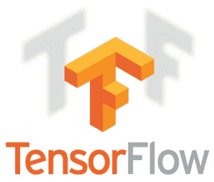

TensorFlow 擅长数值计算，这对深度学习至关重要。它提供了深度学习所需的大多数主要语言和环境的 API

# Keras 是什么？

Keras 是一个完全基于 Python 的框架，这使得它易于调试和探索。这是一个构建在 TensorFlow 之上的高级库。它为构建神经网络提供了 scikit-learn 类型的 API。开发人员可以使用 Keras 快速构建神经网络，而无需担心张量代数、数值技术和优化方法的数学方面。

Keras 开发背后的关键思想是通过快速原型制作来促进实验。从一个想法到结果尽可能不拖延的能力是好的研究的关键。

这为科学家和初级开发人员提供了巨大的优势，因为他们可以直接进入深度学习，而不会被低级计算弄脏手。

# ***OpenCV***

OpenCV 是一个跨平台库，使用它我们可以开发实时**计算机视觉应用**。它主要专注于图像处理、视频捕捉和分析，包括人脸检测和对象检测等功能。

OpenCV 旨在为计算机视觉应用提供一个公共基础设施，并加速机器感知在商业产品中的应用。

# 用 OpenCV 实现实时视频流中的新冠肺炎人脸检测器

让我们看看如何检测实时视频流的脸。首先安装必要的软件包。

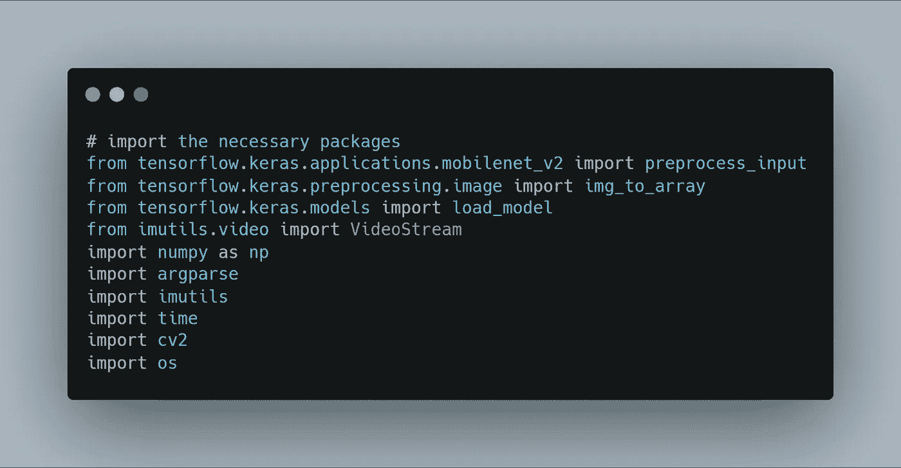

**导入必要的包**

**检测人脸的功能，然后将我们的人脸面具分类器应用于每个人脸。**

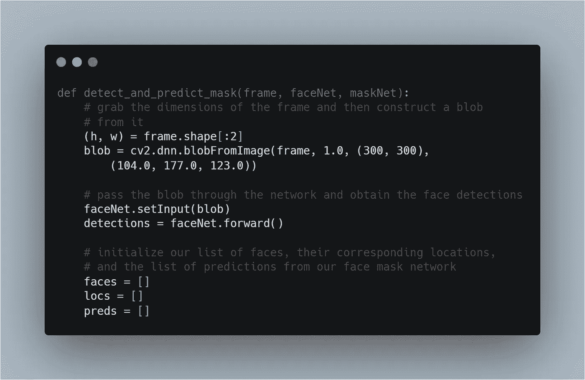

**检测面部和应用掩模分类器的功能**

上述 detect_and_predict_mask 函数接受三个参数:

*   帧:来自我们流的帧
*   faceNet:这是用于检测图像中人脸的模型
*   maskNet:人脸面具分类模型

在内部，我们构造一个 blob，检测人脸，初始化列表，其中两个函数被设置为返回。这些列表包括我们的脸部(即，ROI)、loc(脸部位置)和 preds(遮罩/无遮罩预测列表)。

从这里开始，我们将循环检测面部:

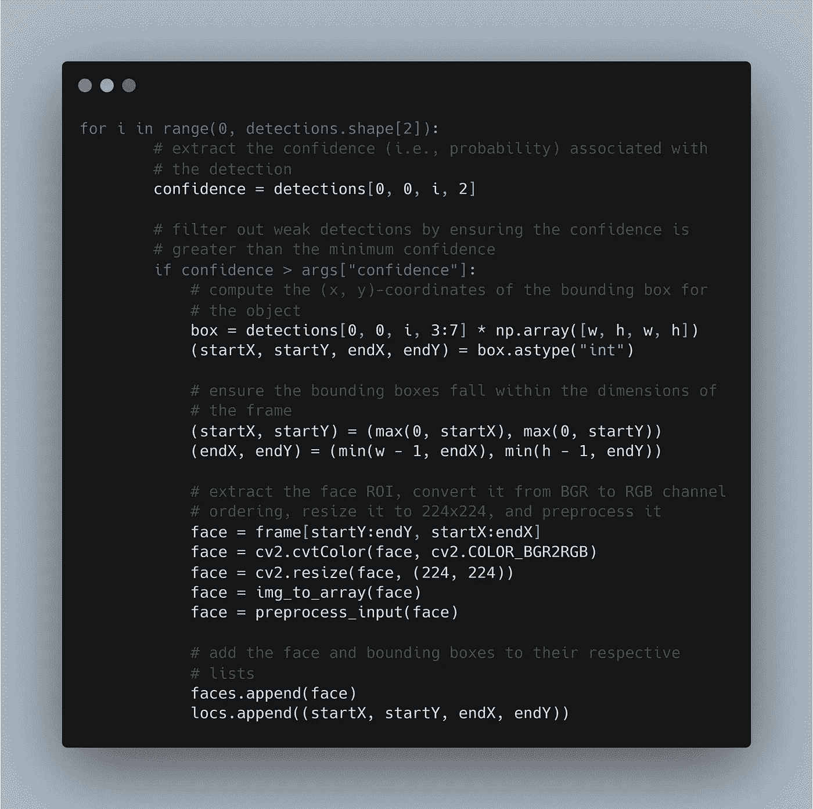

**循环人脸检测**

现在，我们可以实现为预测人脸而创建的掩码预测器。

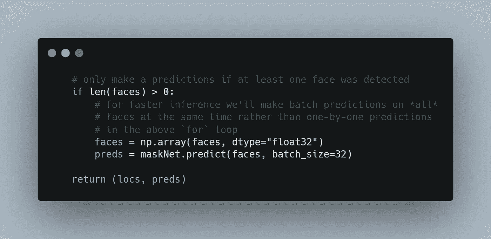

接下来，定义一些命令行参数:

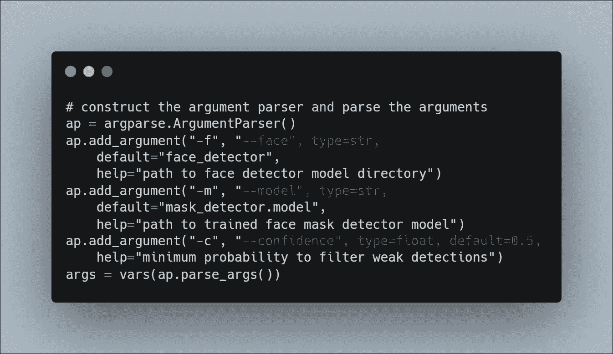

上面提到的命令行参数包括:

*   face:人脸检测器目录的路径
*   模型:通向我们训练过的人脸面具分类器的道路
*   置信度:过滤弱人脸检测的最小概率阈值

导入、便利函数和命令行参数都准备好了，在循环遍历帧之前，我们只需要处理一些初始化:

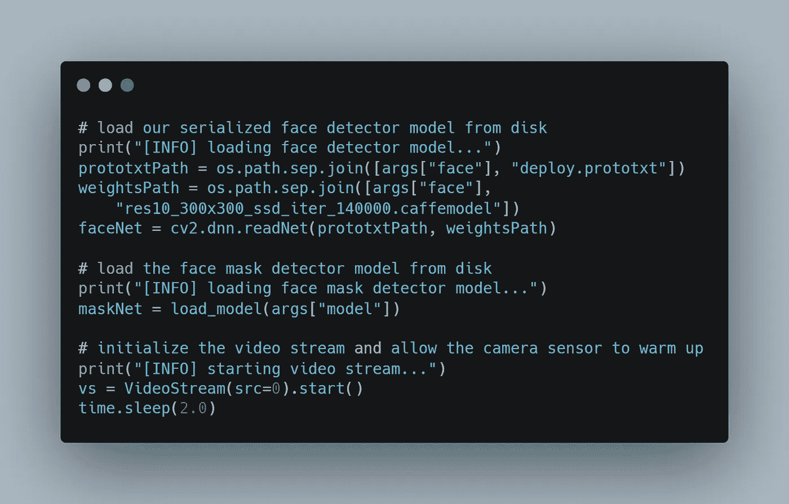

这里我们已经初始化了:

*   人脸检测器
*   面罩检测器
*   网络摄像头视频流

现在，我们将继续循环播放网络摄像头实时视频流中的帧:

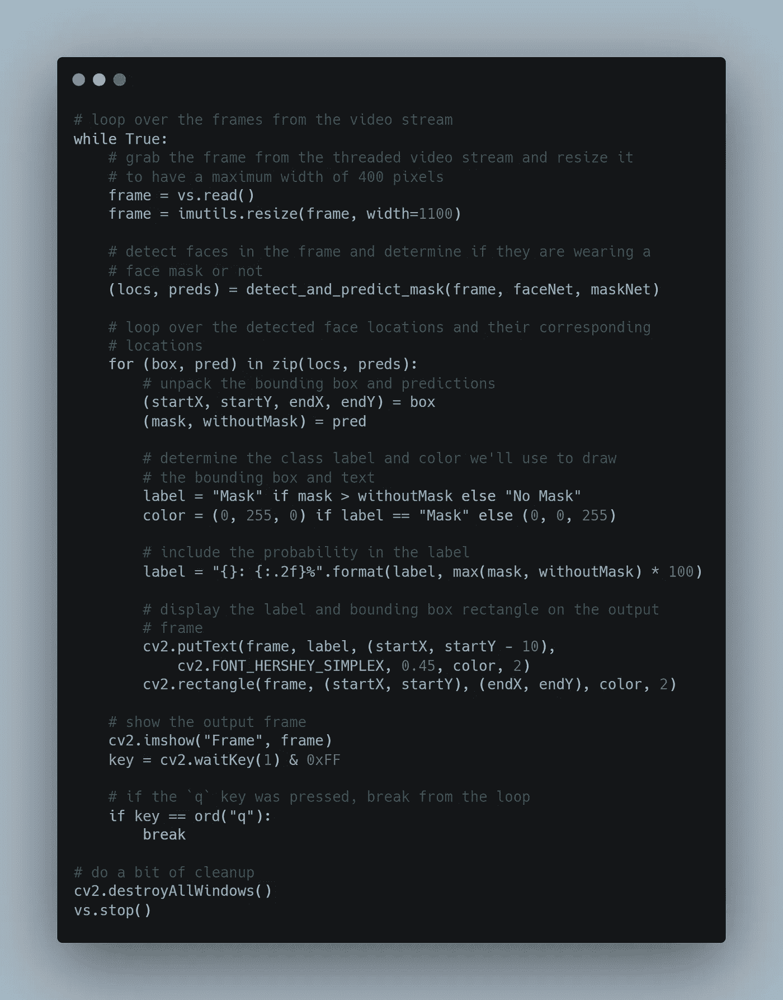

**循环流中的帧**

上面提到的所有代码片段都是用来检测网络视频流中的人脸面具的。这只是为了理解通过实时流部分的检测。这样就可以用 Python、OpenCV 实现实时的人脸面具检测器，用 TensorFlow/Keras 实现深度学习。

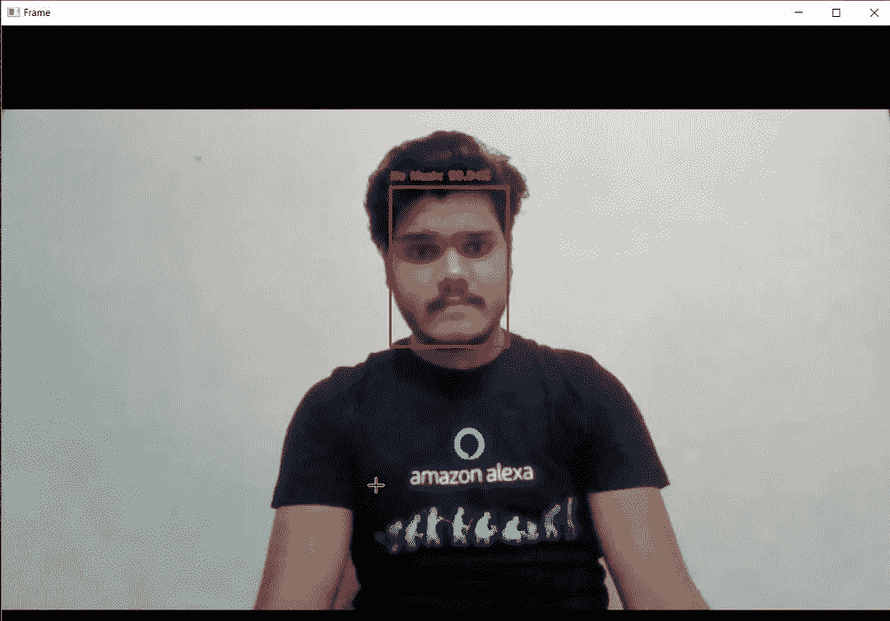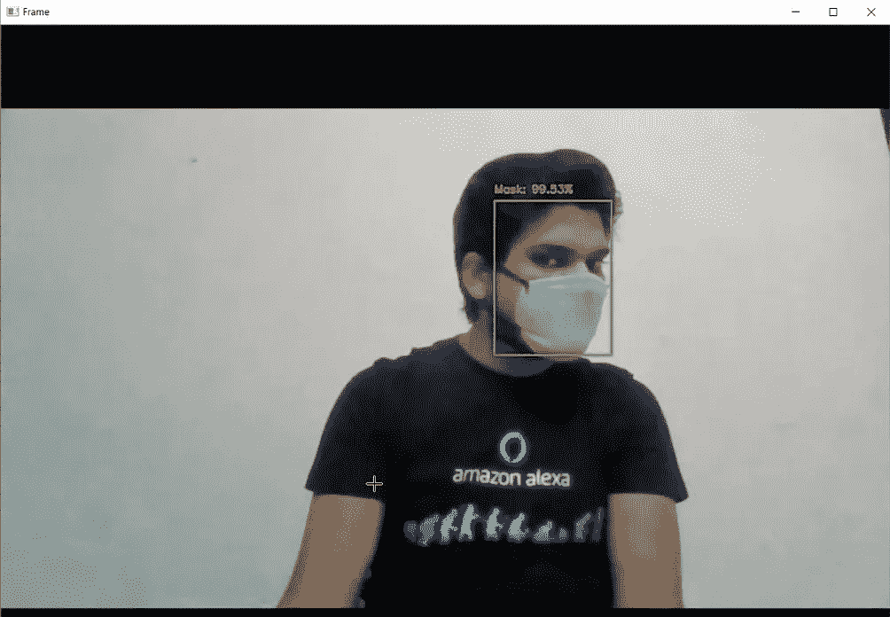

**面具检测**

从上面的快照中，我们可以看到它能够正确地检测到我是否戴着面具，并显示面具的准确性，这也非常好。

在本文中，我们看到了如何检测一个人是否戴着口罩。这可以用于许多应用中。考虑到目前的疫情，戴口罩在不久的将来可能是必要的，这种检测人是否戴口罩的方法可能会非常有用。

注意安全！