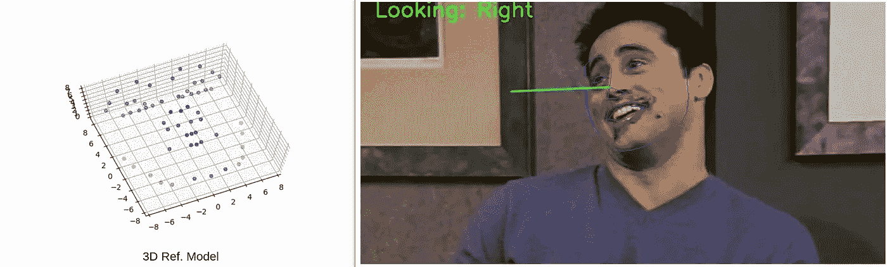
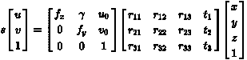

# 基于 OpenCV 和 Dlib 的实时头部姿态估计

> 原文：<https://medium.com/analytics-vidhya/real-time-head-pose-estimation-with-opencv-and-dlib-e8dc10d62078?source=collection_archive---------0----------------------->

头部姿态估计广泛用于各种计算机视觉应用中，如 VR 应用、免提手势控制应用、驾驶员注意力检测、凝视估计等等。在这篇文章中，我们将学习如何用 OpenCV 和 Dlib 来估计头部姿态。

照片提供:来自 F.R.I.E.N.D.S .的乔伊·崔比亚尼—(我甚至不感到抱歉)

# 计算机视觉中的姿态估计

在计算机视觉中，姿态估计特指物体相对于摄像机的相对方位。这里的参照系是摄像机的视场。在计算机视觉中，姿态估计通常被称为 n 点透视问题或 PnP 问题。问题的定义很简单，给定一组世界参考中的 3D 点和相机拍摄的相应 2D 图像，我将尝试用要点来简化这个问题

*   重建参考的 6 自由度姿态-欧拉角(滚动、俯仰和偏航)以及相机从一个 3D 点到另一个 3D 点的移动。在纯文本中，我们必须找到**平移**和**旋转**。
*   基于 2D 参考的三维重建

让我们把这个问题定义为一个等式—

[PNP 问题陈述](https://en.wikipedia.org/wiki/Perspective-n-Point)

等式`s[u v t]ᵗ`的左侧表示由相机拍摄的 2D 图像。等式的右侧，看起来像上三角矩阵的第一部分是我们的相机矩阵，其中`f(x, y)`是焦距，γ是偏斜参数，我们将在代码中将其保留为 1。`(u₀, v₀)`是我们形象的中心。中间部分，`r`和`t`代表旋转和平移，最后一部分表示我们稍后将看到的人脸的 3D 模型。现在，我们将让他们来研究我们的理论和数学。

**获取代码**

 [## by-sabbir/head pose 估计

### 在计算机视觉中，姿态估计特指物体相对于目标的相对方位。

github.com](https://github.com/by-sabbir/HeadPoseEstimation) 

**理解“为什么和如何！?"**

很明显，我们的应用程序需要检测人脸和预测形状来解决 PnP 并最终估计姿态。为了检测人脸和预测形状，我们将使用 [*dlib*](http://dlib.net/) *。*

我们现在开始解决 PnP。但在此之前，我们需要最后一次从上面的等式

*   三维人脸模型
*   参考 2D 矩阵
*   相机矩阵

求解 PnP 并获得图像的旋转和平移(在我们的例子中是人脸)。让我们编码先决条件—

`ref3Dmodel()`和`ref2DImagePoints()`六坐标点是指鼻尖、下巴、左眼左角、右眼右角、嘴角。你可以可视化所有的点，并通过操作`[Visualize3DModel](https://github.com/by-sabbir/HeadPoseEstimation/blob/master/Visualize3DModel.py).py`随意添加。

OpenCV 提供了两个简单的 API 来解决 PnP

*   `solvePnP`
*   `solvePnPRansac`

在我们的例子中，我们将使用`solvePnP`。按照惯例，这个 API 需要 [4 个输入参数](https://docs.opencv.org/2.4/modules/calib3d/doc/camera_calibration_and_3d_reconstruction.html#bool%20solvePnP(InputArray%20objectPoints,%20InputArray%20imagePoints,%20InputArray%20cameraMatrix,%20InputArray%20distCoeffs,%20OutputArray%20rvec,%20OutputArray%20tvec,%20bool%20useExtrinsicGuess,%20int%20flags))

*   目标点→ `ref3Dmodel()`
*   图像点→ `ref2DImagePoints()`
*   cameraMatrix → `cameraMatrix()`
*   distCoefs → `np.zeros(4, 1)`

通过解析 PnP，API 返回`success message`、`rotation vector`和`translation vector`矩阵。

摄像机的焦距必须经过[校准](https://github.com/by-sabbir/HeadPoseEstimation/blob/master/cam_calibration.py)，因为它是摄像机硬件的固有属性。

**得到欧拉角**

最后，我们可以很容易地提取滚动，俯仰和偏航。也就是说，我们要通过 OpenCV 的`[RQDecomp3x3](https://docs.opencv.org/2.4/modules/calib3d/doc/camera_calibration_and_3d_reconstruction.html?highlight=euler#rqdecomp3x3)` API 来提取欧拉角。但是它需要一个旋转矩阵而不是一个旋转向量。幸运的是，我们已经使用`solvePnP`计算了旋转向量。OpenCV 的另一个 API 叫做`[Rodrigues](https://docs.opencv.org/2.4/modules/calib3d/doc/camera_calibration_and_3d_reconstruction.html?highlight=euler#rodrigues)`，它将旋转矩阵转换成旋转向量，反之亦然。这就是我们如何实现它—

最终的输出应该是这样的—

样本头部姿态估计

样本头部姿态估计

**总结总结**

我们开始检测和预测人脸的形状。然后我们用`solvePnP`计算旋转和平移向量。最后用`RQDecomp3x3`得到旋转角度。又一个简单的 3 步过程。计算机视觉很有趣。