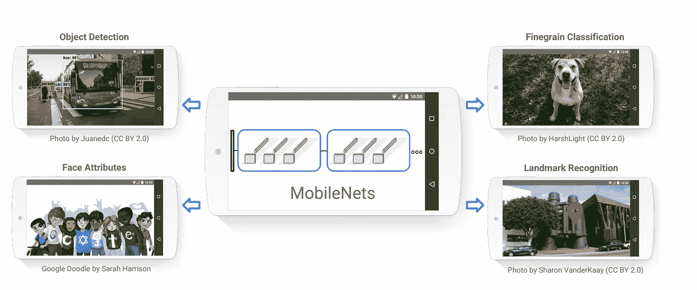

# 使用 Tensorflow Lite 和 Flutter 的实时图像分类

> 原文：<https://medium.com/analytics-vidhya/real-time-image-classification-using-tensorflow-lite-and-flutter-878e3700607a?source=collection_archive---------2----------------------->

随着时间的推移，智能手机等边缘设备变得越来越强大，并支持越来越多的设备上机器学习用例。

# **什么是张量流？**

TensorFlow 是**构建和训练神经网络**的平台，它允许检测和破译模式和相关性，类似于人类使用的学习和推理。
TensorFlow 的灵活架构使开发人员能够使用单一 API 将计算部署到台式机、服务器或移动设备上的一个或多个 CPU 或 GPU。它最初是由机器智能研究部门谷歌大脑团队的研究人员和工程师开发的，目的是进行机器学习和深度神经网络研究。

## **Tensorflow lite**

[TensorFlow Lite](http://tensorflow.org/lite) 是在**边缘设备**上运行 TensorFlow 模型推理的官方框架。它运行在全球超过 40 亿台活跃设备上，运行在各种平台上，包括 Android、iOS 和基于 Linux 的物联网设备，以及裸机微控制器上。

## 「精简版」有什么优势？

TensorFlow Lite 被设计成轻量级的**，具有较小的二进制大小和快速初始化**。它还兼容多种平台，包括 Android 和 iOS。为了增强移动体验，它针对移动设备进行了优化，具有改进的加载时间和硬件加速。

## 它是如何工作的？

**1-选择模型:**tensor flow Lite 团队提供了一组预先训练好的模型，可以解决各种机器学习问题。这些模型已被转换为与 TensorFlow Lite 一起使用，并准备在您的应用程序中使用。

**2-转换模型:** TensorFlow Lite 设计用于在内存和计算资源有限的移动和其他嵌入式设备上高效运行模型。这种效率部分来自于使用一种特殊的格式来存储模型。TensorFlow 模型必须转换为此格式，TensorFlow Lite 才能使用它们。

**用模型进行三次推理:**推理是通过模型运行数据以获得识别的过程。它需要一个模型、一个解释器和输入数据。

**4-优化您的模型:** TensorFlow Lite 提供工具来优化您的模型的大小和性能，通常对准确性的影响最小。优化的模型可能需要稍微复杂一些的训练、转换或集成。

如果你想了解更多关于 TensorFlow lite 的功能，并开始实现你自己的模型，我建议你访问[这篇文章](https://www.tensorflow.org/lite/guide/get_started)。

# Mobilenet

MobileNet 模型执行图像分类—它们将图像作为输入，并将图像中的主要对象分类到一组预定义的类别中。这些型号在速度和尺寸方面也非常高效，因此非常适合嵌入式和移动应用。

## 关于 mobilenet 效率

MobileNet 架构基于将传统卷积分解为两种类型的层，第一卷积层“深度方向”和卷积 1×1 层“点方向”。这种划分允许减少计算成本和模型的大小。
标准卷积层的计算成本**比深度方向层和角度方向层的计算成本**大 8 到 9 倍。此外，增加了一些参数，允许**减小神经网络**的大小和速度。

## Mobilenets 培训

他们在 ImageNet 数据集上接受训练，该数据集包含来自本要点[中详述的 1000 个类别的图像。](https://gist.github.com/MCarlomagno/6ab99d0ebd4ef3ef2d6c903c7341332f)

欲了解更多信息，请访问[本文](https://arxiv.org/pdf/1704.04861.pdf)。

# Mobilenet in flutter 用于实时图像识别

在这个项目中，我将使用 [tflite 库](https://pub.dev/packages/tflite)实现 Mobilenet 模型，这是一个用于访问 TensorFlow Lite API 的 Flutter 插件。

## **安装**

在您的 pubspec.yml 中，添加:

**Android:** 在 android/app/build.gradle 中，在 android block 中添加如下设置。

**iOS:** 在 iOS 上构建错误的解决方案

*   **“vector”文件未找到:**
    在 Xcode 中打开 ios/Runner.xcworkspace，单击 Runner>Tagets>Runner>构建设置，搜索编译源为，将值更改为 Objective-C++
*   **' tensorflow/lite/kernels/register . h '文件未找到:** 插件假定 tensor flow 头文件位于路径`tensorflow/lite/kernels`中。
    然而，对于 tensorflow 的早期版本，头路径是`tensorflow/contrib/lite/kernels`。使用`CONTRIB_PATH`来切换路径。取消此处[的`//#define CONTRIB_PATH`注释。](https://github.com/shaqian/flutter_tflite/blob/master/ios/Classes/TflitePlugin.mm#L1)

## **用法**

**第一步**

我们将通过从[这里](https://www.tensorflow.org/lite/models/image_classification/overview)下载文件 labels.txt 和 mobilenet _ v1 _ 1.0 _ 224 _ quant . tflite 来将模型导入到我们的应用程序中，然后我们创建 assets 文件夹并将标签和模型文件放入其中。

**第二步**

完成第 1 步后，在 pubspec.yaml 中添加:

然后我们将在终端中运行`flutter pub get`。

**第三步:**

制作一个使用相机的简单应用程序。您可以在下面的[链接](https://flutter.dev/docs/cookbook/plugins/picture-using-camera)中使用 flutter 文档作为指南。

**第四步:**

我们为张量流创建一个服务，用于管理模型。
应用程序初始化后，我们将加载模型，以便它可以开始预测，代码如下:

**第五步:**

我们使用相机控制器来捕捉每一帧，然后我们使用它们来生成一个识别，瞧！该模型给出了每一帧的识别结果。

## 考虑因素:

1-结果是具有以下结构的按置信度排序的列表:

2-在实现它时，我决定在每次识别之间留出 1 秒钟的延迟，以提高性能。

然后可以对 UI 进行改进，以更美观的方式显示数据😄。

> 你可以访问这个 github 库来查看完整的实现。

## 其他型号

**MobileNet SSD:** 又名“单次多盒检测器”模型用于检测同一图像中的多个对象，并为每个对象分配一个置信度。
[更多信息](https://www.tensorflow.org/lite/models/object_detection/overview)

**微小的 YOLOv2:** 它另辟蹊径。我们将单个神经网络应用于整个图像。该网络将图像分成多个区域，并预测每个区域的边界框和概率。这些边界框由预测概率加权。小 YOLO 架构比它的大兄弟快了大约 442%，在单个 GPU 上达到 244 FPS 以上。
小的模型尺寸(< 50MB)和快速的推理速度使得微小 YOLO 物体检测器自然地适合用于嵌入式计算机视觉/深度学习设备。
[更多信息](https://www.tensorflow.org/lite/models/object_detection/overview)

**Pix2Pix:** 这些网络不仅学习输入图像到输出图像的映射，还学习一个损失函数来训练这个映射。这使得将相同的通用方法应用于传统上需要非常不同的损失公式的问题成为可能。
[更多信息](https://www.tensorflow.org/tutorials/generative/pix2pix)

**Deeplab:** DeepLab 是一个最先进的深度学习模型，用于语义图像分割，目标是为输入图像中的每个像素分配语义标签(例如，人、狗、猫等)。
[更多信息](https://arxiv.org/pdf/1606.00915.pdf)