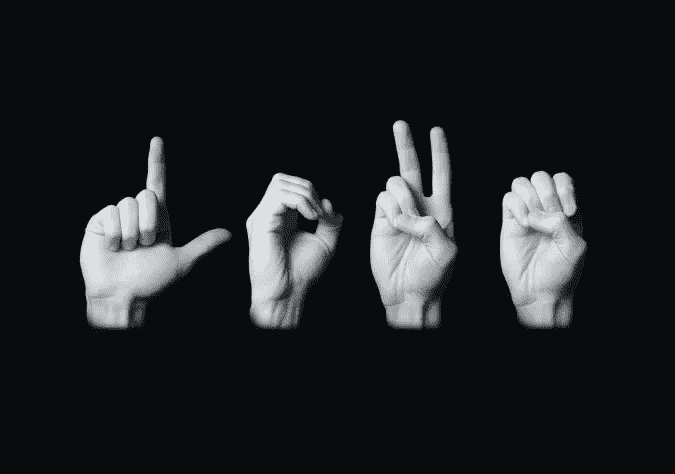
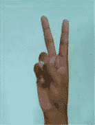
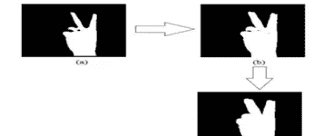
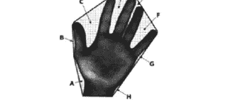
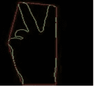
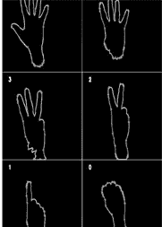
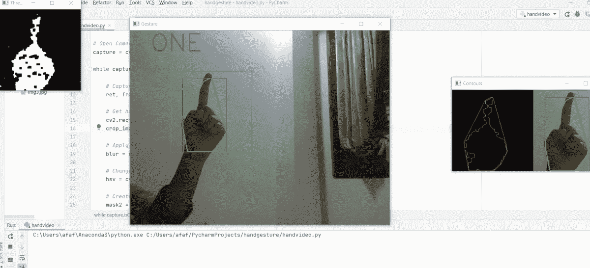

# 实时手语识别系统，以帮助特殊能力。

> 原文：<https://medium.com/analytics-vidhya/real-time-indian-sign-language-recognition-system-to-aid-deaf-dumb-people-e10ac4880752?source=collection_archive---------11----------------------->



手语是重听人——低能儿——交流的一种策略。基于手势的通信是重听残疾人通信的重要技术。由于通过手势进行的交流都是围绕着有组织的代码信号进行的，所以每个动作都有其特定的意义。

它可以通过连接基本组件来传达复杂的含义。在最近相当长的一段时间里，基于手势的通信确认领域的专家们对提出用于从人-人到人-PC 合作的连接的方法越来越感兴趣。

许多与手语相关的研究工作已经完成，如美国手语、英国手语、日本手语等。但到目前为止，在手语数字识别方面的研究还很少。不幸的是，受到挑战的个人依赖于通过签约调解人进行交流的沟通。

在任何情况下，寻找有经验和合格的调解人来处理他们一生中的日常事务都是一件麻烦的事情，而且费用高得不合理。随后，人机连接框架将成为这些人的可靠和稳定的答案。有一项全面的研究已经完成了二十多年。

手语是一种结构良好的代码手势，手势具有赋予它的意义。每次找到一个有成就的合格的翻译是一件非常麻烦的任务，而且非常昂贵。此外，没有重听的人也不会试图熟悉基于手势的交流来与重听的人合作。

这变成了重听人超然的理由。在任何情况下，如果 PC 可以被修改，使得它可以对文本组做出基于手势的通信的解释，则普通个体和听觉网络的困难之间的对比可以被限制。

在所提出的框架中，可以感知用于人机通信的不同数字(即，直到数字 5)的手语数字，从而在任何可想象的时间给出逐渐精确的结果。这不仅仅是对印度几乎毫无意义的个人有利，还可以在创新领域的不同应用中加以利用。

提议的系统如何运作？

1.  *从前置摄像头获取图像:*

```
a. Cap = cv2.VideoCapture(0)b. Ret, IMG = cap.read()
```

*2。* *实时采集帧:*

有了上面的两条线 a & b，它会以帧为单位捕捉图像。下面的图 1 展示了如何捕获数字 2。



图一。实时获取帧

*3。* *图像预处理:*

使用[高斯模糊](https://docs.opencv.org/master/d4/d13/tutorial_py_filtering.html)处理从前置摄像头捕捉的图像，创建手的轮廓。然后处理手部轮廓的[凸包](https://docs.opencv.org/3.4/d7/d1d/tutorial_hull.html)，得到图像的[凸缺陷](https://docs.opencv.org/master/d8/d1c/tutorial_js_contours_more_functions.html)。图 2 显示了手部图像的转换。



图二。转换图像

*4。* *转换:*

简而言之，凸度缺陷是从图像中分割出的对象(斑点、轮廓)中的空洞。这意味着一个区域不属于物体，但位于其外部边界-凸包内。下图，图 3，比百万字更好的展示了它。在手轮廓的示意图中，手指之间的区域(都用箭头标记)是凸面缺陷。



图 3。手轮廓的凸包和凸起缺陷

*5。* *模糊:*

**图像模糊**指使图像变得不清晰或不分明。这是在各种低通滤波器内核的帮助下完成的。

**高斯模糊:**高斯模糊是通过高斯函数模糊图像的结果。这是图形软件中广泛使用的效果，通常用于减少图像噪声和细节。它还被用作应用我们的机器学习或深度学习模型之前的预处理阶段。图 4 显示了通过高斯模糊提取最大轮廓。



图 4。提取最大轮廓

*6。* *阈值:*

对于每个像素，应用相似的边缘权重。如果像素权重小于极限，则设置为 0，否则设置为最大值。容量 cv.threshold 用于应用阈值处理。主要的争论是源图片，它应该是灰度图片。随后的竞争是用于表征像素评价的边缘评价。第三个争论是最极端的价值，它被分配给超过边缘的像素，如图 5 所示。



图 5。具有精确匹配符号的轮廓形状匹配

> **数字 _ 印度手语识别的实现:**

```
*# Imports* import numpy as np
import cv2
import math*# Open Camera* capture = cv2.VideoCapture(0)while capture.isOpened():*# Capture frames from the camera* ret, frame = capture.read()*# Get hand data from the rectangle sub window* cv2.rectangle(frame, (100, 100), (300, 300), (0, 255, 0), 0)
    crop_image = frame[100:300, 100:300]*# Apply Gaussian blur* blur = cv2.GaussianBlur(crop_image, (3, 3), 0)*# Change color-space from BGR -> HSV* hsv = cv2.cvtColor(blur, cv2.COLOR_BGR2HSV)*# Create a binary image with where white will be skin colors and rest is black* mask2 = cv2.inRange(hsv, np.array([2, 0, 0]), np.array([20, 255, 255]))*# Kernel for morphological transformation* kernel = np.ones((5, 5))*# Apply morphological transformations to filter out the background noise* dilation = cv2.dilate(mask2, kernel, iterations=1)
    erosion = cv2.erode(dilation, kernel, iterations=1)*# Apply Gaussian Blur and Threshold* filtered = cv2.GaussianBlur(erosion, (3, 3), 0)
    ret, thresh = cv2.threshold(filtered, 127, 255, 0)*# Show threshold image* cv2.imshow(**"Thresholded"**, thresh)*# Find contours* contours, hierarchy = cv2.findContours(thresh, cv2.RETR_TREE, cv2.CHAIN_APPROX_SIMPLE)try:
        *# Find contour with maximum area* contour = max(contours, key=lambda x: cv2.contourArea(x))*# Create bounding rectangle around the contour* x, y, w, h = cv2.boundingRect(contour)
        cv2.rectangle(crop_image, (x, y), (x + w, y + h), (0, 0, 255), 0)*# Find convex hull* hull = cv2.convexHull(contour)*# Draw contour* drawing = np.zeros(crop_image.shape, np.uint8)
        cv2.drawContours(drawing, [contour], -1, (0, 255, 0), 0)
        cv2.drawContours(drawing, [hull], -1, (0, 0, 255), 0)*# Find convexity defects* hull = cv2.convexHull(contour, returnPoints=False)
        defects = cv2.convexityDefects(contour, hull)*# Use cosine rule to find angle of the far point from the start and end point i.e. the convex points (the finger
        # tips) for all defects* count_defects = 0for i in range(defects.shape[0]):
            s, e, f, d = defects[i, 0]
            start = tuple(contour[s][0])
            end = tuple(contour[e][0])
            far = tuple(contour[f][0])a = math.sqrt((end[0] - start[0]) ** 2 + (end[1] - start[1]) ** 2)
            b = math.sqrt((far[0] - start[0]) ** 2 + (far[1] - start[1]) ** 2)
            c = math.sqrt((end[0] - far[0]) ** 2 + (end[1] - far[1]) ** 2)
            angle = (math.acos((b ** 2 + c ** 2 - a ** 2) / (2 * b * c)) * 180) / 3.14*# if angle > 90 draw a circle at the far point* if angle <= 90:
                count_defects += 1
                cv2.circle(crop_image, far, 1, [0, 0, 255], -1)cv2.line(crop_image, start, end, [0, 255, 0], 2)*# Print number of fingers* if count_defects == 0:
            cv2.putText(frame, **"ONE"**, (50, 50), cv2.FONT_HERSHEY_SIMPLEX, 2,(0,0,255),2)
        elif count_defects == 1:
            cv2.putText(frame, **"TWO"**, (50, 50), cv2.FONT_HERSHEY_SIMPLEX, 2,(0,0,255), 2)
        elif count_defects == 2:
            cv2.putText(frame, **"THREE"**, (5, 50), cv2.FONT_HERSHEY_SIMPLEX, 2,(0,0,255), 2)
        elif count_defects == 3:
            cv2.putText(frame, **"FOUR"**, (50, 50), cv2.FONT_HERSHEY_SIMPLEX, 2,(0,0,255), 2)
        elif count_defects == 4:
            cv2.putText(frame, **"FIVE"**, (50, 50), cv2.FONT_HERSHEY_SIMPLEX, 2,(0,0,255), 2)
        else:
            pass
    except:
        pass*# Show required images* cv2.imshow(**"Gesture"**, frame)
    all_image = np.hstack((drawing, crop_image))
    cv2.imshow(**'Contours'**, all_image)*# Close the camera if 'q' is pressed* if cv2.waitKey(1) == ord(**'q'**):
        breakcapture.release()
cv2.destroyAllWindows()
```

# 结果:



利用图像处理技术为人机合作提出的通过手势确认框架的通信被有效地执行，其精度等同于正在进行的承诺。

希望这有所帮助:)

如果你喜欢我的帖子，请关注。

*更多帮助，查看我的 Github:-*[*【https://github.com/Afaf-Athar/Hand_Gesture_Number】*](https://github.com/Afaf-Athar/Hand_Gesture_Number)

```
More Refrences:
1\. [https://link.springer.com/article/10.1007/s11831-019-09384-2#:~:text=Sign%20language%20recognition%20is%20a,and%20to%20perceive%20their%20meaning.](https://link.springer.com/article/10.1007/s11831-019-09384-2#:~:text=Sign%20language%20recognition%20is%20a,and%20to%20perceive%20their%20meaning.)
2\. [https://link.springer.com/chapter/10.1007/978-3-319-38771-0_54](https://link.springer.com/chapter/10.1007/978-3-319-38771-0_54)
3\. [https://ieeexplore.ieee.org/abstract/document/6470093](https://ieeexplore.ieee.org/abstract/document/6470093)
```