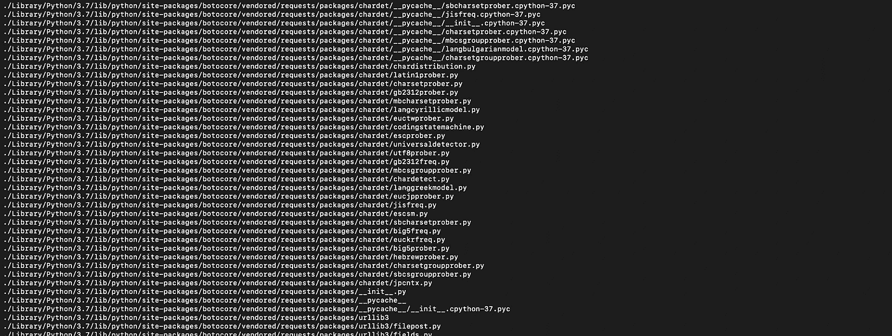
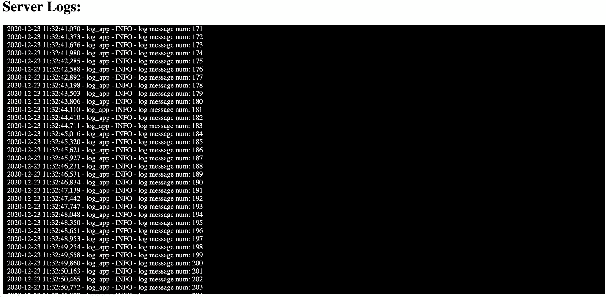

# 通过 Python 和 FastAPI 使用服务器发送的事件

> 原文：<https://medium.com/analytics-vidhya/real-time-log-streaming-with-fastapi-and-server-sent-events-54c31cfe78c5?source=collection_archive---------6----------------------->



服务器发送事件(SSE)经常被它的两个大哥——Web 套接字和长轮询——所掩盖。然而，有许多使用 SSE 的实际用例。更新动态内容、发送推送通知和实时流数据只是 SSE 可以利用的几个应用程序。这篇文章将解释 SSE，何时使用它，并用 FastAPI 实现一个简单的 SSE 应用程序。

# 什么是 SSE

> 传统上，网页必须向服务器发送请求以接收新数据；也就是说，页面从服务器请求数据。使用服务器发送的事件，服务器可以通过向网页推送消息，随时向网页发送新数据。 [*MDN*](https://developer.mozilla.org/en-US/docs/Web/API/Server-sent_events)

这是什么意思？本质上，服务器发送事件(SSE)使用户能够订阅实时数据流。每当数据流更新时，用户可以实时看到新的事件。如果您过去使用过长轮询或 Web Socket 应用程序，您可能会想知道 SSE 有什么了不起的？

# SSE 与 Web 套接字


[玩具企鹅](https://www.amazon.com/Aurora-World-Pompom-Penguin-White/dp/B00GS228DG/ref=asc_df_B00GS228DG/?tag=hyprod-20&linkCode=df0&hvadid=312126267557&hvpos=&hvnetw=g&hvrand=9396469599274290370&hvpone=&hvptwo=&hvqmt=&hvdev=c&hvdvcmdl=&hvlocint=&hvlocphy=9032144&hvtargid=pla-489531873487&psc=1)

Websockets 是服务器之间的双向通信形式。它们通常用于构建聊天室或多人视频游戏，因为这些应用程序需要服务器和客户端之间的持续通信。你可以把 SSE 想象成一个单向的 websocket。只有服务器可以向订阅的客户端发送消息。在许多 web 应用程序中，web 套接字可能有些过头了。例如，更新产品页面上的商品价格不需要双向通信。服务器只需要单向通信来更新所有客户端的价格。这是 SSE 的一个完美用例。

# SSE 与长轮询

[长轮询](https://www.ably.io/topic/long-polling#:~:text=Rather%20than%20having%20to%20repeat,available%20or%20a%20timeout%20threshold)是一种通信方法，客户端定期向服务器发送新数据。当正在构建的应用程序涉及人工干预或执行计算开销大的任务时，通常会使用这种形式的通信。想想看，你的 DoorDash 交付状态或者触发了一个重型机器学习模型的训练。这些事件需要很长时间才能完成，因为它们可能需要人进行更新，或者只是计算量很大。在这种情况下，经常检查这些任务的完成可能是不必要的。SSE 通常用于快速生成事件的应用程序中。例如，在 YouTube 视频上进行实时点赞计数，在用户界面上显示服务器日志文件，或者向用户手机推送通知。所有这些事件都近乎即时更新。

# 快速回顾

简而言之，SSE 是一个很好的快速实时数据流工具。它们提供从服务器到客户端的单向通信，通常用于更新网页上的动态内容。

# 让我们使用 SSE 在网页上显示日志文件！



既然知道了 SSE 的优缺点，那就用起来吧。我们将建立一个网页，显示来自服务器的实时日志文件！这是 SSE 的一个很好的用例，因为日志是通常会快速更新的事件。我们也不需要双向交流。在本教程中，我们将使用 python 和 FastAPI。FastAPI 对于 SSE 应用程序来说是一个很好的工具，因为它非常容易使用，并且是建立在内置了 SSE 功能的 starlette 之上的。下面显示的所有代码都可以在 [Github](https://github.com/amittallapragada/SSELoggerDemo) 上获得。

代码将分为两部分:服务器和客户端

服务器应用程序必须分为两个部分——一个是模拟生成日志的程序，另一个是传输这些日志的程序。

我们的日志生成器非常简单。我们将创建一个名为 **program.py** 的文件。在其中，我们首先创建一个指向日志文件的 logger 对象。然后，我们将编写一个无限 while 循环，将一些随机消息打印到我们的日志文件中。我们将放置一个小的 time.sleep()来降低我们创建日志的速度。

```
program.py
```

好了，现在我们有了一个生成日志的程序。现在让我们用 SSE 流式传输这些日志。为此，我们将使用 FastAPI 构建一个快速 web 服务器。您需要安装一些 python 库来运行这个代码片段，所以我强烈建议您在继续之前按照我在 [Github](https://github.com/amittallapragada/SSELoggerDemo) readme 上的安装说明进行操作。我们将把所有的服务器逻辑写在一个名为 server.py 的文件中。

webserver 代码可以分为三个部分:导入和服务器设置、我们的 SSE 生成器和我们的服务器端点。让我们看一下每一部分:

## 导入和服务器设置

```
server.py
```

这里需要了解的主要导入是 FastAPI、EventSourceResponse 和 tail。FastAPI 将使我们能够快速构建网络服务器。EventSourceResponse 是 sse_starlette 库中的一个函数，它将 python [生成器](https://wiki.python.org/moin/Generators)对象转换成 sse 信号。sh 库中的 tail 函数让我们无限地跟踪一个文件，并且只打印未读的行。这对于我们开发一个日志记录器是至关重要的，因为我们只想显示用户还没有看到的行。完成导入后，我们创建一个 FastAPI 实例。我们还添加了一些 CORS 中间件，允许我们的客户端接受服务器发送的事件。

## SSE 生成器

```
server.py
```

日志生成器

感谢 EventSourceResponse 函数，我们可以将 python [生成器](https://wiki.python.org/moin/Generators)作为服务器发送的事件发送。我们的生成器是在 logGenerator 函数中定义的。它使用尾部导入无限期地跟踪我们的日志文件，并在文件更新时生成新的行。我们还将添加一个睡眠功能来降低发电机的速度。这将使我们更容易跟踪打印在网页上的日志。您可能想知道为什么函数是异步的，request.is_disconnected 在做什么。我稍后会解释那件事。

## 服务器端点

```
server.py
```

流式端点

最后但同样重要的是，我们有我们的服务器端点。我们创建一个路由“/stream-logs ”,它将创建日志生成器的一个实例，并将 is 作为 EventSourceResponse 返回。EventSourceResponse 是 starlette 对服务器发送的事件的表示。您可能会注意到，我们的 run 方法接收一个请求对象，并将其传递给 logGenerator。starlette 请求的一个很酷的优点是我们可以监控客户请求的整个生命周期。每当我们检测到一个特定的客户端断开连接时，这就允许我们中断生成器并节省资源。这就是“request.is_disconnected”逻辑在日志生成器中的作用。这个代码片段的最后一行在您本地主机的端口 8080 上运行我们的 web 服务器，可以这样访问: [http://0.0.0.0:8000/](http://0.0.0.0:8000/)

与服务器相比，我们的客户端应用程序非常简单。这是一个订阅我们服务器的 html 页面。它将被命名为 client.html

```
client.html
```

客户端 html 代码

这个文件中唯一值得讨论的部分是脚本部分。这里我们创建了一个名为 Source 的新 EventSource 变量。我们的 source var 表示我们的客户端已经订阅了服务器的流日志端点。EventSource 对象的 onmessage 函数允许我们在从流中接收到新消息时触发自定义操作。在我们的例子中，我们将修改一个 div，并在那里追加日志数据。(我试图将这个元素设计成控制台的样子)

厉害！我们已经写好了我们的服务器和客户机代码。为了完成这项工作，我们首先需要运行我们的服务器和日志文件。一旦两者都运行了，我们就可以在任何浏览器中打开客户端 html 代码。我将详细介绍如何在项目 [Github](https://github.com/amittallapragada/SSELoggerDemo) 页面上运行这些脚本！感谢您的关注！


*原载于 2020 年 12 月 23 日*[*https://amittallapragada . github . io*](https://amittallapragada.github.io/docker/fastapi/python/2020/12/23/server-side-events.html)*。*