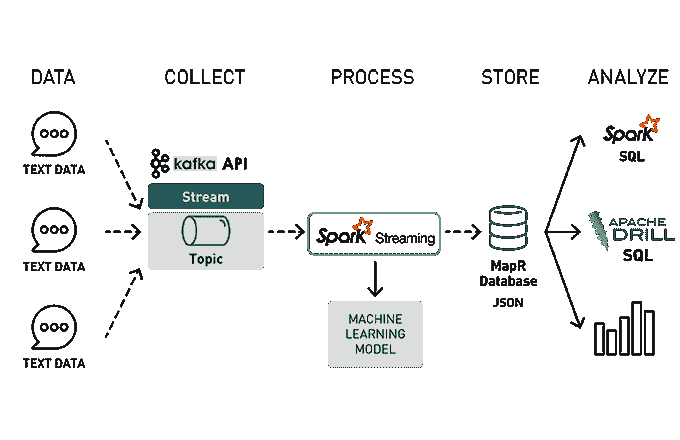
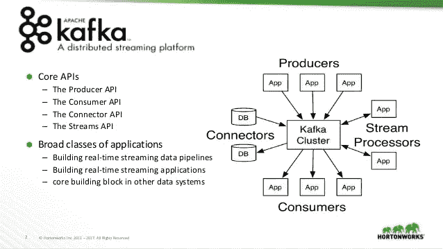
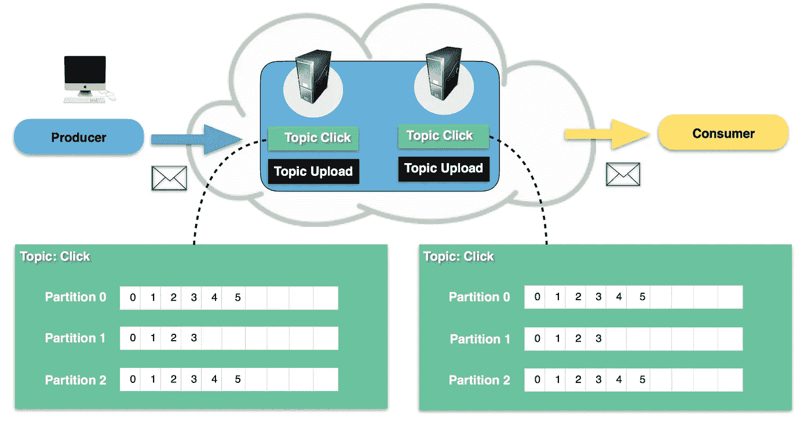
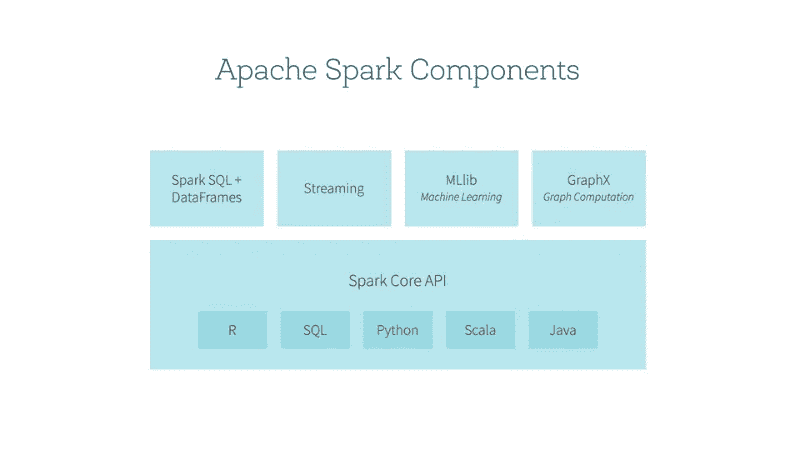

# 实时机器学习

> 原文：<https://medium.com/analytics-vidhya/real-time-machine-learning-7aa55dafb2b?source=collection_archive---------1----------------------->

想象一下这个场景:你有一个使用机器学习的应用程序，你想让这个应用程序实时地从你的用户数据中学习。这意味着，随着新用户数据的生成，你的应用程序能够对传入的数据流进行预测和训练，以自动改进自身。你将如何着手建造这个？花点时间看看这张图表，它是这条管道的一个例子。

所以首先是文本数据。这些文本数据通过一个名为“Apache Kafka”的软件产品实时传输给一个模型。该模型是使用名为“Spark”的库构建和训练的。结果被保存到数据库中，然后我们可以对这些预测做任何我们想做的事情(分析、可视化、UI 更新等)。)现在，这些技术都不是实现这一点所必需的，但是它们中的每一种对于这一用例都很受欢迎。我们可以很容易地将“火花”替换为“张量流”或“PyTorch”。《卡夫卡》也是如此。我们可以很容易地用“Redis”或其他数据流协议来代替它。但是卡夫卡是相当强大的，所以让我们来讨论一下

**阿帕奇卡夫卡是什么意思？**

Kafka 是一款开源软件，为数据流处理、读取和分析提供了一个框架。

开源确保了它基本上可以免费使用，并拥有一个庞大的用户和开发者网络，他们贡献了更新、新功能和新的用户支持。

Kafka 设计为在“分布式”环境中运行，这意味着它通过许多(或许多)服务器运行，而不是坐在一个用户的计算机上，利用它提供的额外计算能力和存储容量。

Kafka 最初创建于 LinkedIn，在分析其数百万专业用户之间的交互以建立个人网络方面发挥了作用。它被授予开源地位，并于 2011 年转移到 Apache 基金会，该基金会负责协调和监督开源软件的开发。

**卡夫卡有什么用？**

如今，公司越来越依赖实时数据分析来获得更好的洞察力和更快的响应时间，以保持竞争力。实时洞察使企业或组织能够根据最新信息预测他们应该存储、促销或从货架上拉取什么。

历史上，数据是通过网络“成批”存储和分发的。这是由于流水线限制 CPUs 能够处理读取和存储信息所涉及的计算的速度，或者传感器能够检测数据的速度。正如这篇采访指出的那样，当人类首次开始用书面记录记录和交换信息时，我们处理数据的能力中就存在这样的“瓶颈”。

由于 Kafka 的分布式特性和处理传入数据的自动化方式，Kafka 能够非常快速地运行——大型集群每秒钟可以跟踪和响应数据集中的数百万次变化。这意味着实时处理和响应流数据是可能的。

最初是为了跟踪访客在大型繁忙网站(如 LinkedIn)上的行为。通过分析每个会话的点击流数据(用户如何导航页面以及他们使用什么功能)，可以更好地了解用户行为。这使得预测访问者可能对新闻文章或待售产品感兴趣成为可能。

自那以后，Kafka 开始被广泛使用，并成为 Spotify、Airbnb、优步、高盛(Goldman Sachs)、Paypal 和 CloudFlare stack 不可或缺的一部分，所有这些公司都用它来处理数据流，并了解用户或设备的行为。事实上，根据《财富》500 强公司的网站，五分之一的公司在某种程度上使用卡夫卡。

Kafka 取得霸主地位的一个具体领域是旅游业，其流媒体技术使其成为监控全球数百万航班、套装度假和酒店空房的理想选择。

**卡夫卡是如何运作的？**

Apache 获取信息——可以从大量数据源中读取——并将其组织成“主题”。作为一个非常简单的例子，这些数据源之一可以是交易日志，其中杂货店报告每笔销售。

Kafka 将处理这些信息流，并创建“主题”，可以是“售出的苹果数量”或“下午 1 点至 2 点之间的销售数量”，任何想要深入了解数据的人都可以对这些主题进行分析。

这听起来可能类似于传统数据库允许你存储或排序信息的方式，但对于 Kafka 来说，这对于每分钟记录数千次苹果销售的全国连锁杂货店来说是理想的。

这是通过称为处理器的功能来实现的，处理器是应用程序(例如，跟踪杂货店有组织但无序的交易数据库的代码)和主题之间的接口，主题是 Kafka 自己的有序、分段的信息存档，称为 Kafka 主题日志。

这种数据流通常用于填充数据湖，如来自 Hadoop 的分布式数据库，或馈送实时存储中的 Spark 或 Storm 等管道。

另一个软件——被称为消费者——允许读取主题日志并将其中存储的信息传输到可能需要它的其他应用程序——例如，杂货店的程序更新耗尽的库存或丢弃过时的产品。

Kafka 通过塑造“中枢神经系统”来工作，当您将其组件与大数据分析框架的其他常见元素结合在一起时，信息通过输入和捕获框架、数据处理引擎和存储湖移动。

**好吧，那么火花是什么？**

Apache Spark 是一个强大的开源处理引擎，具有 Java、Scala、Python、R 和 SQL APIs，围绕速度、易用性和复杂的分析而设计。Spark 在内存中运行程序的速度比 Hadoop MapReduce 快 100 倍，在磁盘上快 10 倍。它可以用作开发软件应用程序和交互式进行特定数据分析的库。Spark power 包括 SQL、数据帧和数据集的库栈，用于机器学习的 MLlib，用于图形存储的 GraphX 和 Spark Streaming。在同一个程序中，你可以很容易地组合这些库。Spark 也可以在独立或云笔记本电脑、Hadoop、Apache Mesos 上运行。它可以访问不同的数据源，如 HDFS、Apache Cassandra、Apache HBase 和 S3。

它最早是在 2009 年由加州大学伯克利分校开发的。(请注意，Spark 的创始人 Matei Zaharia 后来成为了 Databricks 的首席技术官和麻省理工学院的教员。)Spark 自发布以来，已被各行各业的企业迅速采用。网飞、Twitter 和腾讯等互联网巨头已经准备好快速部署 Spark，在超过 8000 个节点的集群上共同存储数 Pb 的数据。它拥有 1000 多名项目参与者和 420 个 Apache Spark Meetups 小组的 187，000 多名参与者，已迅速成为大数据领域最大的开源网络。

一下子接受太多了！我有点困惑。

这完全有道理！这两种技术可能各有各的发展方向。我之所以提到它们，是因为它们有助于提高可伸缩性，这是所有企业在开发软件产品时都必须面对的问题。但幸运的是，我发现了一些完美的博客帖子，它们将所有的东西联系在一起，让您从更高的层次、以实现为重点来理解它们是如何工作的。如果你不了解每一个细节也没关系，只要你知道它们通常是做什么的，以及什么时候使用它们。直觉是这里的关键！

spark vs tensor flow:[https://analyticsindiamag . com/tensor flow-vs-spark-different-work-tandem/](https://analyticsindiamag.com/tensorflow-vs-spark-differ-work-tandem/)

ML in Production 示例，Kafka+Python:[https://towardsdatascience . com/puting-ML-in-Production-I-using-Apache-Kafka-in-Python-ce 06 B3 a 395 c 8](https://towardsdatascience.com/putting-ml-in-production-i-using-apache-kafka-in-python-ce06b3a395c8)

用 Spark 和 Kafka 进行情感分析:[https://mapr . com/blog/streaming-machine-learning-pipeline-for-perspective-Analysis-using-Apache-APIs-Kafka-Spark-and-drill-part-1/](https://mapr.com/blog/streaming-machine-learning-pipeline-for-sentiment-analysis-using-apache-apis-kafka-spark-and-drill-part-1/)