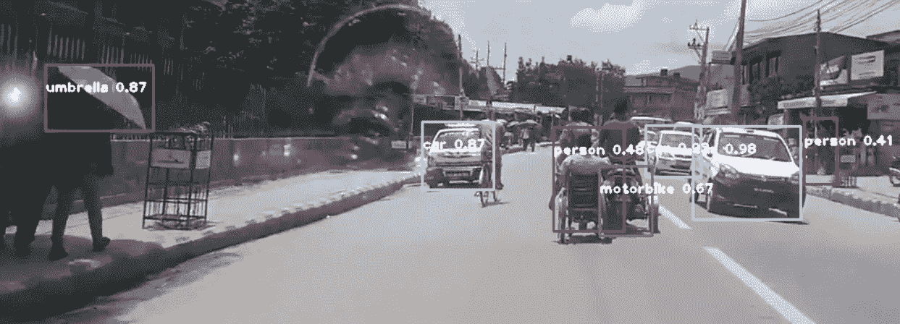
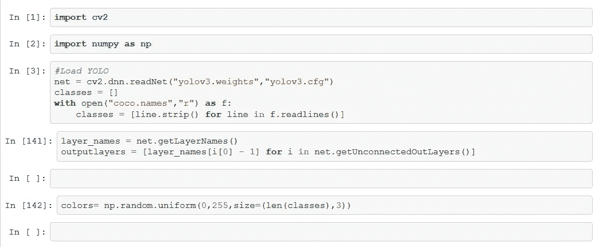
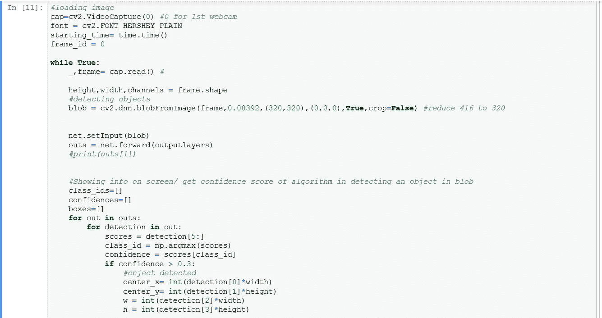
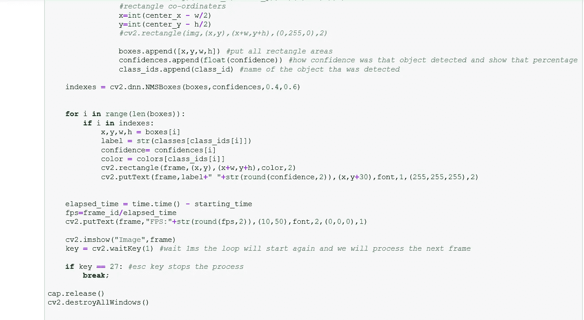

# 基于 OpenCV 和 Python 的 YOLOv3 实时物体检测

> 原文：<https://medium.com/analytics-vidhya/real-time-object-detection-using-yolov3-with-opencv-and-python-64c985e14786?source=collection_archive---------1----------------------->

实时物体检测:使用 yolov3 检测雨伞、人、汽车、摩托车

在之前的[文章](/@darshanadakane/object-detection-with-opencv-python-using-yolov3-481f02c6aa35)中，我们已经看到了使用 YOLOv3 算法对图像进行物体检测。在本文中，让我们更进一步，看看我们如何使用 YOLOv3 进行实时对象检测。

我们可以用两种方法解决这个问题。一个是用 CPU，一个是用 GPU。

CPU 的优点是我们不需要安装任何额外的资源，安装。我们可以马上使用 OpenCV 来做这件事。但缺点是它非常慢(这取决于什么配置的 CPU 你正在运行，但是的，它很慢)。推荐给初学者。

另一方面，GPU 具有视频图形处理器的优势，因此速度更快。但缺点是我们需要手动编译许多库，并在开始利用我们的问题定义之前配置许多东西。

让我们继续这个教程来使用 CPU 进行实时物体检测。在上一个教程中，我们使用的是单幅图像，而现在我们将使用 OpenCV 中的一系列图像(即视频)作为输入。

在加载图像之前，我们将重述代码。我们导入 cv2，numpy 库。然后我们在**网**中加载暗网架构，在**类**中存储来自 **coco.names** 文件的所有不同对象。并从**网**中获取最后一层，以识别最后一层中的对象。

现在，我们从网络摄像头加载捕获视频。因此我们使用 **cv2。视频捕捉(0)** 。这里 0 表示它来自第一个网络摄像头。同样，为了检测我们每秒处理多少帧，我们将导入 **time** 库。我们使用 **frame_id** 来计算帧数。为了得到经过的时间，我们从 **time.now 中减去**starting . time**。**我们已经将**字体**定义为 HERSHEY_PLAIN

然后，我们加载 while 循环中运行的视频的所有帧，并使用 **cap.read** 存储每个帧，并执行我们在上一篇文章中对每个图像所做的操作。在**高度、宽度、通道中存储每帧的详细信息。为了更快地处理图像，我们将把斑点尺寸从 416x416 减小到 320x320。这种变化会使精确度降低一点。另一方面，如果我们增加 608x608，它将准确，但在检测非常缓慢。**

在上面的代码中， **fps** 是我们用帧数除以运行时间计算的每秒帧数。我们将把这个值作为文本放在检测到的对象上。最后，我们使用了**键** =27(键盘上的 Esc 键)，如果按下该键，将会中断循环并停止执行。

我想分享的最后一件事是关于自信。请记住，我们使用的是阈值 0.5，如果我们提高阈值，这意味着我们将获得更高的检测精度，但目标数量会减少，反之亦然。我们也在 box 上展示了这个置信度值。

测试视频从网络摄像头检测到以下物体:雨伞，汽车，人和摩托车。点击[这里](https://github.com/darshanadakane/yolov3_realTimeObjectDetection)查看输出文件(文件名为[网络摄像头 _ 对象检测。MOV](https://github.com/darshanadakane/yolov3_realTimeObjectDetection/blob/master/Webcam_ObjectDetection.MOV)

为了加速检测过程，除了减小斑点图像尺寸之外，还有另一种方法。方法是使用微型 YOLO。在这里，我们将传递一个不同的权重和 cfg 文件。它将比原始的 yolov3 cfg 文件具有更少的卷积层数。要使用它，只需如下替换代码中的文件名，其余代码保持不变。

您可以在以下位置找到这些文件:

yolov3-tiny.weights:从[这里](https://github.com/pjreddie/darknet/tree/master/cfg)下载

yolov3-tiny.cfg:从[这里](https://github.com/pjreddie/darknet/tree/master/cfg)下载

所以，如果你正在处理低配置的 CPU，tiny yolo 是最好的选择。但是现在，随着最新的笔记本电脑计算能力的增加(有些还支持 GPU)，我会推荐直接使用普通的 yolov3。

我希望这将有助于实现 yolov3 实时对象检测算法。我试图让初学者的心态可以理解。如果您有任何问题或意见，请告诉我。

回旋石！

快乐学习！

【你可以在 [Github](https://github.com/darshanadakane/yolov3_realTimeObjectDetection) 上找到完整的代码。喜欢就明星。谢谢]