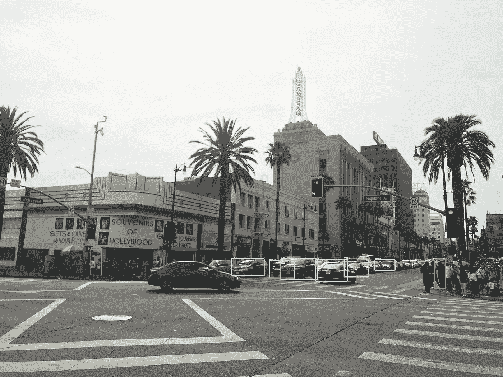
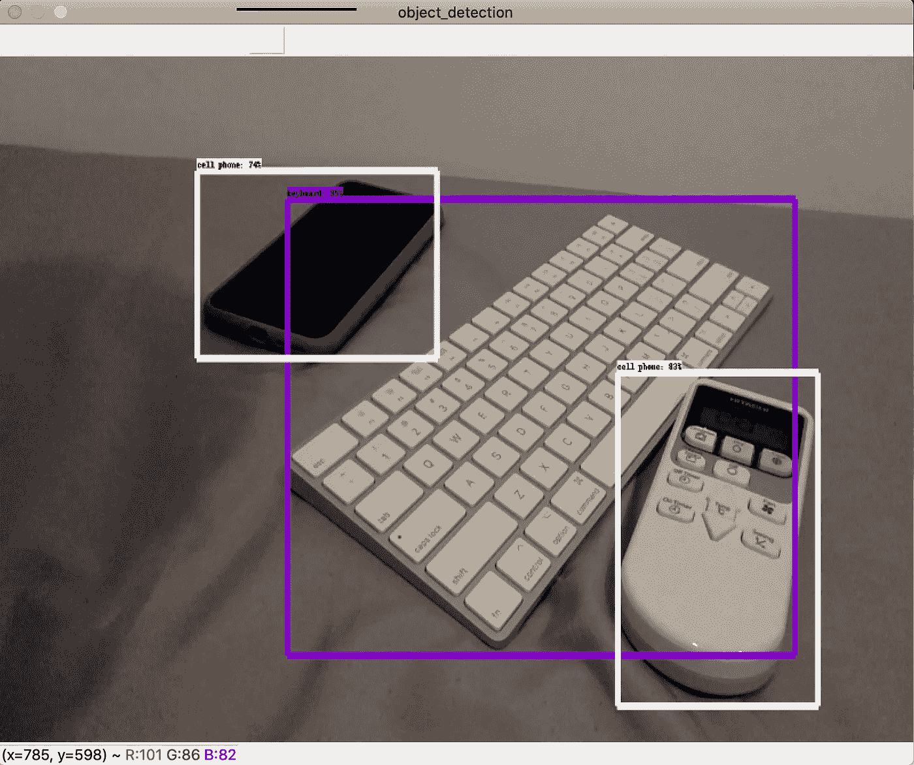

# 基于张量流的实时目标检测

> 原文：<https://medium.com/analytics-vidhya/real-time-object-detection-with-tensorflow-64e2677521ce?source=collection_archive---------22----------------------->



我在洛杉矶拍了这张照片

这是一个时间来尝试对象检测作为实时与 API！

在本文中，我将介绍使用 TensorFlow 对象检测 API 进行实时检测。

当时，我试着用这篇文章来做这件事

[](https://towardsdatascience.com/live-object-detection-26cd50cceffd) [## 活体检测

### 使用 Tensorflow 对象检测 API 进行活体对象检测

towardsdatascience.com](https://towardsdatascience.com/live-object-detection-26cd50cceffd) 

但不知何故，它不起作用，我发现我需要关注 TensorFlow 2.0，这是最近的一个重大更新。所以我要解决这个问题，并在这里分享！

# 物体检测教程

我们将参考 Github 上的 [TensorFlow 对象检测 API 库，如果您不克隆该库，请克隆为](https://github.com/tensorflow/models)

```
git clone [https://github.com/tensorflow/models.git](https://github.com/tensorflow/models.git)
```

然后我们将使用“object _ detection _ tutorial . ipynb ”,其中位于/models/research/object _ detection 中。然后，您只需在本地机器上运行 Jupyter notebook。

此外，您可以使用测试图像和您自己的图像来检测图片中的对象。例如，我只是分享我在西雅图拍摄的测试图像。


检测到三个物体(顺便说一下，那个饭盒相当不错)

# 编辑推理代码

接下来，我们需要编辑笔记本，以便能够实时检测。为了做到这一点，让我们看看笔记本，看看倒数第六个单元格。

```
**def** show_inference(model, image_path):
  *# the array based representation of the image will be used later in order to prepare the*
  *# result image with boxes and labels on it.*
  image_np = np.array(Image.open(image_path))
  *# Actual detection.*
  output_dict = run_inference_for_single_image(model, image_np)
  *# Visualization of the results of a detection.*
  vis_util.visualize_boxes_and_labels_on_image_array(
      image_np,
      output_dict['detection_boxes'],
      output_dict['detection_classes'],
      output_dict['detection_scores'],
      category_index,
      instance_masks=output_dict.get('detection_masks_reframed', **None**),
      use_normalized_coordinates=**True**,
      line_thickness=8)

  display(Image.fromarray(image_np))
```

该单元具有“显示 _ 推断”功能，它只能逐个检测对象。所以我们要用 Opencv 修改一些部分。

为此，这是修改后的代码(确保您需要安装 OpenCV 包)

```
import cv2
cap = cv2.VideoCapture(0)def run_inference(model, cap):
    while True:
        ret, image_np = cap.read()
        # Actual detection.
        output_dict = run_inference_for_single_image(model, image_np)
        # Visualization of the results of a detection.
        vis_util.visualize_boxes_and_labels_on_image_array(
            image_np,
            output_dict['detection_boxes'],
            output_dict['detection_classes'],
            output_dict['detection_scores'],
            category_index,
            instance_masks=output_dict.get('detection_masks_reframed', None),
            use_normalized_coordinates=True,
            line_thickness=8)
        cv2.imshow('object_detection', cv2.resize(image_np, (800, 600)))
        if cv2.waitKey(25) & 0xFF == ord('q'):
            cap.release()
            cv2.destroyAllWindows()
            break
```

最后，调用这个命令。

```
run_inference(detection_model, cap)
```

那我希望你能做实时物体检测。正如你在下面看到的，它将是这样的。



我的机器上的实时对象检测

此外，您也可以在本教程笔记本上使用它进行分段。只需按照笔记本上的说明下载一个分段模型，然后使用此命令而不是 show_inference

```
run_inference(masking_model, cap)
```

# 结论

如果你喜欢这篇文章，请你亲自尝试一下！对象检测 API 对于我们尝试演示以及制作自己的检测模型非常有用。在未来，我将使用这个 API 尝试我自己的检测模型，并张贴在这里！

# 参考

[](https://towardsdatascience.com/live-object-detection-26cd50cceffd) [## 活体检测

### 使用 Tensorflow 对象检测 API 进行活体对象检测

towardsdatascience.com](https://towardsdatascience.com/live-object-detection-26cd50cceffd) [](https://github.com/tensorflow/models) [## 张量流/模型

### TensorFlow 模型花园是一个存储库，包含许多最新(SOTA)的不同实现…

github.com](https://github.com/tensorflow/models) 

并请关注我的推特 [@Kohei_Dozono](https://twitter.com/Kohei_Dozono) ！！！