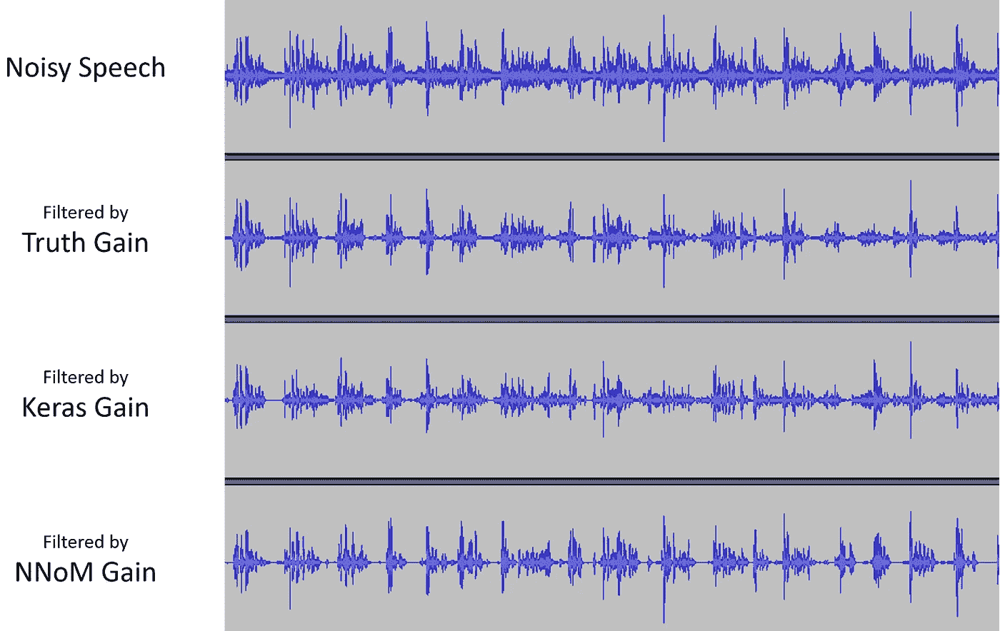

# 基于单片机(STM32)的实时 RNN 语音噪声抑制

> 原文：<https://medium.com/analytics-vidhya/real-time-rnn-speech-noise-suppression-on-a-microcontroller-stm32-e17d8c3eac57?source=collection_archive---------0----------------------->

## 基于众所周知的 [RNNoise](https://jmvalin.ca/demo/rnnoise/) 提供的方法论。

RNNoise 展示了传统信号处理和神经网络的良好结合，从而产生了一种低成本的噪声抑制方法。但是，由于 RNNoise 仍然使用浮点 NN 接口，并且是为 Cortex-A MPU 设计的。Cortex-M 级 MCU 处理信号的计算量仍然很大(约 40 Mflops)。

因此，通过使用 RNNoise 的方法论，我开发了一个 RNN 噪声抑制的 NNoM 实例，但是降低了系统复杂度，并且将 NN 触发器转换为定点算法(MAC ops)。

> 对于不熟悉的人来说， [NNoM](https://github.com/majianjia/nnom) 是一个针对低资源平台(如 Cortex-M)的定点干扰 NN lib。它将复杂的 keras 模型转换成一个 C 头文件，并可以与优化的 CMSIS-NN 一起运行。

本教程的**源代码**可以在这里找到:[https://github . com/majianjia/nnom/tree/master/examples/rnn-de noise](https://github.com/majianjia/nnom/tree/master/examples/rnn-denoise)

# 概观


系统概述。

[RNNoise](https://jmvalin.ca/demo/rnnoise/) 已经解释了我们在这个项目中使用的方法。

基本上，我们使用神经网络模型来控制非常高频率的音频均衡器(EQ ),从而抑制那些包含噪声的频带，同时保持增益包含语音。

与试图直接输出信号的传统神经网络不同，我们的神经网络模型输出均衡器的每个滤波器频带的增益。

此示例使用 MFCC (Mel 标度)来确定增益，而不是 Opus 标度(RNNoise)或 Bark 标度。

我们也没有实现 RNNoise 使用的音调滤波算法。该器件是由一组梳状滤波器组成的独立功能模块。

**这里是我们可以实现的演示**

再次分享给你的朋友！

# 运行该示例的分步指南

本说明将为您提供在 PC 或 MCU 上运行模型和音频处理的必要信息。

源代码可以在 [NNoM 存储库](https://github.com/majianjia/nnom/tree/master/examples/rnn-denoise)下获得。

## 1.得到嘈杂的演讲

这个例子使用[微软可扩展的噪声语音数据集](https://github.com/microsoft/MS-SNSD) (MS-SNSD)。如果你想训练你自己的模型，你可以从上面的库中下载数据集，然后把它们放到文件夹`MS-SNSD/`中。

在 MS-SNSD 被下载之后，你现在可以生成`clean speech`和它相应的`noisy speech`，混合了不同级别的噪声。

使用 MS-SNSD 的优势在于它是可扩展的。修改`noisyspeech_synthesizer.cfg`来配置如何生成语音。本示例的推荐配置如下:

```
sampling_rate: 16000
audioformat: *.wav
audio_length: 60 
silence_length: 0.0
total_hours: 15
snr_lower: 0
snr_upper: 20
total_snrlevels: 3
```

然后，运行`noisyspeech_synthesizer.py`来生成演讲。如果一切顺利，将会创建 3 个新文件夹`/Noise_training`、`/CleanSpeech_training`和`NoisySpeech_training`。我们只需要后面的两个文件夹。

## 2.生成数据集

现在我们有位于`MS-SNSD/CleanSpeech_training`和`MS-SNSD/NoisySpeech_training`的干净和嘈杂的语音。它们是原始 PCM 信号，但我们的神经网络将 MFCCs 及其导数作为输入，均衡器增益作为输出，因此我们需要处理它们以获得我们的训练数据集。

现在我们需要运行`gen_dataset.py`来获得 MFCC 和增益。它将生成数据集文件`dataset.npz`，该文件可用于以后的神经网络训练。还有，

*   您可以配置要在 RNN 中使用多少 MFCC 功能(这也是均衡器中滤波器波段的数量)。修改`num_filter = 20`；这个数字可以是从`10`到`26`。
*   该步骤将均衡器的滤波系数生成到文件`equalizer_coeff.h` ( `generate_filter_header(...)`)中，该文件将在 C 均衡器中使用。

此外，`gen_dataset.py`还生成一个音频文件`_noisy_sample.wav`，它是原始的噪声语音，以及一个使用真实增益`_filtered_sample.wav`过滤的过滤文件。我建议播放这两个文件，看看使用这种均衡器抑制方法能得到什么样的最佳结果。

## 3.培养

一旦我们准备好`dataset.npz`，运行`main.py`来训练模型。训练好的模型将被保存为`model.h5`

我们用`stateful=True`和`timestamps=1`训练 RNN，这对于用反向传播训练不友好，所以我把`batchsize`设置得很大，让 BP 的日子好过些。

在`main.py`的后期，它将重新加载`model.h5`，并尝试使用我们经过皮肉训练的 RNN `filtered_sig = voice_denoise(...)`处理上述噪声文件`_noisy_sample.wav`，并将过滤后的信号保存到`_nn_filtered_sample.wav`。

此外，它将使用 NNoM 模型转换器脚本`generate_model(...)`来生成我们的 NNoM 模型`weights.h`

## 4.使用 NNoM 的推理

这个例子提供了一个`SConstruct`，因此您可以在这个文件夹中运行`scons`来构建一个二进制可执行文件。

该可执行文件可以将`.wav`文件作为输入，输出过滤后的`.wav`文件。

> **唯一支持的**格式是 **16kHz** 、 **1CH** 。`main.c`不会解析 wav 文件，只会复制文件头并跳转到数据块。

编译完成后，使用文件夹中的以下命令运行

*   Win powershell: `.\rnn-denoise [input_file] [output_file]`或将 wav 文件拖到可执行文件上。
*   Linux:我不知道

即运行`.\rnn-denoise _noisy_sample.wav nn_fixedpoit_filtered_sample.wav`

如果您遵循了指南，您会看到您的`rnn-denoise`文件夹中有以下文件。

```
_noisy_sample.wav  --> original noisy speech
_filtered_sample.wav  --> denoised speech by truth gains
_nn_filtered_sample.wav   --> denoised speech by the NN gains from Keras
_nn_fixedpoit_filtered_sample.wav   --> denoised speech by NN gains from NNoM
```

从图形上看，结果如下:



# 进一步的细节

总的来说，我建议你仔细阅读 python 代码，`gen_dataset.py`和`main.py`阅读代码中的注释，并用不同的配置进行测试。

## 培训用数据

`x_train`由 13 或 20 个 MFCC 系数和前 10 个系数的一阶和二阶导数组成，总共给出 33 或 40 个特征。


`y_train`由两个数据组成，`gains`和`VAD`。

*   通过干净语音/有噪声语音的每个频带能量的平方根来计算增益。与 RNNoise 相同。
*   VAD 是由干净语音总能量高于阈值的地方产生的。对于一些样本，它被向前和向后扩展。


用能量检测纯净语音中的周期

## 增益和语音活动检测

在默认模式中，有一个只有一个神经的辅助输出，指示是否检测到*语音*。`1`检测到，`0`未检测到。在 MCU 示例`main_arm.c`中，这与一个板载 LED 相连，如果`VAD neural > 0.5`出现，该 LED 就会亮起。


VAD 和 RNN 产量的前 10 个收益

## 均衡器

该示例使用 20 个频段(默认)或 13 个频段(或您想要的任何数量的频段)来抑制噪声。每个频带由 1 阶(默认)或 2 阶(不稳定)IIR 带通滤波器滤波。两个相邻频带的-3dB(截止)是交叉的。频率响应如下所示:


均衡器中带通滤波器组的频率响应

信号将并行通过每个频带，然后叠加在一起。由于每个波段的重叠，信号可能听起来太响，会导致溢出(破裂噪声)。因此`0.6`的一个因子被乘以最终信号(不是一个数学计算的数字)。

## 模型结构

这个例子提供了两种不同的 RNN 模型。第一种是类似 RNNoise 结构，由许多单个 GRU 层之间的多个链接组成。这些链接使用连接来合并。除了均衡器的增益，它还输出语音活动检测(VAD)。该型号在`main.py`中是默认的，结构如下图所示。这个模型有大约`120k`的权重，比 RNNoise 大，因为它有一个额外的输入层。然而，模型的规模远远不够。你可以减少很多，但结果不会有任何明显的不同。


RNN 整体结构

另一种是简单的堆叠 GRU。这将不提供 VAD 输出。令人惊讶是，它也工作得很好。为了测试这个，用`main.py`中的`train_simple(...)`替换线`history = train(...)`

Keras 模型在`stateful=True`下训练，带`timestamp=1`不理想。`batch_size`等于实际的时间戳，因此我们需要使时间戳尽可能大，以使 BP 能够工作。我们用的是`batch_size > 1024`。记得关掉`shuffle`。

> 这个模型只需要 1 个时期就能过拟合…经常性的掉线是非常需要的。您还可以在每个 GRU 图层之间添加常规下降图层。

## MCU 示例

单片机例子是`main_arm.c`。这个例子运行在 STM32L476-Discovery 上。没有 RTOS 相关的依赖。

它使用来自板载麦克风的输入，并尝试过滤信号。目前，它只通过绿色 LED (PE8)输出一个 VAD，它**不**记录过滤后的语音或回放。然而，RNN 和均衡器是实现和信号滤波，人们可以实现自己的回放或记录现有的输出数据很容易。

`main_arm.c`的功能部分与`main.c`相同

如果你使用的是 ARM-Cortex M 芯片，开启下面的优化将有助于提高性能。

*   打开 CMSIS-NN 对 NNoM 的支持。参见[移植和优化指南](https://github.com/majianjia/nnom/blob/master/docs/Porting_and_Optimisation_Guide.md)
*   在`mfcc.h`中，打开`PLATFORM_ARM`使用 ARM FFT

## 性能

我们只关心 MCU 的性能。无论一个神经网络模型有多好，如果我们的 MCU 不能及时运行它，我们在这里所做的一切努力都将毫无意义。

有 3 个计算量大的部分 *MFCC* 、*神经网络*、*均衡器(EQ)* 。所以我做了一个测试来评估这三个部分的耗时。

测试环境包括:

*   板卡: [STM32L476-Discovery](https://www.st.com/en/evaluation-tools/32l476gdiscovery.html)
*   MCU: STM32L476，超频@140MHz Cortex-M4
*   音频 src:嵌入式麦克风
*   音频输出:无(您可以将其连接到音频插孔)
*   IDE:凯尔·MDK

测试条件:

*   NN 后端:CMSIS-NN 或 Loacl C 后端
*   FFT 库:`arm_rfft_fast_f32`或纯 C fft [arduino_fft](https://github.com/lloydroc/arduino_fft)
*   经过测试的编译器优化:`-O0/-O1`和`-O2`
*   测试的均衡器频段:`13 band`和`20 band`

记住，我们的输入音频格式是`16kHz 1CH`，这意味着对于每个音频更新(`256`样本)，我们只有`256/16000 = 16ms`来完成整个工作。

**13 波段均衡器**


测试结果令人印象深刻。使用优化程度最高的选项，总运行时间只有`6.18ms`，大约是总 CPU 负载的`38%`。纯 C 实现下(local+arduino_fft)，总运行时间还是在`16ms`之下。

**20 波段均衡器**


比较两者，`20`频段对均衡器的影响大于 NN。

## NNoM 印刷的 RNN 模型信息

