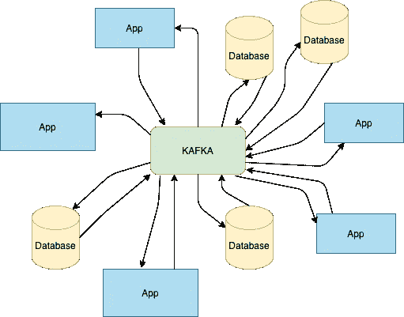
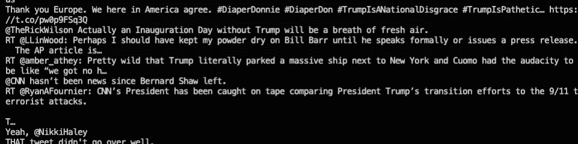
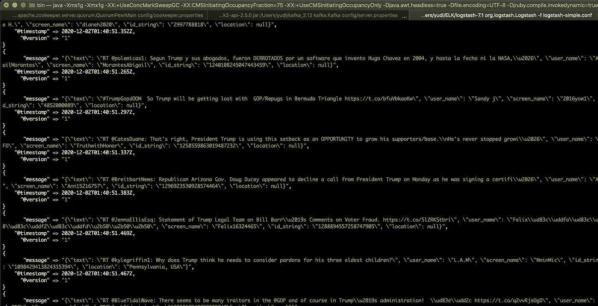
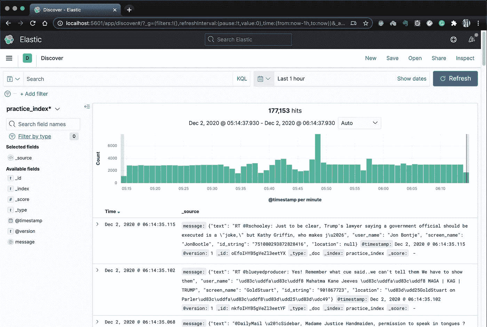

# 通过 Kafka 和 Logstash 实时传输推文

> 原文：<https://medium.com/analytics-vidhya/real-time-tweets-streaming-with-kafka-and-logstash-2a42aec74a5a?source=collection_archive---------5----------------------->

我将首先简要解释这两者，然后展示一个简单的例子，在这个例子中，我使用 Kafka 通过 Logstash 将 tweets 实时传输到 ElasticSearch 中。

# 卡夫卡

我最近开始使用 Apache Kafka，我对它爱不释手，当你想要实时传输事件或拥有一个具有不同组件的应用程序，这些组件相互发送和使用数据时，它是一个非常好的工具。让我详细解释一下这两个问题。

1.  **为什么数据流很重要？** 在当今这个每天都有大量数据流动的时代，你需要技术来存储、读取、分析和 ***流*** 你的数据。数据流涉及对来自多个来源的大量实时数据的处理。一些例子是 IOT 设备发射数据，在移动或网络应用程序中(当你想分析你的应用程序中的用户交互时，每一次点击都是一个事件)，关于金融市场的信息等，你得到的想法。
2.  **一个应用程序如何让不同的组件发出和使用数据？
    听起来很简单，一个来源和一个目的地。但这不会一成不变。一旦你的应用开始增长，不同的需求就会出现，比如数据的存储方式和类型。就像你希望有一个不同的用户活动数据源，一个不同的你在应用程序上实际显示的数据，一个不同的保存你的销售数据等等。这个列表可以逐渐增长。当您有许多源和目标系统时，您需要在这些系统之间有许多连接，这是非常难以管理的。**

阿帕奇卡夫卡解决了这两个问题，在卡夫卡中，你可以有任何你能想到的数据流。它可以是你的应用数据、交易、用户互动等。一旦你的数据在 Kafka 中，你可以在任何你想要的系统中获取它。Kafka 充当跨多个应用程序和服务的通用数据管道，我们将来自不同系统的所有数据驻留在一个位置，使 Kafka 成为真正的数据源。



## 卡夫卡的作品

卡夫卡在出版-订阅模式上工作。这意味着它允许应用程序的某个部分在某个称为*主题*的类别下发布数据，而其他部分可以通过使用主题名称来获取数据。

你的应用程序中发布数据的部分叫做 ***生产者*** ，另一个消费数据的部分叫做 ***消费者*** 。Kafka 为这些任务提供了生产者 API 和消费者 API。

# Logstash

Logstash 是一个轻量级的服务器端数据处理管道，它可以同时从各种来源接收数据，然后解析、过滤、转换数据，最后将其转发给下游系统。这个下游系统通常是 ElasticSearch(这两个和 Kibana 一起被称为 ELK stack)，尽管它并不总是必须是 ElasticSearch。

logstash 有很多可用的输入插件，您可以使用它们从各种来源获取数据，kafka 就是其中之一。

# 动手示例—实时推文流

这个小项目使用 tweepy 包从 twitter 获取数据，然后将数据上传到 Kafka。然后 kafka 充当 Logstash 的输入系统，直接将数据放入 ElasticSearch，最后使用 Kibana 可视化数据。


## **让我们从安装和设置开始:**

1.  **卡夫卡**

前往此链接，[https://kafka.apache.org/downloads](https://kafka.apache.org/downloads)并下载二进制文件。

进入下载的文件夹，然后通过运行以下命令启动 **ZooKeeper 服务器**和 **Kafka 服务器**:

```
*# Start ZooKeeper Server*
bin/zookeeper-server-start.sh config/zookeeper.properties

*# Start Kafka Server*
bin/kafka-server-start.sh config/server.properties
```

接下来，您必须创建一个主题，您的系统将向该主题发布数据。

```
bin/kafka-topics.sh --create --zookeeper localhost:2181 --replication-factor 1 --partitions 1 --topic trump
```

在这里，我创建了一个名为“trump”的主题，因为我们将跟踪包含关键字 trump 的推文。

*你可以这样查看主题列表:*

```
bin/kafka-topics.sh --list --zookeeper localhost:2181
```

**2。ElasticSearch，Logstash，Kibana:**

从这个链接根据你的系统下载文件[https://www.elastic.co/downloads/](https://www.elastic.co/downloads/)

下载完成后，运行`elasticsearchfolder/bin/elasticsearch`(或 Windows 上的`elasticsearchfolder\bin\elasticsearch.bat`)和`kibanafolder/bin/kibana`(或 Windows 上的`kibanafolder\bin\kibana.bat`)分别触发 elasticsearch 和 kibana。

对于 logstash，在运行之前需要一个配置文件。在`logstashfolder/bin/`中，你必须用*创建一个文件。conf* 扩展名(例如 yourconfig.conf)并在其中粘贴以下代码。

```
input {
    kafka {
        topics => "trump" #your kafka should have this topic at this point.
    }
}output {
    elasticsearch { hosts => ["localhost:9200"] index =>    "practice_index"}
    stdout { codec => "rubydebug" }
}
```

*(记住这个 index 的值，在这种情况下是 practice_index，您以后会用到它)*

运行`bin/logstash -f yourconfig.conf.`

设置已经完成，此时您已经在 Kafka 中准备好了一个主题，并运行了 ELK。你所需要的只是一个 python 脚本，它获取 tweets 并把它们放到 kafka 中。

## python 脚本

为了让这个脚本工作，您需要一些来自 twitter 的密钥和一个不记名令牌，这样您就能够通过他们的 API 获取数据。前往[https://developer.twitter.com/en/](https://developer.twitter.com/en/)生成这些。

要运行下面的脚本，您必须安装一些软件包。运行以下命令:

```
pip install python-dotenv tweety kafka-python
```

接下来，你将需要一只 ***。env*** 文件，其中包含您的 twitter 访问令牌和其他密钥。该文件应该与该文件位于同一个文件夹中，其内容应该如下所示:

```
TWITTER_API_KEY = your_twitter_api_keyTWITTER_API_SECRET = your_twitter_api_secretTWITTER_BEARER_TOKEN = your_twitter_bearer_tokenTWITTER_ACCESS_TOKEN = your_twitter_access_tokenTWITTER_TOKEN_SECRET = your_twitter_token_secret
```

现在来看实际的脚本，代码简单易懂，我把脚本分成了几个部分。 ***第 1 节*** 讲述从哪里挑选。env file 和 ***Section 2*** 从您的. env .***Section 3***执行您的身份验证，而 ***Section 4*** 包含一个简单的类，该类继承了由 *tweepy* 包提供的 StreamListener 类(要了解更多信息，请阅读流文档[这里](http://docs.tweepy.org/en/latest/streaming_how_to.html))。最后 ***第 5 节*** 把所有东西放在一起:初始化一个卡夫卡制作人，初始化一个我们创建的类的对象，初始化一个流对象，最后启动跟踪关键字“trump”的流。

```
import os
from dotenv import load_dotenv
from pathlib import Path
import tweepy as tw
import json
import kafka# Section 1
env_path = Path(“.”) / “.env”
load_dotenv(dotenv_path=env_path)# Section 2
consumer_key = os.getenv(“TWITTER_API_KEY”)
consumer_secret = os.getenv(“TWITTER_API_SECRET”)
access_token = os.getenv(“TWITTER_ACCESS_TOKEN”)
access_token_secret = os.getenv(“TWITTER_TOKEN_SECRET”)# Section 3
auth = tw.OAuthHandler(consumer_key, consumer_secret)
auth.set_access_token(access_token, access_token_secret)
api = tw.API(auth, wait_on_rate_limit=True)# Section 4
class MyStreamListener(tw.StreamListener):
  def on_status(self, data):
    tweet_dict = {
      “text”: data.text,
      “user_name”: data.user.name,
      “screen_name”: data.user.screen_name,
      “id_string”: data.user.id_str,
      “location”: data.user.location,
    } print(data.text)
    #THE FOLLOWING LINE SENDS DATA IN KAFKA (Under topic "trump").
    producer.send(“trump”, json.dumps(tweet_dict).encode(“utf-8”))
    return True
  def on_error(self, status_code):
    if status_code == 420:
    return False# Section 5
producer = kafka.KafkaProducer(bootstrap_servers=”localhost:9092")
myStreamListener = MyStreamListener()
myStream = tw.Stream(auth=api.auth, listener=myStreamListener)
myStream.filter(track=[“trump”], is_async=True)
```

一旦您运行了脚本，您应该开始在打印 tweepy 消息的终端中看到一些日志，这意味着脚本已经成功执行，并且您能够使用 tweepy 传输数据。



它成功运行的事实意味着数据确实进入了 kafka，要检查这一点，您应该查看运行 logstash 的终端。它还应该显示连续的日志，显示 logstash 正在获取输入，并成功地将其发送到 elasticsearch。



现在是时候在 Kibana 中可视化这个了，前往 localhost:5601，你应该会看到一个漂亮的 Kibana 仪表板。您必须在索引管理下创建一个索引模式，这是您需要在 logstash 配置文件中给出的索引的地方。一旦创建好了，转到 kibana 下的 discover 部分，你应该会看到关于你的数据的统计，比如有多少点击和什么时候。这是我离开一段时间后的样子。



它显示，一小时内有 177153 条关于特朗普的推文。

如果你觉得这篇文章很有见地，请点击“鼓掌”按钮，如果有任何疑问/意见，请随时发表评论。我很想和你聊聊。:)