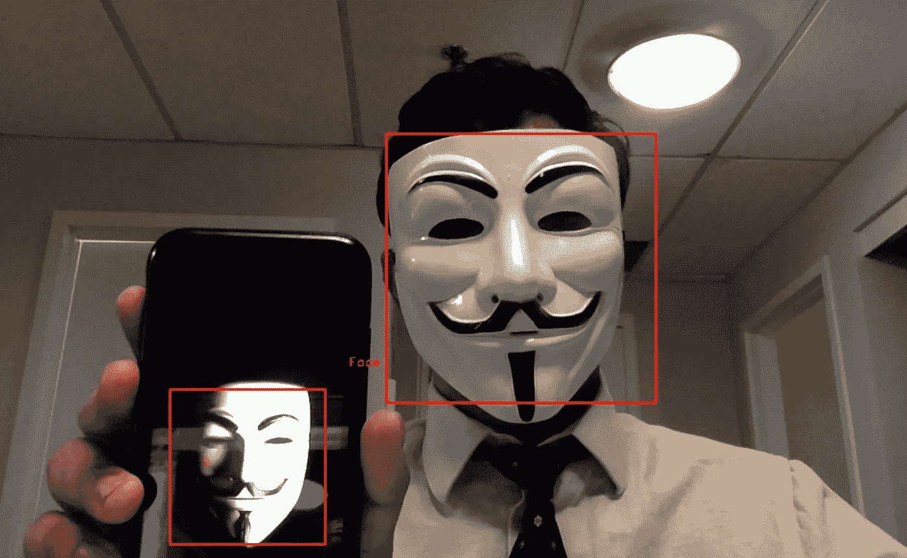

# 在 Python-Windows 和 macOS 中使用 OpenCV 的实时网络摄像头人脸检测系统

> 原文：<https://medium.com/analytics-vidhya/real-time-webcam-face-detection-system-using-opencv-in-python-windows-and-macos-86c31fddd2bc?source=collection_archive---------7----------------------->


通过网络摄像头进行人脸检测

人脸检测使用计算机视觉从图像中提取信息来识别人脸。在这个项目中，我们将学习如何使用 python 以简单的步骤创建一个人脸检测系统。该系统的输入将通过计算机的网络摄像头实时进行。

# **要在 pip (Windows + macOS)中安装的库**

1.  **OpenCV(开源计算机视觉)库:**它的建立是为了帮助开发者执行与计算机视觉相关的任务。

```
pip install opencv-python
```

接下来，我们需要安装人脸识别 API

**2。dlib 库:** dlib 是通过预先训练好的模型建立起来的，用来定位面部标志点。

```
pip install dlib
```


**3。face_recognition 库:** face_recognition 是一个开源项目，也被称为最直白的人脸识别 API。

```
pip install face_recognition
```

# **让我们开始使用 Python**

现在，我们已经安装了所需的库。我们将开始实现如下所示的代码。我解释了每个代码块，以帮助您理解后台发生了什么。

请随意跳到这一页的末尾，获得完整代码的链接。

**步骤 1:** 打开 Spyder

**步骤 2:** 导入库

```
import cv2
import face_recognition
```

**步骤 3:** 参考您系统的网络摄像头

```
video_capture = cv2.VideoCapture(0)
```

**第四步:**初始化需要的变量。这些变量将在稍后的代码中填充

```
face_locations = []
```

**第五步:**我们把我们的视频(实时)分成不同的帧。在每一帧中，我们使用上面导入的 API 来检测人脸的位置。对于检测到的每一张脸，我们定位坐标并在它周围画一个矩形，然后将视频发布给观众。

完整的代码如下所示——代码下面有解释

```
while True:
 # Grab a single frame of video
 ret, frame = video_capture.read()# Convert the image from BGR color (which OpenCV uses) to RGB color (which face_recognition uses)
 rgb_frame = frame[:, :, ::-1]# Find all the faces in the current frame of video
 face_locations = face_recognition.face_locations(rgb_frame)# Display the results
 for top, right, bottom, left in face_locations:
 # Draw a box around the face
 cv2.rectangle(frame, (left, top), (right, bottom), (0, 0, 255), 2)# Display the resulting image
 cv2.imshow(‘Video’, frame)# Hit ‘q’ on the keyboard to quit!
 if cv2.waitKey(1) & 0xFF == ord(‘q’):
 break
```

第一区:

```
# Grab a single frame of video
 ret, frame = video_capture.read()# Convert the image from BGR color (which OpenCV uses) to RGB color (which face_recognition uses)
 rgb_frame = frame[:, :, ::-1]
```

这里，我们一次处理一帧。使用 cv2 库提取帧，cv2 库以 BGR(蓝-绿-红)颜色捕获帧，而面部识别库使用 RGB(红-绿-蓝)格式。因此，我们翻转框架的颜色代码。

**模块 2:**

```
 face_locations = face_recognition.face_locations(rgb_frame)
```

这里，我们定位帧中存在的面部的坐标。列表 *face_locations* 由检测到的面部的 x、y 坐标以及宽度和高度填充。

**第 3 块:**

```
 for top, right, bottom, left in face_locations:
 # Draw a box around the face
 cv2.rectangle(frame, (left, top), (right, bottom), (0, 0, 255), 2)
```

这里，我们在每个捕捉到的人脸周围画一个矩形。该矩形从 x 和 y 坐标(在本例中为左侧和顶部)开始，延伸到检测到的面部的宽度和高度(在本例中为右侧和底部)。代码(0，0，255)代表 B-G-R 序列中的颜色代码。

**第 4 块:**

```
 cv2.imshow(‘Video’, frame) if cv2.waitKey(1) & 0xFF == ord(‘q’):
 break
```

生成的图像(帧)被释放给查看者，循环继续运行，直到用户按下键盘上的 q 键。

**第六步:**必须发布所有拍摄的视频。

```
video_capture.release()
cv2.destroyAllWindows()
```

# **在命令行运行程序**

下一步是[保存](/@venkatesh.chandra_75550/saving-output-of-object-recognition-in-macos-opencv-python-5914bb5d9ca8)文件。py 格式并在命令行/Anaconda 提示符下运行它。

我在 Anaconda 提示符下运行它，首先使用命令 cd 导航到该文件夹。

```
cd <folder path>
```

运行 python 文件

```
python filename.py
```

您将看到一个弹出窗口，您的网络摄像头将打开。试着移动你的脸或者让你的朋友和你一起加入相框。面部检测系统将检测所有的面部。你也可以尝试图片。



瞧！您已经成功构建了一个实时人脸检测系统。

如果你有任何问题，请在评论区告诉我。

# **代码**

[Python/tree/master 中的 https://github.com/chandravenky/Computer-Vision 对象检测](https://github.com/chandravenky/Computer-Vision---Object-Detection-in-Python/tree/master)

# **相关链接**

[**Python 中录制视频的人脸检测— Windows 和 macOS**](/@venkatesh.chandra_75550/face-detection-on-recorded-videos-using-opencv-in-python-windows-and-macos-407635c699)

[**使用 OpenCV 的 Python 中的车辆检测— Windows 和 macOS**](/@venkatesh.chandra_75550/vehicle-car-detection-in-real-time-and-recorded-videos-in-python-windows-and-macos-c5548b243b18)

[**使用 OpenCV 的 Python 中的行人检测— Windows 和 macOS**](/@venkatesh.chandra_75550/person-pedestrian-detection-in-real-time-and-recorded-videos-in-python-windows-and-macos-4c81142f5f59)

[**在 macOS 中保存物体识别的输出**](/@venkatesh.chandra_75550/saving-output-of-object-recognition-in-macos-opencv-python-5914bb5d9ca8)

# 去哪里找我🤓

1.  在[LinkedIn](https://www.linkedin.com/in/venkateshchandra/)/[GitHub](https://github.com/chandravenky)/[我的网站](http://chatraja.com/)上与我联系
2.  感觉大方？在这里给我买一杯[咖啡](https://www.buymeacoffee.com/chandravenky) ☕️