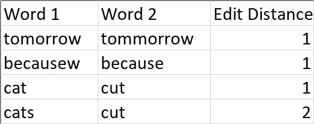
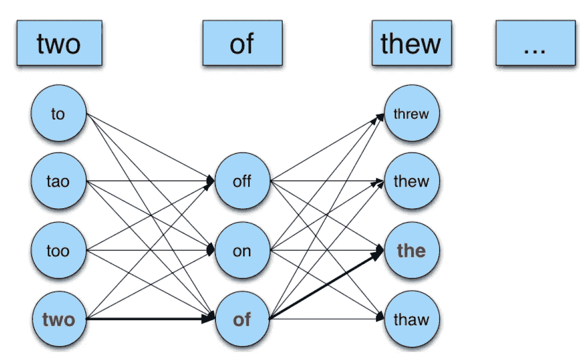

# 真实单词拼写纠正

> 原文：<https://medium.com/analytics-vidhya/real-word-spell-correction-c64a3a02c64d?source=collection_archive---------9----------------------->

> “25-40%的拼写错误是真实的单词”——kuki ch 1992 年

你想知道当我们在谷歌搜索中输入一个错误的查询时，自动更正是如何工作的吗？它怎么能几乎总是估计出我们想要输入的正确短语。自动更正工具依靠拼写检查和数据验证功能，自动识别句子的上下文并为拼写错误的单词提供建议。我们一直在为各种目的使用自动更正工具，如:聊天、电子邮件、word、处理器和搜索引擎。

在这里，我讨论各种方法来纠正单个单词的错误和基于上下文的句子中的错误。在单词级别，只有当拼写错误的单词在我们的字典中不存在时，才能识别出错误。但是在句子层面，即使词典中包含句子的所有单词，也有可能识别错误。一个例子:“*我有一个申请”。*在这里，尽管所有单词都出现在字典中，但是可以从上下文中识别出单词 apply 不合适，应该替换为 apple。这种错误在 NLP 中被称为真实单词拼写错误。

根据所犯的错误，拼写错误可以是以下几种:插入错误(插入额外的字符)、删除错误(删除一个字符)、替换错误(一个字符与另一个字符互换)。我从单词级拼写纠正开始，然后继续到句子级拼写纠正和真实单词拼写纠正。这里的**码可用******。****

# **寻找两个单词之间的距离**

**为了从字典中找出与拼写错误的单词最近的单词，有必要建立一个度量标准来测量两个单词之间的距离。**

## **编辑距离**

**编辑距离是需要对一个单词进行编辑以获得另一个单词的最小次数。编辑可以包括以下任何操作—插入、删除和替换。一些例子:**

****

**这里，我认为所有操作的编辑距离都是 1。**

## **查找编辑距离**

**递归解决方案是从两个字符串的末尾开始比较字符。如果它们相同，我们对剩余的字符串进行循环，而不增加总距离。如果不是，我们考虑所有的操作——删除、插入和替换，对剩余的字符串进行循环，并返回其中的最小值。最坏情况时间复杂度— O(3^m).**

**这种方法可以用动态编程来改进，其中子问题不再重复。维护大小为 m*n 的矩阵，其中 m =第一个字符串的长度，n =第二个字符串的长度。时间复杂度=O(m*n)。**

## **加权编辑距离**

**我们对不同的错误采用不同的权重，而不是对删除、插入和替换操作采用相同的权重。比如用*的*代替*‘a’*时的误差权重和用*‘u’代替时的误差权重是不同的。这样做很重要，因为错误是由不同的来源引起的——键盘上按键的位置、单词的发音以及拼写不同的相似单词。***

****

**sub(x，y)-y 作为 x 键入的次数**

# **建造一个拼写校正器**

**在这里，我从古腾堡项目中摘录了一些连接在一起的公共领域的书籍以形成一个语料库。这个灵感来自[诺威格的作品](https://norvig.com/spell-correct.html)。**

## **噪声信道**

****

**给定一个输入拼错的单词 x，我们可以如下找到正确的单词:**

****

**这里的 *V* 是词汇。这可以简化如下:**

****

## **构建候选人**

**拼写错误的单词 *x* 用于查找词汇 *V 中存在的单词的编辑距离。*编辑距离小于或等于 2 的所有单词都被视为候选单词。这里假设编辑距离越小的单词出现的概率越大。**

# **句子校正器**

**句子中的错误有两种类型:拼写错误和实词错误。在拼写错误的情况下，候选词由词汇表中与拼写错误的单词相距编辑距离 1 的所有单词组成。在真实单词错误的情况下，候选单词由单词本身和编辑距离为 1 的单词组成。首先，考虑句子中所有单词的所有可能候选词。之后，假设每个句子只有一个错误，这简化了搜索。选择二元语法语言模型来估计句子的概率。**

## **来自所有单词的候选词:**

**考虑距离单词 1 个编辑距离的所有可能的候选组合。绘画作品:**

****

## **简化方法:每句话只有一个错误**

**这里，为了简化方法，假设每个句子只有一个错误。因此，形成的候选人要少得多。**

# **参考**

**h[ttps://www . YouTube . com/watch？v = 9xC _ ny7b 91e](https://www.youtube.com/watch?v=9xC_ny7B91E)
[https://towardsdatascience . com/language-models-spell checking-and-auto correction-dd10f 739443 c](https://towardsdatascience.com/language-models-spellchecking-and-autocorrection-dd10f739443c)
[https://web.stanford.edu/class/cs124/lec/spelling.pdf](https://web.stanford.edu/class/cs124/lec/spelling.pdf)
[https://www.gutenberg.org/ebooks/1342](https://www.gutenberg.org/ebooks/1342)
[https://web.stanford.edu/~jurafsky/slp3/B.pdf](https://web.stanford.edu/~jurafsky/slp3/B.pdf)
[http://www.norvig.com/spell-correct.html](http://www.norvig.com/spell-correct.html)**

**[https://sites.google.com/a/iitgn.ac.in/nlp-autmn-2019/](https://sites.google.com/a/iitgn.ac.in/nlp-autmn-2019/)**

 **[## 1990 年第 2 卷:提交给第 13 届国际计算机会议的论文

### COLNG 1990 第 2 卷:提交给第 13 届计算语言学国际会议的论文

www.aclweb.org](https://www.aclweb.org/anthology/volumes/C90-2/)**