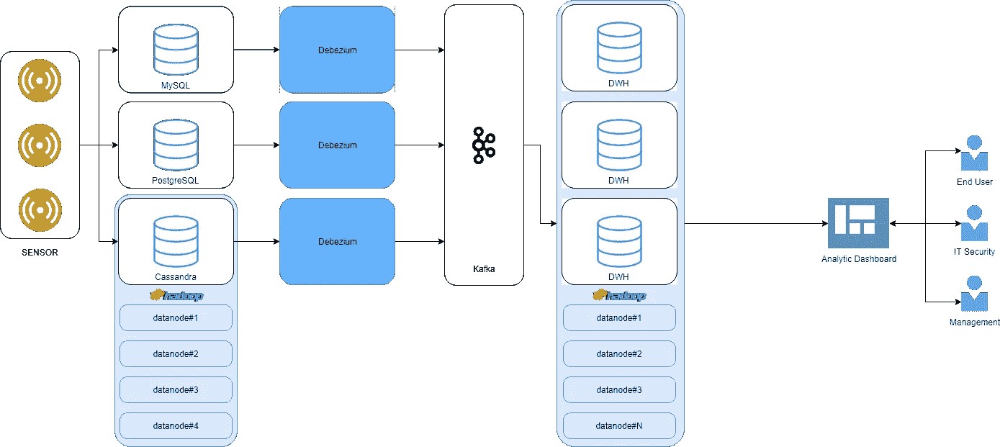

# 事件响应中的实时大数据分析:流和自动化数据仓库的实践回顾

> 原文：<https://medium.com/analytics-vidhya/realtime-big-data-analytic-in-incident-response-practical-review-of-streaming-and-an-automated-2f4b7a045b65?source=collection_archive---------14----------------------->

过去两年来，我一直致力于为事件响应选择正确的大数据技术。讨论事件响应中的实时分析的一个重要原因是实时检测和保护网络安全威胁的必要性。当几个实时数据遥测、日志和时间序列从传感器、网络和安全设备或 SIEM 整合到分析仪表板中时，实时检测最终会成为实质性问题。

如今，许多组织严重依赖安全事故事件管理(SIEM)来监控事故和威胁。尽管大多数 SIEM 堆栈已经通过插座、连接器和过滤器实现了现代化，但它仍然缺乏对历史和实时流数据的维护。此外，当数据规模呈指数级增长时，可伸缩性、弹性和数据生命周期管理成为一个至关重要的问题。

本文通过数据仓库来监督组织选择有价值的技术、工具和架构，开始考虑当前的事件响应架构，以便他们有机会进行改进，使网络安全威胁检测更加充分。重要的是，本文只关注实时分析架构是什么样子的，这并不能满足我在研究过程中的需求。本文不讨论事件响应框架的宽泛主题，而是从大数据和数据仓库的实用角度进行讨论。它还以“开箱即用”的方式满足需求，因为从我的经验来看，许多供应商和技术供应商都非常关注大数据和数据仓库架构本身。他们用订阅、特性改变请求来说服用户，这后来结束了；“供应商锁定。"

最后，我写这篇文章的原因是受 Chris Riccomini 的启发，他在 InfoQ[[https://www . InfoQ . com/presentations/data-engineering-pipelines-warehouses/](https://www.infoq.com/presentations/data-engineering-pipelines-warehouses/)]上谈到了“当前数据管道和数据仓库的最新发展”

# **概述**

从概念上讲，事件响应来自 IT 组织管理和解决与 IT 相关的安全事件的方法，以快速处理情况，从而限制后果并减少恢复时间和成本。

另一方面，大数据，这是我写作的主要重点；是指以非常显著的速度增长的大量多样的信息，尤其是在互联网、物联网和社交媒体的启示下。此外，大数据承载着大量数据，其创建和收集的速度和快速增长，以及检索和消费的各种来源/格式。因此，数据仓库指的是从许多不同来源检索数据以用于报告、分析、决策和事件响应的系统。

# **要求**

当涉及到实际考虑时，将架构分解成阶段有助于使架构更加合理。首先，它从与 it 相关的事件响应的传统方法开始，其次是大数据仓库；最后，大数据仓库与自动化批处理、数据流和数据仓库管理相结合。这种结合已经成为大数据仓库的核心基础。从这一点出发，我们可以开始选择合适的架构来有目的地构建我们的数据仓库。

# **第一阶段(失败！)**

首先，让我解释一下为什么集中式架构无法支持当今的 IT 需求。虽然这是一个简单易行的部署，但不断增加的用户、服务和实时分析需求。遥测数据由传感器直接存储到关系数据库(RDBMS)或列数据库中。两个数据库都可以使用遗留的 SQL 语言从前端应用程序加载数据和执行查询。在遗留生态系统中，为 ETL 和数据可视化提供数据已经成为事实上的标准。然而，这一阶段通常已经过时，因为它不能支持数据大小和用户的增量增长。同时，并发用户执行 SQL 查询、访问仪表盘等问题导致系统性能不足。除此之外，如图 1 所示，当更频繁地从传感器提取数据时，威胁检测的实时响应会变得更慢；

图 1:集中式整体架构

# **二期**

在这个阶段，在两个数据库上添加更多的数据复制节点不会随着数据大小而延长，并且用户是占优势的。尽管解决方案是部署 Redis 来提高 SQL 查询和 ETL 性能，然后部署 Debezium[[https://debezium.io/](https://debezium.io/)]，这是一个用于变更数据捕获的分布式平台，并扩展为一个分散的解决方案，但性能提高并没有预期的多。尽管如此，随着节点数量开始增长，我们仍然要处理数据延迟、数据流水线问题和复杂的工作流程。

图 2:分布式分析的架构

# **第三阶段**

在这个阶段，我开始将批量、实时自动化添加到架构中。这种方法将解决数据延迟、管道和复杂的工作流程。尽管如此，当谈到这些不断增长的数据规模、用户数量、服务和应用程序时，一些挑战正在显现。这些是你会看到的问题；

*   **实时响应威胁检测**
*   **数据延迟**
*   **数据管道问题**
*   **复杂的工作流程**
*   **数据调试问题**
*   **数据健康**
*   **符合性**

随着越来越多的应用程序、服务变得分布式，复杂性现在变得普遍，如图 3 所示。

图 3 —来源:[https://cdn . confluent . io/WP-content/uploads/ETL _ mess-768 x559 . png](https://cdn.confluent.io/wp-content/uploads/etl_mess-768x559.png)

# **解决方案**

将各种工具和解决方案集成到架构中会使架构变得非常复杂，尤其是在数据治理、法规遵从性和监管方面。分解架构的动机是将复杂的事情分开，这样我们就可以部署各种工具和解决方案，从简单的到复杂的。他们在这里；

*   **阿帕奇卡夫卡异步消息**
*   **Apache AirFlow 用于管理复杂的工作流程**
*   **数据分析**
*   **lyft—Amundsen 的数据目录**
*   **基于角色的访问控制**
*   **自动化数据管理**
*   **用于管理 Hadoop 基础设施的 cloud era CM**
*   **用于数据管道、数据屏蔽和管理的流集**

# **工具**

在这里，一些工具可以由 Cloudera CM 管理，然后在集群内部署一个独立的 DWH 流程编排和 ELT 解决方案；

*   **阿帕奇卡夫卡**
*   **阿帕奇气流**
*   **阿帕奇 Hadoop**
*   **阿帕奇蜂巢**
*   **阿帕奇卡珊德拉**
*   **阿帕奇哨兵**
*   **阿帕奇箭头**
*   **阿帕奇游侠**
*   **用于数据仓库编排的平台**
*   德雷米奥
*   **MySQL**
*   **MongoDB**

最后，这是分布式实时分析的架构，如图 4 所示。该架构由四层组成，其中每个组件都是解耦的，并作为与每层相关的独立模块工作。

图 4:分散实时架构

# 体系结构

1.  消息传递服务层:该服务功能负责数据接收点。传感器、网络安全设备、Siem、IoT 或 app 的结构化、非结构化、时序数据，通过 Kafka 将其数据推送到 Hadoop、RDBMS、TSDB；作为话题。这一层通常将原始信息保存在数据库中，而其他层则是流式的。
2.  ELT 层:这一层负责数据提取、加载和转换。发生在消息服务层的是 ELT 而不是 ETL。这一层负责数据生命周期管理、批处理、流管道、数据屏蔽和监控运行时流程性能。
3.  数据仓库层:这是我设计大数据中的分散数据仓库的地方。它是 Hadoop 生态系统中传统 DWH 和分布式存储的混合体。在 Hadoop 中利用分散式架构使架构更加可靠，在自动化和可扩展性方面更具弹性。
4.  分析层:它负责衡量我们在数据仓库中收集的信息的重要性和价值。

# **结论**

大数据和数据仓库已经成为实时分布式大数据分析的主要推动者，特别是在事件响应方面。虽然提议的架构可能在其他生态系统中不起作用，但它可能更有利于我的事件响应分析工具包的下一个实验。希望这个思想值得分享给大家。

# **参考文献**

[1] N. Srivastava 和 U. Chandra Jaiswal，“网络安全中的大数据分析技术:综述”，2019 年第三届计算方法与通信国际会议(ICCMC)，印度，2019 年，第 579-585 页。doi:10.1109/iccm . 2019.8819634 网址:【http://ieeexplore.ieee.org/stamp/stamp.jsp?tp=】T4&ar number = 8819634&is number = 8819605

[2] X. Jin，Q. Wang，X. Li，X. Chen，W. Wang，“基于可信计算的云虚拟机生命周期安全框架”，载于清华科技，第 24 卷第 5 期，第 520–534 页，2019 年 10 月。doi: 10.26599/TST.2018.9010129，网址:[http://ieeexplore.ieee.org/stamp/stamp.jsp?tp=&ar number = 8698209&is number = 8698205](http://ieeexplore.ieee.org/stamp/stamp.jsp?tp=&arnumber=8698209&isnumber=8698205)

[https://github.com/lyft/amundsen](https://github.com/lyft/amundsen)

[4][https://eng . lyft . com/amundsen-lyfts-data-discovery-metadata-engine-62d 27254 fbb 9](https://eng.lyft.com/amundsen-lyfts-data-discovery-metadata-engine-62d27254fbb9)

[5][https://wecode . wepay . com/posts/we pays-data-warehouse-big query-air flow](https://wecode.wepay.com/posts/wepays-data-warehouse-bigquery-airflow)

[6]https://Presto SQL . io/Presto _ SQL _ on _ everything . pdf

[7]https://debezium.io/

[8]https://Martin fowler . com/articles/data-monolith-to-mesh . html

[9]https://www . infoq . com/presentations/data-engineering-pipelines-warehouses/