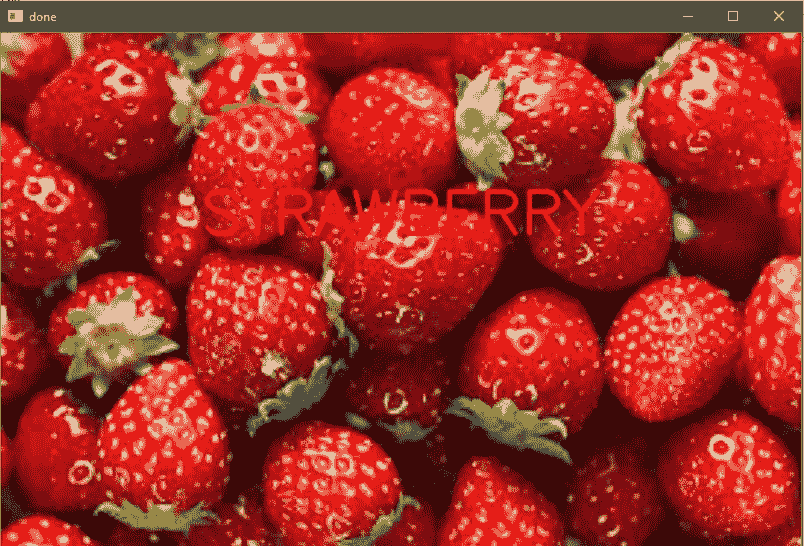
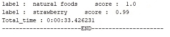
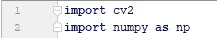
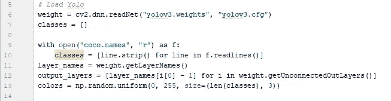
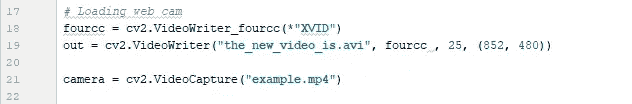
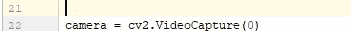
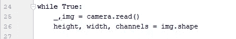
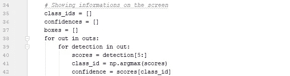

# 基于 YOLO 和 OpenCV 的实时目标检测

> 原文：<https://medium.com/analytics-vidhya/realtime-object-detection-using-yolo-and-opencv-8380e5537f2a?source=collection_archive---------4----------------------->

这篇文章是关于什么是物体检测以及如何使用 OpenCV 和 YOLO 进行实时物体检测的快速教程

# 物体检测是什么意思？

对象检测意味着检测一个图像或一组图像内的对象实例。它是一种与计算机视觉和图像处理相关的计算机技术，用于检测数字图像和视频中某类语义对象(如人、建筑物、汽车、球、笔等)的实例。充分研究的对象检测领域包括面部检测。

# 物体检测在哪里有用？

目标检测有许多应用领域，如人脸识别、图像检索、视频监控和行人检测。最好的例子是在足球比赛中跟踪一个球。

# 目标检测的概念

每个对象类别都有自己的特殊特征，这些特征有助于对图像的类别进行分类，无论是对象的形状还是其纹理。例如，一个篮球和一个足球的区别在于它的颜色、质地和其他类似的特征。类似的方法用于对象检测，其中考虑了像对象的形状、颜色等特征。

# 物体检测与物体识别

对象检测和对象识别是用于识别对象的类似技术，但是它们在执行上有所不同。[物体检测](https://www.mathworks.com/discovery/object-detection.html)是在图像中寻找物体实例的过程。在深度学习的情况下，对象检测是对象识别的子集，其中对象不仅被识别，而且在图像中被定位。这允许在同一图像中识别和定位多个对象。

物体识别

在这里，程序能够高精度地识别出给定的输入是水果草莓。

准确率 99%

# 什么是 OpenCV

OpenCV ( *开源计算机视觉*)是一个面向实时计算机视觉的编程函数库，最初由英特尔开发。

它是一个跨平台的库，可以免费使用。它支持深度学习框架，如 Yolo、Tensorflow、Py-Torch 等。

OpenCV 是用 C++编写的，它的主要接口是 C++。

OpenCV 运行在 Windows、Linux、macOS、FreeBSD、NetBSD、OpenBSD 等操作系统以及 Android、IOS、Maemo 和 Blackberry 10 等移动操作系统上。

Yolo 预装在 OpenCV 中

# 如何在 OpenCV 中使用 YOLO

我们开始吧，

在本教程中，我们将重点介绍如何在 Opencv 中使用 YOLO。对于初学者来说，这是最好的方法，不需要复杂的安装就能让算法快速工作。

1.  首先，我们导入库 OpenCV 和 numpy。

导入库

2.我们加载算法。运行这个算法我们需要三个文件:

*   **权重文件:**它是经过训练的模型，是检测物体的算法的核心。
*   **Cfg 文件**:配置文件，里面有算法的所有设置。
*   **名称文件:**包含算法可以检测到的对象的名称。

使用预先训练的模型

然后，我们加载网络摄像头或预先存在的视频，我们希望在其中执行对象检测，我们还可以获得它的宽度和高度。

加载现有视频或网络摄像头

要加载网络摄像机，只需输入 0

阅读高度和宽度

3.现在我们已经准备好算法和图像，是时候将图像传入网络并进行检测了。请记住，我们不能马上在网络上使用完整的图像，但首先，我们需要将它转换成一个斑点。它用于从图像中提取特征并调整它们的大小。YOLO 接受三种尺寸:

*   320×320 它很小，所以精度较低，但速度更快
*   609×609 比较大所以精度高速度慢
*   416×416 在中间，两者都有一点。

Out 是一个数组，包含所有关于检测到的对象的信息，它们的位置和关于检测的置信度。

检测区

4.至此，检测完成，我们只需要在屏幕上显示结果。然后，我们遍历 outs 数组，计算置信度并选择一个置信度阈值。阈值从 0 到 1。越接近 1，检测的准确度越高，而越接近 0，准确度越低，但是检测到的对象的数量也越多。

5.此时检测已经完成，我们只需要在屏幕上显示结果。
然后，我们遍历 outs 数组，计算置信度并选择一个置信度阈值。阈值从 0 到 1。越接近 1，检测的准确度越高，而越接近 0，准确度越低，但是检测到的对象的数量也越多。

6.当我们执行检测时，碰巧我们有更多的盒子用于相同的对象，所以我们应该使用另一个函数来消除这个“噪声”。
叫做**非最大抑制**。

7.我们最终提取所有的信息并显示在屏幕上。

*   **框**:包含检测对象周围矩形的坐标。
*   **标签**:被检测对象的名称
*   **置信度**:关于检测从 0 到 1 的置信度。

**参考代码**

参考代码和其他文件可以在这个 Git 目录中找到

 [## shantamsultania/object _ detection _ using _ yolo _ in _ video _ and _ web cam

### 这是检测视频中的对象或使用 OpenCV，Yolo 和 python 的网络摄像头

github.com](https://github.com/shantamsultania/object_detection_using_yolo_in_video_and_webcam) 

由...所写

 [## Shantam Sultania -昌迪加尔大学-昌迪加尔，昌迪加尔，印度| LinkedIn

### 查看 Shantam Sultania 在世界上最大的职业社区 LinkedIn 上的个人资料。山塔姆的教育是上市…

www.linkedin.com](https://www.linkedin.com/in/shantam-sultania-737084175/)