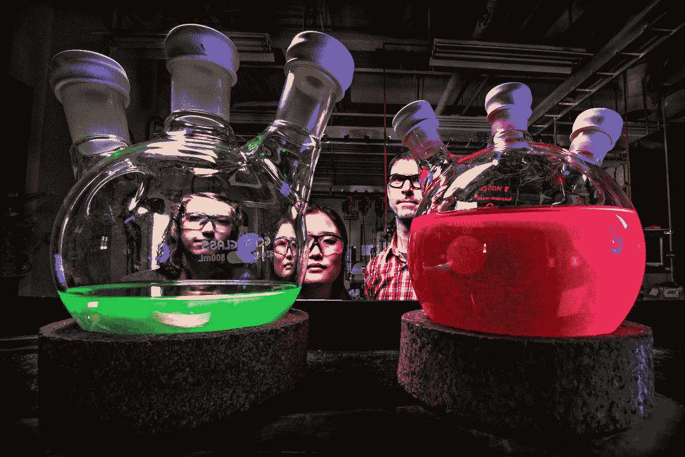

# 概述假设检验:样本量的确定

> 原文：<https://medium.com/analytics-vidhya/recap-on-hypothesis-testing-sample-size-determination-c931130724fb?source=collection_archive---------17----------------------->

在 [Unsplash](https://unsplash.com?utm_source=medium&utm_medium=referral) 上[科学高清](https://unsplash.com/@scienceinhd?utm_source=medium&utm_medium=referral)拍摄的照片

重申我这个周末回顾的关于假设检验的内容，并概括上一篇文章中的例子。

**假设检验**是一种统计方法，用于检验假设并为我们的答案提供信心。我们想知道总体中的一个测量值，但是由于从总体中得到一个答案太费时间，而且几乎不可能(想象一下测量每辆车从洛杉矶国际机场 1 英里外到达终点 B 所需的时间)，我们找到了一个替代方法。我们挑选出一些汽车，测量它们的行驶时间，并使用该样本平均值来估计总人数(行驶到洛杉矶国际机场 B 航站楼 1 英里以外的所有汽车)的平均值。假设洛杉矶国际机场做了一些抽样调查，他们声称从 1 英里外到达 B 航站楼需要 20 分钟。本质上，这里假设从 1 英里外到终端 B 的真实平均行程时间是 20 分钟。我们想验证这是否属实，我们认为实际上可能更高。所以在这种情况下，第一步是建立假设:

H0: μ = 20 分钟

H1: μ > 20 分钟

μ:从 1 英里外到达洛杉矶国际机场 B 航站楼的平均时间

然后我们想去洛杉矶国际机场收集一些样本。也许我们让我们的朋友在不同的时间开车，记录他们的旅行时间。但在此之前，我们想知道有多少样本足以检测到这种差异，并且这种差异会非常大，这样我们就可以做出具有统计学意义的结论。

样本量的确定取决于几个因素:

*   显著性水平(α)
*   力量
*   最小可检测效应
*   采样离散

**显著性水平(α)** 是当原假设为真时拒绝原假设的概率。这也称为 I 类错误。我们通常希望保持这个误差较小，因此通常将其设置为 0.05 或以下。直觉上，显著性水平越高，我们越能容忍测试出错，因此我们需要的样本就越少。

**功效**是当原假设不成立时，拒绝原假设的概率。也等于 1-ⅱ型误差，是不为真时不拒绝零假设的概率。所以功率越高，测试越好。但是，我们应该记住，在重要性级别和功效之间存在一种权衡。显著性水平越高(I 型误差越高)，II 型误差越低，因此功效越高。实际上，我们希望尽可能地减少这两个误差，但是由于减少一个会增加另一个，我们需要找到一个平衡点。通常，我们将功率设置为 0.8，因此允许 0.2 的类型 II 误差。请注意，这比通常的 I 类误差值(0.05 或更低)要大。有说法说 I 型错误更差，但实际上要看具体测试。在上面的例子中，犯 I 型错误意味着真实的平均旅行时间是 20 分钟，但是我们拒绝了它。然后有人可能会利用这一点起诉洛杉矶国际机场提出虚假索赔，导致漫长的审判，也许洛杉矶国际机场不得不花费另一大笔投资来改善旅行时间，而真正的旅行时间已经是 20 分钟。犯第二类错误意味着真实的平均旅行时间大于 20 分钟，但我们不拒绝零。洛杉矶国际机场停止投资改善旅行时间，旅客在机场不断抱怨和抗议，导致交通状况恶化。哪个更糟？在不同人的角度会有所不同。无论如何，如果我们想要更高的功效，测试需要能够更容易地检测空值和替代值之间的差异，样本量越大意味着方差越小，因此置信区间也就越小，这样就更容易发现差异。因此，期望的功率越高，需要的样本量就越大。

**最小可检测效应** (mde)是我们想要测试的空值和替代值之间的最小差异。替代值应该有多大，因此我们可以说旅行时间远远高于 20 分钟。是 30 分钟吗？40 分钟？60 分钟？这要看上下文。也许在这种情况下，我们可以比较非事故引起的交通堵塞期间 1 英里的平均行驶时间，并以此作为基准。mde 越大，越容易发现差异，因此需要的样本就越少。

**样本方差**指样本观测值的方差。但是你可能会说，我们不是还在确定要取多少样本吗，我们甚至还没有观察样本，我们怎么知道样本方差呢？这是非常正确的，所以我们将估计样本方差，并采取最坏的情况，以确保我们得到足够大的样本。如果没有办法估计，那么我们考虑我们希望样本均值有多“多样”。通常我们希望保持较小的规模，比如 2%。方差越大，越难发现差异，因此需要更多的样本量。