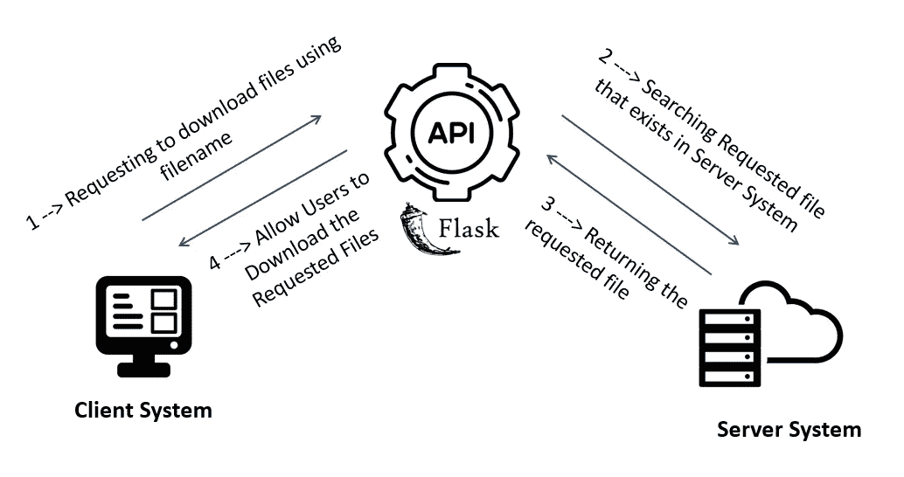
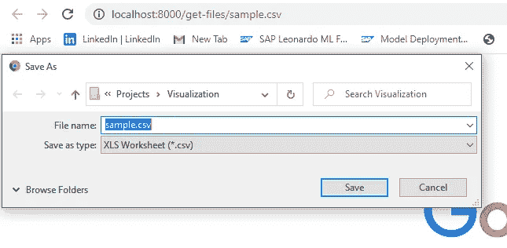
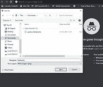
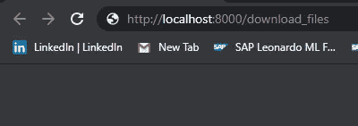
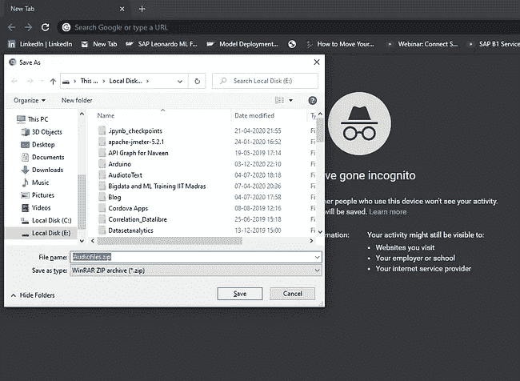

# 接收或返回文件-Flask API

> 原文：<https://medium.com/analytics-vidhya/receive-or-return-files-flask-api-8389d42b0684?source=collection_archive---------0----------------------->

## 使用 Flask 提供文件或下载文件作为输出

在这里，我们将看到“如何使用 Python 通过 Flask 返回单个文件和多个文件”

# 为什么是这个教程？？？

有时，您希望允许用户从您的网站或应用程序下载报告或文件，这是任何网站或应用程序经常需要的功能。。。,



解决方法循环下载文件

Flask 为此提供了一些有用的功能

看到有人写关于“初学者用 Flask”教程的博客后。我注意到，他们没有涵盖“发送文件和允许用户下载文件”。所以，我对写“服务文件”产生了兴趣。我确信这个博客会带你去“服务文件”,让你变得简单。。。,

在我之前的博客中，讨论了“**上传文件到服务器**

[](/@ngbala6/get-started-with-multiple-files-upload-using-flask-e8a2f5402e20) [## 开始使用 Flask 上传多个文件

### 烧瓶多个文件上传

medium.com](/@ngbala6/get-started-with-multiple-files-upload-using-flask-e8a2f5402e20) [](/dev-genius/a-simple-way-to-build-flask-file-upload-1ccb9462bc2c) [## 建立 Flask 文件上传的简单方法！！！

### 烧瓶文件上传

medium.com](/dev-genius/a-simple-way-to-build-flask-file-upload-1ccb9462bc2c) 

# 为什么选择烧瓶？？？

尽管人们说 Flask 简单易用，而 Django 对于构建 web 应用程序来说很笨重。

> *Flask 是一个广泛使用的* ***微 web 框架*** *用于在 Python 中创建 API。这是一个简单而强大的 web 框架，旨在快速轻松地开始使用，并能够扩展到复杂的应用程序。*

从[文档](https://flask.palletsprojects.com/en/1.1.x/foreword/)中，

> *“微型”并不意味着你的整个 web 应用程序必须适合一个单独的 Python 文件(尽管它确实可以)，也不意味着 Flask 缺乏功能。微框架中的“微”意味着 Flask 旨在保持核心简单但可扩展。*


# 要求和安装

1.  当然，我们需要 Python 3.5 或以上版本。[但是为什么呢？？见此](https://flask.palletsprojects.com/en/0.12.x/python3/)
2.  安装烧瓶

```
pip install flask
```

# **#使用 Flask 从服务器简单发送文件**

*一个简单的文件使用 Flask API 发送 Python 脚本。。，*

```
# servefile.py**from** flask **import** Flask,send_from_directory

app = Flask(__name__)# Specify directory to download from . . . DOWNLOAD_DIRECTORY = **"<your folder directory>"** @app.route(**'/get-files/<path:path>'**,methods = [**'GET'**,**'POST'**])
**def** get_files(path):

    *"""Download a file."""* **try**:
        **return** send_from_directory(DOWNLOAD_DIRECTORY, path, as_attachment=**True**)
    **except** FileNotFoundError:
        abort(404)

**if** __name__ == **'__main__'**:
    app.run(host=**'0.0.0.0'**, port = **8000**, threaded = **True**, debug = **True**)
```

通过运行“python servefile.py”来运行应用程序。进入浏览器，输入“**http://localhost:8000/get-files/<文件名，扩展名为>** ”。

如果您在 URL 中提到的指定文件存在，您可以下载该文件。否则将出现 404 错误。。,



下载示例文件

# #根据请求返回各种文件

*文件下载是从服务器接收二进制或普通文件的过程。Flask 方便我们轻松下载文件。*

基于路由返回各种文件

> *创建一个名为“variousfiledownloadflask.py”的文件*

***1。导入库*和**

```
**from** flask **import** Flask,send_file,send_from_directory
```

**2。创建实例并指定文件位置和**

```
app = Flask(__name__)

*# The absolute path of the directory containing images for users to download* app.config[**"CLIENT_IMAGES"**] = **"E:/AudiotoText/Flask_File_Downloads/filedownload/files/image"** *# The absolute path of the directory containing CSV files for users to download* app.config[**"CLIENT_CSV"**] = **"E:/AudiotoText/Flask_File_Downloads/filedownload/files/csv"** *# The absolute path of the directory containing PDF files for users to download* app.config[**"CLIENT_PDF"**] = **"E:/AudiotoText/Flask_File_Downloads/filedownload/files/pdf"**
```

***3。应用程序路由***

```
# Get CSV File Routing
@app.route(**'/get-csv/<csv_filename>'**,methods = [**'GET'**,**'POST'**])
**def** get_csv(csv_filename):

    **try**:
        **return** send_from_directory(app.config[**"CLIENT_CSV"**], filename=csv_filename, as_attachment=**True**)
    **except** FileNotFoundError:
        abort(404)

# Get PDF file Routing
@app.route(**'/get-pdf/<pdf_filename>'**,methods = [**'GET'**,**'POST'**])
**def** get_pdf(pdf_filename):

    **try**:
        **return** send_from_directory(app.config[**"CLIENT_PDF"**], filename=pdf_filename, as_attachment=**True**)
    **except** FileNotFoundError:
        abort(404)

# Get Image file Routing
@app.route(**"/get-image/<path:image_name>"**,methods = ['GET','POST'])
**def** get_image(image_name):

    **try**:
        **return** send_from_directory(app.config[**"CLIENT_IMAGES"**], filename=image_name, as_attachment=**True**)
    **except** FileNotFoundError:
        abort(404)

**if** __name__ == **'__main__'**:
    app.run(host=**'0.0.0.0'**,port = 8000, threaded = **True**, debug = **True**)
```

路由可以接受以下变量类型:

*   *字符串:接受任何不带斜杠的文本(默认情况下)。*
*   *int:接受正整数*
*   *float:接受包含小数点的正数值。*
*   *路径:类似于字符串，但接受斜线*
*   *uuid:接受 uuid 字符串*(通用唯一标识符)(例如 118 bc9c 3–1af 4–4d 46–87a 1–266 db 2 e 64 e 7a)

*与静态路由不同，使用可变规则创建的路由接受参数，这些参数就是路由变量本身。*

例如，如果你用`<int:some_integer>`定义了一个 url，Flask 将尝试把它转换成一个整数，`<path:path_to_some_file>`将允许一个类似字符串的路径，包括斜线等..

## 这里是各种文件格式的完整代码

通过运行"*python*variousfiledownloadsflask . py "来运行应用程序。进入浏览器，输入“**http://localhost:8000/get-csv/<文件名>** ”，即可下载指定的 CSV 文件。。。,



使用路由获取各种文件

# #使用 Flask 返回多个文件

*假设，如果我们想发送多个文件给某人，这将有助于你*

您无法将所有文件发送到可下载的文件中。但是如果你把所有的文件都转换成 zip 格式，然后你可以把它作为一个文件(ZIP 文件)发送出去

> *创建一个名为“multiplefiledownloadflask.py”的文件*

1.  ***导入库***

```
**import** zipfile
**import** os
**from** flask **import** send_file,Flask,send_from_directory
```

***2。创建实例和烧瓶路由*和**

```
app = Flask(__name__)

@app.route(**'/download_files'**)
**def** download_all():
    *# Zip file Initialization* zipfolder = zipfile.ZipFile(**'Audiofiles.zip'**,**'w'**, compression = **zipfile.ZIP_STORED**) # Compression type 

    *# zip all the files which are inside in the folder* **for** root,dirs, files **in** os.walk(**'<foldername>'**):
        **for** file **in** files:
            zipfolder.write(**'<foldername>'**+file)
    zipfolder.close()

    **return** send_file(**'Audiofiles.zip'**,
            mimetype = **'zip'**,
            attachment_filename= **'Audiofiles.zip'**,
            as_attachment = **True**)

    *# Delete the zip file if not needed* os.remove(**"Audiofiles.zip"**)

**if** __name__ == **'__main__'**:
    app.run(host = **'0.0.0.0'**, port = 8000 , debug= **False**, threaded = **True**)
```

在这里，我使用的是***ZIP _ STORED***Compression，意思是“只归档而不压缩文件”

一些压缩类型是`**ZIP_STORED, ZIP_DEFLATED , ZIP_BZIP2, ZIP_LZMA**`

`*ZIP_STORED*` *:只是对文件进行归档，而且是无损压缩*

`*ZIP_DEFLATED*` *:这是通常的 ZIP 压缩方式*

`*ZIP_BZIP2*` *:该方法使用 BZIP2 压缩技术*

`*ZIP_LZMA*` *:该方法使用 LZMA 压缩技术*

关于压缩类型的详细信息，[这里是链接](https://docs.python.org/3.5/library/zipfile.html)

> **返回多个文件的完整代码**

通过运行“*python**multiplefiledownloadsflask . py*”来运行应用程序。进入浏览器，输入“**http://localhost:8000/download _ files**，你会得到一个可下载的 Zip 文件。。。,



多文件下载的输出示例

***注意:*** *下载文件时始终使用匿名模式，因为缓存可能会导致下载不正常。。。*

完整的代码被上传到下面的 GitHub 库

[](https://github.com/ngbala6/Flask-Downloadfiles.git) [## ngbala 6/Flask-下载文件

### 在 GitHub 上创建一个帐户，为 ngbala6/Flask-Downloadfiles 的开发做出贡献。

github.com](https://github.com/ngbala6/Flask-Downloadfiles.git) 

对于**烧瓶文件上传**，勾选此项。。,

[](/dev-genius/a-simple-way-to-build-flask-file-upload-1ccb9462bc2c) [## 建立 Flask 文件上传的简单方法！！！

### 烧瓶文件上传

medium.com](/dev-genius/a-simple-way-to-build-flask-file-upload-1ccb9462bc2c) [](/@ngbala6/get-started-with-multiple-files-upload-using-flask-e8a2f5402e20) [## 开始使用 Flask 上传多个文件

### 烧瓶多个文件上传

medium.com](/@ngbala6/get-started-with-multiple-files-upload-using-flask-e8a2f5402e20) 

# 结论

这篇文章是“如何使用 Python 通过 Flask 返回单个文件和多个文件”的总结

*你喜欢这个帖子并对你有帮助。。。*

尽你所能用**鼓掌**来感谢我，并分享


谢谢，

**巴拉穆鲁甘 N G**

# 参考

[用烧瓶发送文件](https://pythonise.com/series/learning-flask/sending-files-with-flask)