# 近期好论文(2020 年 8 月)

> 原文：<https://medium.com/analytics-vidhya/recent-good-papers-august-2020-ef5ea7645c0d?source=collection_archive---------26----------------------->

以下是我在 2020 年 8 月看的 10 篇论文，我觉得特别有意思。

我已经尽量介绍最近的了，但是论文提交日期可能不是 2020 年 8 月。

# 1.黑森惩罚:无监督解开的弱先验

[https://arxiv.org/abs/2008.10599](https://arxiv.org/abs/2008.10599)

在 GAN 的潜在空间中获得非纠缠表象的研究。使用 Hessian 提出了一个正则化项，使得一个方向 I 的变化不会导致另一个方向 j(≠i)的变化。对于经过训练的模型，微调也是可能的。

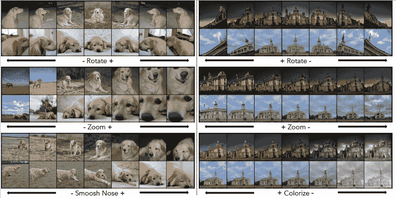

# 2.SRFlow:用归一化流学习超分辨率空间

https://arxiv.org/abs/2006.14200

使用标准化流的高分辨率图像生成。与需要调整多个损失项的 GAN 不同，它仅通过优化对数似然来学习。它还使用可逆转换，这允许与潜在表示一一对应，因此它还可以使用高分辨率潜在变量来执行样式转换。

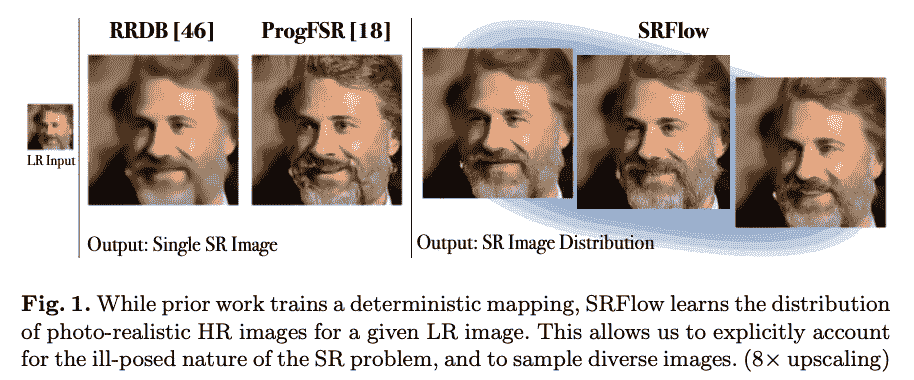

# 3.并非所有未标记数据都是相等的:在半监督学习中学习加权数据

https://arxiv.org/abs/2007.01293

在半监督学习中，通常对未标记数据的权重进行统一处理，但他们提出了一种自动确定个体数据权重的方法，可以将其纳入 FixMatch 等现有的损失系统中，并显著提高准确性。

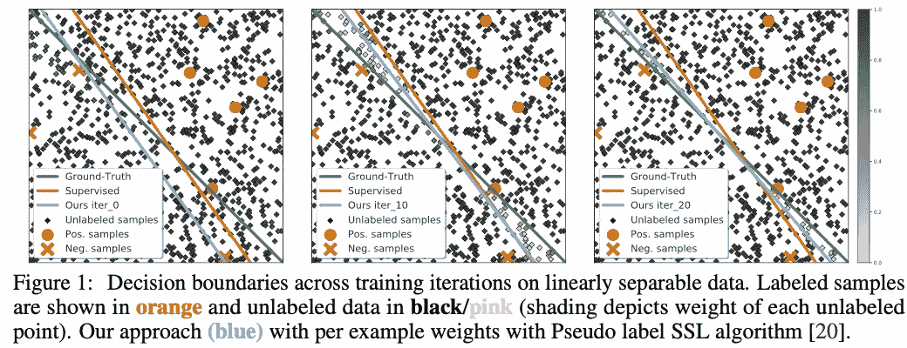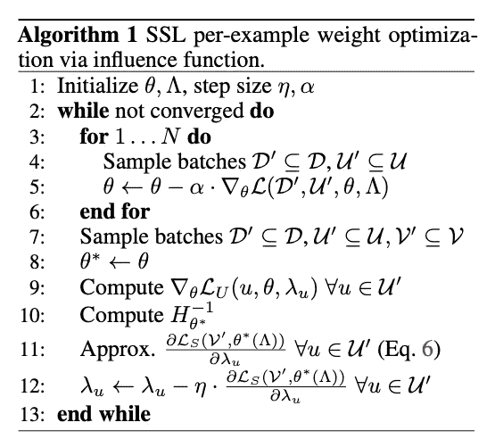

# 4.深度学习的计算极限

【https://arxiv.org/abs/2007.05558 

该论文提出，深度学习通过使用大量的计算能力提高了许多任务的性能，但该论文提出，随着所需的计算能力越来越大，它可能会因硬件的发展而停滞。这表明，财政和环境负担也变得令人望而却步，因此可能有必要进行重大改进。

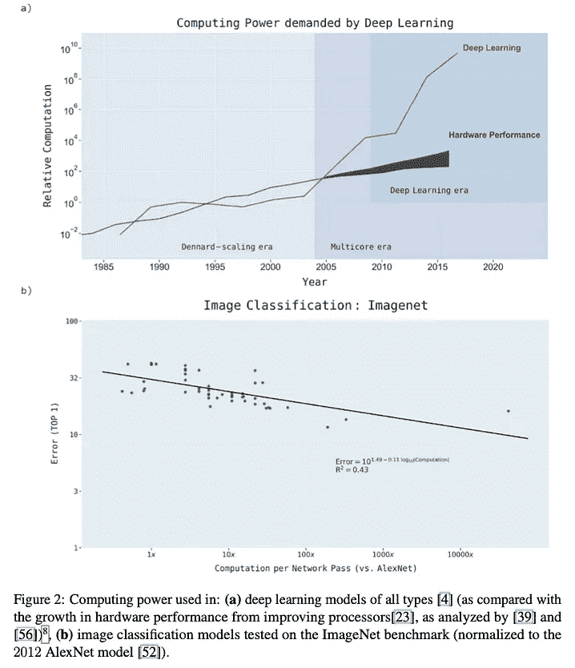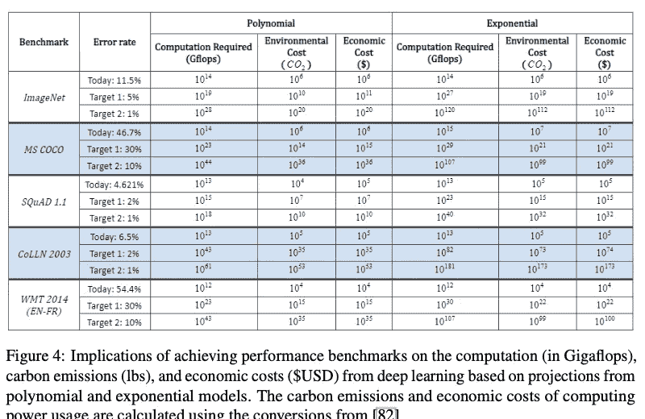

# 5.对抗训练的深网转移得更好

[https://arxiv.org/abs/2007.05869](https://arxiv.org/abs/2007.05869)

与正常训练的模型相比，用敌对噪音训练的模型在迁移学习中表现更好。可视化的结果表明，他们正在以更像人类的方式进行分类，这可能影响了结果。

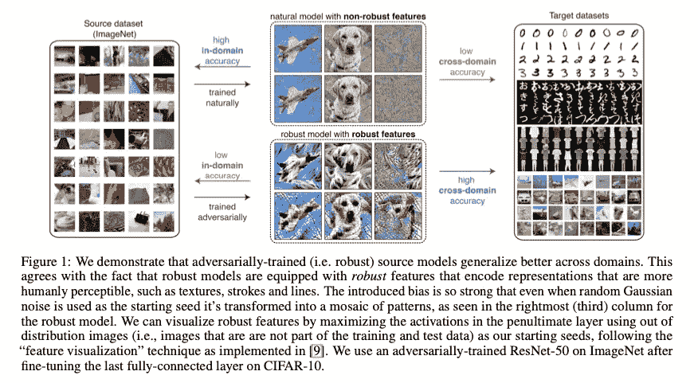

# 6.Vid2Player:可控制的视频精灵，其行为和表现都像职业网球运动员

[https://arxiv.org/abs/2008.04524](https://arxiv.org/abs/2008.04524)

逼真合成网球比赛的研究。基于网球的领域知识，他们将球员的动作分为“追上击球”和“占据下一个位置”两部分。他们从中选择最接近的帧进行合成。没有阴影，所以可以确定是合成的，但动作本身相当自然。

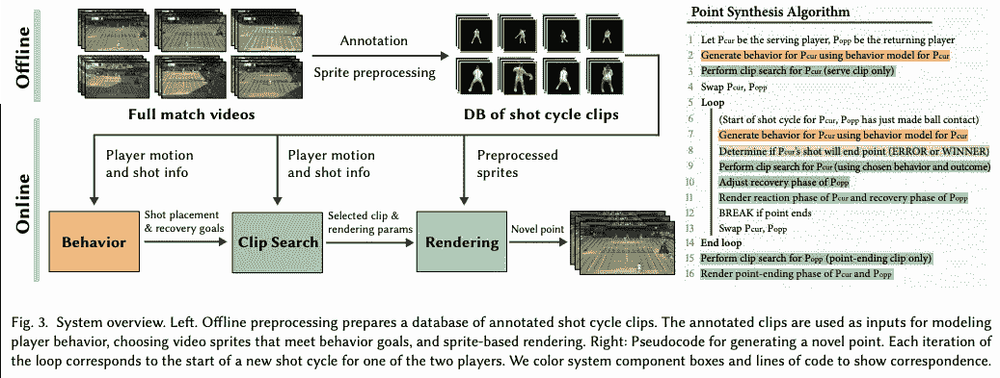

# **7。针对长尾数据的特征空间增强**

https://arxiv.org/abs/2008.03673

在长尾数据集中，每个类别的数据数量存在很大差异，他们提出了一种在线数据扩充方法，以混合特征空间中的稀有类别和频繁类别。与现有方法相比，他们成功地大大提高了该方法的准确性。

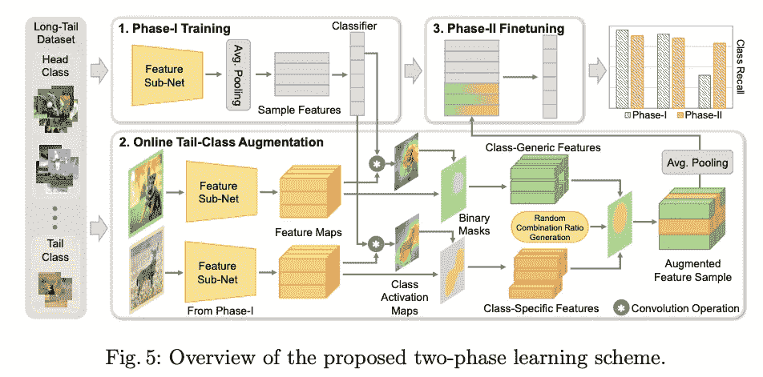

# 8.视觉手性

【https://arxiv.org/abs/2006.09512 

数据扩充中使用的左右翻转假设翻转不会改变数据分布。但是，实际上数据分布有点不一样(大部分人都是把时钟戴在左手边，但是当数据翻转的时候，看起来是戴在右手边，分布和原来左手边有时钟的数据不一样。) )，DL 模型可以确定图像是否被翻转。这有望成为一种新的工具，通过这种方式提取分布发生变化的东西。

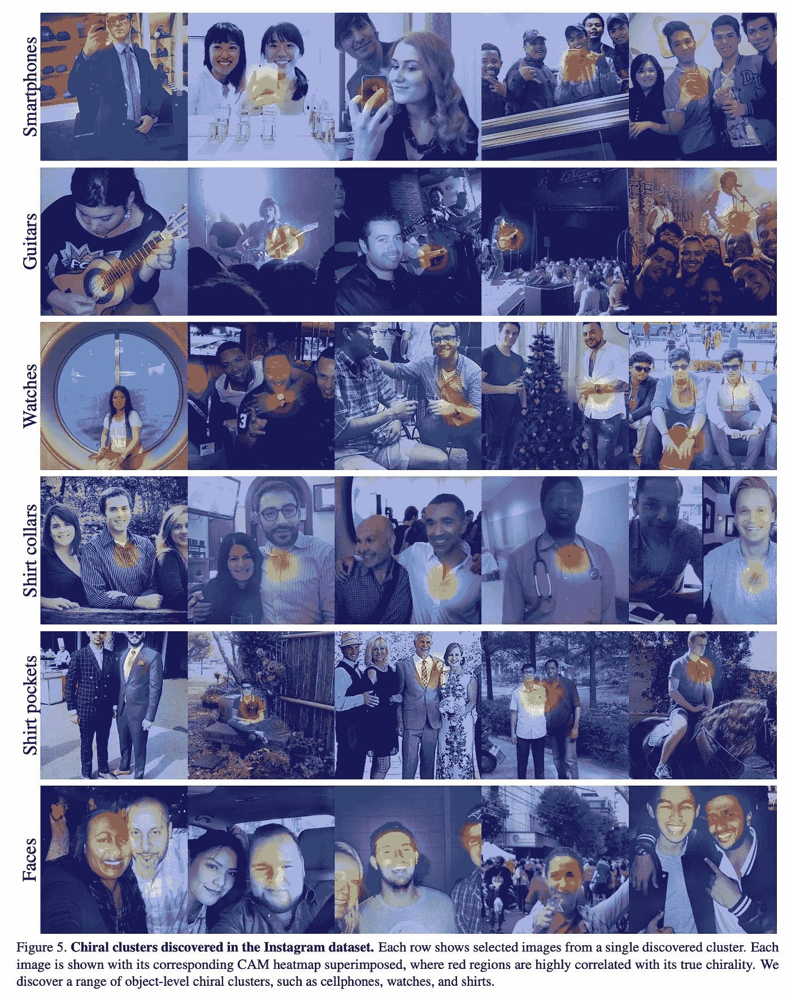

# 9.数据不平衡 NLP 任务的骰子丢失

[https://arxiv.org/abs/1911.02855](https://arxiv.org/abs/1911.02855)

NLP 分类任务通常使用 F1 分数进行评估，但它们使用交叉熵进行优化，如果使用不平衡数据，它们之间存在很大差距。因此，他们提出了 DSC 的损失，可以解释为平滑 F1 并乘以一个因子，将易于分类的样本的系数降至零。他们证实，这种损失在许多模型和数据集上都是有效的。

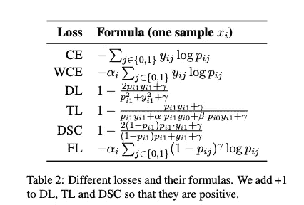

# **10。利用平衡组 Softmax** 克服长尾对象检测的分类器不平衡

[https://arxiv.org/abs/2006.10408](https://arxiv.org/abs/2006.10408)

在对象检测中，次要类别的性能较差。用于这种数据集的分类任务的方法与对象检测不兼容，并且不能如此提高精确度。因此，他们提出了一种方法，根据数据的数量创建组，并在每个组内创建“其他”类。该方法提高了小类别分类的准确性。

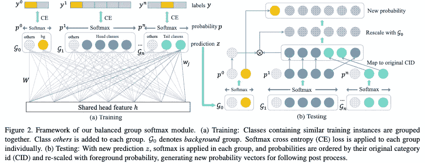

## github 上有我写的许多论文的概述。

 [## AkiraTOSEI/ML_papers

### 关于这个项目有问题吗？注册一个免费的 GitHub 账户来开一期并联系它的…

github.com](https://github.com/AkiraTOSEI/ML_papers/issues) 

## 推特，我贴一句纸评论。

[https://twitter.com/AkiraTOSEI](https://twitter.com/AkiraTOSEI)