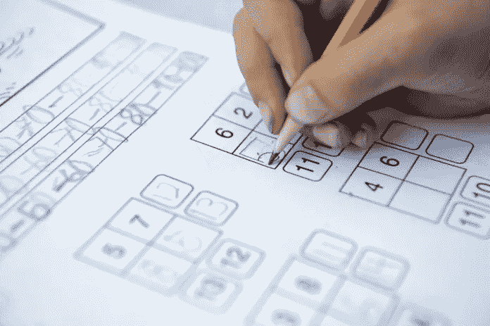
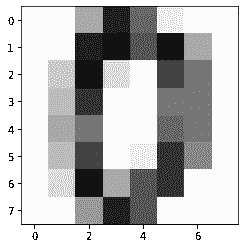
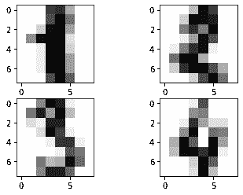

# 用 scikit-learn 识别手写数字

> 原文：<https://medium.com/analytics-vidhya/recognizing-handwritten-digits-with-scikit-learn-67be1a4c74ae?source=collection_archive---------14----------------------->



数据分析不仅限于数字和字符串，因为图像和声音也可以被分析和分类。识别手写文本是一个问题，可以追溯到需要识别手写文档中的单个字符的第一台自动机器。

为了解决 Python 中的这个问题， **scikit-learn** 库提供了一个很好的例子来更好地理解这种技术、所涉及的问题以及做出预测的可能性。 **scikit-learn** python 库是解决机器学习和数据科学问题从乞讨到结束的常用工具。建立在机器学习库基础上的 scikit-learn 。

。Numpy

。Scipy

。Matplotlib

**scikit-learn** 提供了广泛的内置算法，可以充分利用数据科学项目:以下是使用 **scikit-learn** 库的主要方式。

1.  分类
2.  回归
3.  使聚集
4.  降维
5.  型号选择
6.  预处理

简而言之，该库专注于数据建模。 **scikit-learn** 附带了一些小型标准数据集。不需要从一些网站下载任何文件。

我们开始吧，

今天我们要实现一个数字识别器。 **scikit-learn** 库的 Digits 数据集提供了许多数据集，可用于测试数据分析和结果预测的许多问题。一些科学家声称它 95%的时候都能准确预测数字。进行数据分析来接受或拒绝这个假设。

**导入重要库**

从 sklearn 导入数据集
从 sklearn 导入 svm
从 matplotlib 导入 pyplot 作为 plt

因此，您可以将数字数据集加载到笔记本中。

svc = svm。SVC(γ= 0.001，C=100。)
digits = datasets . load _ digits()

加载数据集后，您可以分析内容。首先，您可以通过调用 DESCR 属性来读取关于数据集的大量信息。`DESCR`包含数据的自由文本描述，而`details`包含 openml 存储的元数据字典，如数据集 id。

打印(数字。描述)

手写数字的图像包含在 digits.images 数组中

打印(digits.images[0])

您将获得以下结果:

数组([[ 0。, 0., 5., 13., 9., 1., 0., 0.], [ 0., 0., 13., 15., 10., 15., 5., 0.], [ 0., 3., 15., 2., 0., 11., 8., 0.], [ 0., 4., 12., 0., 0., 8., 8., 0.], [ 0., 5., 8., 0., 0., 9., 8., 0.], [ 0., 4., 11., 0., 1., 12., 7., 0.], [ 0., 2., 14., 5., 10., 12., 0., 0.], [ 0., 0., 6., 13., 10., 0., 0., 0.]])

您可以使用 matplotlib 库直观地检查这个结果的内容

plt.imshow(digits.images[0]，cmap=plt.cm.gray_r，interpolation='nearest ')



1797 个手写数字中的一个

由图像表示的数值，即目标，包含在 digit.targets 数组中。

打印(数字.目标)

一旦定义了预测模型，就必须用训练集来指导它，训练集是一组您已经知道所属类别的数据。考虑到 Digits 数据集中包含的大量元素，您肯定会获得一个非常有效的模型，即能够非常确定地识别手写数字的模型。

通过使用 matplotlib 库，我们可以详细查看所有手写数字:

只保留为循环定义的行和列，图形。

对于范围(1，5)内的 I:
PLT . subplot(3，2，I)
PLT . im show(digits . images[I]，cmap=plt.cm.gray_r，interpolation='nearest ')

这里我只取了前 4 个数字。



前 4 个数字

## 生成模型

让我们建立支持向量机模型。首先，导入 SVM 模块，通过在`SVC()`函数中传递自变量内核作为线性内核来创建支持向量分类器对象。

然后，使用`fit()`将您的模型安装在训练集上，并使用`predict()`对测试集进行预测。

现在，您可以训练之前定义的 svc 估计器。svc.fit(数字.数据[1:1790]，数字.目标[1:1790])

svc.predict(digits.data[1:7])

```
array([1, 2, 3, 4, 5, 6])
```

如果将它们与实际数字进行比较，如下所示:

digits.target[1:7]

```
array([1, 2, 3, 4, 5, 6])
```

可以看到 svc 估计器已经正确学习。它能够识别手写数字，正确解释验证集的所有六个数字。

现在我们可以计算数字识别器的准确性。但是如果你像我一样是初学者，那么谷歌一下，这里的[就是解决方案:](https://stackoverflow.com/questions/42471082/how-to-find-out-the-accuracy)

从 sklearn.metrics 导入 accuracy _ score
accuracy _ score(SVC . predict(digits . data[1:7])，digits.target[1:7])

或者

a=digits.target[1:7]

b=svc.predict(digits.data[1:7])

比较 a 和 b，我们得到的精度为:

对于范围内的 I(len(a)):
是=否=0
如果 a[i]==b[i]:
是+=1
否则:
否+=1

准确度=(是/(否+是))*100

您可以选择较小的训练集和不同的验证范围。在上面的例子中，我们已经得到了 100%准确的预测，但这可能并不总是如此。

# 结论:

在我们学习之前，如何从 sklearn 导入数据集，如何使用估计函数 **fit()** 和 **predict()** 建立模型并进行预测。我们也计算准确度，简而言之我们用 Skleran 库介绍。