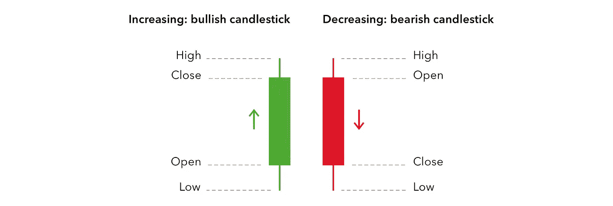
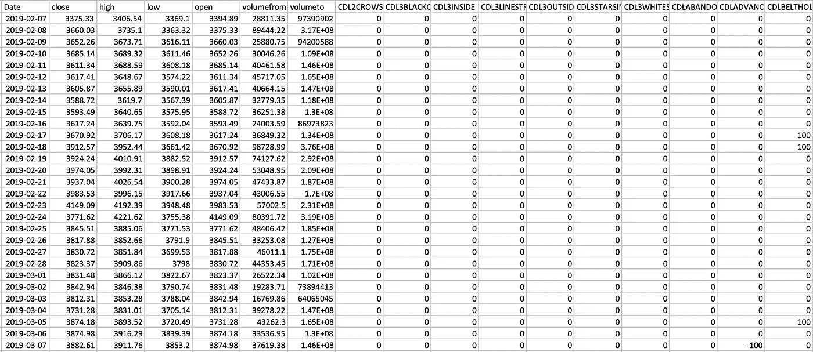
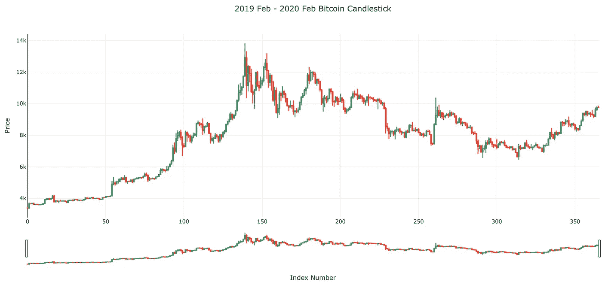
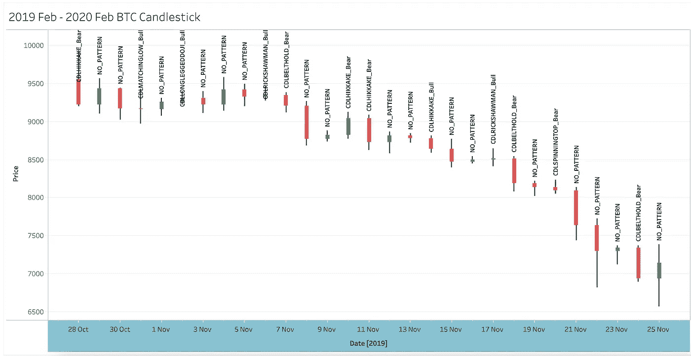

# 用 Python 识别 50 多种烛台图案

> 原文：<https://medium.com/analytics-vidhya/recognizing-over-50-candlestick-patterns-with-python-4f02a1822cb5?source=collection_archive---------0----------------------->

## 一个易于遵循的指南，为 ML 利用烛台模式

现场实施可在[www.cryptodashapp.com](http://www.cryptodashapp.com)找到


[形象信用](http://www.distel.co)。照片由[奥斯汀·迪斯特尔](https://unsplash.com/@austindistel?utm_source=medium&utm_medium=referral)在 [Unsplash](https://unsplash.com?utm_source=medium&utm_medium=referral) 上拍摄

在做交易决策时，我们可以利用几种不同的信息来源进行技术分析。其中一个来源是 OHLC(开盘、盘高、盘低、收盘)数据。可以绘制蜡烛图，从任何可交易工具的 OHLC 数据中提取模式。

> 烛台模式是一种在烛台图表上显示的价格运动，一些人认为它可以预测特定的市场运动。



[图像信用](https://www.ig.com/au/trading-strategies/candlestick-trading-explained-181218)

简单和复杂的烛台图案的完整列表以及视觉示例可以在这篇维基百科文章中找到。

烛台模式是训练机器学习模型以试图预测未来价格的绝佳候选模式。**在本文中，我们将回顾使用烛台模式创建预测器的特征工程步骤，然后可视化我们的结果。**我们将使用 python、TA-Lib 模块和来自[www.thepatternsite.com](http://www.thepatternsite.com)的性能排名

该过程的三个步骤是:

1.  *使用 TA-Lib 提取模式*
2.  *使用* [*模式站点*](www.thepatternsite.com) 中的“总体绩效等级”对模式进行分级
3.  *挑选最佳性能蜡烛*

## *使用 TA-Lib 提取模式*

有了 TA-Lib，提取模式超级简单。我们可以从安装来自 https://github.com/mrjbq7/ta-lib 的模块开始。该存储库包含易于遵循的安装过程说明。

安装完成后，我们开始导入模块:

```
import talib
```

然后，我们通过运行以下命令获得可用模式的列表:

```
candle_names = talib.get_function_groups()['Pattern Recognition']
```

“candle_names”列表应该如下所示:

```
candle_names = [
    'CDL2CROWS',
    'CDL3BLACKCROWS',
    'CDL3INSIDE',
    'CDL3LINESTRIKE',
    .
    .
    .
]
```

我们准备提取蜡烛！我们只需要一个带有*开盘、盘高、盘低、收盘*值的样本数据集。

样本比特币数据集准备

瞧啊。比特币数据集准备好了。让我们提取 OHLC 数据并创建模式列。

```
# extract OHLC 
op = df['open']
hi = df['high']
lo = df['low']
cl = df['close']# create columns for each pattern
for candle in candle_names:
    # below is same as;
    # df["CDL3LINESTRIKE"] = talib.CDL3LINESTRIKE(op, hi, lo, cl)
    df[candle] = getattr(talib, candle)(op, hi, lo, cl)
```

> TA-Lib 为每个模式创建单独的列。0 表示没有形态，正值表示看涨形态，负值表示看跌形态。



比特币数据中发现的烛台图案

恭喜你！我们刚刚获得了第一个包含算法提取模式的数据集。

## *排列模式*

我们使用 TA-Lib 成功地提取了烛台模式。通过几行代码，我们可以将这种稀疏的信息压缩到一个带有模式标签的列中。但是首先，我们需要处理对于给定的蜡烛发现多个模式的情况。为此，我们需要一个性能指标来比较模式。我们将使用 [模式站点](http://thepatternsite.com/)中的*“总体绩效等级”。*

```
candle_rankings = {
    "CDL3LINESTRIKE_Bull": 1,
    "CDL3LINESTRIKE_Bear": 2,
    "CDL3BLACKCROWS_Bull": 3,
    "CDL3BLACKCROWS_Bear": 3,
    "CDLEVENINGSTAR_Bull": 4,
    "CDLEVENINGSTAR_Bear": 4,
    "CDLTASUKIGAP_Bull": 5,
    "CDLTASUKIGAP_Bear": 5,
    .
    .
    .
    .
}
```

经过一些手工抓取后，这些模式被组合在“candle_rankings”字典中。当存在多个模式时，我们将使用上述字典中的值来决定最佳性能模式。模式的完整字典以及命名和排序决定的解释可以在[这里](https://github.com/CanerIrfanoglu/medium/blob/master/candle_stick_recognition/candle_rankings.py)找到。

## 挑选性能最佳的蜡烛

有趣的部分来了。我们将编写创建标签的逻辑代码。我们基本上有三个案例。

*   **无模式**:用“无模式”填充单元格
*   **单一图案**:用图案名称填充单元格
*   **多模式**:用排名最低(最好)的模式名填充单元格

下面是创建模式标签和发现模式计数的代码。

为每根蜡烛挑选最佳模式的逻辑

## 可视化和验证结果

到目前为止，我们使用 TA-Lib 提取了许多烛台模式(截至 2020 年 2 月支持 61 种模式)。我们根据*“总体性能等级”*对它们进行了分级，并为每根蜡烛选择了最佳性能模式。接下来，我们可以通过绘制蜡烛来验证我们的结果，并根据找到的模式进行视觉检查。下面是一个使用 Plotly 可视化数据的示例脚本。数据集和图可以并排比较，通过匹配索引可以轻松验证模式。

代码 plotly 可视化烛台



使用 plotly 的比特币数据蜡烛图

您可能会发现这个[表格(即](https://public.tableau.com/profile/caner.irfanoglu#!/vizhome/BtcCandlestickPatterns/Sheet1)表格)更便于快速检查带有注释的图案。



比特币数据的 [Tableau 即](https://public.tableau.com/profile/caner.irfanoglu#!/vizhome/BtcCandlestickPatterns/Sheet1)

当在我们的数据集上找到的模式与实际模式进行比较时，结果看起来是一致的。作为未来工作的一部分，我们可以在更大的数据集上进行测试。此外，由于一些模式只有一个版本，因此可以从其中删除“牛”和“熊”标签。

本帖所有脚本和内容，包括*识别 _ 烛台*功能，均可在【https://github.com/CanerIrfanoglu/medium】的[找到。](https://github.com/CanerIrfanoglu/medium)

在 https://youtu.be/HS3gAmtET9k?t=121您还可以看到烛台识别作为加密货币技术分析仪表板“加密仪表板”的一部分。

这里的内容主要基于 TA-Lib 模块的创建者的工作和 Thomas Bulkowsi 对烛台模式的长期研究。我要感谢他们公开他们的作品。

如果你喜欢或发现我的工作有价值，请确保保持同步，并随时在 [linkedin](https://www.linkedin.com/in/caner-irfanoglu-6868b077/) 上联系。我很高兴听到你的意见和建议。干杯！

## 参考

[1]烛台图案。(未注明)。在*维基百科*里。2020 年 2 月 11 日从 https://en.wikipedia.org/wiki/Candlestick_pattern[检索](https://en.wikipedia.org/wiki/Candlestick_pattern)