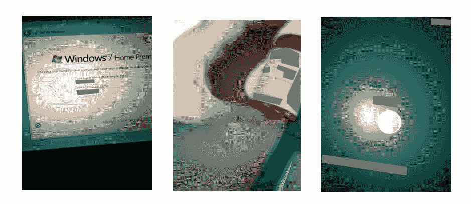

# 识别视障用户拍摄的图像中私人内容的存在— VizWiz 数据集

> 原文：<https://medium.com/analytics-vidhya/recognizing-presence-of-private-content-in-images-taken-by-visually-impaired-users-vizwiz-dataset-73bef56b8a37?source=collection_archive---------16----------------------->

图一。带有私人内容的图片示例被 ImageNet home-mean by[VizWiz](https://vizwiz.org/tasks-and-datasets/vizwiz-priv/)，版权所有。

# **根源问题**

下面这篇文章试图找到一个解决问题的方法，这个问题是由计算机视觉基金会发表的[这篇](http://openaccess.thecvf.com/content_CVPR_2019/papers/Gurari_VizWiz-Priv_A_Dataset_for_Recognizing_the_Presence_and_Purpose_of_CVPR_2019_paper.pdf)论文提出的。

全球有超过 2 . 85 亿人患有某种程度的视力障碍，正如世界上[所说的](https://www.who.int/blindness/GLOBALDATAFINALforweb.pdf)…