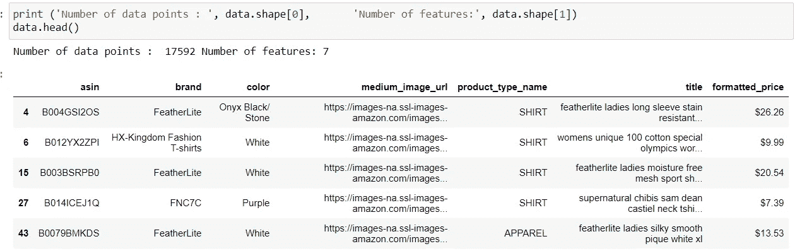
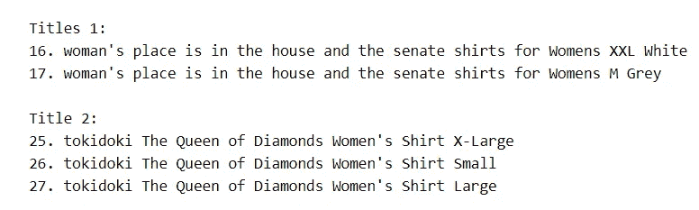
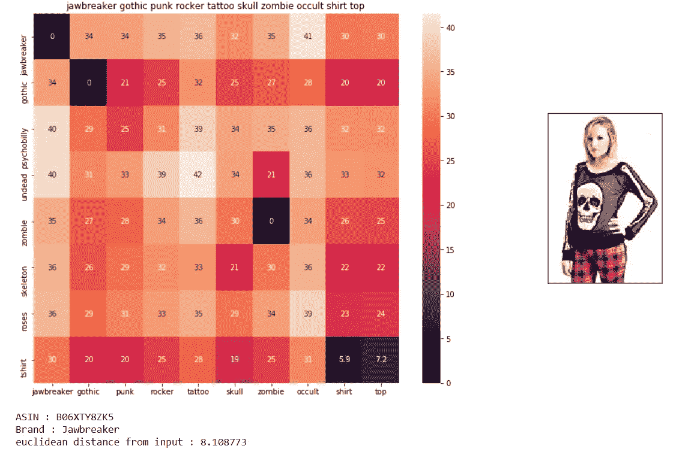

# 使用产品描述和图片推荐类似产品

> 原文：<https://medium.com/analytics-vidhya/recommend-similar-product-using-product-descriptions-and-images-b55ea8122b66?source=collection_archive---------2----------------------->

## ***目标***

从电子商务网站亚马逊，我们将收集女性服装的数据，并向用户推荐相似类型的服装(但不完全相同)，他/她可以购买。

## ***下面我们将一一看到***

1.  数据采集。
2.  数据清理。
3.  文本预处理。
4.  基于文本的产品推荐。
5.  基于图像的推荐。
6.  A/B 测试。

## ***数据采集***

我们从亚马逊的产品广告 api 中获取数据，因为根据他们的政策，从 Amazon.com 删除网页是不允许的。

> 您可以访问此链接获取您的数据[https://docs . AWS . Amazon . com/AWSECommerceService/latest/DG/welcome . html](https://docs.aws.amazon.com/AWSECommerceService/latest/DG/Welcome.html)

使用 REST API 从站点获取数据并存储在“fashion.json 文件”中

在这种情况下，我们将处理大约 183，000 名女性的 top 数据。

使用下面提到的注释获取数据

> **进口熊猫作为 pd**
> 
> **data = PD . read _ JSON(fashion . JSON)**

现在数据集被存储到**数据**中。现在我们将看到数据集的数据形状(数据点数和特征数)

取自我的笔记本

这些是我的数据集中存在的所有要素。

取自我的笔记本

但是我们将只使用这 19 个特征中的 7 个特征，我们发现这 19 个特征中有 7 个特征最相关。

1.asin(亚马逊标准识别号)
2。品牌(产品所属的品牌)
3。颜色(服装的颜色信息，它可以包含许多颜色作为一个值，例如:红色和黑色条纹)
4。产品类型名称(服装的类型，例如:衬衫/T 恤)。medium_image_url(图像的 URL)
6。标题(产品的标题。)
7。formatted_price(产品价格)

前 5 个数据点及其特征视图

# 数据清理

**缺失值移除**

在这一步中，我们将删除丢失的值数据点。在这里，我们逐一检查每个特性(这里我们删除了缺失值的数据点，因为我们的数据集足够大)。

***产品类型名称*** 分析

不同的产品类型

数据集中最常见的 10 种产品类型

以这种方式分析每个特征后，我们必须逐个消除每个特征的缺失值。

**删除重复项目**

我们不想向顾客推荐尺寸或颜色完全相同的商品，因为这是非常糟糕的推荐，因为他或她已经根据自己选择的尺寸或颜色进行了搜索，不会对其他尺寸或颜色感兴趣。比如说-

除了尺码(S、M、L、XL)不同，这些衬衫完全一样

**这些衬衫除了颜色完全一样**

***去重部分 1***

在这种情况下，我们将删除那些与其他标题仅相差最后 2/3 个单词的服装。我们将只保留这些项目中的一个。借助这一过程，我们可以消除上述两种类型的重复。这里，我们将按字母顺序对所有数据进行排序，然后删除仅在最后 2 或 3 个单词不同的产品。

标题 1:只是颜色不同，标题 2:只是大小不同。

***去重第二部分***

在前面的过程中，我们按照标题的字母顺序对整个数据进行了排序。然后，我们删除标题相邻且非常相似的标题。但是有一些产品的标题并不相邻但是非常相似。这些产品名称示例如下。

标题-1:妇女和女士是相同的，标题-2:酷，独特，新在这种情况下是非常相似的

所以在这个过程中，我们必须一个接一个地检查所有的标题，并检查它们是否与其他标题只有一个单词或两个单词的不同。

# 文本预处理

***停止字清除***

首先，我们必须将标题中的所有单词转换成小写，然后我们将删除所有停用的单词。

我们将删除这些词语，因为从这些词语中我们无法获得任何关于产品的信息。

***词干***

我们做词干分析是为了根据一些规则，通过去除词尾或前缀，从一个单词中得到一个词根。这里的词根不必是字典中的词。示例-“studies”在词干提取后转换为“studi”。在我们的案例中，我们尝试了词干法，但效果不佳。所以，我们不会应用这个。

***释义***

它简化为一个词根同义词。它将永远是一个字典单词。示例-“病历报告”将被转换为“病历报告”。但是我们也不会去参加这个，因为它也会带来不好的结果。

# 基于文本的产品相似性

1.  **产品名称上的文字袋**

在这种情况下，我们使用标题中出现的每个单词的频率将每个单词转换为一个向量。这些向量的维数取决于在整个标题语料库中存在的唯一单词的数量。这些向量将会是稀疏向量。

摘自[http://uc-r.github.io/creating-text-features](http://uc-r.github.io/creating-text-features)

现在，在将文本转换成向量后，我们正在使用欧几里得距离计算两个服装或产品之间的相似性。与查询产品的距离越小，意味着与查询产品越相似。

第一幅图像是查询图像，因此距离为“0”。

从上面我们可以看出，并不是所有推荐的服装都与查询图片相似。所以我们将使用下一个相似度方法，因为我们对此不满意。

***2。基于 TF-IDF 的产品相似度***

TF——测量一个单词在文档中出现的次数(在这种情况下是在单个标题中)除以文档中出现的单词总数。

IDF——测量文本语料库中存在的所有文档的对数除以包含特定单词的文档数。

TF-IDF=TF*IDF。

现在，在用上述方法计算了每个标题之后，我们将再次使用欧几里德距离来检查相似性。

第一幅图像是查询图像

从上面我们可以看出，我们正在得到相当满意的结果。但是我们还是会尝试一些不同的方法。

***3。基于 IDF 的产品相似度***

我们将尝试这种方法，因为在分析数据集之后，我们可以看到标题通常不包含一个以上的相同单词，因此使用 TF 部分是无用的。但是与 TF-IDF 方法相比，这种方法给出的结果较差。

***4。基于产品相似度的 VEC 平均词***

到目前为止，当我们把一个文本转换成一个向量时，并没有考虑到语义。但是在这个单词到 vec 的方法中，我们关注的是语义，这意味着我们现在要考虑单词的上下文。

我们可以在我们的数据集中训练单词到 vec 模型，但是由于我们的数据集不是很大，所以这里我们导入了已经训练好的 300 维单词到 vec 模型。

这个已经训练好的模型将为标题的每个单词分配一个 300 维的向量。我们将对一个标题的所有单词向量求和，然后除以标题中出现的单词数。(这叫平均字对 vec)。之后，我们将再次计算查询产品和数据集中其他产品之间的欧几里德距离。

通过这种方法，我们得到了以下类似的产品-

***5。IDF 加权字***

这里，在计算每个单词的向量之后，我们计算每个单词的 IDF，并将每个单词的 IDF 和 IDF 相乘，最后对标题中出现的每个单词的所有向量求和。然后，我们将它除以标题中所有单词的总和。(正如我们之前提到的，在我们的数据中，每个标题通常不会重复任何单词，因此我们将 IDF 加权单词作为 vec，而不是 tf-idf 加权单词作为 vec)。

它同时考虑了单词的重要性和语义的相似性。这种方法给予在整个文本语料库中出现频率较低的单词更多的重要性，并且还保留了该单词的语义。

**步骤**

1.  使用 word to vec 将所有单词转换为 300 维向量。
2.  现在计算每个单词的 IDF 呈现标题 Ti。
3.  现在将标题中的每个单词乘以 vector 和 IDF。
4.  现在对单个标题的第 3 步的所有值求和。
5.  现在，将 step4 值除以一个标题的所有 IDF 的总和。

查询产品

***6。使用品牌和颜色*加权相似度**

现在，在这种方法中，我们将品牌和颜色特征添加到标题中。对于颜色，我们正在创建一个向量，其维数等于整个语料库中唯一颜色的数目。使用一个热编码，我们使向量中只有一个颜色值等于“1”，其他保持为“0”。

同样，对于品牌，我们也在做一个热编码。

之后，我们会根据自己的意愿为每个向量(标题、品牌、颜色)分配权重。该权重将优先考虑某些特征而不是其他特征。

这里，每个分配的权重将与向量的每个元素相乘(标题向量、品牌向量、颜色向量)。之后，连接这三个向量，并计算欧几里得距离，以找到相似性。

在我们的笔记本中，我们给标题向量一个权重(w1 ),给品牌和颜色向量一个权重(w2)。(在笔记本中，我们以稍微不同的方式应用这种方法。[{((w1)*距离(标题向量))+(w2)*(距离(品牌向量，颜色向量))}/(w1+w2)]

我们通过给两个向量相同的权重来得到下面提到的结果。

现在，如果我们给颜色和品牌向量比标题向量更多的权重，那么我们将看到下面提到的相同查询产品的推荐服装。

**第七期*。基于视觉相似度的产品相似度***

这里，我们使用 CNN 将产品的每个图像转换为密集向量，然后计算每个向量与查询向量的距离，以测量相似性。这里，我们使用 VGG16 网络将(224，224)像素图像转换为 25088 维密集矢量。

# A/B 测试

在上面提到的这些方法中，选择哪一种推荐呢？

因为在上面我们只是看穿了‘1’的积，哪个算法更有效率。但是这个过程是不正确的，因为在现实生活中会有数十亿的产品。现在不可能对每种产品都采用上述方法，然后再比较效率。

那怎么办呢？

我们必须做一个统计测试，这就是所谓的 A/B 测试。

在 A/B 测试中，我们将我们的用户集合划分为不重叠的不同集合，现在我们通过上述不同类型的方法推荐每组用户。这些不重叠的集合或组是随机选择的。之后，我们必须看看哪种推荐方法能带来更多的销售。据此我们必须选择一种方法。