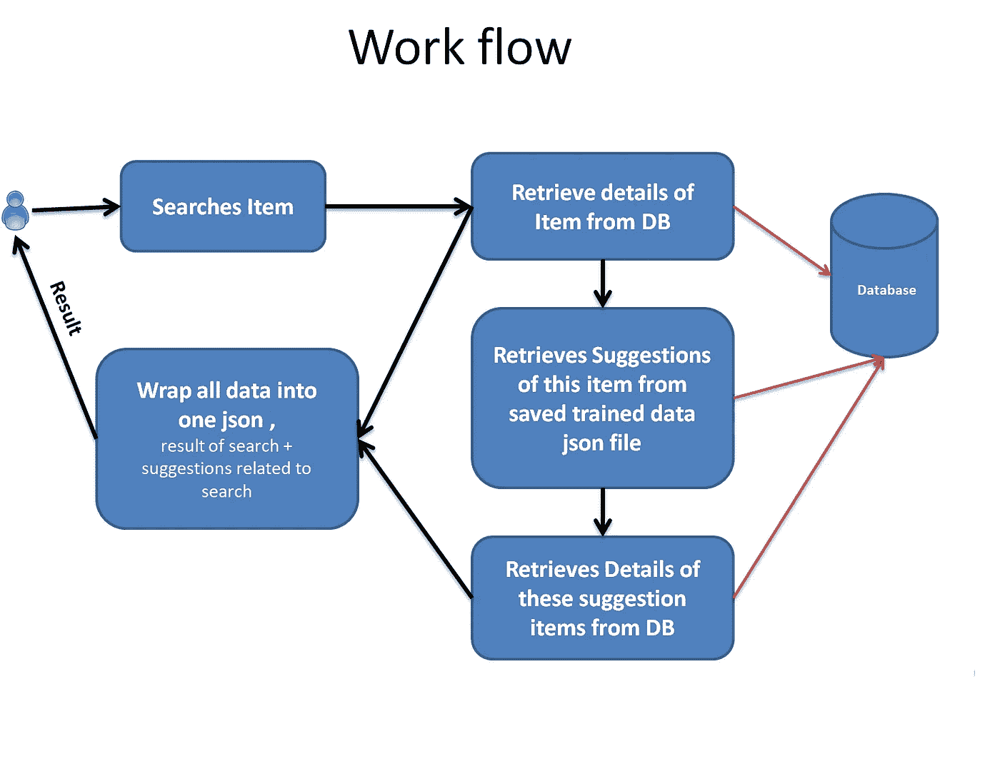
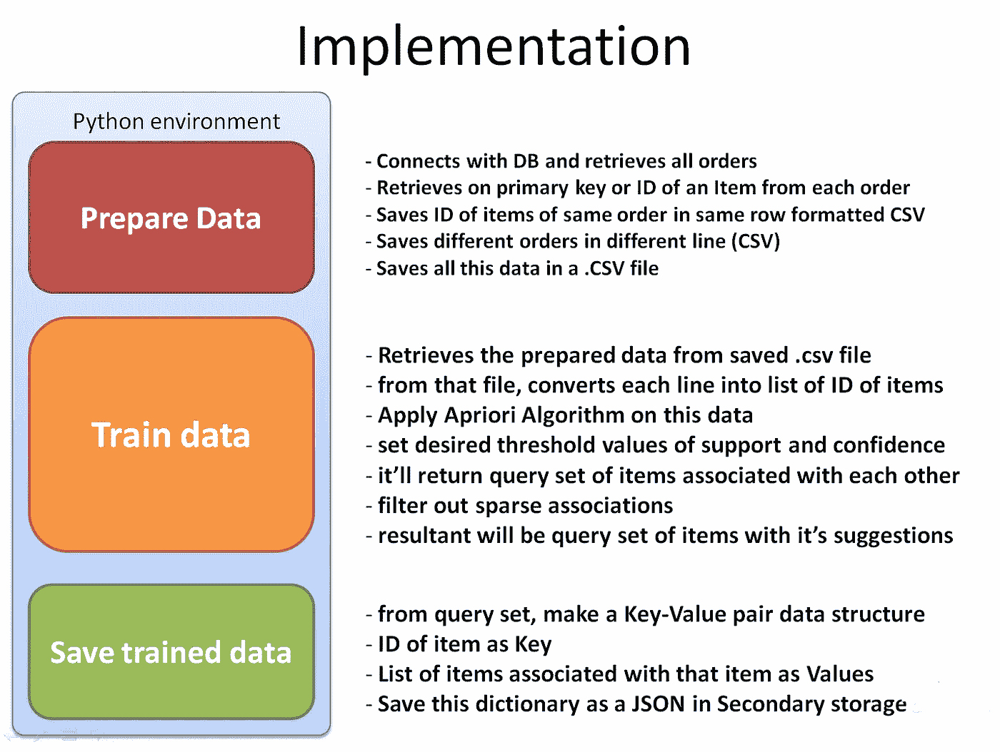
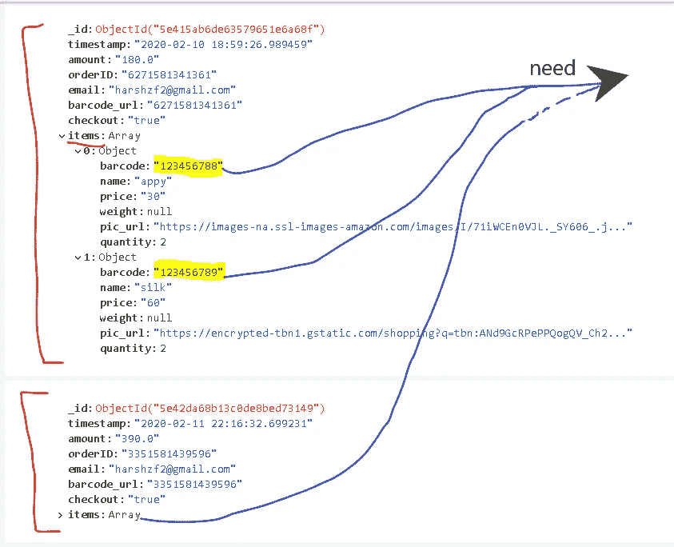
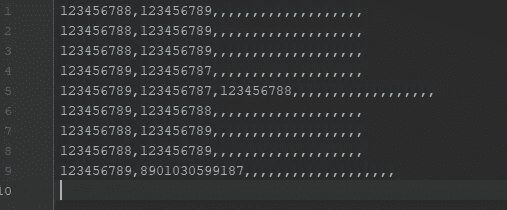
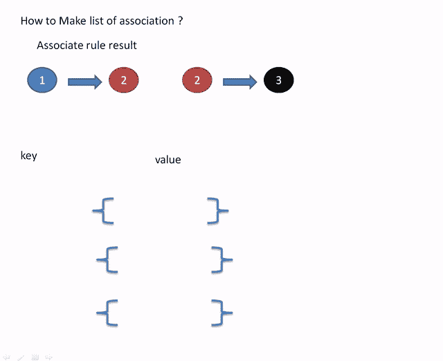

# 推荐系统

> 原文：<https://medium.com/analytics-vidhya/recommendation-system-3c8ea846ae0f?source=collection_archive---------21----------------------->

编码部分


在这里，我们将学习如何为我们的推荐系统实现 Apriori 算法

在上一篇文章中，我们学习并理解了推荐系统的类型以及 apriori 是如何工作的。

这里->[https://medium . com/analytics-vid hya/re commendation-system-a4eba 47 cf 0b](/analytics-vidhya/recommendation-system-a4ebaa47cf0b)

# 实施

我们必须通过 3 个主要步骤来让我们的系统走上正轨。

看，当你只实现 apriori 算法和在你的实际项目中实现它是有区别的。在这里，我们将学习如何在项目中实际实现推荐系统

我在这里用 Django 创建了一个简单的 API。

让我们先了解一下示例项目在做什么。



1.  一个用户用条形码搜索一个产品，它的请求将被发送到后端 API
2.  在后端，我们将首先从数据库中搜索项目的详细信息，并将其存储在我们的'**结果**JSON 中
3.  然后，我们将搜索为搜索产品推荐的商品(我们将搜索与搜索商品一起购买的可能性最高的商品)
4.  然后，我们会将推荐项目的详细信息添加到我们的“**结果**”JSON 中
5.  并将'**结果** ' JSON 返回给用户

所以让我来为你分解关键步骤

> 1)准备数据
> 
> 2)列车数据
> 
> 3)保存训练数据



# 密码

## 1)准备数据

让我们首先看看完整订单的 JSON 对象实际上是什么样子的



ps，不要太关注结构，你可以根据你的要求创建任何结构。

将条形码视为产品的主键。

我们想要的是，只有在同一订单的产品的条形码，并保存在同一行的 CSV 文件，同样为下一个订单在新的一行 CSV 购买的所有项目的条形码

> 1)相同顺序的项目，用逗号将它们存储在同一行中
> 
> 2)为每个订单创建一个新行



看到那些多余的空逗号，其实它们很重要，那就是我们稀疏的数据。我们在上一篇文章中了解了不同技术所需的数据集的差异。

让我们将准备好的数据 CSV 文件保存为**orders _ data _ for _ training . CSV**

现在，这个文件是我们实际的数据集，将用于培训

```
import csv
import os
def **prepare_data**():
#   *this will remove the old file every time we prepare the data*
    os.remove("res/orders_data_for_training.csv")#   *first connect with mongoDB and select the DB and collection*
    client = MongoClient("mongodb://localhost:27017/")
    mydatabase = client["minor2"]
    mycollection = mydatabase["completed_orders"] cursor = mycollection.find()for order in cursor:
        print(order)
        barcodes = []
        count = 20
        for item in order["items"]:
            barcodes.append(item['barcode'])
            count -= 1
        for i in range(0, count + 1):
            barcodes.append("")
        with open('res/orders_data_for_training.csv', 'a', newline='\n') as file:
            writer = csv.writer(file)
            writer.writerow(barcodes) 
```

## **2)列车**

在这里，我们没有训练任何来自 Keras 或 TensorFlow 或 PyTorch 等库的机器学习模块。

相反，我们使用一种统计算法来给出我们想要的关系形式，从中我们可以进行预测。

Apriori 算法->创建相互关联的项目的查询集

它的代码有点复杂，但超级容易理解。

# 列车数据代码

**#** Apriori 算法函数- >这将为我们提供一个查询集，这当然很有用，它将是您做出的最终预测，

**#** 找到你想要预测的一对，(a，b) - >意思是如果有人买 a，他也会买 b，反之亦然

**#** 但是在查询集中还有很多其他信息，这些信息并不是真正需要的。

**#** 我们接下来的任务就是如何将这些数据以简单的(a，b)关系的形式提取出来并保存。

**#** 为什么要保存它——这样我们就不用在每次一个人搜索一个商品的时候都要计算这些关系了。



1，2，3 是不同的项目

**逻辑** - >如果‘a’与‘b’相关，那么‘b’也与‘a’相关
**#** 当然，这很简单，我们也知道，但我们也必须将这一点告诉计算机。索引 a 上的
**#**->b 存在，并不意味着索引 b - > a
**#** 因此我们只是执行了一些简单的逻辑来创建它。

保存此培训数据:

```
def set_default(obj):
    if isinstance(obj, set):
        return list(obj)
    raise TypeErrordef saveTrained(trained):
with open('res/trained_data.json', 'w') as outfile:
        json.dump(trained, outfile,default=set_default) 
```

您不需要显式调用这些函数，因为它们已经在 **train_data()** 中被调用了

# 3)预测


请记住，我们将产品的“条形码”作为主要 id/密钥

所以我们将只搜索它，

->每当用户搜索条形码为“123456789”的商品“a”时

->我们必须查看我们保存的训练数据，用户可以用“a”购买哪些相关商品

根据我们保存的训练数据，我们将有与项目“a”相关的建议/推荐，但它们将只是条形码。

***建议转化为真实数据***

我们的下一个任务是获取我们在预测中得到的所有条形码的所有细节，并将其返回给用户。

简单的代码

预测代码

就这样，你的推荐系统现在完成了。

在 Github repo 中可以看到这个 API 集成在 flutter app 中的完整代码。

[](https://github.com/borsezf2/HandM) [## borsezf2/HandM

### 新的商店应用程序。https://github.com/borsezf2/HandM/blob/master/report%20.pdf 这个项目的目标是把…

github.com](https://github.com/borsezf2/HandM) 

感谢阅读，欢迎任何疑问。