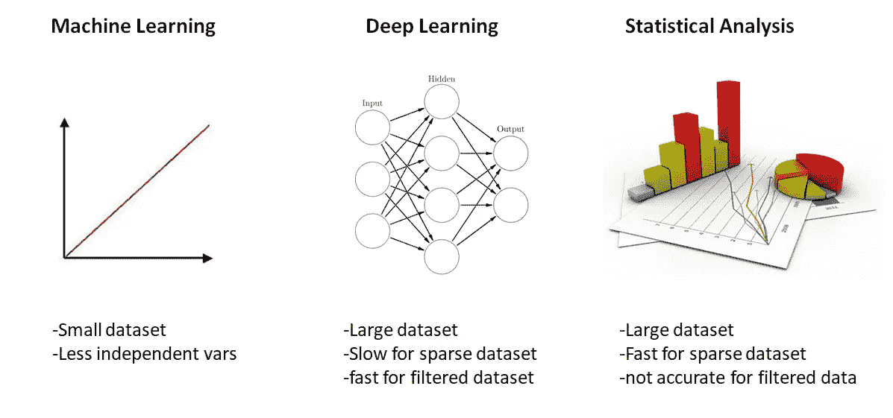
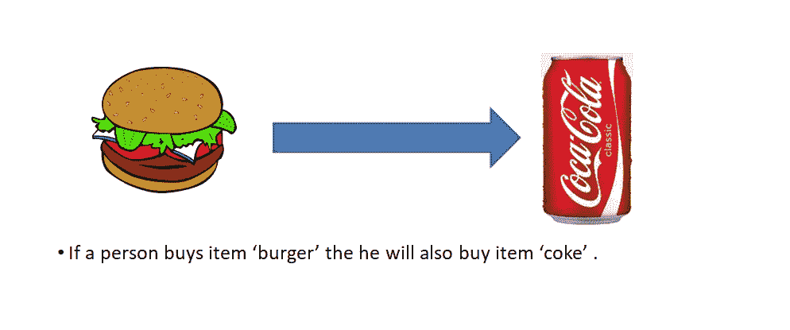
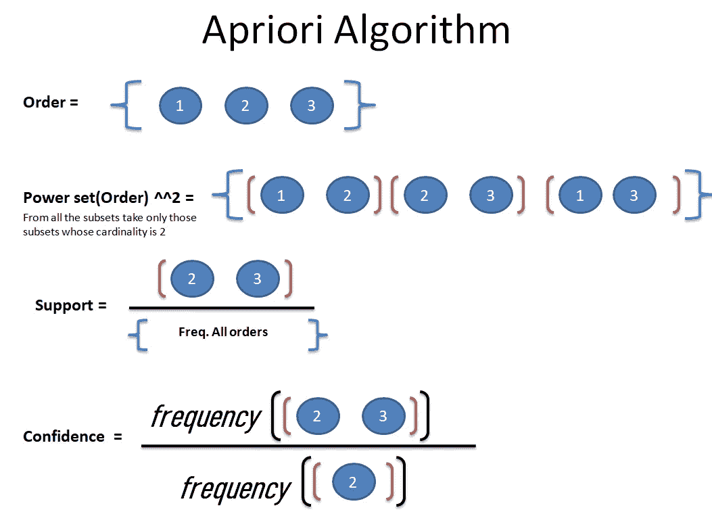

# 推荐系统

> 原文：<https://medium.com/analytics-vidhya/recommendation-system-a4ebaa47cf0b?source=collection_archive---------9----------------------->

**又名建议系统和购物篮分析**

主图像

购物篮分析是一种推荐系统，用于分析用户的购物篮/购物车，从他们过去的购买和订单中学习，并向用户建议类似的产品

本教程分为两个部分

1.  **推荐系统基础**
2.  **用 python 实现。**

# 1.基础

**定义:-**

它从用户的一些独立特征中学习，并返回与用户决策相似或最接近的输出。

## 1.1 推荐系统的类型

**1- >协同**

*   分析关于客户的数据识别模式
*   向一类用户建议
*   向相似类别的用户推荐产品，产品之间可能没有任何关系，但特定类别的客户会一起购买它们。
*   例如，如果一些用户一起购买“茶”和“饼干”,机器会将茶和饼干与特定类别的用户联系起来，比如 A 类，下次如果我们的机器成功检测到 A 类用户并且他正在寻找茶，也会向用户建议饼干。

**2- >基于内容的**

*   按项目特征过滤
*   对类似项目的建议
*   基于相似类型的特征来建议产品。
*   例如，它会提示一起购买的商品，如果人们购买可乐，我们的机器会提示与可乐类似的其他商品

**3- >混动推荐**

*   协作+基于内容的遥感

## 1.2 推荐系统的技术

我们可以用不同的技术实现一个推荐系统，其中一些是

每种技术或方法都有其优缺点。

# **2。购物篮分析**

> 它解释了在交易中经常同时出现的产品组合

它由两部分组成

1.  **关联规则挖掘**
2.  **Apriori 算法**

## 2.1 关联规则挖掘

这是一种显示项目如何相互关联的技术。

## 2.2 Apriori 算法

上面的关系是根据我们以前所有的订单数据计算出来的

***通过 Apriori 算法计算两个项目之间的关系。***

为此，该算法计算 3 个主要因素来建立关系

1.  支持:包含项目 A 和 B 的交易的一部分
2.  置信度:对于给定的 A 出现的总次数，它给出了项目 A 和 B 一起出现的频率
3.  提升:它表明规则对 A 和 B 随机共现的强度

对于升力，公式为

# lift = main _ Support/(Support(A)* Support(B))

> **升力高** =这两种产品之间没有关系
> 
> **升力低** =这两种产品有关系

**Apriori 算法将为所有不同的项目计算所有这些因素，并将为此返回一组关系查询。**

现在就看你了，你有了两个产品之间的关系，你想如何实现工作。

记住这个

Apriori 算法适用于稀疏数据集，是一种基于统计的推荐方法。

您必须再次训练您的数据，以便将最新的订单放入数据集中。

在下一部分，我们将学习如何在我们自己的项目中实现这个算法。

我在 MongoDB 上用过 python。

***感谢阅读***