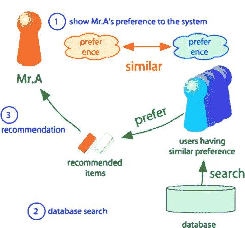

# 推荐系统:协同过滤(下)

> 原文：<https://medium.com/analytics-vidhya/recommendation-system-collaborative-filtering-part-2-2cad286d32c6?source=collection_archive---------23----------------------->

本文包含了协作过滤在 python 中的详细实现步骤，从头开始不需要任何外部库。

顾名思义，这是推荐系统文章的第 2 部分，其中第 1 部分关注基于内容的推荐系统，本文将关注协同过滤方法，即利用其他用户的质量判断的 t 2。

> 协同过滤的主要思想是基于一组相似用户给出的评分，为用户 **X** 预测一个项目的评分。

让我们试着理解这个定义，这里“相似用户”指的是与用户 *X* 相似和不相似的一组用户。因此，例如，如果用户 X 不喜欢项目 *a* ，那么相似用户一定也不喜欢项目 *a* ，反之亦然。尽管它们相似性的强度取决于用户提供的评级。图 2 描述了这个过程，其中我们试图预测 a 先生喜欢的物品。



图 2

一旦我们有一组用户已经以与用户 *X* 相似的方式对项目进行了评级，那么我们可以开始预测用户 *X* 尚未使用的项目的评级，并且具有最高评级的项目将被推荐给用户 *X* 。这种方法也被称为**基于用户-用户的协同过滤**，因为我们匹配的是用户简档而不是项目简档，在这种情况下，它将是基于项目-项目的协同过滤。

听起来很简单！让我们试着实现它。

## 数据集:

我使用的数据集与第 1 部分中使用的相同，即来自 Kaggle 的动画数据集。数据集包含两个文件 rating.csv 和 anime.csv，其中 rating . CSV 包含用户对不同动漫的评级，因此总共有 3 列，anime . CSV 包含所有动漫的详细信息，如名称、类型、平均评级等。共有 12，294 部独特动漫，73，516 个独特用户和 7，813，737 个总评分。

在这种方法中，我们将主要使用 rating.csv 文件，即包含每个用户对某些动画的评级的文件。用户有缺失值 *-1* ，表示用户看过这部动漫但没有评价。全球平均评分为 7.8。

## 实施步骤:

实施主要分为 3 项任务:

**任务 1:** 计算一组截至用户 *X* 的相似用户。并且为了计算两个用户之间的相似性，我们使用了用户 x 与其余所有用户之间的*皮尔逊相关系数*。一旦完成，它将返回一个最相似用户的列表。


图 2 ( *皮尔逊相关系数*)

**任务 2:** 在得到用户 *X* 的相似用户列表后，我们可以预测用户 *X* 没有看过但是集合 *N* 的相似用户看过的动漫的评分。


图 3(预测用户 X 对动漫 I 的评级)

**任务 3:** 在预测用户 *X* 的评分时应用常规做法，即*正则化*来改进预测结果。


图 4(调整预测评级)

关于编码，有一些事情需要记住。由于数据集非常庞大，即大约 800 万个总评分，我们将使用 spark 的 rdd 进行内存计算和惰性评估，这将有助于我们获得一些速度，并在以后创建一个字典来快速访问数据集。

```
*# Reading from rating.csv and transforming data*
df = spark.read.text("/content/drive/My Drive/Colab Notebooks/rating.csv").rdd
data = df.map(**lambda** x: x[0].split(','))
data2 = data.groupBy(**lambda** x : x[0])
data3 = data2.collect()*# Preparing data : a dictionary utility = {users: {anime : ratings}}*
utility = {}
all_animes = []
all_users = []
**for** user **in** range(len(data3)):
    **if** data3[user][0] == 'user_id':
        **continue**
    utility[int(data3[user][0])] = {}
    **for** i **in** data3[user][1]:        
        **if** int(i[1]) **not** **in** all_animes:
            all_animes.append(int(i[1]))
        **if** int(i[2]) == -1:
            **continue**            
        utility[int(i[0])][int(i[1])] = int(i[2])
```

因此，完成这一步后，我们将得到一个效用矩阵，它将用于进一步的实施。那么可以为每个任务创建三种方法，然后可以为用户进行预测。

```
**def** recommend_with_regularization(matrix, user):
    *# this method returns the predictions wrt most similar users*
    similar_users = most_similar_user(matrix, user)
    predictions = {}
    **for** anime **in** all_animes:
        num = 0
        den = 0
        **for** user_ **in** similar_users:
            **if** anime **in** matrix[user_[0]].keys():
                b_xj = global_avg + (avg_rating_of_user[user_[0]] - global_avg) + (avg_rating_of_animes[anime]- global_avg)
                num += (matrix[user_[0]][anime]- b_xj) * user_[1]
                den += user_[1]
        **if** den == 0:
            **continue**
        *# if anime in matrix[user[0]].keys():*
        b_xi = global_avg + (avg_rating_of_user[user] - global_avg) + (avg_rating_of_animes[anime] - global_avg)
        **if** b_xi + float(num/den) > 10:
            predictions[anime] = 10
        **else**:
            predictions[anime] = b_xi + float(num/den)
    **return** predictions
```

## 结果:


图 5(用于评估的效用矩阵)

这个效用矩阵以用户为行，以动漫为列。为了比较两种算法的性能，我们使用了相同的测试数据来衡量性能。我们随机抽取了 995 名用户和 3304 部动漫。

为了评估该模型，我们对相同的测试数据集使用了 RMSE 评分，因为我们再次预测了评级。

**没有正规化的 RMSE:1.72669202**

**正规化的 RMSE:1.4481453462**

为用户 3 推荐动漫。


图 6(推荐动漫)

## **讨论:**

这种方法给出了多样化的结果，更适合于一般用户喜欢不同类型的项目。虽然，将会有一个开始的问题，即在用户对系统是新的并且没有先前的评级或更少的情况下。在这个项目中实现的精度是 1.48 RMSE，因为在这里我们预测用户会给动画的评级，并返回最佳结果。

因此，这两种方法各有利弊，您可以根据手头的问题来决定采用哪种方法。

这是上述模型的完整实现。注意:在本文中，为了保持文章的简洁，我没有包括数据集的预处理等内容。

[](https://github.com/arsh1207/BigDataProject/blob/master/User_based_CF_colab.ipynb) [## arsh 1207/大数据项目

### permalink dissolve GitHub 是超过 5000 万开发人员的家园，他们一起工作来托管和审查代码，管理…

github.com](https://github.com/arsh1207/BigDataProject/blob/master/User_based_CF_colab.ipynb) 

参考资料:

海量数据集的挖掘:[http://www.mmds.org](http://www.mmds.org/)

数据集:[https://www . ka ggle . com/Cooper union/anime-recommendations-database # rating . CSV](https://www.kaggle.com/CooperUnion/anime-recommendations-database#rating.csv)

[https://www . analyticsvidhya . com/blog/2015/08/初学者-指南-学习-基于内容-推荐系统/](https://www.analyticsvidhya.com/blog/2015/08/beginners-guide-learn-content-based-recommender-systems/)

项目回购:【https://github.com/arsh1207/BigDataProject 