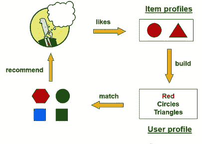
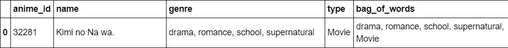
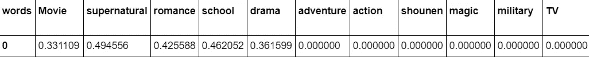
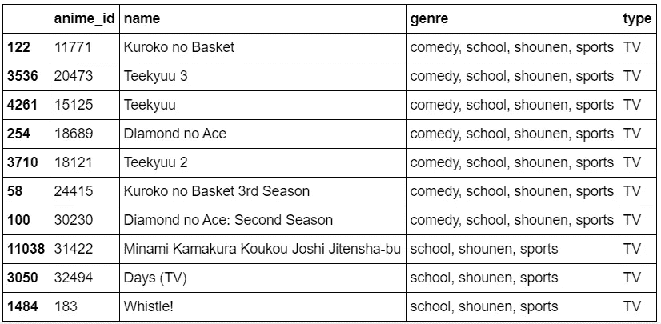
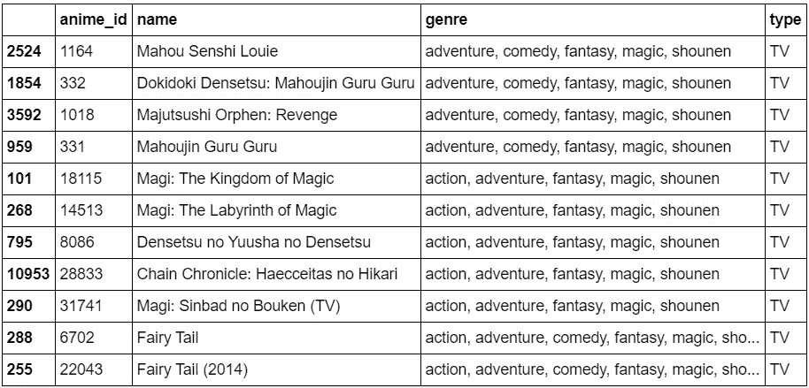

# 推荐系统:基于内容(上)

> 原文：<https://medium.com/analytics-vidhya/recommendation-system-content-based-part-1-8f5ac093127a?source=collection_archive---------5----------------------->

这篇文章包含了 python 中 CBRS 的详细实现步骤，从头开始不需要任何外部库。

推荐系统的两个著名方法是基于内容和协同过滤。在本文中，我将重点介绍基于内容的推荐系统的实现细节，在本文的第 2 部分，我将解释协同过滤方法。

> CBRS 的主要思想围绕着向用户推荐他/她过去评价很高的*类似*的商品。

例如，在图 1 中，如果用户喜欢红色的项目(在此发现的共同属性),那么推荐系统将向用户推荐更多的红色项目，并且不强调项目的形状。



图一

基于内容的推荐系统不关注其他用户的评价，这使得该模型能够向具有独特品味的用户推荐新的或不受欢迎的项目。这里的单词“内容”指的是用户喜欢或不喜欢的项目属性，例如电影的类型和类型(类型:动作、冒险和类型:电视连续剧)等。

为了向用户推荐任何商品，你需要两个主要的东西:商品简介和用户简介。现在让我们深入研究实现部分。

对于这篇文章，我使用 kaggle 的动画数据集(参考资料中的链接)。数据集包含两个文件，rating.csv 包含用户对不同动漫的评级，因此共有 3 列，anime.csv 包含所有动漫的详细信息，如名称、类型、平均评级等。共有 12，294 部独特动漫，73，516 个独特用户和 7，813，737 个总评分。

是的，数据集很大，所以我将使用 spark 的一些部分。

# 实施步骤:

在开始推荐商品之前，让我们创建个人资料。

**第 1 步**:通过删除缺失值对数据进行预处理，并分析数据集，以识别可用于预测物品的属性。在这个应用中，我使用了动漫的两个属性:*流派*和*类型，*你也可以使用平均评分，但需要对其进行处理，使其具有可比性。

**第二步:**为表格中的每个动漫创建一个*单词包(BOW)* 属性流派和类型。BOW 将包含我们用作该动画内容的属性值，如图 2 所示。



图 2(我们表中的一个典型行)

**步骤 3** :为了将每个动画的弓转换成它的 ***物品轮廓向量*** 我们将为每个动画创建 *TFIDF 向量*。你也可以使用其他方法，如二进制值表示，但 TFIDF 分数包含更多信息，而不仅仅是告诉一个单词是否存在于向量中。这有助于给予出现较少的单词比出现较多的单词更大的权重，因此唯一性在这里被赋予更大的价值。

要创建 TFIDF 矢量作为项目配置文件:

首先计算词频 *TF_ij* 得分，即*词* *i* 在*文档 j* 中出现的次数(此处为步骤 2 中的单词包)。

然后计算逆文档频率， *IDF_i = log (N / n_i)* 其中 N 是存在的文档总数，而 n_i 是提及项 I 的文档数

最后，TFIDF 得分计算为 *w_ij = TF_ij * IDF_i.* 下面的代码片段展示了这些步骤。

上述 TFIDF 的 Python 实现

完成后，*将为每个项目*提供您的 *项目简介，即一个向量，代表动画中出现的每个内容词的值。在我的实现中，我将为一部动画获取一个 1 x 51 维的向量，这也表示我们总共有 50 个不同的内容词。总的来说，我们将得到一个 12294 x 51 的矩阵，即所有动画的项目向量。在图 3 中，动画的内容词具有大于零的值，而没有找到该动画的内容词将具有零的值，例如冒险= 0。*



图 3(项目向量)

**步骤 4** :为了找到一个用户的匹配动画，我们需要计算一个 ***用户简档向量*** ，它也将具有相同内容词的值，即每个用户 1×51 维的简档向量。用户简档表示用户喜欢/不喜欢项目的哪个属性以及喜欢/不喜欢的程度。

要计算用户配置文件:

查找用户过去评价过的所有动漫。将评级移动到零左右，即从对该用户有评级的所有动画中减去该用户的平均评级。现在，具有正值的评级，即初始评级高于平均评级的动漫是用户喜欢的动漫，反之则是动漫用户不喜欢的动漫。

> 用户简档向量通过对评分项目简档进行加权平均来计算，其中权重将是我们上面计算的移动评分值。

用户配置文件的 Python 实现

**注意:**您也可以使用其他方法来生成用户配置文件。您的模型对用户的推荐将直接取决于用户创建的个人资料。

**第 5 步**:一旦我们准备好我们的项目和用户资料，我们就可以开始推荐项目。我们使用的方法是*余弦相似度*函数，用于查找用户简档和所有项目简档之间的相似度。尚未被使用/观看并且具有最高余弦值的项目将最终被推荐给用户。够简单吧！

```
cosine_sim = cosine_similarity(user_vector, item_vectors)
```

# 结果:

表 1 显示了与用户 3 最匹配的动画。要观察的是这里的内容，即显示相似性的流派和类型属性。



表 1(对用户 3 的建议)

我们还可以扩展我们的模型来查找类似的项目。这可以通过计算需要搜索相似项目的项目向量和所有项目向量之间的余弦相似性来实现，如表 2 所示。



表 2(找到与项目“仙女尾巴(2014)”相似的项目)

# 讨论

基于内容是一个很好的开始为用户推荐商品的模型，但是它缺乏推荐商品的多样性。大多数被推荐的项目将具有相同的性质。当我们想要找到相似的条目(表 2)时，它会有更好的用途，因为用户可以有非常不同的品味，并且可以喜欢具有完全不同内容的不同类型的条目。但好处是你不需要其他用户的数据，所以没有冷启动的问题，即没有足够的数据来推荐商品。这通常是仍在收集数据的新应用程序面临的问题。

这是上述模型的完整实现。注意:在本文中，为了保持文章的简洁，我没有包括数据集的预处理等内容。

[](https://github.com/arsh1207/BigDataProject.git) [## arsh 1207/大数据项目

### 项目报告算法 1 CBRS 代码文件 PDF 副本:Content _ based _ recommendation _ system _ colab . ipynb 算法 2…

github.com](https://github.com/arsh1207/BigDataProject.git) 

参考资料:

海量数据集的挖掘:【http://www.mmds.org 

数据集:[https://www . ka ggle . com/Cooper union/anime-recommendations-database # rating . CSV](https://www.kaggle.com/CooperUnion/anime-recommendations-database#rating.csv)https://www . analyticsvidhya . com/blog/2015/08/beginners-guide-learn-content-based-recommenders-systems/

项目回购:[https://github.com/arsh1207/BigDataProject](https://github.com/arsh1207/BigDataProject)