# 动漫数据推荐系统

> 原文：<https://medium.com/analytics-vidhya/recommendation-system-for-anime-data-784c78952ba5?source=collection_archive---------11----------------------->

简单，tfidf 矢量器和计数矢量器推荐系统，适合初学者。

# 目标

推荐系统在许多行业中被广泛用于向顾客推荐商品。例如，广播电台可以使用推荐系统来创建本月的前 100 首歌曲以推荐给观众，或者他们可以使用推荐系统来识别观众已经请求的相似风格的歌曲。基于推荐系统在业界的广泛应用，我们将为动漫数据创建一个推荐系统。如果动漫爱好者每次走进动漫商店或收到基于他们喜欢的类型推荐动漫的电子邮件时，都能看到前 100 部动漫的更新，那就太好了。

利用[动漫数据](https://www.kaggle.com/CooperUnion/anime-recommendations-database)，我们将应用两种不同的推荐系统模型:简单推荐系统和基于内容的推荐系统来分析动漫数据并创建推荐。

# 概观

对于简单的推荐系统，我们需要计算加权评分，以确保不同票数的相同分数的评分具有不同的权重。例如，来自 10 个人的 9.0 的平均评级将比来自 1000 个人的 9.0 的平均评级具有更低的权重。在我们计算出加权评分后，我们可以看到一个排行榜动画。

对于基于内容的推荐系统，我们需要确定哪些特征将被用作分析的一部分。我们将应用 sklearn 来识别上下文中的相似性，并创建动漫建议。

# 数据概述

根据我们现有的动漫数据，总共有 12，294 部动漫的 7 种不同类型的数据，包括 anime_id、名称、流派、类型、剧集、评级和成员。

# 履行

**1。导入数据**

我们需要导入熊猫，因为让我们把数据很好地放入 dataframe 格式。

```
import pandas as pd
anime = pd.read_csv('…/anime.csv')
anime.head(5)
```

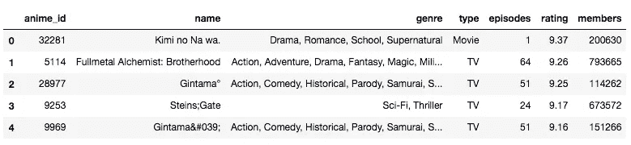

```
anime.info()
```

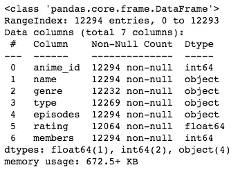

```
anime.describe()
```

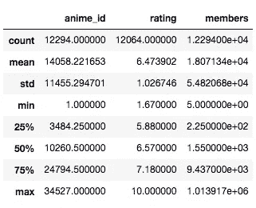

我们可以看到，最低评级得分为 1.67，最高评级得分为 10。最小成员数为 5，最大成员数为 1，013，917。

```
anime_dup = anime[anime.duplicated()]
print(anime_dup)
```

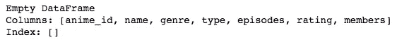

没有需要清理的重复数据。

```
type_values = anime['type'].value_counts()
print(type_values)
```

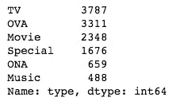

大多数动漫都是电视播放的，其次是 OVA。

**2。简单推荐系统**

首先，我们需要知道加权评级(WR)的计算方法。

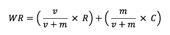

v 是该动漫的投票数；m 是在图表中列出所需的最低票数；r 是该动漫的平均评分；c 是整个报告的平均票数。

我们需要确定这次计算将使用哪些数据。

```
m = anime['members'].quantile(0.75)
print(m)
```

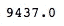

根据结果，我们将使用那些拥有超过 9，437 个成员的数据来创建推荐系统。

```
qualified_anime = anime.copy().loc[anime['members']>m]
C = anime['rating'].mean()def WR(x,C=C, m=m):
    v = x['members']
    R = x['rating']
    return (v/(v+m)*R)+(m/(v+m)*C)qualified_anime['score'] = WR(qualified_anime)
qualified_anime.sort_values('score', ascending =False)
qualified_anime.head(15)
```

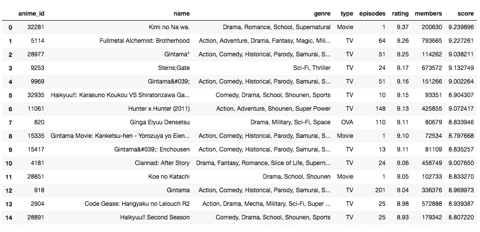

这是基于加权评分计算的前 15 名动漫名单。

**3。基于流派的推荐系统**

对于基于体裁的推荐，我们将使用 sklearn 软件包来帮助我们分析文本上下文。我们需要计算流派的相似度。我们将要使用的两个方法是 TfidfVectorizer 和 CountVectorizer。

在 TfidfVectorizer 中，它根据单词在所有文档中出现的频率来计算单词的频率。而 CountVectorizer 更简单，它只计算单词出现的次数。

```
from sklearn.feature_extraction.text import TfidfVectorizertf_idf = TfidfVectorizer(lowercase=True, stop_words = 'english')
anime['genre'] = anime['genre'].fillna('')
tf_idf_matrix = tf_idf.fit_transform(anime['genre'])tf_idf_matrix.shape
```

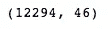

我们可以看到 12294 部动漫中有 46 个不同的词。

```
from sklearn.metrics.pairwise import linear_kernelcosine_sim = linear_kernel(tf_idf_matrix, tf_idf_matrix)
indices = pd.Series(anime.index, index=anime['name'])
indices = indices.drop_duplicates()def recommendations (name, cosine_sim = cosine_sim):
    similarity_scores = list(enumerate(cosine_sim[indices[name]]))
    similarity_scores = sorted(similarity_scores, key=lambda x: x[1], reverse=True)
    similarity_scores = similarity_scores[1:21]
    anime_indices = [i[0] for i in similarity_scores]
    return anime['name'].iloc[anime_indices]recommendations('Kimi no Na wa.')
```

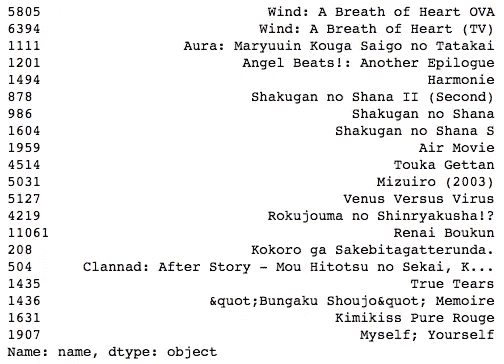

基于 TF-IDF 的计算，这是前 20 名的动漫推荐，类似于基米 no Na wa..

接下来，我们将看看另一个模型，CountVectorizer()，我们将比较余弦相似度和线性核之间的结果。

```
from sklearn.feature_extraction.text import CountVectorizer
from sklearn.metrics.pairwise import cosine_similaritycount = CountVectorizer(stop_words = 'english')
count_matrix = count.fit_transform(anime['genre'])
cosine_sim2 = cosine_similarity(count_matrix, count_matrix)recommendations('Kimi no Na wa.', cosine_sim2)
```

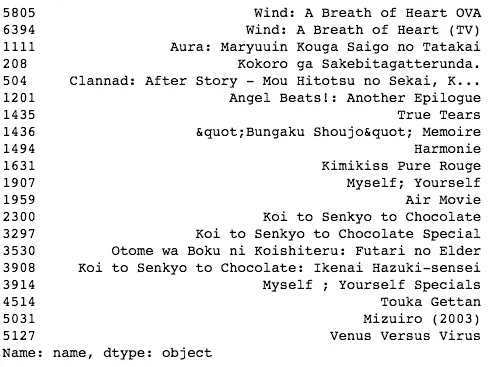

```
cosine_sim2 = linear_kernel(count_matrix, count_matrix)
recommendations('Kimi no Na wa.', cosine_sim2)
```

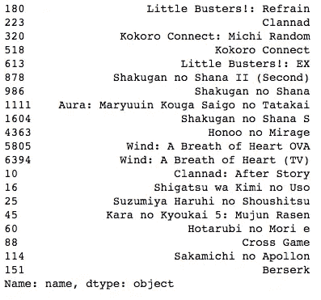

**总结**

在这篇文章中，我们研究了动漫数据，并试图建立两种类型的推荐系统。简单的推荐系统让我们看到了排行榜动漫。我们通过对投票和成员数量进行加权评分计算来实现这一点。然后，我们继续构建基于动漫类型特征的推荐系统。在这种情况下，我们应用 TfidfVectorizer 和 CountVectorizer 来查看它们的推荐之间的差异。

希望你喜欢这篇文章！

**参考文献**

1.[https://www . data camp . com/community/tutorials/recommender-systems-python](https://www.datacamp.com/community/tutorials/recommender-systems-python)