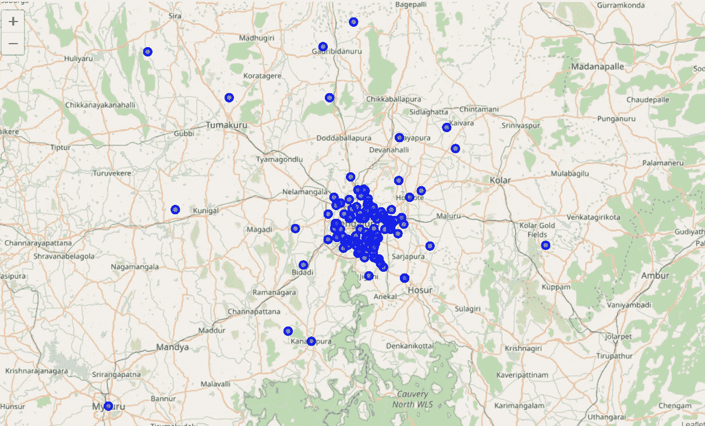

# 班加罗尔市资本投资推荐系统。

> 原文：<https://medium.com/analytics-vidhya/recommendation-system-for-capital-investments-in-bangalore-city-fd3251e0b82e?source=collection_archive---------23----------------------->


图片来自 [Pixabay](https://pixabay.com/photos/manhattan-empire-state-building-336708/)

> **简介:**

班加罗尔是一个特大城市，是印度第三大人口稠密城市和第五大人口稠密城市。Bengaluru 有时被称为“印度的硅谷”(或“印度的 IT 之都”)，因为它是该国领先的信息技术(IT)出口商。印度技术机构 ISRO、印孚瑟斯、威普罗和哈尔的总部都设在这座城市。作为一个人口多样化的城市，班加罗尔是印度发展第二快的大都市。孟加拉鲁鲁拥有世界上教育程度最高的劳动力。它是许多教育和研究机构的所在地，如印度科学研究所(IISc)、印度管理学院(班加罗尔)(IIMB)、班加罗尔国际信息技术学院(IIITB)、班加罗尔国家时装技术学院。


来源:[宏观趋势](https://www.macrotrends.net/cities/21176/bangalore/population)

如上图所示，我们可以观察到班加罗尔市的人口每年都在急剧增长。随着人口的增长，这也导致了商业的增长。作为一个发达的城市，它每天都吸引着大量的投资者。由于残酷的竞争，新投资者将很难生存。为了生存，他们需要在这样一个竞争很少或没有竞争的地区建立自己的企业，这样他们就可以专注于自己的业务而不受竞争对手的干扰。因此，为了解决这个问题，我们将使用机器学习算法和 Foursquare API 来获得班加罗尔各种公寓、餐厅、商场、咖啡馆的详细信息，以及它们的精确纬度和经度(如下所示)。

> 那么谁能从这项工作中受益呢？

*   ***投资者*** 正在寻找竞争最小化的最佳创业地点的投资者，需要看看他们的竞争对手是谁？以及他们居住的半径范围。通过这个项目，他们可以找到已经建立了类似业务的领域，通过美国提供的评论，新投资者可以找到他的同行所缺乏的东西，帮助他在这些领域取得进步。
*   这个城市的人口与日俱增，即使找一套新公寓也成了一件费力的工作。我们可以根据他们的需求帮助他们选择公寓，通过选择他们想要的周围环境，我们提供公寓周围所有场所的详细信息，如餐厅、购物中心、公园、咖啡馆、动物园等，


来源:[期限](https://tenor.com/view/luke-skywalker-im-here-to-rescue-you-starwars-luke-skywalker-rescue-luke-leia-cell-gif-12117318)

> **如何？？**

在我们的项目中，我们将通过向企业家推荐最佳创业地点来为他们提供帮助，具体包括:

1.  在那个领域有竞争对手吗？如果是的话，他们的业务是如何运作的？
2.  利用他们的竞争对手收到的评论，我们可以提供关于他们需要更加专注于其业务的领域的关键见解，以战胜他们的同行。
3.  利用我们已有的数据，我们可以通过给出一些新的规格来预测新公寓的价格。
4.  建筑规格，如建筑面积、停车位等。
5.  提供关于周围地区的细节，例如，一个愿意建立一个美食街的人希望他的生意在一个完全拥挤的地区，那里有许多 IT 公司、大学等..可能住在。
6.  影响价格上涨的参数是什么？
7.  我的公寓离餐馆有多远？

同样，我们可以帮助那些搬迁到班加罗尔的人，考虑到你是第一次搬到班加罗尔市。你可能不知道班加罗尔，在那里没有任何关系，所以你很难在那里定居。因此，为了解决这个问题，我们将使用机器学习算法和 Foursquare API 来获得班加罗尔各种公寓的详细信息以及它们的精确纬度和经度(如下所示)。现在为了选择最好的公寓，你需要考虑以下事实:

1.  我的办公室离公寓有多远？
2.  公寓附近有餐馆吗？。
3.  附近有咖啡馆吗？
4.  影响价格上涨的参数是什么？
5.  他们“准备好行动”了吗？如果没有，我什么时候可以搬进公寓？
6.  公寓的平方英尺是多少？
7.  我能在离我公寓多远的地方找到一个羽毛球场？

> **主意！！**

我们将使用 Foursquare API 来提取班加罗尔市所有餐馆、咖啡馆、公园、酒店和购物中心的详细信息。这些细节包括建筑物的位置、规格、评论和评级。稍后，我们将对提取的评论应用机器学习技术，以收集上述重要见解。为了收集空置公寓的详细信息，我使用了免费提供的数据集，其中包含班加罗尔市周围所有公寓的详细信息及其规格。对于这个数据集，我添加了纬度和经度坐标，使其易于绘制，后来我在这个数据集上运行 Foursquare API，以找到公寓周围最著名的地方。使客户更容易选择更合适的公寓来满足他的标准。

> **要求:-**


数据集来源: [Kaggle](https://www.kaggle.com/amitabhajoy/bengaluru-house-price-data)

> **方法论&执行:-**

我用 python 做数据分析和数据可视化。为了预测价格，我使用了一些机器学习算法。

让我们开始编码部分


来源:[期限](https://tenor.com/view/bruce-almighty-keyboard-warrior-comedy-jim-carrey-angry-gif-3393582)

—导入所需的库:

```
import os # Operating System
import numpy as np
import pandas as pd
import datetime as dt # Datetime
import json # library to handle JSON files#!conda install -c conda-forge geopy --yes
from geopy.geocoders import Nominatim # convert an address into latitude and longitude valuesimport requests # library to handle requests
from pandas.io.json import json_normalize # tranform JSON file into a pandas dataframe# Matplotlib and associated plotting modules
import matplotlib.cm as cm
import matplotlib.colors as colors#!conda install -c conda-forge folium=0.5.0 --yes
import folium #import folium # map rendering library
```

—读取 [**数据集**](https://www.kaggle.com/amitabhajoy/bengaluru-house-price-data) :

```
# Reading The DataSet
df_bglr=pd.read_csv("Bengaluru_House_Data.csv")
df_bglr.head()
```


图 1:数据集的图像

—在**图 1** 中，我们没有公寓的纬度和经度值。为了提取公寓附近的餐馆和购物中心的细节，我们需要它们的确切位置，因为我们需要纬度和经度的值。现在我们将在上面的数据集中添加两个空列纬度和经度。

```
# Adding Latitude and logitude columns for our later use
df_bglr["latitude"]=np.NaN
df_bglr["longitude"]=np.NaN
for i in range(0,13320):
    df_bglr["latitude"]="a"
    df_bglr["longitude"]="a"
```

—现在，为了提取纬度和经度的细节，我们将使用一个名为 Nominatim 的地理定位服务，它有自己的类别**地理编码器**。示例:-让我们获取班加罗尔市的纬度和经度

```
from geopy.geocoders import Nominatimaddress = 'Bangalore, KA'geolocator = Nominatim(user_agent="bg_explorer")
location = geolocator.geocode(address)
latitude = location.latitude
longitude = location.longitude
print('The geograpical coordinate of Bangalore City are {}, {}.'.format(latitude, longitude))
```

输出:-" **班加罗尔市地理坐标为 12.9791198，77.5912997。**

—我们将重复类似上面的任务，并收集所有公寓的所有纬度和经度的细节。

```
df_bglr_tail_venues=df_bglr["location"]
df_bglr_tail_venues=df_bglr_tail_venues.unique() **#extracting only the unique locations**
#print(len(df_bglr_venues))
j=0
for i in df_bglr_tail_venues: **#Updating the values of latitude and longitudes by iterating over the dataset**
    address_venue=i
    print(i)
    geolocator = Nominatim(user_agent="bg_explorer")
    location = geolocator.geocode(address_venue,timeout=10000)
    if location !=None:                **#Taking only values without null location values #Foursquare May not find the location for all locations so we are removing such undefined locations**
        print(location.latitude) 
        df_bglr.at[j,"latitude"] = location.latitude
        df_bglr.at[j,"longitude"]= location.longitude
        j=j+1
```


图 2:各个区域的纬度和经度值

—以下是更新纬度和经度列后的数据集:


图 3:更新的数据集

*   **数据清理:**


图 4:数据清理

1.  如图 4 所示，在列" **total_sqft** 中有一些非数值，我们必须删除它们，否则在数据可视化过程中解释非数值时会出错。

```
df_bglr=df_bglr[df_bglr.total_sqft.apply(lambda x: x.isnumeric())]
```

2. **Foursquare** 可能找不到某些位置的纬度和经度值，所以我们正在删除这些未定义的位置

```
df_bglr=df_bglr[df_bglr.latitude !='a']
```

3.丢弃所有 NaN 值

```
df_bglr.dropna(inplace=True)
```

— — — — — — —

*   **数据可视化:**

现在，我们将通过绘制图表和分析不同属性之间的关系来看到数据的一些可视化。

1.  Area_type **vs** 价格

```
import seaborn as sns
import matplotlib.pyplot as plt
plts = pd.read_csv('df_bglr.csv')
sns.catplot(x="area_type", y="price", data=plts);
```


图 5:散点图——面积类型与价格

```
sns.barplot(x="area_type", y="price", data=tips);
```


图 6:柱状图——面积类型与价格

从**图 5** 我们可以看到**超建成区**与其他区域类型相比，价格区间(0-150)的公寓更多。****

****2.户型**与**价格对比****

```
**sns.catplot(x="size", y="price", data=tips);**
```

********

****图 7:散点图——价格与大小****

```
**sns.boxplot(x="size", y="price", data=tips);**
```

********

****图 8:箱线图——价格与尺寸****

```
**sns.barplot(x="size", y="price", data=tips);**
```

********

****图 9:柱状图——价格与尺寸****

****因此，如果你观察图 9，对于 5BHK，不清楚有多少公寓，所以如果你观察图 8 或图 7，它清楚地显示只有一个 5 BHK 公寓可用。因此，不建议只遵循一种可视化技术，我们必须应用所有可用的可视化技术。****

****— — — — — —****

> ****让我们开始我们的主要项目吧****

********

****来源:[期限](https://tenor.com/view/adventure-time-jake-lets-do-this-lets-get-on-it-begin-gif-4584221)****

******探索公寓周围的街区******

1.  ****在班加罗尔城市地图上标出公寓的位置:****

****我们将使用**叶，**来绘制我们的公寓。follow 是 fleet . js 库的一部分，它使我们能够可视化数据。****

```
**# create map of New York using latitude and longitude values
map_bnglr = folium.Map(location=[latitude, longitude], zoom_start=10)# add markers to map
for lat, lng, borough, neighborhood in zip(df_bglr_155['latitude'], df_bglr_155['longitude'], df_bglr_155['society'], df_bglr_155['location']):
    label = '{}, {}'.format(neighborhood, borough)
    label = folium.Popup(label, parse_html=True)
    folium.CircleMarker(
        [lat, lng],
        radius=5,
        popup=label,
        color='blue',
        fill=True,
        fill_color='#3186cc',
        fill_opacity=0.7,
        parse_html=False).add_to(map_bnglr)  

map_bnglr**
```

********

****图 10:蓝点代表的公寓。****

****2.提取公寓周围的场地:****

****我们将使用 Foursquare API 提取每个公寓周围场地的细节。Foursquare 是一个本地搜索和发现应用程序。这提供了用户位置附近的个性化推荐。****

********

****来源: [Coursera](https://www.coursera.org/professional-certificates/ibm-data-science)****

****要提取指定地点的详细信息，您必须在 Foursquare 门户网站注册为开发者，请按照以下步骤注册:****

1.  ****访问 Foursquare 网站。:[https://foursquare.com/](https://foursquare.com/)****
2.  ****点击左上角的 **Resources** span 按钮，选项中会出现一个下拉菜单，点击**开发者门户**您会被重定向到一个注册页面。现在创建一个帐户。****
3.  ****选择沙盒帐户层，它将具有以下规格，足以满足我们目前的要求。****

*   ****950 次常规通话/天****
*   ****50 次高级通话/天****
*   ****每个场馆 1 张照片****
*   ****每个场馆 1 个小费****

****4.创建帐户后登录门户网站并创建新的应用程序，您将获得新的**客户端 ID &客户端密码。******

********

****图 11: Foursquare 凭证****

****—现在复制您的客户端 ID 和客户端密码，并将它们存储在如下所示的变量中:****

```
**CLIENT_ID = 'paste your client ID here, under the Apostrophe' # your Foursquare ID
CLIENT_SECRET = 'paste your client secret here, under the Apostrophe' # your Foursquare Secret
VERSION = '20180605' # Foursquare API version**
```

****— *现在让我们测试一下我们的 Foursquare API —*****

****我们将使用我们的 API 在**电子城二期**附近找到场地。********

```
****neighborhood_latitude = df_bglr_155.loc[0, 'latitude'] # neighborhood latitude value for "**electroniccityphaseII"**
neighborhood_longitude = df_bglr_155.loc[0, 'longitude'] # neighborhood longitude value for "**electroniccityphaseII"**neighborhood_name = df_bglr_155.loc[0, 'location'] # neighborhood nameprint('Latitude and longitude values of {} are {}, {}.'.format(neighborhood_name, 
                                                               neighborhood_latitude, 
                                                               neighborhood_longitude))****
```

********输出:**电子城二期经纬度值为 12.8468545，77.6769267。******

****现在让我们来寻找“**电子城二期**”附近的前 **6** 场馆。****

```
**LIMIT = 6# limit of number of venues returned by Foursquare API
radius = 500 # define radius
url = '[https://api.foursquare.com/v2/venues/explore?&client_id={}&client_secret={}&v={}&ll={},{}&radius={}&limit={}'.format(](https://api.foursquare.com/v2/venues/explore?&client_id={}&client_secret={}&v={}&ll={},{}&radius={}&limit={}'.format()
    CLIENT_ID, 
    CLIENT_SECRET, 
    VERSION, 
    neighborhood_latitude, 
    neighborhood_longitude, 
    radius, 
    LIMIT)
url**
```

****我们将创建一个 JSON 文件，并在其中存储排名前 50 的场馆。****

```
**results = requests.get(url).json()
results**
```

****输出:****

```
**{'meta': {'code': 200, 'requestId': '5e818d6e98205d001b5b9702'},
 'response': {'suggestedFilters': {'header': 'Tap to show:',
   'filters': [{'name': 'Open now', 'key': 'openNow'}]},
  'headerLocation': 'Current map view',
  'headerFullLocation': 'Current map view',
  'headerLocationGranularity': 'unknown',
  'totalResults': 6,
  'suggestedBounds': {'ne': {'lat': 12.851354504500003,
    'lng': 77.68153362366434},
   'sw': {'lat': 12.842354495499995, 'lng': 77.67231977633566}},
  'groups': [{'type': 'Recommended Places',
    'name': 'recommended',
    'items': [{'reasons': {'count': 0,
       'items': [{'summary': 'This spot is popular',
         'type': 'general',
         'reasonName': 'globalInteractionReason'}]},
      'venue': {'id': '4e0855c8b61c60b0454a7cbb',
       'name': '***TCS Think Campus***',
       'location': {'address': '#42, Electronic City',
        'crossStreet': 'Phase II',
        'lat': 12.847598224906433,
        'lng': 77.6791380938702,
        'labeledLatLngs': [{'label': 'display',
          'lat': 12.847598224906433,
          'lng': 77.6791380938702}],
        'distance': 253,
        'postalCode': '560100',
        'cc': 'IN',
        'city': 'Bangalore',
        'state': 'Karnātaka',
        'country': 'India',
        'formattedAddress': ['#42, Electronic City (Phase II)',
         'Bangalore 560100',
         'Karnātaka',
         'India']},
       'categories': [{'id': '4bf58dd8d48988d174941735',
         'name': 'Coworking Space',
         'pluralName': 'Coworking Spaces',
         'shortName': 'Coworking Space',
         'icon': {'prefix': 'https://ss3.4sqi.net/img/categories_v2/building/office_coworkingspace_',
          'suffix': '.png'},
         'primary': True}],
       'photos': {'count': 0, 'groups': []}},
      'referralId': 'e-0-4e0855c8b61c60b0454a7cbb-0'},
     {'reasons': {'count': 0,
       'items': [{'summary': 'This spot is popular',
         'type': 'general',
         'reasonName': 'globalInteractionReason'}]},
      'venue': {'id': '4eebe42077c82b92f636bb4f',
       'name': '***TCS Think Campus Ground***',
       'location': {'address': 'Electronic city',
        'lat': 12.848343641377438,
        'lng': 77.67926678752525,
        'labeledLatLngs': [{'label': 'display',
          'lat': 12.848343641377438,
          'lng': 77.67926678752525}],
        'distance': 303,
        'postalCode': '560100',
        'cc': 'IN',
        'city': 'Bangalore',
        'state': 'Karnātaka',
        'country': 'India',
        'formattedAddress': ['Electronic city',
         'Bangalore 560100',
         'Karnātaka',
         'India']},
       'categories': [{'id': '4bf58dd8d48988d1e1941735',
         'name': '***Basketball Court***',
         'pluralName': 'Basketball Courts',
         'shortName': 'Basketball Court',
         'icon': {'prefix': 'https://ss3.4sqi.net/img/categories_v2/parks_outdoors/basketballcourt_',
          'suffix': '.png'},
         'primary': True}],
       'photos': {'count': 0, 'groups': []}},
      'referralId': 'e-0-4eebe42077c82b92f636bb4f-1'},
     {'reasons': {'count': 0,
       'items': [{'summary': 'This spot is popular',
         'type': 'general',
         'reasonName': 'globalInteractionReason'}]},
      'venue': {'id': '50fe76dde4b06b7ff49c608c',
       'name': 'Coffee Day Xpress',
       'location': {'address': '42, Think Campus- TCS,',
        'crossStreet': 'Electronic City, Phase 2,',
        'lat': 12.848826839267772,
        'lng': 77.67894642513268,
        'labeledLatLngs': [{'label': 'display',
          'lat': 12.848826839267772,
          'lng': 77.67894642513268}],
        'distance': 310,
        'postalCode': '560010',
        'cc': 'IN',
        'city': 'Bangalore',
        'state': 'Karnātaka',
        'country': 'India',
        'formattedAddress': ['42, Think Campus- TCS, (Electronic City, Phase 2,)',
         'Bangalore 560010',
         'Karnātaka',
         'India']},
       'categories': [{'id': '4bf58dd8d48988d16d941735',
         'name': '***Café***',
         'pluralName': 'Cafés',
         'shortName': 'Café',
         'icon': {'prefix': 'https://ss3.4sqi.net/img/categories_v2/food/cafe_',
          'suffix': '.png'},
         'primary': True}],
       'photos': {'count': 0, 'groups': []}},
      'referralId': 'e-0-50fe76dde4b06b7ff49c608c-2'},
     {'reasons': {'count': 0,
       'items': [{'summary': 'This spot is popular',
         'type': 'general',
         'reasonName': 'globalInteractionReason'}]},
      'venue': {'id': '50fe5c8fe4b0d36cb9d9913d',
       'name': 'Mint-The Kitchen, Think Campus.',
       'location': {'address': '42, Think Campus-TCS',
        'crossStreet': 'Electronic City,  Phase 2',
        'lat': 12.848941327230767,
        'lng': 77.6789602817386,
        'labeledLatLngs': [{'label': 'display',
          'lat': 12.848941327230767,
          'lng': 77.6789602817386}],
        'distance': 320,
        'postalCode': '560010',
        'cc': 'IN',
        'city': 'Bangalore',
        'state': 'Karnātaka',
        'country': 'India',
        'formattedAddress': ['42, Think Campus-TCS (Electronic City,  Phase 2)',
         'Bangalore 560010',
         'Karnātaka',
         'India']},
       'categories': [{'id': '4bf58dd8d48988d1d3941735',
         'name': '***Vegetarian / Vegan Restaurant***',
         'pluralName': 'Vegetarian / Vegan Restaurants',
         'shortName': 'Vegetarian / Vegan',
         'icon': {'prefix': 'https://ss3.4sqi.net/img/categories_v2/food/vegetarian_',
          'suffix': '.png'},
         'primary': True}],
       'photos': {'count': 0, 'groups': []}},
      'referralId': 'e-0-50fe5c8fe4b0d36cb9d9913d-3'},
     {'reasons': {'count': 0,
       'items': [{'summary': 'This spot is popular',
         'type': 'general',
         'reasonName': 'globalInteractionReason'}]},
      'venue': {'id': '52fe2d9211d2c8e9f718d193',
       'name': 'Foodies Express',
       'location': {'address': 'Electronics City Phase 2',
        'lat': 12.847622629612248,
        'lng': 77.68072608901532,
        'labeledLatLngs': [{'label': 'display',
          'lat': 12.847622629612248,
          'lng': 77.68072608901532}],
        'distance': 421,
        'postalCode': '560100',
        'cc': 'IN',
        'city': 'Bangalore',
        'state': 'Karnātaka',
        'country': 'India',
        'formattedAddress': ['Electronics City Phase 2',
         'Bangalore 560100',
         'Karnātaka',
         'India']},
       'categories': [{'id': '4bf58dd8d48988d147941735',
         'name': '***Diner***',
         'pluralName': 'Diners',
         'shortName': 'Diner',
         'icon': {'prefix': 'https://ss3.4sqi.net/img/categories_v2/food/diner_',
          'suffix': '.png'},
         'primary': True}],
       'photos': {'count': 0, 'groups': []}},
      'referralId': 'e-0-52fe2d9211d2c8e9f718d193-4'},
     {'reasons': {'count': 0,
       'items': [{'summary': 'This spot is popular',
         'type': 'general',
         'reasonName': 'globalInteractionReason'}]},
      'venue': {'id': '4d9d82c0c97a236a82a2be99',
       'name': 'Aastha',
       'location': {'address': '108 Gokul Complex',
        'crossStreet': 'Nr. TCS, Electronic City',
        'lat': 12.849795443905391,
        'lng': 77.6793909072876,
        'labeledLatLngs': [{'label': 'display',
          'lat': 12.849795443905391,
          'lng': 77.6793909072876}],
        'distance': 422,
        'cc': 'IN',
        'city': 'Bangalore',
        'state': 'Karnātaka',
        'country': 'India',
        'formattedAddress': ['108 Gokul Complex (Nr. TCS, Electronic City)',
         'Bangalore',
         'Karnātaka',
         'India']},
       'categories': [{'id': '4bf58dd8d48988d10f941735',
         'name': 'Indian Restaurant',
         'pluralName': 'Indian Restaurants',
         'shortName': 'Indian',
         'icon': {'prefix': 'https://ss3.4sqi.net/img/categories_v2/food/indian_',
          'suffix': '.png'},
         'primary': True}],
       'photos': {'count': 0, 'groups': []}},
      'referralId': 'e-0-4d9d82c0c97a236a82a2be99-5'}]}]}}**
```

****你可以在上面的输出中看到场馆 ***高亮显示*** 。现在，我们将提取每个场馆的详细统计数据:****

```
**# function that extracts the category of the venue
def get_category_type(row):
    try:
        categories_list = row['categories']
    except:
        categories_list = row['venue.categories']

    if len(categories_list) == 0:
        return None
    else:
        return categories_list[0]['name']**
```

****—****

```
**venues = results['response']['groups'][0]['items']

nearby_venues = json_normalize(venues) # flatten JSON# filter columns
filtered_columns = ['venue.name', 'venue.categories', 'venue.location.lat', 'venue.location.lng']
nearby_venues =nearby_venues.loc[:, filtered_columns]# filter the category for each row
nearby_venues['venue.categories'] = nearby_venues.apply(get_category_type, axis=1)# clean columns
nearby_venues.columns = [col.split(".")[-1] for col in nearby_venues.columns]**
```

********

****图 12:场馆详情****

****现在，我们将对所有公寓位置重复相同的过程，并将所有顶级场所存储在一个 CSV 文件中，以供我们进一步分析。****

```
**def getNearbyVenues(names, latitudes, longitudes, radius=500):

    venues_list=[]
    for name, lat, lng in zip(names, latitudes, longitudes):
        print(name)

        # create the API request URL
        url = '[https://api.foursquare.com/v2/venues/explore?&client_id={}&client_secret={}&v={}&ll={},{}&radius={}&limit={}'.format(](https://api.foursquare.com/v2/venues/explore?&client_id={}&client_secret={}&v={}&ll={},{}&radius={}&limit={}'.format()
            CLIENT_ID, 
            CLIENT_SECRET, 
            VERSION, 
            lat, 
            lng, 
            radius, 
            LIMIT)

        # make the GET request
        results = requests.get(url).json()["response"]['groups'][0]['items']

        # return only relevant information for each nearby venue
        venues_list.append([(
            name, 
            lat, 
            lng, 
            v['venue']['name'], 
            v['venue']['location']['lat'], 
            v['venue']['location']['lng'],  
            v['venue']['categories'][0]['name']) for v in results])nearby_venues = pd.DataFrame([item for venue_list in venues_list for item in venue_list])
    nearby_venues.columns = ['Neighborhood', 
                  'Neighborhood Latitude', 
                  'Neighborhood Longitude', 
                  'Venue', 
                  'Venue Latitude', 
                  'Venue Longitude', 
                  'Venue Category']

    return(nearby_venues)**
```

****— —****

```
**banglore_venues = getNearbyVenues(names=df_bglr_155['location'],
                                   latitudes=df_bglr_155['latitude'],
                                   longitudes=df_bglr_155['longitude'])banglore_venues.to_csv("banglore_venues.csv")
banglore_venues**
```

********

****图 13:各公寓附近热门场馆列表。****

********

****图 14:每个公寓附近的顶级场馆列表。****

****我们将过滤掉数据集中所有独特的场馆类别。****

```
**banglore_venues['Venue Category'].unique()**
```

********

****图 15:显示所有独特的场馆类别。****

****现在，我们将在“banglore _ venues”上应用**一键编码**，以获得场馆类别的详细视图。****

```
**# one hot encoding
banglore_onehot = pd.get_dummies(banglore_venues[['Venue Category']], prefix="", prefix_sep="")# add neighborhood column back to dataframe
banglore_onehot['Neighborhood'] = banglore_venues['Neighborhood']# move neighborhood column to the first column
fixed_columns = [banglore_onehot.columns[-1]] + list(banglore_onehot.columns[:-1])
banglore_onehot = banglore_onehot[fixed_columns]banglore_onehot.head()**
```

********

****图 16****

```
**banglore_grouped = banglore_onehot.groupby('Neighborhood').mean().reset_index()
banglore_grouped**
```

********

****图 17****

****—现在，我们将抽取每个公寓附近 10 个最受欢迎和评价最高的场所。****

```
**num_top_venues = 10for hood in banglore_grouped['Neighborhood']:
    print("----"+hood+"----")
    temp = banglore_grouped[banglore_grouped['Neighborhood'] == hood].T.reset_index()
    temp.columns = ['venue','freq']
    temp = temp.iloc[1:]
    temp['freq'] = temp['freq'].astype(float)
    temp = temp.round({'freq': 2})
    print(temp.sort_values('freq', ascending=False).reset_index(drop=True).head(num_top_venues))
    print('\n')**
```

********

****图 18(a):每个公寓附近的顶级场馆。****

********

****图 18(b):每个公寓附近的顶级场馆。****

****—我们的下一个任务是将上述场馆复制成更清晰的 CSV 格式，以便更好地可视化。****

```
**def return_most_common_venues(row, num_top_venues):
    row_categories = row.iloc[1:]
    row_categories_sorted = row_categories.sort_values(ascending=False)

    return row_categories_sorted.index.values[0:num_top_venues]
---------num_top_venues = 10indicators = ['st', 'nd', 'rd']# create columns according to number of top venues
columns = ['Neighborhood']
for ind in np.arange(num_top_venues):
    try:
        columns.append('{}{} Most Common Venue'.format(ind+1, indicators[ind]))
    except:
        columns.append('{}th Most Common Venue'.format(ind+1))# create a new dataframe
neighborhoods_venues_sorted = pd.DataFrame(columns=columns)
neighborhoods_venues_sorted['Neighborhood'] = banglore_grouped['Neighborhood']for ind in np.arange(banglore_grouped.shape[0]):
    neighborhoods_venues_sorted.iloc[ind, 1:] = return_most_common_venues(banglore_grouped.iloc[ind, :], num_top_venues)neighborhoods_venues_sorted.head()**
```

********

****图 19:根据评级列出的场馆只是一张可爱的金毛猎犬的图片，让你放松🤗。****

```
**neighborhoods_venues_sorted['Neighborhood Latitude'] = banglore_venues['Neighborhood Latitude'].astype(float)
neighborhoods_venues_sorted['Neighborhood Longitude'] = banglore_venues['Neighborhood Longitude'].astype(float)neighborhoods_venues_sorted['1st Most Common Venue'].value_counts()**
```

********

****图 20****

## ****聚集场馆****

****使用 ***Kmeans 聚类*** 我们将根据具体需求组成聚类-****

```
**from sklearn.cluster import KMeans# set number of clusters
kclusters = 10banglore_grouped_clustering = banglore_grouped.drop('Neighborhood', 1)# run k-means clustering
kmeans = KMeans(n_clusters=kclusters, random_state=42).fit(banglore_grouped_clustering)# check cluster labels generated for each row in the dataframe
kmeans.labels_[0:11]**
```

********

****图 21:集群标签的阵列****

```
**# add clustering labels
neighborhoods_venues_sorted.insert(0, 'Cluster Labels', kmeans.labels_)banglore_merged = df_bglr# merge toronto_grouped with toronto_data to add latitude/longitude for each neighborhood
banglore_merged = banglore_merged.join(neighborhoods_venues_sorted.set_index('Neighborhood'), on='location')banglore_merged.drop(banglore_merged.loc[banglore_merged['1st Most Common Venue']==np.NaN].index, inplace=True)
banglore_merged = banglore_merged.dropna()**
```

********

****图 22:banglare _ merged 数据集****

****—我们的下一个任务是使用 folium 绘制聚类图:****

```
**# create map
map_clusters = folium.Map(location=[latitude, longitude], zoom_start=11)# set color scheme for the clusters
x = np.arange(kclusters)
ys = [i + x + (i*x)**2 for i in range(kclusters)]
colors_array = cm.rainbow(np.linspace(0, 1, len(ys)))
rainbow = [colors.rgb2hex(i) for i in colors_array]# add markers to the map
markers_colors = []
for lat, lon, poi, cluster in zip(banglore_merged_final['latitude'], banglore_merged_final['longitude'], banglore_merged_final['location'], banglore_merged_final['Cluster Labels']):
    label = folium.Popup(str(poi) + ' Cluster ' + str(cluster), parse_html=True)
    folium.CircleMarker(
        [lat, lon],
        radius=5,
        popup=label,
        color=rainbow[int(cluster)-1],
        fill=True,
        fill_color=rainbow[int(cluster)-1],
        fill_opacity=0.7).add_to(map_clusters)

map_clusters**
```

********

****图 23:星团图。****

# ****让我们进入我们的主要项目，耶！！****

********

****来源:[期限](https://tenor.com/search/ok-lets-do-this-gifs)****

## ****任务 1:****

****通过提供主要细节，向企业家推荐创业的最佳地点，从而帮助他们。****

******问题 1:你可以在哪里建立一家竞争非常少的新“餐馆”,并且可以立即搬迁？******

****我们将获取“**banglare _ merged”**数据集，并过滤附近没有餐馆的区域。现在我们有了最终的数据集，我们的下一步是选择其他规范，如:“该区域准备好移动了吗？”、“该地区的价格”、“餐馆附近有什么 IT 中心吗？”等等..,****

*******步骤 1:*** 过滤当地没有餐馆的区域，为了实现这一点，我们将选择没有任何类型的餐馆或快餐店或咖啡馆的区域，在它们的第一、第二或第三最常去的场所列表中。通过这样做，我们可以提取附近没有好餐馆的区域。****

```
**best_places_for_restaurant = banglore_merged[(~banglore_merged["1st Most Common Venue"].str.contains('Restaurant'))&(~banglore_merged["2nd Most Common Venue"].str.contains('Restaurant'))&(~banglore_merged["3rd Most Common Venue"].str.contains('Restaurant'))&(~banglore_merged["1st Most Common Venue"].str.contains('Food'))&(~banglore_merged["2nd Most Common Venue"].str.contains('Food'))&(~banglore_merged["3rd Most Common Venue"].str.contains('Food'))&(~banglore_merged["1st Most Common Venue"].str.contains('Pizza'))&(~banglore_merged["2nd Most Common Venue"].str.contains('Pizza'))&(~banglore_merged["3rd Most Common Venue"].str.contains('Pizza'))]**
```

*******第二步:*** 现在，我们的下一个优先任务是进一步应用过滤器，如:“该区域准备好移动了吗？”、“该地区的价格”、“餐馆附近有什么 IT 中心吗？”等等..,****

*****例如，*假设我们的客户想要马上建立他的餐馆，所以他将寻找一个"**准备移动"**的区域，所以我们必须过滤掉准备移动的区域。****

```
**best_places_for_restaurant=best_places_for_restaurant.loc[best_places_for_restaurant['availability'] == 'Ready To Move']**
```

****我们将根据价格对地区进行分类，从而使选择更容易。****

```
**best_places_for_restaurant=best_places_for_restaurant.sort_values("price")**
```

****让我们来看看结果:****

```
**pd.set_option('display.max_columns', None)
best_places_for_restaurant**
```

********

****图 24:符合我们要求的领域列表。****

****我们的客户有 11 个最佳区域可供选择，此外，他还可以应用其他过滤器，选择建立餐厅的最佳地点。****

****—绘制上述过滤区域，以便更好地可视化。****

```
**# create map of New York using latitude and longitude values
map_bnglr = folium.Map(location=[latitude, longitude], zoom_start=10)# add markers to map
for lat, lng, borough, neighborhood in zip(best_places_for_restaurant['latitude'], best_places_for_restaurant['longitude'], best_places_for_restaurant['society'], best_places_for_restaurant['location']):
    label = '{}, {}'.format(neighborhood, borough)
    label = folium.Popup(label, parse_html=True)
    folium.CircleMarker(
        [lat, lng],
        radius=5,
        popup=label,
        color='red',
        fill=True,
        fill_color='#3186cc',
        fill_opacity=0.7,
        parse_html=False).add_to(map_bnglr)  

map_bnglr**
```

********

****图 25****

## ******询问 2:在什么地方建立一个比赛非常少的羽毛球场最好，周围有一些不错的美食广场？******

****我们将使用"**banglare _ merged "**数据集，过滤附近没有羽毛球场的区域，我们的下一个任务是选择附近有美食广场的区域。****

*******第一步:*** 过滤当地没有羽毛球场的地区，为了实现这一点，我们将选择在第一、第二或第三最常去的场馆列表中没有“羽毛球场”的地区。****

```
**best_places_for_badminton_court = banglore_merged[(~banglore_merged["1st Most Common Venue"].str.contains('Badminton Court'))&(~banglore_merged["2nd Most Common Venue"].str.contains('Badminton Court'))&(~banglore_merged["3rd Most Common Venue"].str.contains('Badminton Court'))&((banglore_merged["1st Most Common Venue"].str.contains('Restaurant'))|(banglore_merged["1st Most Common Venue"].str.contains('Food'))|(banglore_merged["1st Most Common Venue"].str.contains('Pizza')))]**
```

*******第二步:*** 现在，我们的下一个优先事项是应用进一步的过滤器，如:“该区域准备好移动了吗？”、“该地区的价格”等..,****

*****例如，*考虑我们的客户想要马上建立他的餐馆，所以他将寻找一个"**准备移动"**的区域，所以我们必须过滤掉准备移动的区域。****

```
**best_places_for_badminton_court=best_places_for_badminton_court.loc[best_places_for_badminton_court['availability'] == 'Ready To Move']
best_places_for_badminton_court=best_places_for_badminton_court.sort_values("price")
best_places_for_badminton_court**
```

********

****图 26:我们可以建立羽毛球场的区域列表。****

```
**best_places_for_badminton_court.shape(55, 25)**
```

****我们的客户有 55 个最佳区域可供选择，此外，他还可以应用其他过滤器，选择建立餐厅的最佳地点。****

****—绘制上述过滤区域，以便更好地可视化。****

********

****图 27****

## ****任务 2:****

****根据邻居的兴趣，帮助寻找最佳公寓的人搬进去。****

****询问 1:我想让我的公寓靠近公交车站，那么我应该在哪里租呢？****

****我们将获取"**banglare _ merged "**数据集，并过滤其附近有公交车站的区域。****

*******步骤 1:*** 过滤当地有公交车站的地区，为了实现这一点，我们必须选择在第一、第二或第三最常去的地点列表中有**【公交车站】**的地区。****

```
**placenearestto_bustand = banglore_merged[(banglore_merged["1st Most Common Venue"]=="Bus Station")|(banglore_merged["2nd Most Common Venue"]=="Bus Station")|(banglore_merged["3rd Most Common Venue"]=="Bus Station")]**
```

*******第二步:*** 现在，我们的下一个优先任务是进一步应用过滤器，如:“该区域准备好移动了吗？”、“该地区的价格”等..,****

*****例如，*考虑我们的客户想要马上建立他的餐馆，所以他将寻找一个"**准备移动"**的区域，所以我们必须过滤掉准备移动的区域。****

```
**placenearestto_bustand=placenearestto_bustand.loc[placenearestto_bustand['availability'] == 'Ready To Move']
placenearestto_bustand=placenearestto_bustand.sort_values("price")
placenearestto_bustand
placenearestto_bustand**
```

********

****图 28****

****只有 4 套公寓满足客户的要求。****

****—绘制上述过滤区域，以便更好地可视化。****

********

****图 29****

******询问 2:我们的客户想把自己的身体锻炼得像石头一样！！所以他希望他的公寓离体育馆很近，他还想要一套 2BHK 的公寓******

********

****来源:[期限](https://tenor.com/view/jumanji-jumanji-welcome-to-the-jungle-jumanji-gifs-dwayne-johnson-arm-day-gif-9846292)****

****我们将获取" **banglore_merged"** 数据集，并过滤附近有健身房的 2BHK 公寓。****

*******第一步:*** 过滤当地有健身房的地区，为了实现这一点，我们必须选择在第一、第二或第三个常去场馆列表中有**“健身房”**的地区。****

```
**best_places_for_apartment_gym = banglore_merged[(banglore_merged["1st Most Common Venue"].str.contains('Gym'))|(banglore_merged["2nd Most Common Venue"].str.contains('Gym'))|(banglore_merged["3rd Most Common Venue"].str.contains('Gym'))]**
```

****现在让我们过滤掉属于 2 BHK 的公寓:****

```
**best_places_for_apartment_gym[best_places_for_apartment_gym['size']=='2 BHK']**
```

********

****图 30****

****我们的客户只有一个选择。****

****— — — — — — — — — — — — — — — — — — — — — — — — — — — — — — — -****

****咻，就是这样。恭喜我们帮助一些客户建立了良好的业务，帮助其他人挑选了他们喜欢的公寓。****

********

****来源:[期限](https://tenor.com/view/done-annoyed-overa-overb-gif-5690236)****