# 新手推荐系统-一个样本数据集。

> 原文：<https://medium.com/analytics-vidhya/recommendation-system-for-novice-with-a-sample-dataset-5ca5266dda85?source=collection_archive---------26----------------------->

嗨…！这个博客用一个简单的用例解释了推荐系统实现背后的基本统计概念。

在我们深入探讨这个话题之前，让我们先了解一下什么是推荐系统..？及其在娱乐和电子商务领域的影响。

# 什么是推荐系统..？

推荐系统基本上是一个**信息过滤系统**，它预测用户可能给产品的评级/反馈。推荐系统使用几种统计和 ML 算法，如**聚类**和**集成**方法，根据特定用户过去对不同产品的反馈来预测他对产品的评级/反馈。

**网飞推荐系统|** 谷歌图片

# 推荐系统在电子商务中的意义

1.  根据网飞高管 Carlos A. Gomez-Uribe 和 Neil Hunt 撰写的一篇论文，视频流媒体服务的人工智能推荐系统每年为该公司节省约 10 亿美元。
2.  网飞甚至在 2006 年举办了一场名为“ **Netflix Prize** 的竞赛，奖励创造最佳协同过滤算法的人，奖金高达 100 万美元。
3.  任务是即兴发挥其现有的算法**“电影技术”。**更多详情请参考此链接( [**电影**](https://electronics.howstuffworks.com/netflix2.htm) )
4.  获胜者的模型(BellKor 的务实混沌团队)能够将其准确性提高超过 **10%。**
5.  其他几个电子商务网站，如亚马逊拥有自己的定制推荐系统。

# 推荐系统的类型

有 3 种不同类型的推荐系统。

1.  基于内容的推荐系统
2.  协同过滤/推荐系统
3.  混合推荐系统

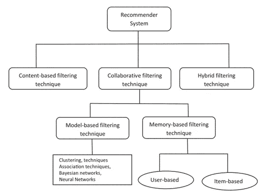

**推荐系统类型-流程图**

# 基于内容的推荐系统

在这种类型的推荐类型中，用户的简档和项目的简档被考虑用于预测用户的评级。在文献(书籍)的情况下的例子是流派、语言、作者简介、关键字和用户过去的选择等等。

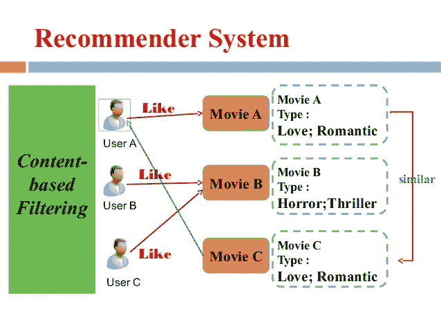

**基于内容的电影推荐系统。**

# 协同过滤推荐系统

与基于内容的系统不同，协同过滤系统不考虑用户的属性(年龄、性别、档案等)..，)和产品属性(流派、语言、关键词等..,).它从用户-项目矩阵中识别用户和产品之间的关系。

有两种类型的协同过滤系统。

1.  基于模型的协作系统
2.  基于记忆的协作系统

在基于模型的系统中，像聚类和神经网络这样的 ML 技术被用来预测评级。而在基于内存的情况下，它被进一步分类为

1.  基于用户的推荐系统
2.  基于项目的推荐系统

# 基于用户的过滤

在基于用户的过滤中，使用**中心余弦相似度**、**皮尔逊相关度**，基于用户的简档历史(过去的评级和订阅)来识别用户之间的相似度。如果用户 A 和 B 相似，则 B 订阅的产品被推荐给 A，反之亦然。

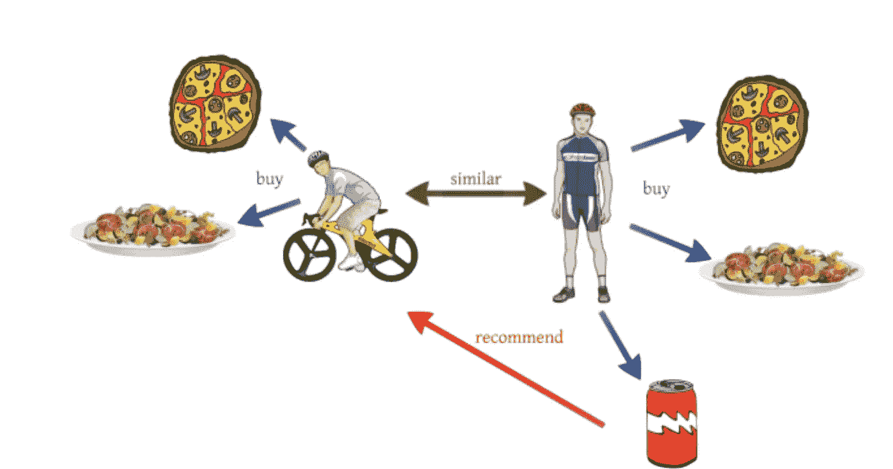

**基于用户的协同过滤系统**

# 皮尔逊相关

皮尔逊相关用于查找两个实体之间的关系。皮尔逊相关值的范围是从-1 到+1。正值意味着实体之间存在正相关性。负值意味着实体之间存在负相关性。越接近 0 的值意味着它们之间没有相关性。项目“X”和“Y”之间的相似性相关度由 r 计算

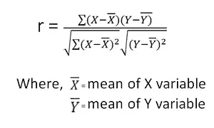

**皮尔逊相关公式**

相关值的不同范围的关系表由下式给出

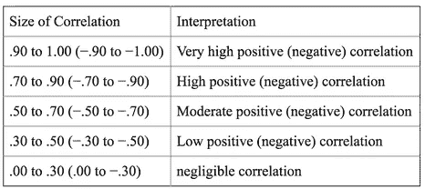

# 余弦相似性

用户之间的相似度也可以通过余弦相似度函数来计算。相似性通过用户向量之间的角度来计算。假设当用户之间具有小角度时，用户是相似的。余弦相似性的公式由下式给出

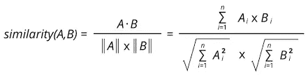

图形矢量形式如下所示。

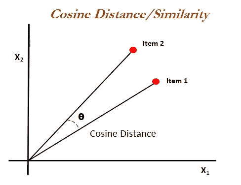

**余弦相似度的图形形式**

# 用户评分预测

用户给出的评级预测通过**贝叶斯加权平均来计算。****用户“I”**对**产品“P”**的预测计算如下

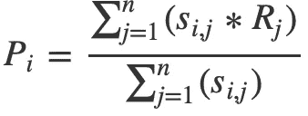

**贝叶斯加权平均。**

其中 S(i，j) —用户“I”和“j”之间的相似性

R (j) —用户“j”对产品的评分。

# 基于项目的过滤

基于项目的协作系统是由亚马逊在 1998 年推出的。在这种类型的过滤中，计算的是产品之间的相似性，而不是用户。前者是通过计算有多少用户购买了**产品“p”**也购买了**产品“q”**来实现的。

基于用户过去的反馈(或)评级来推荐相似的项目。

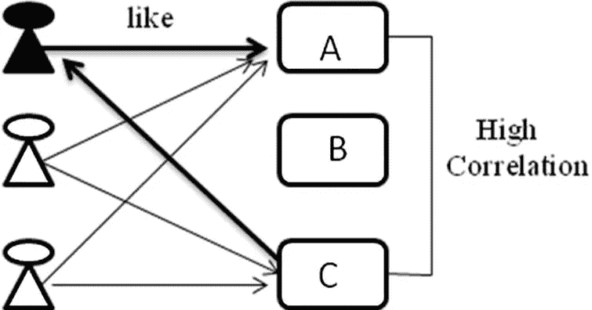

**产品 A 和 C 相似，因此推荐给用户‘A’**

这里，产品“A”和“C”是相似的。因为用户 A 喜欢产品 A，所以产品 C 被推荐给用户 A。

# 协作与基于内容的推荐系统

协作推荐系统只需要用户-产品评级，而基于内容的系统需要产品和用户信息的元数据。因此，协作被广泛应用于大多数电子商务网站。

# 合作推荐的优点

1.  不需要领域知识。由于它只处理用户对产品的评分，因此可以应用于各个领域。
2.  **意外之喜**——这种模式可以帮助用户发现新的兴趣。孤立地，ML 系统可能不知道用户对给定的项目感兴趣，但是模型可能仍然推荐它，因为相似的用户对该项目感兴趣。

# 合作推荐的缺点

1.  **冷启动问题-** 由于协同作用于用户和产品的过去的活动，所以它不能用于新用户或新产品的情况。
2.  **数据稀疏问题-** 是 NULL 占据用户-产品矩阵 90%以上的情况。它导致皮尔逊相关中的正相关误差和余弦相似性中的负相关误差。

# 基于条目的简单图书协同推荐系统

让我们考虑图书交叉数据集的子集。这个数据集由 15 本不同类型的书组成，由几个用户进行了评价。数据集的选择方式是**数据密集**，所有的书都被均匀地阅读和评级。下面显示的数据集

**图书数据集**

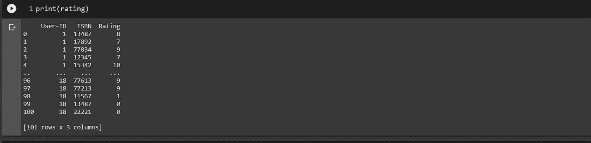

**形状为(101，3)的评级数据集**

用户-项目矩阵是通过合并和透视评级和书籍数据集(pandas.merge 和 pandas.pivot_table)形成的。

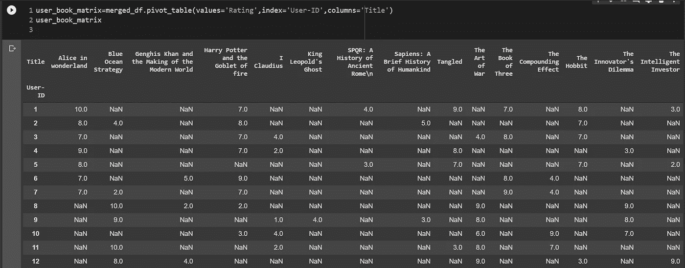

**用户-项目矩阵。**

基于项目的相似性使用皮尔逊相关来计算。书籍之间的关联矩阵如下所示

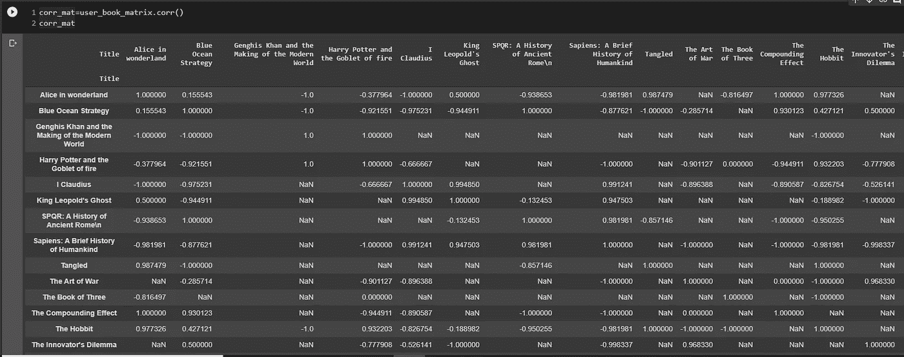

**不同书籍之间的相关值**

根据相关值(相似值)，相似项目被识别并被推荐给用户。识别的项目对是

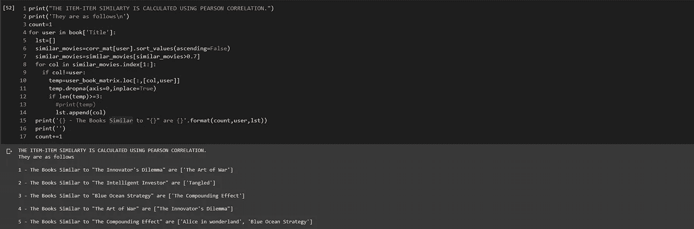

**已识别的相似物品对**

# 注意

上述数据集以这样的方式选择，它具有低**数据稀疏度**，并且具有同等评级的书籍(**没有冷启动问题**)用于基本理解。然而，在现实世界中，在识别相似性和预测准确性方面，事情会更复杂。

希望我们现在清楚了推荐系统实现背后的统计概念。

干杯…!